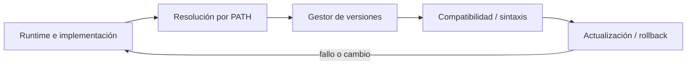

# SE-102 — Gestores de versiones de runtimes

[← SE-101 — REPL, notebooks y desarrollo exploratorio](https://github.com/vladimiracunadev-create/software-engineering-learning-suite/blob/main/classes/part-08-entornos-herramientas-y-depuracion/se-101-repl-notebooks-y-desarrollo-exploratorio/README.md) · [↑ Parte 08](https://github.com/vladimiracunadev-create/software-engineering-learning-suite/blob/main/classes/part-08-entornos-herramientas-y-depuracion/README.md) · [📚 Índice completo](https://github.com/vladimiracunadev-create/software-engineering-learning-suite/blob/main/classes/README.md) · [🌐 Portal](https://vladimiracunadev-create.github.io/software-engineering-learning-suite/classes/SE-102.html) · [SE-103 — Entornos virtuales y aislamiento de dependencias →](https://github.com/vladimiracunadev-create/software-engineering-learning-suite/blob/main/classes/part-08-entornos-herramientas-y-depuracion/se-103-entornos-virtuales-y-aislamiento-de-dependencias/README.md)

> Estado: **GUIDED** · Clase desarrollada y revisada cualitativamente.

## Antes de empezar

Esta clase continúa **Lupa**, el caso conductor de la Parte 08. Recupera la evidencia de la clase anterior, añade una decisión propia de **Gestores de versiones de runtimes** y deja un artefacto que la clase siguiente deberá consumir. La pregunta activa es: **¿Cómo garantizar que terminal, editor, CI y contenedor ejecuten el mismo runtime esperado?**

## Prerrequisitos

- Haber completado la clase anterior o reconstruir su contrato y evidencia.
- Python 3.11 o posterior, terminal, editor y Git; un segundo runtime es opcional y debe declararse.
- Trabajar con fixtures sintéticos: ninguna observación necesita datos de una persona o sistema real.

## Problema auténtico

Lupa muestra Python 3.12 en terminal, pero el launcher, el IDE y CI resuelven versiones diferentes. Una característica disponible localmente falla antes de iniciar pruebas.

## Objetivos observables

Al terminar podrás explicar los cinco mecanismos de esta clase, predecir su comportamiento antes de ejecutar, construir un caso normal y uno límite, diagnosticar el fallo controlado, comparar una alternativa y entregar evidencia que otra persona pueda reproducir.

## Mapa conceptual



El mapa se lee como una cadena de razonamiento, no como fases obligatorias del runtime. La flecha de retorno indica que un fallo o cambio de requisito obliga a revisar el modelo inicial; no autoriza a parchear solo la última salida.

## Temas y por qué importan

| Tema | Por qué cambia una decisión profesional | Evidencia mínima |
|---|---|---|
| Runtime e implementación | La versión del lenguaje, la implementación y la arquitectura son dimensiones distintas. | Evidencia o contraejemplo registrado |
| Resolución por PATH | El shell busca ejecutables según PATH, alias, launcher o shim. | Evidencia o contraejemplo registrado |
| Gestor de versiones | Un gestor instala y selecciona runtimes por archivo o comando. | Evidencia o contraejemplo registrado |
| Compatibilidad y sintaxis | Un rango como `>=3. | Evidencia o contraejemplo registrado |
| Actualización y rollback | Actualizar runtime requiere suite, dependencias compatibles y plan de reversión. | Evidencia o contraejemplo registrado |

## Conceptos y decisiones

### 1. Runtime e implementación

La versión del lenguaje, la implementación y la arquitectura son dimensiones distintas. `Python 3.12` no identifica necesariamente build, ABI o distribución. El proyecto declara rango soportado y matriz realmente probada.

### 2. Resolución por PATH

El shell busca ejecutables según PATH, alias, launcher o shim. `python` puede cambiar por terminal y directorio. Registrar ruta absoluta observada ayuda a diagnosticar; hardcodearla en el proyecto reduce portabilidad.

### 3. Gestor de versiones

Un gestor instala y selecciona runtimes por archivo o comando. Su shim intercepta resolución y debe inicializarse en el shell. La configuración versionada expresa intención, pero CI debe instalar explícitamente y comprobar la versión efectiva.

### 4. Compatibilidad y sintaxis

Un rango como `>=3.11` promete que código y dependencias funcionan en cada versión incluida. Probar solo la más nueva no sostiene esa promesa. Cambios de stdlib, warnings y orden pueden descubrir dependencias accidentales.

### 5. Actualización y rollback

Actualizar runtime requiere suite, dependencias compatibles y plan de reversión. Se prueba en matriz antes de cambiar el predeterminado. Conservar una versión vulnerable indefinidamente tampoco es estabilidad; riesgo y soporte guían el calendario.

## Definiciones de trabajo

- **runtime e implementación:** la versión del lenguaje, la implementación y la arquitectura son dimensiones distintas.
- **resolución por path:** el shell busca ejecutables según path, alias, launcher o shim.
- **gestor de versiones:** un gestor instala y selecciona runtimes por archivo o comando.
- **compatibilidad y sintaxis:** un rango como `>=3.
- **actualización y rollback:** actualizar runtime requiere suite, dependencias compatibles y plan de reversión.

Las definiciones son operativas para Lupa. No convierten términos con historia más amplia en sinónimos y deben contrastarse con la documentación primaria enlazada al final.

## Ejemplo mínimo

```shell
python --version
python -c "import platform,sys; print(sys.executable); print(platform.python_implementation()); print(platform.machine())"
```

Antes de ejecutar, predice estado, resultado y error. Después registra versión, comando y salida. Si el fragmento es pseudocódigo o pertenece a otro lenguaje, etiquétalo como tal y no afirmes que fue ejecutado.

## Ejemplo profesional

En Lupa, una investigación conserva síntoma, entorno, reproducción, hipótesis, observaciones, causa, corrección y regresión. La implementación de esta clase debe conservar ese contrato aunque cambie la forma interna. El caso profesional no pregunta únicamente si produce una salida: pregunta quién puede producirla, qué estado observa, cómo falla y qué rastro permite disputar una decisión incorrecta.

Compara el caso normal con autorización falsa, evidencia incompleta, empate y repetición. Un mecanismo es apropiado cuando esas diferencias quedan visibles y localizadas; es peligroso cuando dependen de orden accidental, estado oculto o una convención que el consumidor no puede conocer.

## Práctica guiada

1. Copia el contrato de entrada y salida antes de escribir implementación.
2. Predice el caso normal y un límite; identifica la invariante que no puede romperse.
3. Implementa la versión mínima sin I/O dentro del núcleo.
4. Ejecuta el caso y conserva comando, versión y salida bajo `evidence/`.
5. Introduce el fallo controlado, reduce la reproducción y formula dos hipótesis rivales.
6. Corrige la causa, añade regresión y ejecuta el conjunto completo.
7. Compara con otro paradigma o lenguaje indicando qué semántica se preserva.

## Ejercicios

1. **Lectura:** dibuja una traza de cinco pasos y marca dónde cambia estado o control.
2. **Construcción:** añade una observación que refute una hipótesis sin cambiar simultáneamente el sistema.
3. **Frontera:** cubre vacío, empate, no autorizado e inválido con resultados distintos.
4. **Contraste:** reescribe una pieza con otro modelo y explica una mejora y una pérdida.

## Reto verificable

Entrega implementación, fixtures, pruebas y un informe corto. Se aprueba si otra persona ejecuta desde checkout limpio, obtiene los mismos resultados y puede relacionar cada rama o transformación con una regla del dominio. No se aprueba por cantidad de archivos ni por usar la sintaxis característica del paradigma.

## Caso conductor

Lupa parte de una inversión de empates en Orbe, captura versión y entrada mínima, compara un entorno sano con uno afectado y conserva la primera divergencia observable. Cambia después una sola regla o condición y revisa qué archivos, pruebas y trazas debieron modificarse. Esa superficie de cambio alimenta el proyecto final de la parte.

## Preguntas frecuentes

### ¿Una técnica o herramienta determina toda la arquitectura?

No. Puede organizar un núcleo o una frontera sin dominar el sistema completo. Combinar técnicas es válido si las fronteras preservan identidad, orden, errores y evidencia.

### ¿Más automatización o menos líneas significan una solución mejor?

No. La brevedad puede quitar duplicación o esconder decisiones. Se evalúan semántica, diagnóstico, costo de cambio y adecuación a la carga.

### ¿Debo instalar todas las herramientas mencionadas?

No. Instala solo lo necesario para la práctica elegida. Registra versión y comandos; si solo analizas una notación o salida, decláralo como análisis no ejecutado.

## Fallo controlado y diagnóstico

Configura el archivo de versión pero no el CI. Añade un assert de versión al diagnóstico y una matriz que cubra mínimo y máximo soportado.

Registra síntoma, entrada mínima, hipótesis, observación que descarta cada hipótesis, causa, corrección y prueba de regresión. No cambies simultáneamente implementación, fixture y expectativa.

## Errores comunes y cómo corregirlos

| Síntoma | Causa probable | Corrección |
|---|---|---|
| dos pruebas aisladas pasan y juntas fallan | estado o dependencia compartida | aislar propietario y reiniciar fixture |
| implementación corta pero opaca | semántica delegada sin contrato | documentar transición, error y orden |
| modelos “equivalentes” divergen | fixtures normalizan diferencias reales | comparar contrato antes de presentación |
| reintento duplica resultado | efecto sin identidad ni idempotencia | correlacionar y probar repetición |
| diagrama y código cuentan historias distintas | visual ornamental o desactualizado | trazar el mismo caso en ambos |

## Entorno y archivos clave

```text
work/SE-102/
├── README.md
├── lupa/
│   ├── domain.py
│   └── se_102.py
├── fixtures/cases.json
├── tests/test_se_102.py
└── evidence/diagnosis.md
```

El `README` declara plataforma, runtimes, comandos, limpieza y límites. Evita dependencias externas cuando la biblioteca estándar permita observar el mecanismo; si agregas una, fija procedencia y versión.

## Seguridad, ética y accesibilidad

- la autorización forma parte del dominio y no se infiere por ausencia de rechazo;
- no uses `eval`, reglas descargadas ni serialización insegura;
- limita colas, recursión, tamaño de entrada y tiempo de evaluación;
- redacta trazas y conserva una explicación textual además de color o animación;
- una recomendación automatizada debe poder revisarse, impugnarse y corregirse;
- respeta licencias de ejemplos y atribuye adaptaciones.

## Transferencia

Traslada un fixture al segundo modelo, herramienta, plataforma o lenguaje. Compara representación de ausencia, error, mutabilidad, orden y cancelación. La transferencia está lograda cuando el contrato se conserva y las diferencias están explicadas, no cuando la interfaz se parece.

## Evaluación y evidencia

| Criterio | Evidencia para aprobar |
|---|---|
| comprensión | explicación causal de los cinco mecanismos |
| corrección | normal, límite, inválido y contraejemplo |
| diseño | estado, efectos y contrato localizables |
| diagnóstico | reproducción mínima y regresión |
| transferencia | comparación semántica, no estética |
| reproducibilidad | versiones, comandos, salida y límites |

Los snippets no elevan la clase a `EXECUTABLE` o `TESTED`: esos estados requieren artefactos versionados y ejecuciones verificadas fuera de la guía.

## Fuentes

- [Language Server Protocol 3.18](https://microsoft.github.io/language-server-protocol/specifications/lsp/3.18/specification/) — Mensajes, capacidades y sincronización entre editor y servidor; autoridad: Microsoft.
- [Debug Adapter Protocol](https://microsoft.github.io/debug-adapter-protocol/) — Breakpoints, frames, variables y negociación de capacidades; autoridad: Microsoft.
- [Python Debugging and Profiling](https://docs.python.org/3/library/debug.html) — Pdb, cprofile, timeit, tracemalloc y límites instrumentales; autoridad: Python Software Foundation.
- [Python venv](https://docs.python.org/3/library/venv.html) — Aislamiento de intérprete, scripts y entorno virtual; autoridad: Python Software Foundation.
- [Development Container Specification](https://containers.dev/implementors/spec/) — Configuración reproducible de herramientas y ciclo de vida del contenedor; autoridad: Dev Container Specification maintainers.
- [Web Content Accessibility Guidelines 2.2](https://www.w3.org/TR/WCAG22/) — Percepción, operación por teclado y reducción de barreras en interfaces; autoridad: W3C.

Cada fuente respalda el mecanismo indicado; ninguna demuestra que la implementación de Lupa sea correcta. Esa afirmación depende de fixtures, pruebas, trazas y revisión reproducible.

## Límites y siguiente paso

Fijar runtime no aísla paquetes instalados. La siguiente clase explica entornos virtuales, resolución y frontera con herramientas globales.

## Glosario

- **runtime e implementación:** la versión del lenguaje, la implementación y la arquitectura son dimensiones distintas.
- **resolución por path:** el shell busca ejecutables según path, alias, launcher o shim.
- **gestor de versiones:** un gestor instala y selecciona runtimes por archivo o comando.
- **compatibilidad y sintaxis:** un rango como `>=3.
- **actualización y rollback:** actualizar runtime requiere suite, dependencias compatibles y plan de reversión.

---

[← SE-101 — REPL, notebooks y desarrollo exploratorio](https://github.com/vladimiracunadev-create/software-engineering-learning-suite/blob/main/classes/part-08-entornos-herramientas-y-depuracion/se-101-repl-notebooks-y-desarrollo-exploratorio/README.md) · [↑ Parte 08](https://github.com/vladimiracunadev-create/software-engineering-learning-suite/blob/main/classes/part-08-entornos-herramientas-y-depuracion/README.md) · [📚 Índice completo](https://github.com/vladimiracunadev-create/software-engineering-learning-suite/blob/main/classes/README.md) · [🌐 Portal](https://vladimiracunadev-create.github.io/software-engineering-learning-suite/classes/SE-102.html) · [SE-103 — Entornos virtuales y aislamiento de dependencias →](https://github.com/vladimiracunadev-create/software-engineering-learning-suite/blob/main/classes/part-08-entornos-herramientas-y-depuracion/se-103-entornos-virtuales-y-aislamiento-de-dependencias/README.md)
