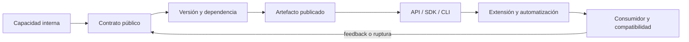

# Parte 09 — Bibliotecas, paquetes, SDK y automatización

La biblioteca de estructuras y algoritmos resolvió estructuras y el entorno reproducible de diagnóstico hizo reproducible su diagnóstico. El producto reutilizable con SDK y CLI convierte esa capacidad en un paquete con API, SDK y CLI. La parte sigue al consumidor: descubre el producto, instala dependencias, ejecuta un primer caso, automatiza, amplía con plugins y actualiza. Cada paso hace visible compatibilidad, procedencia, error y recuperación.

## Pregunta rectora

> ¿Qué contrato consume otra persona y qué evidencia demuestra que una nueva versión no la rompe?

## Antes del recorrido clase por clase

Esta parte sigue a quien consume **producto reutilizable con SDK y CLI**, no solo a quien la construye. Cada
clase hace explícita una frontera pública —API, paquete, CLI, plugin o artefacto— y la
somete a instalación, error, actualización y retirada. Así se distingue reutilización
real de código que solo funciona dentro del repositorio original.

El diagrama sigue el viaje del consumidor. La flecha de retorno indica que una ruptura,
una migración difícil o una nueva necesidad obligan a revisar el contrato público; no se
resuelven cambiando silenciosamente el artefacto ya publicado.

## Resultados acumulativos

Podrás distinguir biblioteca, framework, runtime, plataforma y SDK; declarar una API pública; razonar SemVer y resolución; construir y publicar paquetes; diseñar CLI y scripts idempotentes; aislar plugins y generación; verificar licencias, procedencia y experiencia de desarrollador con pruebas desde el consumidor.

Al finalizar podrás publicar y consumir la capacidad desde fuera del repositorio,
clasificar cambios compatibles, automatizar con recuperación y sostener procedencia,
licencias y experiencia mediante evidencia de consumidor.

## Prerrequisitos enlazados

- [Parte 4 — Pensamiento computacional](https://github.com/vladimiracunadev-create/software-engineering-learning-suite/blob/main/classes/part-04-pensamiento-computacional-y-resolucion-de-problemas/): modelado, invariantes, corrección y complejidad.
- [Parte 5 — Fundamentos de programación](https://github.com/vladimiracunadev-create/software-engineering-learning-suite/blob/main/classes/part-05-fundamentos-de-programacion/): valores, control, funciones, errores, pruebas y la CLI diagnóstica.
- Python 3.11+, Git y terminal; runtimes adicionales son opcionales y deben declararse.

## Bloques y progresión

1. **Producto reusable y contrato:** las clases 109–112 delimitan producto, contrato, versión, resolución y publicación.
2. **Distribución e interfaz:** las clases 113–114 diseñan CLI, configuración y automatización idempotente.
3. **Extensión y procedencia:** las clases 115–117 gobiernan extensiones, generación, licencias y procedencia.
4. **Experiencia y compatibilidad:** las clases 118–120 prueban DX, empaquetan y verifican SDK+CLI entre versiones.

## Guía razonada clase por clase

El producto reutilizable con SDK y CLI transforma la capacidad de la biblioteca de estructuras y algoritmos en un producto reusable. El recorrido
avanza desde la definición de capas y contratos hasta un release candidato probado por
un consumidor externo; cada paso conserva compatibilidad, procedencia y recuperación
como obligaciones, no como documentación posterior.

### Bloque 1 — Delimitar producto, contrato y distribución

#### SE-109 — Biblioteca, framework, runtime, plataforma y SDK

Estos términos describen relaciones de control y responsabilidad, no tamaños del
repositorio. Una biblioteca es llamada por el consumidor; un framework suele invertir
el control; runtime y plataforma aportan servicios de ejecución; un SDK combina acceso,
modelos, herramientas y guía para una capacidad externa.

El estudiante dibuja el producto reutilizable con SDK y CLI como capas, marca quién llama a quién y qué debe
instalar u operar el consumidor. La evidencia incluye un caso donde una capa no se
justifica. Esa frontera permite que `SE-110` enumere la superficie pública y clasifique
cambios por su impacto observable.

#### SE-110 — SemVer, compatibilidad y contratos públicos

SemVer solo tiene significado después de definir API pública. La clase incluye firmas,
comportamiento, errores, formatos, CLI y extensiones; distingue compatibilidad de fuente,
binaria, datos y comportamiento. Agregar un parámetro opcional puede romper wrappers o
salidas parseadas aunque parezca aditivo.

El producto reutilizable con SDK y CLI publica un inventario de contrato y compara versiones con consumidores de
prueba. El estudiante clasifica cambios, escribe migración y rechaza promesas que no
puede verificar. `SE-111` estudia cómo restricciones de muchas dependencias se resuelven
en una instalación concreta.

#### SE-111 — Resolución de dependencias y lockfiles

Declarar rangos no instala versiones: el resolvedor combina restricciones, marcadores,
índices y plataforma. Un lock registra una solución para contextos definidos, pero no
garantiza disponibilidad, integridad ni compatibilidad fuera de ellos. La clase diferencia
dependencia directa, transitiva y opcional.

El estudiante reproduce un conflicto del producto reutilizable con SDK y CLI, explica por qué no existe solución
y genera una instalación fijada con hashes cuando el ecosistema lo permite. La evidencia
se prueba en más de un entorno. `SE-112` convierte el árbol fuente y su metadata en
artefactos que puedan instalarse sin el checkout.

#### SE-112 — Paquetes, módulos y publicación

Un módulo organiza nombres; un paquete distribuye artefactos con identidad, versión,
dependencias y contenido. La clase sigue fuente → build → wheel/sdist → índice →
instalación, y exige probar el artefacto construido, no el directorio de trabajo. La
publicación es inmutable y necesita procedencia y recuperación.

El producto reutilizable con SDK y CLI construye artefactos, inspecciona su contenido y los instala en un entorno
vacío. El estudiante detecta un archivo omitido o import accidental desde el checkout.
Con una capacidad instalable, `SE-113` diseña la interfaz de línea de comandos que
personas y automatizaciones usarán.

### Bloque 2 — Diseñar interfaces para personas y automatizaciones

#### SE-113 — CLI, flags, configuración y códigos de salida

Una CLI tiene contrato de argumentos, precedencia, `stdout`, `stderr`, códigos y
señales. La clase separa datos de diagnóstico, diseña ayuda y errores accionables, y
evita que color, prompts o logs rompan tuberías. Cambiar texto parseado puede ser una
ruptura pública.

El estudiante crea comandos del producto reutilizable con SDK y CLI para seleccionar y explicar, prueba terminal
interactiva y redirección, y conserva salida estructurada estable. `SE-114` compone esa
CLI en tareas repetibles que deben sobrevivir a repetición, interrupción y reanudación.

#### SE-114 — Scripting repetible y tareas idempotentes

Un script confiable parte de precondiciones, falla temprano, deja estado observable y
puede ejecutarse de nuevo. Idempotencia no significa ausencia de efectos: significa que
repetir bajo el mismo objetivo converge sin duplicar ni corromper. La clase trabaja
temporales, transacciones compensatorias y reanudación.

El producto reutilizable con SDK y CLI automatiza build, verificación e instalación local. El estudiante interrumpe
cada fase y demuestra recuperación o limpieza. Los códigos conservan causa. `SE-115`
abre el producto a extensiones sin entregar a cada plugin acceso implícito e ilimitado.

### Bloque 3 — Extender y reutilizar con procedencia

#### SE-115 — Plugins, extensiones y puntos de integración

Un plugin necesita descubrimiento, contrato, ciclo de vida, versión y aislamiento de
fallos. Cargar código de terceros dentro del proceso amplía privilegios; un punto de
extensión estable es una promesa de compatibilidad, no un import dinámico cualquiera.

El producto reutilizable con SDK y CLI define metadata y protocolo de plugin, rechaza incompatibles y conserva un
modo seguro sin extensiones. El estudiante prueba fallo al cargar y durante ejecución.
`SE-116` examina otra forma de extensión: producir código o configuración desde una
fuente declarativa.

#### SE-116 — Generación de código y metaprogramación

Generar reduce repetición cuando existe una fuente canónica, pero crea deriva si las
salidas se editan a mano o el generador no es determinista. La clase compara plantillas,
introspección y metaprogramación; exige trazabilidad, diff revisable y mensaje de error
en el nivel que la persona entiende.

El estudiante genera clientes o modelos del producto reutilizable con SDK y CLI dos veces y comprueba salida
idéntica, luego cambia el esquema y revisa el diff. Declara qué archivo se edita y cuál
se regenera. `SE-117` pregunta si todos los componentes y salidas pueden reutilizarse y
redistribuirse legalmente, con procedencia verificable.

#### SE-117 — Licencias, procedencia y reutilización

Código visible no equivale a permiso. La clase distingue licencia, copyright,
compatibilidad de obligaciones, avisos, datos y marcas; usa identificadores SPDX y
prácticas REUSE para conectar archivo, componente y evidencia. Un SBOM describe
componentes, pero no resuelve automáticamente compatibilidad ni riesgo.

El producto reutilizable con SDK y CLI inventaría dependencias y artefactos generados, conserva textos y atribución
y bloquea material sin licencia clara. El estudiante explica una decisión de uso y su
límite sin dar asesoría jurídica. `SE-118` vuelve al consumidor para medir si todo ese
contrato puede descubrirse y operarse.

### Bloque 4 — Verificar experiencia y compatibilidad desde fuera

#### SE-118 — Diseño de experiencia para desarrolladores

DX comprende descubrimiento, instalación, primer éxito, comprensión de errores,
depuración, extensión, migración y retirada. La clase mide tiempo y bloqueos sin reducir
experiencia a documentación bonita; defaults, tipos, ejemplos y observabilidad forman un
sistema de aprendizaje del producto.

Una persona que no participó en el producto reutilizable con SDK y CLI sigue el quickstart y piensa en voz alta.
El estudiante registra fricción, severidad y recuperación, y corrige el contrato o la
guía según evidencia. `SE-119` somete el paquete completo a build, instalación y uso en
un proyecto consumidor.

#### SE-119 — Taller: empaquetar una capacidad reusable

El taller parte de la lógica funcional de la biblioteca de estructuras y algoritmos y exige separar API pública, CLI, metadata
y artefactos. El estudiante construye en un entorno limpio, instala desde wheel y sdist,
ejecuta un consumidor externo y prueba una versión incompatible o plugin rechazado.

La entrega incluye hashes, inventario, quickstart, problemas conocidos y limpieza. Una
prueba que importa desde el repositorio no cuenta. `SE-120` convierte el resultado en un
release candidato con matriz de compatibilidad y migración.

#### SE-120 — Proyecto: SDK y CLI con compatibilidad verificada

El proyecto publica una API Python, una CLI y un protocolo de plugin alineados alrededor
de la misma capacidad. Define superficie pública, versión, errores y política de soporte;
construye artefactos inmutables y prueba consumidores anteriores frente al candidato.

La aceptación cubre runtime mínimo y máximo, wheel y sdist, ayuda, salida estructurada,
plugin compatible e incompatible, actualización y rollback. Changelog, hashes,
procedencia y límites acompañan los resultados. El producto reutilizable con SDK y CLI cierra la etapa con una
capacidad consumible; la Parte 10 partirá de problemas y necesidades para decidir qué
producto merece construirse después.

## Resumen operativo del recorrido

| Clase | Capacidad que construye | Pregunta que resuelve | Evidencia acumulativa |
|---|---|---|---|
| [SE-109](https://github.com/vladimiracunadev-create/software-engineering-learning-suite/blob/main/classes/part-09-bibliotecas-paquetes-sdk-y-automatizacion/se-109-biblioteca-framework-runtime-plataforma-y-sdk/) | Biblioteca, framework, runtime, plataforma y SDK | ¿Qué papel cumple cada capa reusable y quién controla el flujo? | Mapa de capas, control y responsabilidad |
| [SE-110](https://github.com/vladimiracunadev-create/software-engineering-learning-suite/blob/main/classes/part-09-bibliotecas-paquetes-sdk-y-automatizacion/se-110-semver-compatibilidad-y-contratos-publicos/) | SemVer, compatibilidad y contratos públicos | ¿Qué constituye la API pública y cuándo un cambio exige migración? | Inventario público y clasificación de cambios |
| [SE-111](https://github.com/vladimiracunadev-create/software-engineering-learning-suite/blob/main/classes/part-09-bibliotecas-paquetes-sdk-y-automatizacion/se-111-resolucion-de-dependencias-y-lockfiles/) | Resolución de dependencias y lockfiles | ¿Cómo convierte un resolvedor restricciones declaradas en una instalación concreta? | Grafo resuelto, conflicto y lock verificado |
| [SE-112](https://github.com/vladimiracunadev-create/software-engineering-learning-suite/blob/main/classes/part-09-bibliotecas-paquetes-sdk-y-automatizacion/se-112-paquetes-modulos-y-publicacion/) | Paquetes, módulos y publicación | ¿Qué transforma un árbol fuente en artefactos instalables, inmutables y verificables? | Wheel/sdist inspeccionados e instalados externamente |
| [SE-113](https://github.com/vladimiracunadev-create/software-engineering-learning-suite/blob/main/classes/part-09-bibliotecas-paquetes-sdk-y-automatizacion/se-113-cli-flags-configuracion-y-codigos-de-salida/) | CLI, flags, configuración y códigos de salida | ¿Cómo diseñar una CLI consumible por personas y automatizaciones sin mezclar datos con diagnóstico? | Contrato CLI con streams, ayuda y códigos |
| [SE-114](https://github.com/vladimiracunadev-create/software-engineering-learning-suite/blob/main/classes/part-09-bibliotecas-paquetes-sdk-y-automatizacion/se-114-scripting-repetible-y-tareas-idempotentes/) | Scripting repetible y tareas idempotentes | ¿Qué debe ocurrir al ejecutar una automatización dos veces, interrumpirla o retomarla? | Tarea repetida, interrumpida y recuperada |
| [SE-115](https://github.com/vladimiracunadev-create/software-engineering-learning-suite/blob/main/classes/part-09-bibliotecas-paquetes-sdk-y-automatizacion/se-115-plugins-extensiones-y-puntos-de-integracion/) | Plugins, extensiones y puntos de integración | ¿Cómo ampliar un sistema sin convertir cada extensión en dependencia privilegiada e incompatible? | Plugin compatible, rechazo y aislamiento de fallo |
| [SE-116](https://github.com/vladimiracunadev-create/software-engineering-learning-suite/blob/main/classes/part-09-bibliotecas-paquetes-sdk-y-automatizacion/se-116-generacion-de-codigo-y-metaprogramacion/) | Generación de código y metaprogramación | ¿Cuándo generar código reduce duplicación y cuándo crea una segunda fuente imposible de reconciliar? | Generación determinista y diff trazable |
| [SE-117](https://github.com/vladimiracunadev-create/software-engineering-learning-suite/blob/main/classes/part-09-bibliotecas-paquetes-sdk-y-automatizacion/se-117-licencias-procedencia-y-reutilizacion/) | Licencias, procedencia y reutilización | ¿Qué derecho permite reutilizar cada componente y qué evidencia conserva su procedencia? | Inventario SPDX/REUSE y decisión de reutilización |
| [SE-118](https://github.com/vladimiracunadev-create/software-engineering-learning-suite/blob/main/classes/part-09-bibliotecas-paquetes-sdk-y-automatizacion/se-118-diseno-de-experiencia-para-desarrolladores/) | Diseño de experiencia para desarrolladores | ¿Qué fricción encuentra una persona desde el primer contacto hasta diagnosticar y migrar? | Ensayo de consumidor con tiempo y bloqueos |
| [SE-119](https://github.com/vladimiracunadev-create/software-engineering-learning-suite/blob/main/classes/part-09-bibliotecas-paquetes-sdk-y-automatizacion/se-119-taller-empaquetar-una-capacidad-reusable/) | Taller: empaquetar una capacidad reusable | ¿Cómo demostrar que una capacidad reusable sobrevive a build, instalación y uso externo? | Artefactos, hashes y proyecto consumidor limpio |
| [SE-120](https://github.com/vladimiracunadev-create/software-engineering-learning-suite/blob/main/classes/part-09-bibliotecas-paquetes-sdk-y-automatizacion/se-120-proyecto-sdk-y-cli-con-compatibilidad-verificada/) | Proyecto: SDK y CLI con compatibilidad verificada | ¿Qué conjunto mínimo de artefactos y pruebas sostiene un SDK y CLI listos para consumidores reales? | Release candidate y matriz de compatibilidad |

## Proyecto integrador

El proyecto **SE-120** entrega API, SDK, CLI y plugin de ejemplo; inventario de superficie
pública; artefactos wheel/sdist instalados desde fuera del checkout; matriz de
compatibilidad; pruebas de consumidor; changelog, migración, hashes y procedencia. El
release candidato solo respalda las combinaciones ejecutadas y conserva rollback.

## Criterios de salida

- las doce clases explican todos sus temas mediante mecanismos, ejemplos y límites;
- API, CLI y protocolo de plugin tienen contratos y versiones explícitos;
- build e instalación se prueban desde artefactos en entornos limpios;
- resolución, licencias, hashes y procedencia quedan inventariados;
- otra persona reproduce comandos y resultados desde checkout limpio;
- el informe declara lo observado, lo inferido y lo no ejecutado.

## Preguntas de control por bloque

- ¿Qué capa controla el flujo y qué obligación asume el consumidor?
- ¿Qué superficie es pública y qué cambio observable rompe compatibilidad?
- ¿Puede repetirse, interrumpirse y retirarse la automatización sin corromper estado?
- ¿Qué prueba desde un proyecto externo demuestra instalación, uso y migración?

## Fuentes de la parte

- [Semantic Versioning 2.0.0](https://semver.org/spec/v2.0.0.html) — API pública, versiones, prereleases y compatibilidad declarada; autoridad: Semantic Versioning project.
- [Python Packaging User Guide: Specifications](https://packaging.python.org/en/latest/specifications/) — metadata, nombres, versiones, dependencias y artefactos de distribución; autoridad: Python Packaging Authority.
- [pylock.toml Specification](https://packaging.python.org/en/latest/specifications/pylock-toml/) — lock files para instalaciones reproducibles y selección por entorno; autoridad: Python Packaging Authority.
- [Python Standard Library](https://docs.python.org/3/library/index.html) — argparse, importlib.metadata, subprocess y APIs de automatización; autoridad: Python Software Foundation.
- [SPDX Specification 3.0](https://spdx.dev/use/specifications/) — identificadores, SBOM y procedencia legible por máquinas; autoridad: Linux Foundation.
- [REUSE Specification](https://reuse.software/spec-3.3/) — declaración inequívoca y verificable de copyright y licencias por archivo; autoridad: Free Software Foundation Europe.

Las fuentes se vinculan también dentro de cada clase. Definen semántica y mecanismos; la adecuación del producto reutilizable con SDK y CLI se demuestra con el caso, las pruebas y la comparación.
