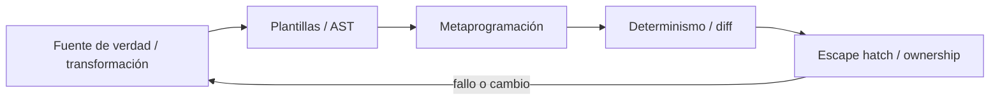

# SE-116 — Generación de código y metaprogramación

[← SE-115 — Plugins, extensiones y puntos de integración](https://github.com/vladimiracunadev-create/software-engineering-learning-suite/blob/main/classes/part-09-bibliotecas-paquetes-sdk-y-automatizacion/se-115-plugins-extensiones-y-puntos-de-integracion/README.md) · [↑ Parte 09](https://github.com/vladimiracunadev-create/software-engineering-learning-suite/blob/main/classes/part-09-bibliotecas-paquetes-sdk-y-automatizacion/README.md) · [📚 Índice completo](https://github.com/vladimiracunadev-create/software-engineering-learning-suite/blob/main/classes/README.md) · [🌐 Portal](https://vladimiracunadev-create.github.io/software-engineering-learning-suite/classes/SE-116.html) · [SE-117 — Licencias, procedencia y reutilización →](https://github.com/vladimiracunadev-create/software-engineering-learning-suite/blob/main/classes/part-09-bibliotecas-paquetes-sdk-y-automatizacion/se-117-licencias-procedencia-y-reutilizacion/README.md)

> Estado: **PLANNED** · Borrador público conservado íntegramente y sometido a auditoría técnica y pedagógica.

## Punto profesional y fundamento pedagógico

**Punto profesional.** La clase existe para tratar generación de código y metaprogramación como transformación con fuente de verdad y salida revisable.

**Por qué aparece aquí.** Se sitúa después de **Plugins, extensiones y puntos de integración** y antes de **Licencias, procedencia y reutilización**: convierte el conocimiento anterior en una decisión observable que la clase siguiente podrá reutilizar. La continuidad se comprueba en el artefacto, no por compartir vocabulario.

**Error conceptual que debe corregir.** Editar generado a mano o esconder cambios semánticos en plantillas.

**Secuencia de aprendizaje.** Antes de leer la solución, el estudiante predice el resultado del caso normal y del error conceptual anterior. Luego explica un caso resuelto paso a paso, construye un contraejemplo que cambie la decisión y, sin consultar el texto, reconstruye el mecanismo y lo aplica a una entrada nueva. La secuencia usa predicción, explicación propia, contraste y recuperación. [ICAP](https://icap.education.asu.edu/research) distingue participación de construcción de conocimiento; [How People Learn II](https://nap.nationalacademies.org/catalog/24783/how-people-learn-ii-learners-contexts-and-cultures) exige conectar conocimiento previo, contexto y transferencia; la [práctica de recuperación](https://pubmed.ncbi.nlm.nih.gov/16507066/) respalda producir de nuevo la explicación tras una demora; y [Education for Life and Work](https://nap.nationalacademies.org/resource/13398/dbasse_084153.pdf) exige devolución que explique la causa del error.

**Evidencia de aprendizaje.** Generation-report.md con entrada, generador, diff determinista y regeneración limpia. Debe contener predicción previa, observación, explicación causal, contraejemplo, criterio de aceptación y una nota de qué dato haría cambiar la conclusión.

**Límite de la conclusión.** Determinismo de salida no demuestra corrección del generador.

### Trazabilidad fuente → afirmación

| Fuente primaria u oficial | Afirmación que respalda | Lo que no prueba |
|---|---|---|
| [Python Standard Library](https://docs.python.org/3/library/index.html) | Argparse, importlib.metadata, subprocess y apis de automatización; autoridad: Python Software Foundation | No demuestra por sí sola que el artefacto del estudiante sea correcto. |
| [Python Packaging User Guide: Specifications](https://packaging.python.org/en/latest/specifications/) | Metadata, nombres, versiones, dependencias y artefactos de distribución; autoridad: Python Packaging Authority | No demuestra por sí sola que el artefacto del estudiante sea correcto. |
| [Python ast](https://docs.python.org/3/library/ast.html) | define transformaciones estructuradas de código Python | No demuestra por sí sola que el artefacto del estudiante sea correcto. |

## Antes de empezar

Esta clase continúa el **producto reutilizable con SDK y CLI de la Parte 09**. Recupera la evidencia de la clase anterior, añade una decisión propia de **Generación de código y metaprogramación** y deja un artefacto que la clase siguiente deberá consumir. La pregunta activa es: **¿Cuándo generar código reduce duplicación y cuándo crea una segunda fuente imposible de reconciliar?**

## Prerrequisitos

- Haber completado la clase anterior o reconstruir su contrato y evidencia.
- Python 3.11 o posterior, terminal, editor y Git; un segundo runtime es opcional y debe declararse.
- Trabajar con fixtures sintéticos: ninguna observación necesita datos de una persona o sistema real.

## Problema auténtico

El producto reutilizable con SDK y CLI genera modelos de SDK desde un esquema, pero desarrolladores editan archivos generados. La siguiente ejecución borra arreglos y el runtime diverge del contrato.

## Objetivos observables

Al terminar podrás explicar los cinco mecanismos de esta clase, predecir su comportamiento antes de ejecutar, construir un caso normal y uno límite, diagnosticar el fallo controlado, comparar una alternativa y entregar evidencia que otra persona pueda reproducir.

## Mapa conceptual



El mapa se lee como una cadena de razonamiento, no como fases obligatorias del runtime. La flecha de retorno indica que un fallo o cambio de requisito obliga a revisar el modelo inicial; no autoriza a parchear solo la última salida.

## Temas y por qué importan

| Tema | Por qué cambia una decisión profesional | Evidencia mínima |
|---|---|---|
| Fuente de verdad y transformación | Generar es aplicar una transformación determinista a esquema, plantilla y versión. | Predicción, traza causal y contraejemplo de **Fuente de verdad y transformación** en `generation-report.md` |
| Plantillas y AST | Plantillas concatenan texto y son simples pero frágiles ante escaping o sintaxis; transformar AST preserva estructura con mayor complejidad. | Predicción, traza causal y contraejemplo de **Plantillas y AST** en `generation-report.md` |
| Metaprogramación | Decoradores, macros, reflexión o generación en build modifican comportamiento desde código sobre código. | Predicción, traza causal y contraejemplo de **Metaprogramación** en `generation-report.md` |
| Determinismo y diff | Misma entrada, versión y entorno deben producir salida equivalente. | Predicción, traza causal y contraejemplo de **Determinismo y diff** en `generation-report.md` |
| Escape hatch y ownership | No toda excepción cabe en generador. | Predicción, traza causal y contraejemplo de **Escape hatch y ownership** en `generation-report.md` |
## Conceptos y decisiones

### 1. Fuente de verdad y transformación

Generar es aplicar una transformación determinista a esquema, plantilla y versión. Se declara cuál entrada es canónica y los outputs llevan aviso. Editar el derivado sin cambiar fuente produce drift inevitable.

### 2. Plantillas y AST

Plantillas concatenan texto y son simples pero frágiles ante escaping o sintaxis; transformar AST preserva estructura con mayor complejidad. La técnica depende del cambio. Generar strings desde datos no confiables exige escaping contextual.

### 3. Metaprogramación

Decoradores, macros, reflexión o generación en build modifican comportamiento desde código sobre código. Reducen repetición sistemática, pero desplazan errores y herramientas. La expansión o resultado debe poder inspeccionarse.

### 4. Determinismo y diff

Misma entrada, versión y entorno deben producir salida equivalente. Orden estable, timestamps controlados y formatter fijado reducen ruido. CI regenera y falla si hay diff, revelando fuentes o derivados desactualizados.

### 5. Escape hatch y ownership

No toda excepción cabe en generador. Extensiones parciales, composición o archivos separados permiten código manual sin ser sobrescrito. Un parche postgeneración opaco vuelve el pipeline una secuencia frágil.

## Definiciones de trabajo

- **fuente de verdad y transformación:** generar es aplicar una transformación determinista a esquema, plantilla y versión.
- **plantillas y ast:** plantillas concatenan texto y son simples pero frágiles ante escaping o sintaxis; transformar ast preserva estructura con mayor complejidad.
- **metaprogramación:** decoradores, macros, reflexión o generación en build modifican comportamiento desde código sobre código.
- **determinismo y diff:** misma entrada, versión y entorno deben producir salida equivalente.
- **escape hatch y ownership:** no toda excepción cabe en generador.

Las definiciones son operativas para el producto reutilizable con SDK y CLI. No convierten términos con historia más amplia en sinónimos y deben contrastarse con la documentación primaria enlazada al final.

## Ejemplo mínimo

```shell
python tools/generate.py --schema contract.json --output src/engineering_sdk/models.py
python -m compileall -q src
git diff --exit-code -- src/engineering_sdk/models.py
```

Antes de ejecutar, predice estado, resultado y error. Después registra versión, comando y salida. Si el fragmento es pseudocódigo o pertenece a otro lenguaje, etiquétalo como tal y no afirmes que fue ejecutado.

## Ejemplo profesional

En el producto reutilizable con SDK y CLI, un release contiene contrato público, artefactos inmutables, dependencias, procedencia, ejemplos, errores y ruta de migración. La implementación de esta clase debe conservar ese contrato aunque cambie la forma interna. El caso profesional no pregunta únicamente si produce una salida: pregunta quién puede producirla, qué estado observa, cómo falla y qué rastro permite disputar una decisión incorrecta.

Compara el caso normal con autorización falsa, evidencia incompleta, empate y repetición. Un mecanismo es apropiado cuando esas diferencias quedan visibles y localizadas; es peligroso cuando dependen de orden accidental, estado oculto o una convención que el consumidor no puede conocer.

## Práctica guiada

1. Copia el contrato de entrada y salida antes de escribir implementación.
2. Predice el caso normal y un límite; identifica la invariante que no puede romperse.
3. Implementa la versión mínima sin I/O dentro del núcleo.
4. Ejecuta el caso y conserva comando, versión y salida bajo `evidence/`.
5. Introduce el fallo controlado, reduce la reproducción y formula dos hipótesis rivales.
6. Corrige la causa, añade regresión y ejecuta el conjunto completo.
7. Compara con otro paradigma o lenguaje indicando qué semántica se preserva.

## Ejercicios

1. **Lectura:** dibuja una traza de cinco pasos y marca dónde cambia estado o control.
2. **Construcción:** añade una capacidad pública y prueba el comportamiento desde un proyecto consumidor.
3. **Frontera:** cubre vacío, empate, no autorizado e inválido con resultados distintos.
4. **Contraste:** reescribe una pieza con otro modelo y explica una mejora y una pérdida.

## Reto verificable

Entrega implementación, fixtures, pruebas y un informe corto. Se aprueba si otra persona ejecuta desde checkout limpio, obtiene los mismos resultados y puede relacionar cada rama o transformación con una regla del dominio. No se aprueba por cantidad de archivos ni por usar la sintaxis característica del paradigma.

## Caso conductor

El producto reutilizable con SDK y CLI empaqueta el motor de la biblioteca de estructuras y algoritmos como `engineering_sdk`, expone `choose_next`, una CLI y un punto de extensión. Ejecuta instalación limpia, entrada válida, configuración ausente, plugin incompatible y actualización entre dos versiones. Cambia después una sola regla o condición y revisa qué archivos, pruebas y trazas debieron modificarse. Esa superficie de cambio alimenta el proyecto final de la parte.

## Preguntas frecuentes

### ¿Una técnica o herramienta determina toda la arquitectura?

No. Puede organizar un núcleo o una frontera sin dominar el sistema completo. Combinar técnicas es válido si las fronteras preservan identidad, orden, errores y evidencia.

### ¿Más automatización o menos líneas significan una solución mejor?

No. La brevedad puede quitar duplicación o esconder decisiones. Se evalúan semántica, diagnóstico, costo de cambio y adecuación a la carga.

### ¿Debo instalar todas las herramientas mencionadas?

No. Instala solo lo necesario para la práctica elegida. Registra versión y comandos; si solo analizas una notación o salida, decláralo como análisis no ejecutado.

## Fallo controlado y diagnóstico

Incluye fecha actual en cada archivo y CI siempre difiere. Elimina nondeterminismo o colócalo en metadata externa; prueba dos generaciones consecutivas.

Registra síntoma, entrada mínima, hipótesis, observación que descarta cada hipótesis, causa, corrección y prueba de regresión. No cambies simultáneamente implementación, fixture y expectativa.

## Errores comunes y cómo corregirlos

| Síntoma | Causa probable | Corrección |
|---|---|---|
| dos pruebas aisladas pasan y juntas fallan | estado o dependencia compartida | aislar propietario y reiniciar fixture |
| implementación corta pero opaca | semántica delegada sin contrato | documentar transición, error y orden |
| modelos “equivalentes” divergen | fixtures normalizan diferencias reales | comparar contrato antes de presentación |
| reintento duplica resultado | efecto sin identidad ni idempotencia | correlacionar y probar repetición |
| diagrama y código cuentan historias distintas | visual ornamental o desactualizado | trazar el mismo caso en ambos |

## Entorno y archivos clave

```text
work/SE-116/
├── README.md
├── engineering_sdk/
│   ├── domain.py
│   └── se_116.py
├── fixtures/cases.json
├── tests/test_se_116.py
└── evidence/diagnosis.md
```

El `README` declara plataforma, runtimes, comandos, limpieza y límites. Evita dependencias externas cuando la biblioteca estándar permita observar el mecanismo; si agregas una, fija procedencia y versión.

## Seguridad, ética y accesibilidad

- la autorización forma parte del dominio y no se infiere por ausencia de rechazo;
- no uses `eval`, reglas descargadas ni serialización insegura;
- limita colas, recursión, tamaño de entrada y tiempo de evaluación;
- redacta trazas y conserva una explicación textual además de color o animación;
- una recomendación automatizada debe poder revisarse, impugnarse y corregirse;
- respeta licencias de ejemplos y atribuye adaptaciones.

## Transferencia

Traslada un fixture al segundo modelo, herramienta, plataforma o lenguaje. Compara representación de ausencia, error, mutabilidad, orden y cancelación. La transferencia está lograda cuando el contrato se conserva y las diferencias están explicadas, no cuando la interfaz se parece.

## Evaluación y evidencia

| Criterio | Evidencia para aprobar |
|---|---|
| comprensión | explicación causal de los cinco mecanismos |
| corrección | normal, límite, inválido y contraejemplo |
| diseño | estado, efectos y contrato localizables |
| diagnóstico | reproducción mínima y regresión |
| transferencia | comparación semántica, no estética |
| reproducibilidad | versiones, comandos, salida y límites |

Los snippets no elevan la clase a `EXECUTABLE` o `TESTED`: esos estados requieren artefactos versionados y ejecuciones verificadas fuera de la guía.

## Fuentes


- [Semantic Versioning 2.0.0](https://semver.org/spec/v2.0.0.html) — Api pública, versiones, prereleases y compatibilidad declarada; autoridad: Semantic Versioning project.
- [Python Packaging User Guide: Specifications](https://packaging.python.org/en/latest/specifications/) — Metadata, nombres, versiones, dependencias y artefactos de distribución; autoridad: Python Packaging Authority.
- [pylock.toml Specification](https://packaging.python.org/en/latest/specifications/pylock-toml/) — Lock files para instalaciones reproducibles y selección por entorno; autoridad: Python Packaging Authority.
- [Python Standard Library](https://docs.python.org/3/library/index.html) — Argparse, importlib.metadata, subprocess y apis de automatización; autoridad: Python Software Foundation.
- [SPDX Specification 3.0](https://spdx.dev/use/specifications/) — Identificadores, sbom y procedencia legible por máquinas; autoridad: Linux Foundation.
- [REUSE Specification](https://reuse.software/spec-3.3/) — Declaración inequívoca y verificable de copyright y licencias por archivo; autoridad: Free Software Foundation Europe.

Cada fuente respalda el mecanismo indicado; ninguna demuestra que la implementación del producto reutilizable con SDK y CLI sea correcta. Esa afirmación depende de fixtures, pruebas, trazas y revisión reproducible.

## Límites y siguiente paso

La generación legalmente reutilizable depende de licencias y procedencia de entradas y plantillas. La siguiente clase hace esas obligaciones visibles y verificables.

## Glosario

- **fuente de verdad y transformación:** generar es aplicar una transformación determinista a esquema, plantilla y versión.
- **plantillas y ast:** plantillas concatenan texto y son simples pero frágiles ante escaping o sintaxis; transformar ast preserva estructura con mayor complejidad.
- **metaprogramación:** decoradores, macros, reflexión o generación en build modifican comportamiento desde código sobre código.
- **determinismo y diff:** misma entrada, versión y entorno deben producir salida equivalente.
- **escape hatch y ownership:** no toda excepción cabe en generador.

---

[← SE-115 — Plugins, extensiones y puntos de integración](https://github.com/vladimiracunadev-create/software-engineering-learning-suite/blob/main/classes/part-09-bibliotecas-paquetes-sdk-y-automatizacion/se-115-plugins-extensiones-y-puntos-de-integracion/README.md) · [↑ Parte 09](https://github.com/vladimiracunadev-create/software-engineering-learning-suite/blob/main/classes/part-09-bibliotecas-paquetes-sdk-y-automatizacion/README.md) · [📚 Índice completo](https://github.com/vladimiracunadev-create/software-engineering-learning-suite/blob/main/classes/README.md) · [🌐 Portal](https://vladimiracunadev-create.github.io/software-engineering-learning-suite/classes/SE-116.html) · [SE-117 — Licencias, procedencia y reutilización →](https://github.com/vladimiracunadev-create/software-engineering-learning-suite/blob/main/classes/part-09-bibliotecas-paquetes-sdk-y-automatizacion/se-117-licencias-procedencia-y-reutilizacion/README.md)
