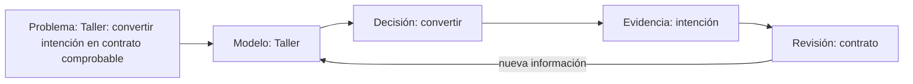

# SE-167 — Taller: convertir intención en contrato comprobable

> [!WARNING]
> Estado: **PLANNED · BORRADOR EN REVISIÓN**. El material es visible para auditoría,
> pero aún no supera el estándar pedagógico profundo y no debe presentarse como clase terminada.

## Ficha

| Campo | Valor |
| --- | --- |
| Etapa | C · Producto, requisitos y especificación |
| Parte | 13 · Especificaciones, contratos y modelos |
| Modalidad | taller de integración (`studio`) |
| Dominio técnico principal | `suite` |
| Duración estimada | 6 horas |
| Producto de la clase | contrato versionado y ejemplos verificables |

## Prerrequisitos

- Haber completado o diagnosticado `SE-166` y poder explicar qué evidencia produjo.
- Manejar archivos de texto, rutas y control de versiones a nivel básico.
- Disponer de editor YAML/JSON y validador local opcional.

## Problema auténtico

Un equipo que trabaja en una control de agentes debe decidir sobre **Taller: convertir intención en contrato comprobable**. Tiene información incompleta, restricciones de tiempo y personas afectadas por una decisión incorrecta. El reto no es repetir definiciones: es convertir el tema en un resultado revisable, distinguir observación de supuesto y conservar evidencia para que otra persona pueda continuar o cuestionar el trabajo.

## Objetivos observables

Al terminar podrás:

1. explicar Taller y convertir con un ejemplo y un contraejemplo;
2. comparar al menos dos opciones usando evidencia, riesgo, costo y reversibilidad;
3. producir el artefacto **contrato versionado y ejemplos verificables** para que otra persona pueda revisarlo;
4. diagnosticar el fallo «cambiar una interfaz sin analizar consumidores ni compatibilidad» sin ocultar incertidumbre;
5. transferir la decisión a otra plataforma o dominio sin depender de una marca.

## Mapa conceptual



## Conceptos y decisiones

Una especificación reduce interpretaciones permitidas mediante vocabulario, modelos, invariantes y ejemplos; un contrato además define obligaciones observables entre partes.

La pregunta rectora de esta parte es: **¿qué comportamiento se promete, qué queda fuera y cómo evoluciona sin romper consumidores?** La respuesta debe
apoyarse en **esquema válido, ejemplos positivos y negativos, compatibilidad y prueba contractual**.

### 1. Taller

En **Taller: convertir intención en contrato comprobable**, `Taller` se analiza dentro de esta base: Una especificación reduce interpretaciones permitidas mediante vocabulario, modelos, invariantes y ejemplos; un contrato además define obligaciones observables entre partes. Para volverlo operativo, responde «¿qué comportamiento se promete, qué queda fuera y cómo evoluciona sin romper consumidores?» y conserva esquema válido, ejemplos positivos y negativos, compatibilidad y prueba contractual. Después declara qué problema resuelve, qué supuesto utiliza, qué señal permitiría aceptarlo y qué señal obligaría a revisarlo. La respuesta profesional separa hechos, inferencias y preferencias; además registra costo, riesgo y reversibilidad antes de elegir una herramienta.

### 2. Convertir

En **Taller: convertir intención en contrato comprobable**, `convertir` se analiza dentro de esta base: Una especificación reduce interpretaciones permitidas mediante vocabulario, modelos, invariantes y ejemplos; un contrato además define obligaciones observables entre partes. Para volverlo operativo, responde «¿qué comportamiento se promete, qué queda fuera y cómo evoluciona sin romper consumidores?» y conserva esquema válido, ejemplos positivos y negativos, compatibilidad y prueba contractual. Después declara qué problema resuelve, qué supuesto utiliza, qué señal permitiría aceptarlo y qué señal obligaría a revisarlo. La respuesta profesional separa hechos, inferencias y preferencias; además registra costo, riesgo y reversibilidad antes de elegir una herramienta.

### 3. Intención

En **Taller: convertir intención en contrato comprobable**, `intención` se analiza dentro de esta base: Una especificación reduce interpretaciones permitidas mediante vocabulario, modelos, invariantes y ejemplos; un contrato además define obligaciones observables entre partes. Para volverlo operativo, responde «¿qué comportamiento se promete, qué queda fuera y cómo evoluciona sin romper consumidores?» y conserva esquema válido, ejemplos positivos y negativos, compatibilidad y prueba contractual. Después declara qué problema resuelve, qué supuesto utiliza, qué señal permitiría aceptarlo y qué señal obligaría a revisarlo. La respuesta profesional separa hechos, inferencias y preferencias; además registra costo, riesgo y reversibilidad antes de elegir una herramienta.

### 4. Contrato

En **Taller: convertir intención en contrato comprobable**, `contrato` se analiza dentro de esta base: Una especificación reduce interpretaciones permitidas mediante vocabulario, modelos, invariantes y ejemplos; un contrato además define obligaciones observables entre partes. Para volverlo operativo, responde «¿qué comportamiento se promete, qué queda fuera y cómo evoluciona sin romper consumidores?» y conserva esquema válido, ejemplos positivos y negativos, compatibilidad y prueba contractual. Después declara qué problema resuelve, qué supuesto utiliza, qué señal permitiría aceptarlo y qué señal obligaría a revisarlo. La respuesta profesional separa hechos, inferencias y preferencias; además registra costo, riesgo y reversibilidad antes de elegir una herramienta.

La regla de trabajo es conservar trazabilidad: problema → supuesto → opción → decisión → evidencia → revisión. Una solución técnicamente posible puede seguir siendo inadecuada si excluye personas, desplaza riesgos o no puede mantenerse. La herramienta concreta se elige después de fijar el comportamiento y el criterio de aceptación.

## Ejemplo mínimo

Registra una sola decisión sobre **Taller: convertir intención en contrato comprobable**:

| Elemento | Ejemplo contrastable |
| --- | --- |
| Contexto | el equipo necesita una decisión en una iteración y carece de una medición directa |
| Supuesto | la opción elegida reduce el riesgo principal sin crear uno mayor |
| Evidencia | ejemplo, medición o revisión que una segunda persona puede repetir |
| Límite | el resultado no representa producción ni todas las poblaciones usuarias |
| Próxima señal | un dato que confirmaría, refutaría o modificaría la decisión |

El valor del ejemplo no está en “tener razón”, sino en que el razonamiento pueda ser inspeccionado.

## Ejemplo profesional

En la control de agentes, el equipo prepara un cambio relacionado con **Taller: convertir intención en contrato comprobable**. Parte de esta pregunta: **¿qué comportamiento se promete, qué queda fuera y cómo evoluciona sin romper consumidores?** Antes de implementarlo, registra personas afectadas, estados normales y degradados, datos utilizados, costo de reversión y señales de éxito. Dos opciones se comparan con la misma tabla y se contrastan usando esquema válido, ejemplos positivos y negativos, compatibilidad y prueba contractual. La alternativa ganadora queda condicionada a una prueba pequeña. La revisión incluye a producto, ingeniería y una persona que no participó en la propuesta. El resultado se archiva como `contract.yaml` y enlaza la evidencia, no solo la conclusión.

## Práctica guiada

1. Crea `work/SE-167/` sin copiar datos personales ni secretos.
2. Formula el problema en una frase que incluya actor, necesidad y consecuencia.
3. Separa en una tabla hechos observados, inferencias, incógnitas y restricciones.
4. Propón dos opciones y una opción de no actuar; explicita costos y riesgos.
5. Construye el contrato versionado y ejemplos verificables con los archivos indicados abajo.
6. Introduce deliberadamente el fallo controlado y registra síntomas antes de corregirlo.
7. Pide una revisión: la otra persona debe reconstruir la decisión solo con el artefacto.
8. Actualiza la conclusión y anota qué evidencia cambiaría la decisión.

## Ejercicios

1. **Fundamental:** define Taller y convertir con un ejemplo propio, un contraejemplo y un criterio que permita distinguirlos.
2. **Aplicado:** resuelve el caso de la control de agentes, compara tres opciones y entrega `contract.yaml` con trazabilidad completa.
3. **Avanzado:** cambia una restricción crítica —plataforma, escala, conectividad, regulación o capacidad del equipo— y demuestra qué partes de la decisión se conservan y cuáles deben revisarse.

## Fallo controlado y diagnóstico

Provoca de forma segura este fallo: **cambiar una interfaz sin analizar consumidores ni compatibilidad**. No lo ejecutes sobre producción ni datos reales. Captura la decisión inicial, el síntoma observable y la primera hipótesis. Después reduce el caso, busca evidencia que pueda refutar tu hipótesis y corrige la causa, no solo el síntoma. Cierra con una medida preventiva y un procedimiento de recuperación.

## Entorno y archivos clave

Entorno de referencia: editor YAML/JSON y validador local opcional. La actividad es documental y portable; cualquier comando adicional debe declarar sistema operativo y versión.

```text
work/SE-167/
├── README.md
│   ├── contract.yaml
│   ├── examples.json
│   ├── compatibility.md
├── activity.yaml
└── rubric.json
```

`README.md` explica cómo reproducir la actividad; `contract.yaml` contiene el resultado principal; los demás archivos separan evidencia y revisión. `activity.yaml` y `rubric.json` son contratos generados junto a esta guía.

## Seguridad, ética y accesibilidad

- usa datos sintéticos o anonimizados y aplica minimización;
- no incluyas tokens, rutas privadas ni información personal en evidencias;
- identifica personas que reciben beneficios, cargas o riesgo de exclusión;
- ofrece una alternativa textual a diagramas y no uses color como única señal;
- verifica navegación por teclado y lenguaje comprensible cuando exista interfaz;
- detén la práctica si requiere acceso no autorizado o puede afectar sistemas reales.

## Transferencia

Repite la decisión en un segundo contexto: cambia la control de agentes por otro de los dominios persistentes, o cambia Windows por Linux/macOS cuando aplique. Conserva problema, criterios y evidencia; modifica únicamente los supuestos dependientes del entorno. Explica por escrito qué conocimiento fue transferible y qué parte pertenecía a la herramienta.

## Evaluación y evidencia

| Criterio | Evidencia para aprobar |
| --- | --- |
| Comprensión | conceptos explicados con ejemplo, contraejemplo y límites |
| Decisión | opciones comparadas con criterios explícitos y alternativa de no actuar |
| Reproducibilidad | archivos, pasos y entorno permiten repetir la revisión |
| Diagnóstico | fallo controlado conserva síntomas, hipótesis, causa y recuperación |
| Responsabilidad | seguridad, privacidad, accesibilidad y personas afectadas fueron consideradas |

Entrega el directorio `work/SE-167/` y una reflexión de máximo 300 palabras. La rúbrica machine-readable está en `rubric.json`; no se aprueba solo por completar pasos.

## Fuentes

Fuentes verificadas el 2026-09-30:

- **ISO/IEC/IEEE 29148:2018 Requirements Engineering** — ISO. [https://www.iso.org/standard/72089.html](https://www.iso.org/standard/72089.html) — se usa para contrastar vocabulario, límites y criterios aplicables.
- **OpenAPI Specification** — OpenAPI Initiative. [https://spec.openapis.org/oas/latest.html](https://spec.openapis.org/oas/latest.html) — se usa para contrastar vocabulario, límites y criterios aplicables.
- **AsyncAPI Specification** — AsyncAPI Initiative. [https://www.asyncapi.com/docs/reference/specification/latest](https://www.asyncapi.com/docs/reference/specification/latest) — se usa para contrastar vocabulario, límites y criterios aplicables.
- **GraphQL Specification** — GraphQL Foundation. [https://spec.graphql.org/](https://spec.graphql.org/) — se usa para contrastar vocabulario, límites y criterios aplicables.

## Límites y siguiente paso

Esta guía enseña a razonar y producir evidencia sobre **Taller: convertir intención en contrato comprobable**; no certifica dominio profesional ni valida una implementación productiva. El siguiente enlace curricular es `SE-168`. Si la actividad necesita código o infraestructura real, debe avanzar a `EXECUTABLE`, añadir pruebas y documentar versiones, limpieza y recuperación.
