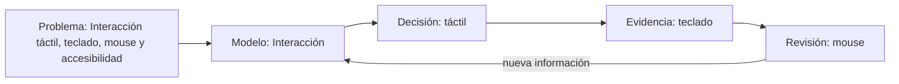

# SE-258 — Interacción táctil, teclado, mouse y accesibilidad

[← SE-257 — Permisos, sensores y capacidades del dispositivo](https://github.com/vladimiracunadev-create/modern-software-engineering-program/blob/main/classes/part-21-software-movil-escritorio-y-multiplataforma/se-257-permisos-sensores-y-capacidades-del-dispositivo/README.md) · [↑ Parte 21](https://github.com/vladimiracunadev-create/modern-software-engineering-program/blob/main/classes/part-21-software-movil-escritorio-y-multiplataforma/README.md) · [📚 Índice completo](https://github.com/vladimiracunadev-create/modern-software-engineering-program/blob/main/classes/README.md) · [🌐 Portal](https://vladimiracunadev-create.github.io/modern-software-engineering-program/classes/SE-258.html) · [SE-259 — Actualizaciones, tiendas y distribución empresarial →](https://github.com/vladimiracunadev-create/modern-software-engineering-program/blob/main/classes/part-21-software-movil-escritorio-y-multiplataforma/se-259-actualizaciones-tiendas-y-distribucion-empresarial/README.md)

> [!WARNING]
> Estado: **PLANNED · BORRADOR EN REVISIÓN**. El material es visible para auditoría,
> pero aún no supera el estándar pedagógico profundo y no debe presentarse como clase terminada.

## Prerrequisitos

- Haber completado o diagnosticado `SE-257` y poder explicar qué evidencia produjo.
- Manejar archivos de texto, rutas y control de versiones a nivel básico.
- Disponer de Android Studio, Xcode o Electron según plataforma elegida.

## Problema auténtico

Un equipo que trabaja en una suite familiar privada debe decidir sobre **Interacción táctil, teclado, mouse y accesibilidad**. Tiene información incompleta, restricciones de tiempo y personas afectadas por una decisión incorrecta. El reto no es repetir definiciones: es convertir el tema en un resultado revisable, distinguir observación de supuesto y conservar evidencia para que otra persona pueda continuar o cuestionar el trabajo.

## Objetivos observables

Al terminar podrás:

1. explicar Interacción y táctil con un ejemplo y un contraejemplo;
2. comparar al menos dos opciones usando evidencia, riesgo, costo y reversibilidad;
3. producir el artefacto **comparación de ciclo de vida entre plataformas cliente** para que otra persona pueda revisarlo;
4. diagnosticar el fallo «suponer que cerrar, suspender y terminar una aplicación son el mismo evento» sin ocultar incertidumbre;
5. transferir la decisión a otra plataforma o dominio sin depender de una marca.

## Temas y por qué importan

| Tema | Función en la clase | Por qué importa |
| --- | --- | --- |
| Interacción | Modelo | Delimita qué entidad, estado o relación se estudia y qué queda fuera. |
| Táctil | Mecanismo | Explica la cadena causal: qué entrada cambia qué estado y mediante qué regla. |
| Teclado | Evidencia | Define la señal observable que permite contrastar el modelo sin confundir correlación con causa. |
| Mouse | Decisión | Convierte el conocimiento en opciones comparables, límites, riesgos y condiciones de reversión. |

## Mapa conceptual



El diagrama se lee de izquierda a derecha: el problema obliga a construir un
modelo; el modelo permite decidir; la decisión solo se sostiene con evidencia; y
la revisión devuelve nueva información al modelo. No es una secuencia lineal de
entrega, sino un ciclo de aprendizaje aplicado a **Interacción táctil, teclado, mouse y accesibilidad**.

## Conceptos y decisiones

Cada plataforma cliente controla instalación, permisos, ciclo de vida, recursos y distribución; compartir código no elimina esas diferencias.

La pregunta rectora de esta parte es: **¿qué estado debe sobrevivir a pausa, cierre, actualización o pérdida de conectividad?** La respuesta debe
apoyarse en **matriz de ciclo de vida, prototipo, pruebas de restauración y requisitos de distribución**.

### 1. Interacción: modelo

En esta clase, **Interacción** se estudia como modelo. Su función es delimita qué entidad, estado o relación se estudia y qué queda fuera. Debe conectarse con la pregunta «¿qué estado debe sobrevivir a pausa, cierre, actualización o pérdida de conectividad?» y demostrarse mediante matriz de ciclo de vida, prototipo, pruebas de restauración y requisitos de distribución. Un tratamiento superficial solo lo nombraría; un tratamiento útil identifica precondiciones, transición, resultado observable y caso en que la explicación deja de sostenerse. Aplica esa secuencia a **Interacción táctil, teclado, mouse y accesibilidad**, registra los supuestos y explica qué decisión concreta cambia al comprenderla.

### 2. Táctil: mecanismo

En esta clase, **táctil** se estudia como mecanismo. Su función es explica la cadena causal: qué entrada cambia qué estado y mediante qué regla. Debe conectarse con la pregunta «¿qué estado debe sobrevivir a pausa, cierre, actualización o pérdida de conectividad?» y demostrarse mediante matriz de ciclo de vida, prototipo, pruebas de restauración y requisitos de distribución. Un tratamiento superficial solo lo nombraría; un tratamiento útil identifica precondiciones, transición, resultado observable y caso en que la explicación deja de sostenerse. Aplica esa secuencia a **Interacción táctil, teclado, mouse y accesibilidad**, registra los supuestos y explica qué decisión concreta cambia al comprenderla.

### 3. Teclado: evidencia

En esta clase, **teclado** se estudia como evidencia. Su función es define la señal observable que permite contrastar el modelo sin confundir correlación con causa. Debe conectarse con la pregunta «¿qué estado debe sobrevivir a pausa, cierre, actualización o pérdida de conectividad?» y demostrarse mediante matriz de ciclo de vida, prototipo, pruebas de restauración y requisitos de distribución. Un tratamiento superficial solo lo nombraría; un tratamiento útil identifica precondiciones, transición, resultado observable y caso en que la explicación deja de sostenerse. Aplica esa secuencia a **Interacción táctil, teclado, mouse y accesibilidad**, registra los supuestos y explica qué decisión concreta cambia al comprenderla.

### 4. Mouse: decisión

En esta clase, **mouse** se estudia como decisión. Su función es convierte el conocimiento en opciones comparables, límites, riesgos y condiciones de reversión. Debe conectarse con la pregunta «¿qué estado debe sobrevivir a pausa, cierre, actualización o pérdida de conectividad?» y demostrarse mediante matriz de ciclo de vida, prototipo, pruebas de restauración y requisitos de distribución. Un tratamiento superficial solo lo nombraría; un tratamiento útil identifica precondiciones, transición, resultado observable y caso en que la explicación deja de sostenerse. Aplica esa secuencia a **Interacción táctil, teclado, mouse y accesibilidad**, registra los supuestos y explica qué decisión concreta cambia al comprenderla.

La regla de trabajo es conservar trazabilidad: problema → supuesto → opción → decisión → evidencia → revisión. Una solución técnicamente posible puede seguir siendo inadecuada si excluye personas, desplaza riesgos o no puede mantenerse. La herramienta concreta se elige después de fijar el comportamiento y el criterio de aceptación.

## Definiciones de trabajo

- **Interacción:** concepto usado aquí como modelo; se acepta solo si puede observarse o justificarse mediante matriz de ciclo de vida, prototipo, pruebas de restauración y requisitos de distribución.
- **Táctil:** concepto usado aquí como mecanismo; se acepta solo si puede observarse o justificarse mediante matriz de ciclo de vida, prototipo, pruebas de restauración y requisitos de distribución.
- **Teclado:** concepto usado aquí como evidencia; se acepta solo si puede observarse o justificarse mediante matriz de ciclo de vida, prototipo, pruebas de restauración y requisitos de distribución.
- **Mouse:** concepto usado aquí como decisión; se acepta solo si puede observarse o justificarse mediante matriz de ciclo de vida, prototipo, pruebas de restauración y requisitos de distribución.

Estas definiciones son operativas para el borrador: deberán sustituirse o
precisarse con terminología de las fuentes de la clase durante la revisión
cualitativa. No son un glosario normativo.

## Ejemplo mínimo

Registra una sola decisión sobre **Interacción táctil, teclado, mouse y accesibilidad**:

| Elemento | Ejemplo contrastable |
| --- | --- |
| Contexto | el equipo necesita una decisión en una iteración y carece de una medición directa |
| Supuesto | la opción elegida reduce el riesgo principal sin crear uno mayor |
| Evidencia | ejemplo, medición o revisión que una segunda persona puede repetir |
| Límite | el resultado no representa producción ni todas las poblaciones usuarias |
| Próxima señal | un dato que confirmaría, refutaría o modificaría la decisión |

El valor del ejemplo no está en “tener razón”, sino en que el razonamiento pueda ser inspeccionado.

## Ejemplo profesional

En la suite familiar privada, el equipo prepara un cambio relacionado con **Interacción táctil, teclado, mouse y accesibilidad**. Parte de esta pregunta: **¿qué estado debe sobrevivir a pausa, cierre, actualización o pérdida de conectividad?** Antes de implementarlo, registra personas afectadas, estados normales y degradados, datos utilizados, costo de reversión y señales de éxito. Dos opciones se comparan con la misma tabla y se contrastan usando matriz de ciclo de vida, prototipo, pruebas de restauración y requisitos de distribución. La alternativa ganadora queda condicionada a una prueba pequeña. La revisión incluye a producto, ingeniería y una persona que no participó en la propuesta. El resultado se archiva como `lifecycle.md` y enlaza la evidencia, no solo la conclusión.

## Práctica guiada

1. Crea `work/SE-258/` sin copiar datos personales ni secretos.
2. Formula el problema en una frase que incluya actor, necesidad y consecuencia.
3. Separa en una tabla hechos observados, inferencias, incógnitas y restricciones.
4. Propón dos opciones y una opción de no actuar; explicita costos y riesgos.
5. Construye el comparación de ciclo de vida entre plataformas cliente con los archivos indicados abajo.
6. Introduce deliberadamente el fallo controlado y registra síntomas antes de corregirlo.
7. Pide una revisión: la otra persona debe reconstruir la decisión solo con el artefacto.
8. Actualiza la conclusión y anota qué evidencia cambiaría la decisión.

## Ejercicios

1. **Fundamental:** define Interacción y táctil con un ejemplo propio, un contraejemplo y un criterio que permita distinguirlos.
2. **Aplicado:** resuelve el caso de la suite familiar privada, compara tres opciones y entrega `lifecycle.md` con trazabilidad completa.
3. **Avanzado:** cambia una restricción crítica —plataforma, escala, conectividad, regulación o capacidad del equipo— y demuestra qué partes de la decisión se conservan y cuáles deben revisarse.

## Reto verificable

Entrega el **comparación de ciclo de vida entre plataformas cliente** de forma que una persona que no participó en
la clase pueda reconstruir problema, supuestos, opciones, decisión y evidencia.
El reto se acepta únicamente si esa persona puede señalar una condición concreta
que cambiaría la decisión y reproducir al menos una comprobación sin pedir contexto
oral adicional.

## Fallo controlado y diagnóstico

Provoca de forma segura este fallo: **suponer que cerrar, suspender y terminar una aplicación son el mismo evento**. No lo ejecutes sobre producción ni datos reales. Captura la decisión inicial, el síntoma observable y la primera hipótesis. Después reduce el caso, busca evidencia que pueda refutar tu hipótesis y corrige la causa, no solo el síntoma. Cierra con una medida preventiva y un procedimiento de recuperación.

## Entorno y archivos clave

Entorno de referencia: Android Studio, Xcode o Electron según plataforma elegida. La actividad es documental y portable; cualquier comando adicional debe declarar sistema operativo y versión.

```text
work/SE-258/
├── README.md
│   ├── lifecycle.md
│   ├── prototype.md
│   ├── distribution.md
├── activity.yaml
└── rubric.json
```

`README.md` explica cómo reproducir la actividad; `lifecycle.md` contiene el resultado principal; los demás archivos separan evidencia y revisión. `activity.yaml` y `rubric.json` son contratos generados junto a esta guía.

## Seguridad, ética y accesibilidad

- usa datos sintéticos o anonimizados y aplica minimización;
- no incluyas tokens, rutas privadas ni información personal en evidencias;
- identifica personas que reciben beneficios, cargas o riesgo de exclusión;
- ofrece una alternativa textual a diagramas y no uses color como única señal;
- verifica navegación por teclado y lenguaje comprensible cuando exista interfaz;
- detén la práctica si requiere acceso no autorizado o puede afectar sistemas reales.

## Transferencia

Repite la decisión en un segundo contexto: cambia la suite familiar privada por otro de los dominios persistentes, o cambia Windows por Linux/macOS cuando aplique. Conserva problema, criterios y evidencia; modifica únicamente los supuestos dependientes del entorno. Explica por escrito qué conocimiento fue transferible y qué parte pertenecía a la herramienta.

## Evaluación y evidencia

| Criterio | Evidencia para aprobar |
| --- | --- |
| Comprensión | conceptos explicados con ejemplo, contraejemplo y límites |
| Decisión | opciones comparadas con criterios explícitos y alternativa de no actuar |
| Reproducibilidad | archivos, pasos y entorno permiten repetir la revisión |
| Diagnóstico | fallo controlado conserva síntomas, hipótesis, causa y recuperación |
| Responsabilidad | seguridad, privacidad, accesibilidad y personas afectadas fueron consideradas |

Entrega el directorio `work/SE-258/` y una reflexión de máximo 300 palabras. La rúbrica machine-readable está en `rubric.json`; no se aprueba solo por completar pasos.

## Fuentes

Fuentes verificadas el 2026-09-30:

- **Android Developers** — Google. [https://developer.android.com/docs](https://developer.android.com/docs) — se usa para contrastar vocabulario, límites y criterios aplicables.
- **Apple Developer Documentation** — Apple. [https://developer.apple.com/documentation/](https://developer.apple.com/documentation/) — se usa para contrastar vocabulario, límites y criterios aplicables.
- **Electron documentation** — OpenJS Foundation. [https://www.electronjs.org/docs/latest/](https://www.electronjs.org/docs/latest/) — se usa para contrastar vocabulario, límites y criterios aplicables.
- **ISO/IEC 25010:2023** — ISO. [https://www.iso.org/standard/78176.html](https://www.iso.org/standard/78176.html) — se usa para contrastar vocabulario, límites y criterios aplicables.

## Preguntas frecuentes

### ¿Basta con definir los términos del título?

No. Debes mostrar cómo se relacionan, qué mecanismo explican, qué evidencia los
contrasta y qué decisión profesional cambia gracias a esa comprensión.

### ¿La herramienta recomendada es obligatoria?

No. El entorno de referencia hace reproducible la práctica, pero puedes usar otro
si documentas equivalencias, versiones, diferencias y procedimiento de recuperación.

### ¿Completar los archivos aprueba automáticamente la clase?

No. Los archivos son contenedores de evidencia. La aprobación depende de la calidad
del razonamiento, la reproducibilidad, el diagnóstico y la revisión contra las fuentes.

## Límites y siguiente paso

Esta guía enseña a razonar y producir evidencia sobre **Interacción táctil, teclado, mouse y accesibilidad**; no certifica dominio profesional ni valida una implementación productiva. El siguiente enlace curricular es `SE-259`. Si la actividad necesita código o infraestructura real, debe avanzar a `EXECUTABLE`, añadir pruebas y documentar versiones, limpieza y recuperación.

---

[← SE-257 — Permisos, sensores y capacidades del dispositivo](https://github.com/vladimiracunadev-create/modern-software-engineering-program/blob/main/classes/part-21-software-movil-escritorio-y-multiplataforma/se-257-permisos-sensores-y-capacidades-del-dispositivo/README.md) · [↑ Parte 21](https://github.com/vladimiracunadev-create/modern-software-engineering-program/blob/main/classes/part-21-software-movil-escritorio-y-multiplataforma/README.md) · [📚 Índice completo](https://github.com/vladimiracunadev-create/modern-software-engineering-program/blob/main/classes/README.md) · [🌐 Portal](https://vladimiracunadev-create.github.io/modern-software-engineering-program/classes/SE-258.html) · [SE-259 — Actualizaciones, tiendas y distribución empresarial →](https://github.com/vladimiracunadev-create/modern-software-engineering-program/blob/main/classes/part-21-software-movil-escritorio-y-multiplataforma/se-259-actualizaciones-tiendas-y-distribucion-empresarial/README.md)
