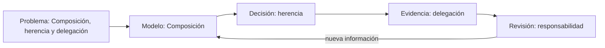

# SE-291 — Composición, herencia y delegación

[← SE-290 — SOLID y sus límites](https://github.com/vladimiracunadev-create/modern-software-engineering-program/blob/main/classes/part-24-diseno-patrones-y-refactorizacion/se-290-solid-y-sus-limites/README.md) · [↑ Parte 24](https://github.com/vladimiracunadev-create/modern-software-engineering-program/blob/main/classes/part-24-diseno-patrones-y-refactorizacion/README.md) · [📚 Índice completo](https://github.com/vladimiracunadev-create/modern-software-engineering-program/blob/main/classes/README.md) · [🌐 Portal](https://vladimiracunadev-create.github.io/modern-software-engineering-program/classes/SE-291.html) · [SE-292 — Patrones creacionales, estructurales y conductuales →](https://github.com/vladimiracunadev-create/modern-software-engineering-program/blob/main/classes/part-24-diseno-patrones-y-refactorizacion/se-292-patrones-creacionales-estructurales-y-conductuales/README.md)

> [!WARNING]
> Estado: **PLANNED · BORRADOR EN REVISIÓN**. El material es visible para auditoría,
> pero aún no supera el estándar pedagógico profundo y no debe presentarse como clase terminada.

## Prerrequisitos

- Haber completado o diagnosticado `SE-290` y poder explicar qué evidencia produjo.
- Manejar archivos de texto, rutas y control de versiones a nivel básico.
- Disponer de Python 3.11+, pruebas, analizador estático y Git.

## Problema auténtico

Un equipo que trabaja en una servicio financiero debe decidir sobre **Composición, herencia y delegación**. Tiene información incompleta, restricciones de tiempo y personas afectadas por una decisión incorrecta. El reto no es repetir definiciones: es convertir el tema en un resultado revisable, distinguir observación de supuesto y conservar evidencia para que otra persona pueda continuar o cuestionar el trabajo.

## Objetivos observables

Al terminar podrás:

1. explicar Composición y herencia con un ejemplo y un contraejemplo;
2. comparar al menos dos opciones usando evidencia, riesgo, costo y reversibilidad;
3. producir el artefacto **refactorización protegida por caracterización y decisión de diseño** para que otra persona pueda revisarlo;
4. diagnosticar el fallo «refactorizar y cambiar comportamiento al mismo tiempo sin caracterización» sin ocultar incertidumbre;
5. transferir la decisión a otra plataforma o dominio sin depender de una marca.

## Temas y por qué importan

| Tema | Función en la clase | Por qué importa |
| --- | --- | --- |
| Composición | Modelo | Delimita qué entidad, estado o relación se estudia y qué queda fuera. |
| Herencia | Mecanismo | Explica la cadena causal: qué entrada cambia qué estado y mediante qué regla. |
| Delegación | Evidencia | Define la señal observable que permite contrastar el modelo sin confundir correlación con causa. |
| Responsabilidad | Decisión | Convierte el conocimiento en opciones comparables, límites, riesgos y condiciones de reversión. |

## Mapa conceptual



El diagrama se lee de izquierda a derecha: el problema obliga a construir un
modelo; el modelo permite decidir; la decisión solo se sostiene con evidencia; y
la revisión devuelve nueva información al modelo. No es una secuencia lineal de
entrega, sino un ciclo de aprendizaje aplicado a **Composición, herencia y delegación**.

## Conceptos y decisiones

Diseñar distribuye responsabilidades y dependencias para facilitar cambios; refactorizar mejora esa estructura sin alterar comportamiento observable.

La pregunta rectora de esta parte es: **¿qué cambio futuro se vuelve más seguro y qué evidencia demuestra que el comportamiento se conserva?** La respuesta debe
apoyarse en **pruebas de caracterización, diff enfocado, métricas interpretadas y decisión reversible**.

### 1. Composición: modelo

En esta clase, **Composición** se estudia como modelo. Su función es delimita qué entidad, estado o relación se estudia y qué queda fuera. Debe conectarse con la pregunta «¿qué cambio futuro se vuelve más seguro y qué evidencia demuestra que el comportamiento se conserva?» y demostrarse mediante pruebas de caracterización, diff enfocado, métricas interpretadas y decisión reversible. Un tratamiento superficial solo lo nombraría; un tratamiento útil identifica precondiciones, transición, resultado observable y caso en que la explicación deja de sostenerse. Aplica esa secuencia a **Composición, herencia y delegación**, registra los supuestos y explica qué decisión concreta cambia al comprenderla.

### 2. Herencia: mecanismo

En esta clase, **herencia** se estudia como mecanismo. Su función es explica la cadena causal: qué entrada cambia qué estado y mediante qué regla. Debe conectarse con la pregunta «¿qué cambio futuro se vuelve más seguro y qué evidencia demuestra que el comportamiento se conserva?» y demostrarse mediante pruebas de caracterización, diff enfocado, métricas interpretadas y decisión reversible. Un tratamiento superficial solo lo nombraría; un tratamiento útil identifica precondiciones, transición, resultado observable y caso en que la explicación deja de sostenerse. Aplica esa secuencia a **Composición, herencia y delegación**, registra los supuestos y explica qué decisión concreta cambia al comprenderla.

### 3. Delegación: evidencia

En esta clase, **delegación** se estudia como evidencia. Su función es define la señal observable que permite contrastar el modelo sin confundir correlación con causa. Debe conectarse con la pregunta «¿qué cambio futuro se vuelve más seguro y qué evidencia demuestra que el comportamiento se conserva?» y demostrarse mediante pruebas de caracterización, diff enfocado, métricas interpretadas y decisión reversible. Un tratamiento superficial solo lo nombraría; un tratamiento útil identifica precondiciones, transición, resultado observable y caso en que la explicación deja de sostenerse. Aplica esa secuencia a **Composición, herencia y delegación**, registra los supuestos y explica qué decisión concreta cambia al comprenderla.

### 4. Responsabilidad: decisión

En esta clase, **responsabilidad** se estudia como decisión. Su función es convierte el conocimiento en opciones comparables, límites, riesgos y condiciones de reversión. Debe conectarse con la pregunta «¿qué cambio futuro se vuelve más seguro y qué evidencia demuestra que el comportamiento se conserva?» y demostrarse mediante pruebas de caracterización, diff enfocado, métricas interpretadas y decisión reversible. Un tratamiento superficial solo lo nombraría; un tratamiento útil identifica precondiciones, transición, resultado observable y caso en que la explicación deja de sostenerse. Aplica esa secuencia a **Composición, herencia y delegación**, registra los supuestos y explica qué decisión concreta cambia al comprenderla.

La regla de trabajo es conservar trazabilidad: problema → supuesto → opción → decisión → evidencia → revisión. Una solución técnicamente posible puede seguir siendo inadecuada si excluye personas, desplaza riesgos o no puede mantenerse. La herramienta concreta se elige después de fijar el comportamiento y el criterio de aceptación.

## Definiciones de trabajo

- **Composición:** concepto usado aquí como modelo; se acepta solo si puede observarse o justificarse mediante pruebas de caracterización, diff enfocado, métricas interpretadas y decisión reversible.
- **Herencia:** concepto usado aquí como mecanismo; se acepta solo si puede observarse o justificarse mediante pruebas de caracterización, diff enfocado, métricas interpretadas y decisión reversible.
- **Delegación:** concepto usado aquí como evidencia; se acepta solo si puede observarse o justificarse mediante pruebas de caracterización, diff enfocado, métricas interpretadas y decisión reversible.
- **Responsabilidad:** concepto usado aquí como decisión; se acepta solo si puede observarse o justificarse mediante pruebas de caracterización, diff enfocado, métricas interpretadas y decisión reversible.

Estas definiciones son operativas para el borrador: deberán sustituirse o
precisarse con terminología de las fuentes de la clase durante la revisión
cualitativa. No son un glosario normativo.

## Ejemplo mínimo

Registra una sola decisión sobre **Composición, herencia y delegación**:

| Elemento | Ejemplo contrastable |
| --- | --- |
| Contexto | el equipo necesita una decisión en una iteración y carece de una medición directa |
| Supuesto | la opción elegida reduce el riesgo principal sin crear uno mayor |
| Evidencia | ejemplo, medición o revisión que una segunda persona puede repetir |
| Límite | el resultado no representa producción ni todas las poblaciones usuarias |
| Próxima señal | un dato que confirmaría, refutaría o modificaría la decisión |

El valor del ejemplo no está en “tener razón”, sino en que el razonamiento pueda ser inspeccionado.

## Ejemplo profesional

En la servicio financiero, el equipo prepara un cambio relacionado con **Composición, herencia y delegación**. Parte de esta pregunta: **¿qué cambio futuro se vuelve más seguro y qué evidencia demuestra que el comportamiento se conserva?** Antes de implementarlo, registra personas afectadas, estados normales y degradados, datos utilizados, costo de reversión y señales de éxito. Dos opciones se comparan con la misma tabla y se contrastan usando pruebas de caracterización, diff enfocado, métricas interpretadas y decisión reversible. La alternativa ganadora queda condicionada a una prueba pequeña. La revisión incluye a producto, ingeniería y una persona que no participó en la propuesta. El resultado se archiva como `characterization.py` y enlaza la evidencia, no solo la conclusión.

## Práctica guiada

1. Crea `work/SE-291/` sin copiar datos personales ni secretos.
2. Formula el problema en una frase que incluya actor, necesidad y consecuencia.
3. Separa en una tabla hechos observados, inferencias, incógnitas y restricciones.
4. Propón dos opciones y una opción de no actuar; explicita costos y riesgos.
5. Construye el refactorización protegida por caracterización y decisión de diseño con los archivos indicados abajo.
6. Introduce deliberadamente el fallo controlado y registra síntomas antes de corregirlo.
7. Pide una revisión: la otra persona debe reconstruir la decisión solo con el artefacto.
8. Actualiza la conclusión y anota qué evidencia cambiaría la decisión.

## Ejercicios

1. **Fundamental:** define Composición y herencia con un ejemplo propio, un contraejemplo y un criterio que permita distinguirlos.
2. **Aplicado:** resuelve el caso de la servicio financiero, compara tres opciones y entrega `characterization.py` con trazabilidad completa.
3. **Avanzado:** cambia una restricción crítica —plataforma, escala, conectividad, regulación o capacidad del equipo— y demuestra qué partes de la decisión se conservan y cuáles deben revisarse.

## Reto verificable

Entrega el **refactorización protegida por caracterización y decisión de diseño** de forma que una persona que no participó en
la clase pueda reconstruir problema, supuestos, opciones, decisión y evidencia.
El reto se acepta únicamente si esa persona puede señalar una condición concreta
que cambiaría la decisión y reproducir al menos una comprobación sin pedir contexto
oral adicional.

## Fallo controlado y diagnóstico

Provoca de forma segura este fallo: **refactorizar y cambiar comportamiento al mismo tiempo sin caracterización**. No lo ejecutes sobre producción ni datos reales. Captura la decisión inicial, el síntoma observable y la primera hipótesis. Después reduce el caso, busca evidencia que pueda refutar tu hipótesis y corrige la causa, no solo el síntoma. Cierra con una medida preventiva y un procedimiento de recuperación.

## Entorno y archivos clave

Entorno de referencia: Python 3.11+, pruebas, analizador estático y Git. La actividad es documental y portable; cualquier comando adicional debe declarar sistema operativo y versión.

```text
work/SE-291/
├── README.md
│   ├── characterization.py
│   ├── design.md
│   ├── refactoring.md
├── activity.yaml
└── rubric.json
```

`README.md` explica cómo reproducir la actividad; `characterization.py` contiene el resultado principal; los demás archivos separan evidencia y revisión. `activity.yaml` y `rubric.json` son contratos generados junto a esta guía.

## Seguridad, ética y accesibilidad

- usa datos sintéticos o anonimizados y aplica minimización;
- no incluyas tokens, rutas privadas ni información personal en evidencias;
- identifica personas que reciben beneficios, cargas o riesgo de exclusión;
- ofrece una alternativa textual a diagramas y no uses color como única señal;
- verifica navegación por teclado y lenguaje comprensible cuando exista interfaz;
- detén la práctica si requiere acceso no autorizado o puede afectar sistemas reales.

## Transferencia

Repite la decisión en un segundo contexto: cambia la servicio financiero por otro de los dominios persistentes, o cambia Windows por Linux/macOS cuando aplique. Conserva problema, criterios y evidencia; modifica únicamente los supuestos dependientes del entorno. Explica por escrito qué conocimiento fue transferible y qué parte pertenecía a la herramienta.

## Evaluación y evidencia

| Criterio | Evidencia para aprobar |
| --- | --- |
| Comprensión | conceptos explicados con ejemplo, contraejemplo y límites |
| Decisión | opciones comparadas con criterios explícitos y alternativa de no actuar |
| Reproducibilidad | archivos, pasos y entorno permiten repetir la revisión |
| Diagnóstico | fallo controlado conserva síntomas, hipótesis, causa y recuperación |
| Responsabilidad | seguridad, privacidad, accesibilidad y personas afectadas fueron consideradas |

Entrega el directorio `work/SE-291/` y una reflexión de máximo 300 palabras. La rúbrica machine-readable está en `rubric.json`; no se aprueba solo por completar pasos.

## Fuentes

Fuentes verificadas el 2026-09-30:

- **SWEBOK Guide v4.0a** — IEEE Computer Society. [https://www.computer.org/education/bodies-of-knowledge/software-engineering](https://www.computer.org/education/bodies-of-knowledge/software-engineering) — se usa para contrastar vocabulario, límites y criterios aplicables.
- **ISO/IEC 25010:2023** — ISO. [https://www.iso.org/standard/78176.html](https://www.iso.org/standard/78176.html) — se usa para contrastar vocabulario, límites y criterios aplicables.
- **Python 3 documentation** — Python Software Foundation. [https://docs.python.org/3/](https://docs.python.org/3/) — se usa para contrastar vocabulario, límites y criterios aplicables.

## Preguntas frecuentes

### ¿Basta con definir los términos del título?

No. Debes mostrar cómo se relacionan, qué mecanismo explican, qué evidencia los
contrasta y qué decisión profesional cambia gracias a esa comprensión.

### ¿La herramienta recomendada es obligatoria?

No. El entorno de referencia hace reproducible la práctica, pero puedes usar otro
si documentas equivalencias, versiones, diferencias y procedimiento de recuperación.

### ¿Completar los archivos aprueba automáticamente la clase?

No. Los archivos son contenedores de evidencia. La aprobación depende de la calidad
del razonamiento, la reproducibilidad, el diagnóstico y la revisión contra las fuentes.

## Límites y siguiente paso

Esta guía enseña a razonar y producir evidencia sobre **Composición, herencia y delegación**; no certifica dominio profesional ni valida una implementación productiva. El siguiente enlace curricular es `SE-292`. Si la actividad necesita código o infraestructura real, debe avanzar a `EXECUTABLE`, añadir pruebas y documentar versiones, limpieza y recuperación.

---

[← SE-290 — SOLID y sus límites](https://github.com/vladimiracunadev-create/modern-software-engineering-program/blob/main/classes/part-24-diseno-patrones-y-refactorizacion/se-290-solid-y-sus-limites/README.md) · [↑ Parte 24](https://github.com/vladimiracunadev-create/modern-software-engineering-program/blob/main/classes/part-24-diseno-patrones-y-refactorizacion/README.md) · [📚 Índice completo](https://github.com/vladimiracunadev-create/modern-software-engineering-program/blob/main/classes/README.md) · [🌐 Portal](https://vladimiracunadev-create.github.io/modern-software-engineering-program/classes/SE-291.html) · [SE-292 — Patrones creacionales, estructurales y conductuales →](https://github.com/vladimiracunadev-create/modern-software-engineering-program/blob/main/classes/part-24-diseno-patrones-y-refactorizacion/se-292-patrones-creacionales-estructurales-y-conductuales/README.md)
