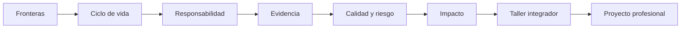

# Parte 00 — Ingeniería de software como profesión

- **Etapa:** A · Fundamentos de la profesión
- **Audiencia:** personas que comienzan y profesionales que necesitan hacer explícito su criterio de ingeniería
- **Estado:** 12 clases `GUIDED`, desarrolladas y aprobadas contra el gate pedagógico
- **Dedicación estimada:** 54 horas entre clases, taller y proyecto

## Antes de comenzar: la historia que conecta la parte

Durante las doce clases trabajarás con **Campus Abierto**, un servicio ficticio de
matrícula universitaria que combina portal web, reglas académicas, pagos, identidad,
atención humana y sistemas heredados. El caso no pretende simular una empresa
completa: ofrece un mismo objeto de estudio para observar cómo cambia una decisión
cuando ampliamos la mirada.

En `SE-001` dibujarás sus fronteras. Después explicarás por qué sus problemas no se
resuelven solo programando, distribuirás responsabilidades durante todo el ciclo de
vida y enfrentarás una decisión que perjudica a un grupo de estudiantes. Las clases
siguientes añaden colaboración, evidencia, calidad, riesgo e impacto. El taller
`SE-011` integra esas lentes en un producto real; el proyecto `SE-012` convierte lo
aprendido en una ruta profesional verificable.

El recorrido avanza desde **qué estamos cambiando** hasta **qué puedes demostrar que
sabes decidir**. Cada clase reutiliza y corrige evidencia anterior; no son capítulos
independientes ni una lista de conceptos.

## Cómo estudiar cada clase

1. Lee “Antes de empezar” para recuperar la decisión anterior y anticipar la nueva.
2. Intenta responder el problema auténtico antes de leer la explicación.
3. Usa el mapa visual como hipótesis: explica cada flecha y busca dónde podría fallar.
4. Produce el artefacto de la práctica; no marques progreso solo por haber leído.
5. Contrasta el resultado con el reto verificable y solicita una revisión externa.
6. Conserva la evidencia: será entrada de la clase siguiente y del proyecto final.

## Propósito profesional

Esta parte enseña a mirar el software como una intervención sociotécnica con ciclo de vida, personas afectadas y consecuencias. Antes de elegir lenguajes o frameworks, el estudiante aprende a delimitar sistemas, razonar con evidencia, reconocer responsabilidades, comparar riesgos y leer fuentes. La salida no es memorizar terminología: es producir decisiones que otra persona pueda inspeccionar y cuestionar.

## Resultados acumulativos

Al completar la parte podrás:

1. distinguir software, componente, sistema, producto, servicio y plataforma según la capacidad analizada;
2. explicar por qué una práctica de ingeniería existe, qué señal recibe y qué no garantiza;
3. modelar responsabilidades desde concepción hasta retiro;
4. analizar una decisión desde interés público, daño, inclusión y sostenibilidad;
5. separar observación, inferencia, hipótesis e incertidumbre;
6. convertir calidad y riesgo en escenarios verificables;
7. rastrear una afirmación hasta una fuente vigente y declarar su límite;
8. inspeccionar un producto y construir una ruta profesional basada en evidencia.

## Prerrequisitos y preparación

No se exige programación. Necesitas editar Markdown, navegar un repositorio y estar dispuesto a escribir «aún no tengo evidencia». Usa datos ficticios y un repositorio local o el producto de referencia. Ninguna práctica requiere secretos, producción ni información personal.

## Progresión por bloques

### Bloque 1 — Objeto y evolución de la disciplina

`SE-001` delimita qué se está construyendo. `SE-002` muestra por qué escala, cambio y coordinación exigieron prácticas de ingeniería. `SE-003` lleva esas prácticas al ciclo completo.

**Pregunta de control:** si el código funciona hoy, ¿qué evidencia falta para afirmar que el producto puede operar, evolucionar y retirarse responsablemente?

### Bloque 2 — Responsabilidad y colaboración

`SE-004` introduce interés público y reparación. `SE-005` distribuye autoridad entre especialidades. `SE-006` disciplina las afirmaciones mediante evidencia e incertidumbre.

**Pregunta de control:** ¿quién puede sufrir la decisión, quién puede detenerla y qué observación cambiaría la conclusión?

### Bloque 3 — Calidad y decisiones bajo restricciones

`SE-007` separa calidad interna, producto y uso. `SE-008` convierte conflictos de atributos en trade-offs explícitos. `SE-009` amplía el horizonte a efectos humanos, sociales y ambientales.

**Pregunta de control:** ¿qué métrica podría mejorar mientras el resultado importante empeora?

### Bloque 4 — Fuentes, integración y ruta

`SE-010` enseña lectura trazable de fuentes. `SE-011` integra el bloque mediante la anatomía de un producto. `SE-012` transforma la evidencia en un contrato de aprendizaje revisable.

**Pregunta de control:** ¿puede otra persona reconstruir tu afirmación, método, decisión y límite sin contexto oral?

## Guía razonada clase por clase

La tabla del recorrido sirve para localizar materiales, pero no explica por sí sola qué
transformación intelectual propone cada clase. Esta guía desarrolla esa progresión.
No conviene saltar directamente al artefacto: en cada paso se explicita el problema
profesional, el mecanismo que se aprende a observar, la decisión que se toma en
**Campus Abierto** y la evidencia que queda preparada para la clase siguiente.

### Bloque 1 — Comprender qué se construye y por qué requiere ingeniería

#### SE-001 — Software, sistemas y productos: fronteras de la disciplina

La entrada al programa no es una definición de diccionario, sino una decisión de
alcance. Campus Abierto contiene código, configuración y datos, pero la capacidad de
matricular depende además de reglas académicas, personal de secretaría, identidad,
pagos, conectividad y sistemas heredados. La clase enseña a distinguir el artefacto
software del sistema sociotécnico y del producto o servicio que promete un resultado.
Mover una frontera cambia los requisitos visibles, las dependencias que deben
controlarse y las consecuencias por las que el equipo sigue respondiendo.

El estudiante compara tres fronteras posibles —aplicación, producto y sistema de
matrícula— y sigue una solicitud a través de sus interfaces. Así descubre una idea que
se reutiliza en toda la parte: **estar fuera del control directo no equivale a estar
fuera de la responsabilidad profesional**. El resultado es un mapa discutible, con
capacidad, actores, interfaces, supuestos y propietarios; no un diagrama decorativo.
Ese mapa será la unidad de análisis de `SE-002`.

#### SE-002 — De la crisis del software a la ingeniería continua

Con la frontera trazada, Campus Abierto crece de una facultad a veinte. Aumentan los
estados posibles, las interfaces y las decisiones que varias personas deben coordinar.
La clase explica la llamada crisis del software como una familia de problemas de
escala, cambio, conocimiento y retroalimentación tardía, no como una época superada ni
como prueba de que una metodología específica es universal. Modularidad, control de
versiones, revisión, iteración, integración y operación continua se estudian como
respuestas a fallos causales concretos.

Cada práctica se analiza mediante cuatro preguntas: qué demora o incertidumbre reduce,
qué señal produce, bajo qué condiciones funciona y qué no garantiza. Integrar a diario
puede revelar incompatibilidades antes; no demuestra que se entendió la necesidad.
Desplegar con frecuencia reduce el tamaño del lote; no vuelve reversible una migración.
La evidencia es una cadena causa → práctica → señal → límite que impide adoptar una
moda por su nombre y prepara la distribución temporal de responsabilidades de
`SE-003`.

#### SE-003 — Ciclo de vida completo y responsabilidades profesionales

La tercera clase convierte el mapa estático en una película. Una capacidad se concibe,
se diseña, se construye, se verifica, se transfiere, se opera, se adapta y finalmente
se retira. Estas actividades pueden solaparse y repetirse; “ciclo de vida” no significa
cascada. El mecanismo central es seguir una decisión a través del tiempo: una elección
de esquema durante construcción reaparece como migración, recuperación, conservación
de datos y compatibilidad durante operación y retiro.

Campus Abierto cambia de proveedor de identidad. El estudiante define quién propone,
quién puede detener, qué acepta el receptor, qué evidencia autoriza el cambio y cómo se
revierte o se completa el retiro. Se distingue responsabilidad de ejecución, autoridad
de decisión y custodia. El entregable combina mapa de ciclo, contrato de handoff y plan
de retiro; deja visibles los puntos en que el poder técnico produce consecuencias que
`SE-004` someterá a juicio ético.

### Bloque 2 — Responder por consecuencias y decidir con otros

#### SE-004 — Ética, interés público y deber de cuidado

Campus Abierto introduce una priorización que mejora el promedio de atención, pero
perjudica a estudiantes que trabajan y no ofrece apelación. La clase no entrega una
lista de valores para recitar: enseña un procedimiento de deliberación. Primero separa
hechos, supuestos y conflictos de interés; luego identifica personas afectadas —usen o
no la interfaz—, distribuye beneficios y daños, compara alternativas y define
prevención, monitoreo, apelación y reparación.

Legalidad, política institucional y ética profesional son fuentes distintas de
obligación. Cumplir una instrucción no elimina el deber de advertir un daño previsible;
tampoco todo desacuerdo habilita una acusación pública. El estudiante produce una
decisión proporcional a severidad, escala, reversibilidad y posibilidad de impugnarla,
incluye incertidumbre y documenta el escalamiento. `SE-005` toma esas obligaciones y
pregunta qué combinación de voces, competencia y autoridad puede sostenerlas.

#### SE-005 — Roles, especialidades y colaboración interdisciplinaria

Una lista de cargos no explica cómo circula una señal durante un incidente. En Campus
Abierto, soporte observa síntomas, datos ve un patrón, seguridad limita accesos y
desarrollo conoce el cambio reciente. La clase diferencia rol, responsabilidad,
autoridad y competencia, y modela la colaboración como interfaces con entrada, salida,
plazo, criterio de aceptación y escalamiento. Así se evita tanto el silo especialista
como la reunión en la que todos participan y nadie decide.

El estudiante reconstruye la cronología del incidente y diseña derechos de decisión:
quién propone, quién decide, quién debe ser consultado, quién revisa de forma
independiente y quién opera la consecuencia. También prueba qué ocurre cuando un rol
tiene responsabilidad sin autoridad o cuando una misma persona propone y aprueba una
decisión de alto impacto. El mapa resultante hace posible que `SE-006` evalúe no solo
quién opina, sino qué evidencia justifica cada explicación.

#### SE-006 — Evidencia, incertidumbre y pensamiento crítico

Varias explicaciones plausibles compiten: la base de datos, el proveedor de identidad,
la caché o el último despliegue. Esta clase separa observación, inferencia, hipótesis,
supuesto y decisión provisional. La evidencia se valora por relevancia para la pregunta,
trazabilidad del método, representatividad del contexto y capacidad de discriminar
entre alternativas; acumular capturas o métricas no basta.

El estudiante formula predicciones rivales, busca contraevidencia, controla variables
cuando puede y triangula cuando un experimento no es viable. Compara además el costo de
seguir investigando con la consecuencia y reversibilidad de decidir. El registro final
permite reproducir una medición, muestra qué resultado refutaría la hipótesis y declara
cuándo revisar la decisión. Esa disciplina se usa en `SE-007` para transformar
“calidad” en afirmaciones que puedan examinarse.

### Bloque 3 — Hacer explícita la calidad, el riesgo y los costos desplazados

#### SE-007 — Calidad interna, externa y calidad en uso

Campus Abierto puede tener código analizable, pruebas que pasan y una API rápida, pero
seguir impidiendo que una persona complete la matrícula desde una conexión inestable.
La clase explica tres perspectivas relacionadas, no intercambiables: propiedades
internas que condicionan el cambio, comportamiento del producto en ejecución y
consecuencias obtenidas por personas concretas en un contexto de uso. Una relación
plausible entre ellas no se presenta como causalidad demostrada.

Cada adjetivo se convierte en escenario con fuente del estímulo, entorno, artefacto,
respuesta y medida. Después se examina cómo una métrica puede convertirse en objetivo
y ocultar el resultado que pretendía representar. El estudiante construye escenarios
encadenados, justifica umbrales, añade señales de protección y declara qué conclusión
no permite cada medida. `SE-008` usa esos escenarios para mostrar que decidir calidad
implica restricciones y pérdidas, no maximización abstracta.

#### SE-008 — Restricciones, riesgos y compromisos entre atributos

Reservar cupos de manera estricta mejora consistencia, pero puede aumentar latencia,
dependencia y costo operativo. Relajarla puede responder más rápido y trasladar el
error a estudiantes y soporte. La clase distingue restricciones duras de preferencias
y supuestos, exige fuente, vigencia y autoridad para cada una, y formula el riesgo como
cadena causa → evento incierto → consecuencia → señal → respuesta.

Las alternativas se comparan con la misma evidencia y sin sumar derechos fundamentales
como si fueran puntos compensables. Se consideran reversibilidad, radio de impacto y
valor de conservar opciones. La decisión no termina en “opción ganadora”: incorpora
mitigación, contingencia, propietario, fecha y disparadores que obligan a revisarla.
`SE-009` amplía la frontera para observar costos que la tabla de arquitectura podría
haber desplazado fuera del equipo.

#### SE-009 — Sostenibilidad, inclusión y responsabilidad social

Digitalizar no elimina materia, trabajo ni desigualdad. Campus Abierto ahorra trámites
presenciales, pero puede exigir dispositivos recientes, transferir más datos, excluir
conexiones lentas y concentrar guardias en pocas personas. La clase estudia impactos
directos, cambios de conducta habilitados y efectos sistémicos durante construcción,
uso, evolución y retiro. También diferencia accesibilidad técnica, inclusión en el
resultado y justicia en la distribución de beneficios y cargas.

El estudiante diseña una ruta de baja conectividad que preserve el resultado esencial,
analiza ciclo de vida de datos e infraestructura y busca posibles efectos rebote. Las
comunidades hipotéticas no sustituyen participación real: se registran como escenarios
que necesitan validación, no como voz apropiada. El mapa de impacto termina en
alternativas, medidas y reparación, y crea afirmaciones cuya procedencia se auditará en
`SE-010`.

### Bloque 4 — Fundamentar, integrar y convertir aprendizaje en evidencia

#### SE-010 — Cómo leer estándares, documentación y literatura técnica

Un enlace no respalda cualquier frase cercana. La décima clase enseña a identificar qué
tipo de autoridad tiene una fuente, para qué objeto y versión, dentro de qué alcance y
con qué lenguaje. Una norma puede definir un modelo sin prescribir una implementación;
la documentación oficial describe una versión soportada, pero no demuestra resultados
en el contexto local; un estudio aporta evidencia bajo su método y muestra.

El estudiante audita una afirmación previa y construye la cadena pregunta → fuente →
pasaje → interpretación → límite. Comprueba edición, vigencia y sustitución, distingue
contenido normativo de material informativo y coloca la cita junto a la afirmación que
realmente sustenta. Si el texto completo es inaccesible, no finge haberlo leído. Este
método permite que la anatomía de `SE-011` se apoye en evidencia localizable y no en la
autoridad aparente de una bibliografía extensa.

#### SE-011 — Taller: anatomía verificable de un producto real

El taller integra las diez lentes anteriores sobre un producto autorizado. La unidad de
análisis es un flujo vertical: una necesidad atraviesa interfaz, contrato, validación,
lógica, datos, dependencias, construcción, despliegue y señales operativas. Inventariar
directorios o repetir el README no demuestra comprensión. Cada hallazgo se clasifica
como observación, inferencia o incógnita y enlaza una ruta o fuente precisa.

La revisión comienza de forma estática y solo ejecuta lo expresamente autorizado tras
inspeccionar instrucciones y efectos. Se siguen una ruta normal y otra degradada, se
registran contradicciones y se priorizan huecos por consecuencia. Una segunda persona
debe reproducir hallazgos sin explicación oral. La anatomía resultante demuestra cómo
el estudiante investiga hoy; `SE-012` la convierte en evidencia para elegir qué
capacidad desarrollar después.

#### SE-012 — Proyecto: mapa profesional y contrato personal de aprendizaje

La parte cierra sustituyendo aspiraciones vagas por capacidades observables. El
estudiante reúne los artefactos de Campus Abierto y la anatomía del taller, distingue
lo que puede reconocer, ejecutar con guía, transferir y defender, y declara sin castigo
lo que aún no puede demostrar. El tiempo de experiencia y la familiaridad con una
herramienta no se aceptan como sustitutos de evidencia contextualizada.

Una dirección profesional se expresa mediante problemas y responsabilidades, no como
identidad permanente. Cada brecha se transforma en un experimento acotado con práctica,
feedback, criterio de salida, límite de trabajo en curso y plan ante bloqueo. El
contrato incluye una fecha de revisión porque nueva evidencia puede cambiar la ruta.
El resultado no promete empleo ni dominio total: establece una forma sostenible y
auditable de continuar en `SE-013` y en las partes posteriores.

## Resumen operativo del recorrido

| Clase | Capacidad construida | Evidencia principal |
| --- | --- | --- |
| [SE-001](../../classes/part-00-ingenieria-de-software-como-profesion/se-001-software-sistemas-y-productos-fronteras-de-la-disciplina/README.md) | trazar fronteras y responsabilidades | mapa de sistema y fronteras |
| [SE-002](../../classes/part-00-ingenieria-de-software-como-profesion/se-002-historia-de-la-crisis-del-software-a-la-ingenieria-continua/README.md) | explicar prácticas mediante causalidad histórica | línea causal y comparación |
| [SE-003](../../classes/part-00-ingenieria-de-software-como-profesion/se-003-ciclo-de-vida-completo-y-responsabilidades-profesionales/README.md) | cubrir ciclo completo | mapa de ciclo, handoff y retiro |
| [SE-004](../../classes/part-00-ingenieria-de-software-como-profesion/se-004-etica-interes-publico-y-consecuencias-de-las-decisiones-tecnicas/README.md) | decidir con interés público | caso ético y apelación |
| [SE-005](../../classes/part-00-ingenieria-de-software-como-profesion/se-005-roles-especialidades-y-colaboracion-interdisciplinaria/README.md) | coordinar especialidades | mapa de autoridad y handoff |
| [SE-006](../../classes/part-00-ingenieria-de-software-como-profesion/se-006-evidencia-incertidumbre-y-pensamiento-critico-en-ingenieria/README.md) | razonar bajo incertidumbre | log de evidencia y experimento |
| [SE-007](../../classes/part-00-ingenieria-de-software-como-profesion/se-007-calidad-interna-externa-y-calidad-en-uso/README.md) | especificar calidad | escenarios y medidas |
| [SE-008](../../classes/part-00-ingenieria-de-software-como-profesion/se-008-restricciones-riesgos-y-compromisos-entre-atributos/README.md) | comparar trade-offs | registro de riesgos y decisión |
| [SE-009](../../classes/part-00-ingenieria-de-software-como-profesion/se-009-sostenibilidad-inclusion-y-responsabilidad-social/README.md) | ampliar impactos | mapa social, ambiental y técnico |
| [SE-010](../../classes/part-00-ingenieria-de-software-como-profesion/se-010-como-leer-estandares-documentacion-y-literatura-tecnica/README.md) | leer fuentes sin exagerar | trazabilidad de afirmaciones |
| [SE-011](../../classes/part-00-ingenieria-de-software-como-profesion/se-011-taller-anatomia-verificable-de-un-producto-real/README.md) | integrar perspectivas | anatomía verificable del producto |
| [SE-012](../../classes/part-00-ingenieria-de-software-como-profesion/se-012-proyecto-mapa-profesional-y-contrato-personal-de-aprendizaje/README.md) | planificar desarrollo profesional | mapa y contrato de aprendizaje |

## Proyecto integrador y criterio de salida

El proyecto final reúne diagnóstico, mapa de competencias y tres experimentos. Para salir de la parte, otra persona debe poder rastrear cada prioridad a una brecha, cada brecha a evidencia actual y cada experimento a un criterio de aceptación. Además, el portafolio debe contener la anatomía del taller, al menos una revisión independiente y límites explícitos de lo no ejecutado.

No aprueba una carpeta llena de plantillas, una lista de tecnologías ni una autoevaluación sin enlaces. Si una evidencia previa ya cumple el criterio, puede convalidarse; seguridad, ética, accesibilidad y recuperación no se omiten.

## Fuentes de la parte

- [SWEBOK v4.0a](https://www.computer.org/education/bodies-of-knowledge/software-engineering/v4) delimita el cuerpo profesional.
- [ISO/IEC/IEEE 12207:2026](https://www.iso.org/standard/90219.html) sustenta el ciclo de vida.
- [ISO/IEC 25010:2023](https://www.iso.org/standard/78176.html) e [ISO/IEC 25019:2023](https://www.iso.org/standard/78177.html) separan producto y calidad en uso.
- [ACM Code of Ethics](https://www.acm.org/code-of-ethics) y [Software Engineering Code of Ethics](https://www.computer.org/education/code-of-ethics) orientan responsabilidad profesional.
- [NASA Systems Engineering Handbook](https://www.nasa.gov/reference/systems-engineering-handbook/) aporta trazabilidad, stakeholders y revisiones.

## Límites

La parte no certifica competencia profesional ni sustituye experiencia supervisada, asesoría jurídica o participación de comunidades afectadas. Prepara el criterio con el que se estudiarán las áreas técnicas siguientes.

[Volver al índice de clases](../../classes/README.md)
