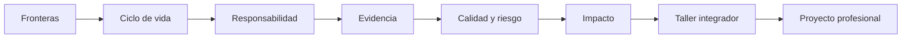

# Parte 00 — Ingeniería de software como profesión

- **Etapa:** A · Fundamentos de la profesión
- **Audiencia:** personas que comienzan y profesionales que necesitan hacer explícito su criterio de ingeniería
- **Estado:** 12 clases `GUIDED`, desarrolladas y aprobadas contra el gate pedagógico
- **Dedicación estimada:** 54 horas entre clases, taller y proyecto

## Antes de comenzar: la historia que conecta la parte

Durante las doce clases trabajarás con **Campus Abierto**, un servicio ficticio de
matrícula universitaria que combina portal web, reglas académicas, pagos, identidad,
atención humana y sistemas heredados. El caso no pretende simular una empresa
completa: ofrece un mismo objeto de estudio para observar cómo cambia una decisión
cuando ampliamos la mirada.

En `SE-001` dibujarás sus fronteras. Después explicarás por qué sus problemas no se
resuelven solo programando, distribuirás responsabilidades durante todo el ciclo de
vida y enfrentarás una decisión que perjudica a un grupo de estudiantes. Las clases
siguientes añaden colaboración, evidencia, calidad, riesgo e impacto. El taller
`SE-011` integra esas lentes en un producto real; el proyecto `SE-012` convierte lo
aprendido en una ruta profesional verificable.

El recorrido avanza desde **qué estamos cambiando** hasta **qué puedes demostrar que
sabes decidir**. Cada clase reutiliza y corrige evidencia anterior; no son capítulos
independientes ni una lista de conceptos.

## Cómo estudiar cada clase

1. Lee “Antes de empezar” para recuperar la decisión anterior y anticipar la nueva.
2. Intenta responder el problema auténtico antes de leer la explicación.
3. Usa el mapa visual como hipótesis: explica cada flecha y busca dónde podría fallar.
4. Produce el artefacto de la práctica; no marques progreso solo por haber leído.
5. Contrasta el resultado con el reto verificable y solicita una revisión externa.
6. Conserva la evidencia: será entrada de la clase siguiente y del proyecto final.

## Propósito profesional

Esta parte enseña a mirar el software como una intervención sociotécnica con ciclo de vida, personas afectadas y consecuencias. Antes de elegir lenguajes o frameworks, el estudiante aprende a delimitar sistemas, razonar con evidencia, reconocer responsabilidades, comparar riesgos y leer fuentes. La salida no es memorizar terminología: es producir decisiones que otra persona pueda inspeccionar y cuestionar.

## Resultados acumulativos

Al completar la parte podrás:

1. distinguir software, componente, sistema, producto, servicio y plataforma según la capacidad analizada;
2. explicar por qué una práctica de ingeniería existe, qué señal recibe y qué no garantiza;
3. modelar responsabilidades desde concepción hasta retiro;
4. analizar una decisión desde interés público, daño, inclusión y sostenibilidad;
5. separar observación, inferencia, hipótesis e incertidumbre;
6. convertir calidad y riesgo en escenarios verificables;
7. rastrear una afirmación hasta una fuente vigente y declarar su límite;
8. inspeccionar un producto y construir una ruta profesional basada en evidencia.

## Prerrequisitos y preparación

No se exige programación. Necesitas editar Markdown, navegar un repositorio y estar dispuesto a escribir «aún no tengo evidencia». Usa datos ficticios y un repositorio local o el producto de referencia. Ninguna práctica requiere secretos, producción ni información personal.

## Progresión por bloques

### Bloque 1 — Objeto y evolución de la disciplina

`SE-001` delimita qué se está construyendo. `SE-002` muestra por qué escala, cambio y coordinación exigieron prácticas de ingeniería. `SE-003` lleva esas prácticas al ciclo completo.

**Pregunta de control:** si el código funciona hoy, ¿qué evidencia falta para afirmar que el producto puede operar, evolucionar y retirarse responsablemente?

### Bloque 2 — Responsabilidad y colaboración

`SE-004` introduce interés público y reparación. `SE-005` distribuye autoridad entre especialidades. `SE-006` disciplina las afirmaciones mediante evidencia e incertidumbre.

**Pregunta de control:** ¿quién puede sufrir la decisión, quién puede detenerla y qué observación cambiaría la conclusión?

### Bloque 3 — Calidad y decisiones bajo restricciones

`SE-007` separa calidad interna, producto y uso. `SE-008` convierte conflictos de atributos en trade-offs explícitos. `SE-009` amplía el horizonte a efectos humanos, sociales y ambientales.

**Pregunta de control:** ¿qué métrica podría mejorar mientras el resultado importante empeora?

### Bloque 4 — Fuentes, integración y ruta

`SE-010` enseña lectura trazable de fuentes. `SE-011` integra el bloque mediante la anatomía de un producto. `SE-012` transforma la evidencia en un contrato de aprendizaje revisable.

**Pregunta de control:** ¿puede otra persona reconstruir tu afirmación, método, decisión y límite sin contexto oral?

## Recorrido clase por clase

| Clase | Capacidad construida | Evidencia principal |
| --- | --- | --- |
| [SE-001](../../classes/part-00-ingenieria-de-software-como-profesion/se-001-software-sistemas-y-productos-fronteras-de-la-disciplina/README.md) | trazar fronteras y responsabilidades | mapa de sistema y fronteras |
| [SE-002](../../classes/part-00-ingenieria-de-software-como-profesion/se-002-historia-de-la-crisis-del-software-a-la-ingenieria-continua/README.md) | explicar prácticas mediante causalidad histórica | línea causal y comparación |
| [SE-003](../../classes/part-00-ingenieria-de-software-como-profesion/se-003-ciclo-de-vida-completo-y-responsabilidades-profesionales/README.md) | cubrir ciclo completo | mapa de ciclo, handoff y retiro |
| [SE-004](../../classes/part-00-ingenieria-de-software-como-profesion/se-004-etica-interes-publico-y-consecuencias-de-las-decisiones-tecnicas/README.md) | decidir con interés público | caso ético y apelación |
| [SE-005](../../classes/part-00-ingenieria-de-software-como-profesion/se-005-roles-especialidades-y-colaboracion-interdisciplinaria/README.md) | coordinar especialidades | mapa de autoridad y handoff |
| [SE-006](../../classes/part-00-ingenieria-de-software-como-profesion/se-006-evidencia-incertidumbre-y-pensamiento-critico-en-ingenieria/README.md) | razonar bajo incertidumbre | log de evidencia y experimento |
| [SE-007](../../classes/part-00-ingenieria-de-software-como-profesion/se-007-calidad-interna-externa-y-calidad-en-uso/README.md) | especificar calidad | escenarios y medidas |
| [SE-008](../../classes/part-00-ingenieria-de-software-como-profesion/se-008-restricciones-riesgos-y-compromisos-entre-atributos/README.md) | comparar trade-offs | registro de riesgos y decisión |
| [SE-009](../../classes/part-00-ingenieria-de-software-como-profesion/se-009-sostenibilidad-inclusion-y-responsabilidad-social/README.md) | ampliar impactos | mapa social, ambiental y técnico |
| [SE-010](../../classes/part-00-ingenieria-de-software-como-profesion/se-010-como-leer-estandares-documentacion-y-literatura-tecnica/README.md) | leer fuentes sin exagerar | trazabilidad de afirmaciones |
| [SE-011](../../classes/part-00-ingenieria-de-software-como-profesion/se-011-taller-anatomia-verificable-de-un-producto-real/README.md) | integrar perspectivas | anatomía verificable del producto |
| [SE-012](../../classes/part-00-ingenieria-de-software-como-profesion/se-012-proyecto-mapa-profesional-y-contrato-personal-de-aprendizaje/README.md) | planificar desarrollo profesional | mapa y contrato de aprendizaje |

## Proyecto integrador y criterio de salida

El proyecto final reúne diagnóstico, mapa de competencias y tres experimentos. Para salir de la parte, otra persona debe poder rastrear cada prioridad a una brecha, cada brecha a evidencia actual y cada experimento a un criterio de aceptación. Además, el portafolio debe contener la anatomía del taller, al menos una revisión independiente y límites explícitos de lo no ejecutado.

No aprueba una carpeta llena de plantillas, una lista de tecnologías ni una autoevaluación sin enlaces. Si una evidencia previa ya cumple el criterio, puede convalidarse; seguridad, ética, accesibilidad y recuperación no se omiten.

## Fuentes de la parte

- [SWEBOK v4.0a](https://www.computer.org/education/bodies-of-knowledge/software-engineering/v4) delimita el cuerpo profesional.
- [ISO/IEC/IEEE 12207:2026](https://www.iso.org/standard/90219.html) sustenta el ciclo de vida.
- [ISO/IEC 25010:2023](https://www.iso.org/standard/78176.html) e [ISO/IEC 25019:2023](https://www.iso.org/standard/78177.html) separan producto y calidad en uso.
- [ACM Code of Ethics](https://www.acm.org/code-of-ethics) y [Software Engineering Code of Ethics](https://www.computer.org/education/code-of-ethics) orientan responsabilidad profesional.
- [NASA Systems Engineering Handbook](https://www.nasa.gov/reference/systems-engineering-handbook/) aporta trazabilidad, stakeholders y revisiones.

## Límites

La parte no certifica competencia profesional ni sustituye experiencia supervisada, asesoría jurídica o participación de comunidades afectadas. Prepara el criterio con el que se estudiarán las áreas técnicas siguientes.

[Volver al índice de clases](../../classes/README.md)
