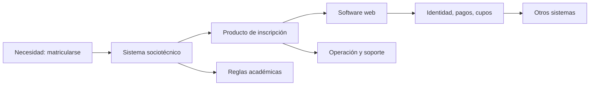

# SE-001 — Software, sistemas y productos: fronteras de la disciplina

← Inicio del programa · [↑ Parte 00](../../classes/part-00-ingenieria-de-software-como-profesion/README.md) · [📚 Índice completo](../../classes/README.md) · [🌐 Portal](https://vladimiracunadev-create.github.io/modern-software-engineering-program/classes/SE-001.html) · [SE-002 →](../../classes/part-00-ingenieria-de-software-como-profesion/se-002-historia-de-la-crisis-del-software-a-la-ingenieria-continua/README.md)

> Estado: **GUIDED**. Clase desarrollada y revisada contra el estándar pedagógico; no implica evidencia de ejecución productiva.

## Antes de empezar

Esta primera clase ocurre **antes del lenguaje, el framework y la arquitectura**. La
pregunta inicial no es “¿cómo lo construimos?”, sino “¿qué realidad intentamos
cambiar y dónde termina nuestra responsabilidad?”. Sin esa pausa, una solución puede
ser técnicamente correcta y fracasar como producto.

Abrimos el caso conductor **Campus Abierto**: estudiantes intentan matricularse,
secretaría aplica reglas, un proveedor procesa pagos y varios sistemas intercambian
cupos. Hoy producirás el primer artefacto acumulativo, `system-map.md`. En `SE-002`
usaremos ese mapa para descubrir qué ocurre cuando escala el número de componentes,
personas y cambios.

## Prerrequisitos

Puedes comenzar sin programar. Necesitas distinguir una observación de una opinión y representar relaciones con cajas y flechas. Si no has trabajado en un producto digital, usa como caso un sistema de matrícula, una biblioteca o una tienda.

## Problema auténtico

Un equipo recibe «mejorar el sistema de inscripción». Antes de estimar debe saber qué cambia. ¿El software es solo código? ¿El sistema incluye secretaría y procedimientos manuales? ¿El producto termina en la interfaz o incluye soporte, datos y operación? Una frontera mal trazada permite optimizar una pieza mientras el problema persiste fuera de ella.

## Objetivos observables

Podrás delimitar software, sistema, producto, servicio y plataforma; explicar cómo una frontera cambia requisitos y responsabilidad; construir un mapa con actores, elementos e interfaces; y detectar una mejora local que empeora el resultado global.

## Temas y por qué importan

| Tema | Mecanismo | Por qué importa |
| --- | --- | --- |
| Software | instrucciones, datos y configuración producen comportamiento | evita reducir el trabajo a pantallas |
| Sistema | elementos técnicos y humanos cooperan para una capacidad | revela fallos fuera del código |
| Producto | una propuesta de valor se sostiene durante un ciclo de vida | conecta técnica con resultados y costos |
| Frontera | decide qué se modela y quién responde | impide trasladar silenciosamente el riesgo |

## Mapa conceptual

El software implementa parte de la capacidad, pero la inscripción depende de reglas, personas, datos y sistemas externos. Ninguna frontera es natural: se elige para razonar y debe declararse.

## Conceptos y decisiones

### 1. El código produce comportamiento; no produce por sí solo el resultado

**Software** no significa únicamente archivos fuente. El comportamiento ejecutable
depende también de datos, configuración, versiones de dependencias, permisos,
infraestructura y conocimiento operativo. Un repositorio puede compilar en la máquina
de su autora y no constituir todavía una capacidad reproducible: faltan condiciones
para instalarlo, configurarlo, observarlo, recuperarlo y modificarlo sin depender de
memoria privada.

Esta distinción evita un primer error profesional: confundir “el programa responde”
con “la necesidad quedó satisfecha”. En Campus Abierto, el portal puede aceptar una
solicitud y devolver `200 OK`; la matrícula no existe hasta que las reglas académicas
la validan, el cupo queda reservado, el pago se concilia y la persona recibe una
confirmación que puede comprender y conservar. La respuesta HTTP es evidencia sobre
una pieza. No demuestra el resultado de extremo a extremo.

Una **capacidad** expresa ese resultado bajo condiciones declaradas. “Permitir que una
persona elegible reserve asignaturas sin superar cupos y conozca el estado de su
solicitud” es una capacidad. “Tener un formulario React” es una solución posible. Si se
formula primero la solución, desaparecen del análisis los canales alternativos, las
reglas, la recuperación y la posibilidad legítima de no construir software nuevo.

### 2. Sistema: relaciones, retroalimentación y comportamiento emergente

Un **sistema** es un conjunto de elementos relacionados que coopera para producir una
capacidad. Sus propiedades no se deducen sumando propiedades aisladas. Una base de
datos rápida, una interfaz accesible y un equipo atento pueden formar un sistema lento
si la aprobación manual acumula trabajo sin señal de capacidad. Ese retraso es
**emergente**: aparece por la relación entre tasa de entrada, reglas, cola y autoridad,
no por un único componente defectuoso.

Por eso el mapa debe incluir flujos de información, control y responsabilidad, no solo
dependencias técnicas. Una flecha “portal → secretaría” es ambigua. Conviene preguntar:
¿qué se envía?, ¿cuándo?, ¿con qué estado?, ¿quién confirma recepción?, ¿qué ocurre si
no responde?, ¿puede la persona usuaria ver el atraso? Al responder, una caja genérica
se convierte en una interfaz que puede especificarse y evaluarse.

La retroalimentación también importa. Si soporte recibe reclamos, pero no existe un
canal para modificar reglas o prioridades, el sistema observa el daño sin aprender de
él. Si secretaría corrige manualmente inconsistencias y esas correcciones nunca llegan
al equipo, la interfaz oculta defectos. Un sistema profesional hace visibles esas
señales y define quién puede actuar sobre ellas.

### 3. Producto, servicio, plataforma y componente son perspectivas de gestión

Un **producto** agrupa capacidades para sostener una propuesta de valor durante un
ciclo de vida. Tiene personas beneficiarias y afectadas, costos, riesgos, evolución,
soporte y retiro. Un **servicio** pone el acento en la provisión continuada y en la
relación entre quien provee y quien recibe. Una **plataforma** ofrece capacidades a
otros equipos o productos mediante contratos relativamente estables. Un **componente**
es una unidad interna con responsabilidad e interfaces delimitadas.

Estas categorías no describen naturalezas incompatibles. La autenticación es una
función para quien se matricula, un servicio consumido por Campus Abierto, una
capacidad de plataforma para la universidad y un conjunto de componentes para el
equipo de identidad. La categoría útil depende de la pregunta. Si se evalúa la
experiencia del estudiante, tratar identidad como caja externa no autoriza a ignorar
sus fallos; si se diseña internamente la plataforma, hace falta abrir esa caja.

El contraejemplo aclara el límite: una biblioteca criptográfica puede gestionarse como
componente con consumidores técnicos y contrato de compatibilidad. Inventarle una
“persona usuaria final” no mejora el análisis. En cambio, llamar componente al portal
de beneficios no elimina que sus decisiones distribuyan oportunidades entre personas.
La etiqueta nunca reduce el impacto real.

### 4. Trazar una frontera es elegir qué explicamos, no borrar lo exterior

Una **frontera de análisis** declara qué elementos se modelan con detalle y cuáles se
tratan como entorno. Es útil cuando permite explicar la capacidad sin volver el modelo
inmanejable. Debe acompañarse de interfaces y supuestos, porque el entorno sigue
condicionando el resultado. Externalizar pagos cambia quién opera el procesador; no
externaliza el deber de informar un cobro incierto, reconciliarlo ni ofrecer reparación.

Tres preguntas ayudan a trazarla:

1. ¿Qué resultado y qué fallo intentamos explicar?
2. ¿Qué decisiones controla directamente el equipo y cuáles gestiona por contrato,
   regulación o colaboración?
3. ¿Qué dependencia exterior puede invalidar el resultado y cómo se detecta?

Una frontera demasiado estrecha produce **optimización local**. Si el equipo mide solo
el tiempo del portal, puede aumentar el número de solicitudes enviadas y empeorar la
cola manual. Una frontera excesiva tiene el problema opuesto: incorpora toda la
universidad, pierde responsables concretos y no permite verificar nada. La solución no
es encontrar una frontera “verdadera”, sino declarar una frontera suficiente para la
decisión y revisarla cuando aparece evidencia que no explica.

### 5. Responsabilidad, control e influencia no son sinónimos

El equipo controla el código del portal, influye sobre reglas mediante propuestas y
depende del proveedor de pagos mediante un contrato. Esos grados cambian la respuesta,
pero no convierten en irrelevante una consecuencia previsible. Si el proveedor cae, el
equipo quizá no pueda repararlo; sí puede detectar el fallo, evitar dobles cobros,
comunicar estado, conservar evidencia y escalar conforme al acuerdo.

Esta distinción evita dos extremos. El primero es asumir responsabilidad ilimitada por
todo el entorno, algo imposible de ejecutar. El segundo es usar la frontera del equipo
como excusa para trasladar daños. La práctica profesional consiste en identificar qué
se controla, qué se negocia, qué se monitorea y qué se comunica con honestidad.

## Caso conductor: tres fronteras para Campus Abierto

Compara estas vistas antes de dibujar:

| Frontera | Incluye | Pregunta que permite responder | Riesgo que puede ocultar |
| --- | --- | --- | --- |
| aplicación web | interfaz, validación local, llamadas API | ¿la solicitud se captura y transmite correctamente? | reglas, conciliación y trabajo manual |
| producto de matrícula | aplicación, servicios propios, soporte y operación | ¿la persona completa y comprende el trámite? | restricciones institucionales y proveedores |
| sistema universitario de matrícula | producto, secretaría, reglas, identidad, pagos y legados | ¿la capacidad funciona de extremo a extremo? | detalle interno de cada dependencia |

Sigue una solicitud de una estudiante con conexión intermitente. En la frontera de la
aplicación observas reintentos y mensajes. En la del producto debes explicar
idempotencia, estado consultable y soporte. En la del sistema aparece además la
reserva temporal de cupo, la conciliación del pago y la autoridad para corregir una
regla. Ninguna vista reemplaza a las otras: cada una responde una pregunta distinta.

El mapa se considera útil cuando otra persona puede señalar una interfaz, preguntar
qué ocurre si falla y encontrar responsable, señal y respuesta. Si solo reconoce cajas
de tecnología, el mapa todavía describe inventario, no una capacidad.

## Definiciones de trabajo

- **capacidad:** resultado que un sistema produce bajo condiciones declaradas;
- **componente:** elemento con responsabilidades e interfaces delimitadas;
- **entorno:** elementos fuera de la frontera que condicionan el comportamiento;
- **interfaz:** punto de intercambio de información, control o responsabilidad;
- **stakeholder:** persona o grupo afectado, use o no la interfaz.

## Glosario

**Sociotécnico** indica que conducta humana, reglas y tecnología se afectan mutuamente. **Contexto de uso** reúne usuarios, tareas, recursos y entorno. **Propietario** tiene autoridad y obligación de sostener una decisión, no necesariamente escribió el código.

## Ejemplo mínimo

Una calculadora tributaria contiene software. El sistema relevante incluye reglas, datos introducidos, navegador y persona que interpreta el resultado. Si el producto promete una declaración correcta, debe gestionar vigencia normativa y casos no cubiertos. El mismo código, con otra frontera, cambia de responsabilidad.

## Ejemplo profesional

En matrícula, «cupos disponibles» proviene de un legado que actualiza cada quince minutos. Mostrarlo como tiempo real genera decisiones erróneas. Las opciones son ocultarlo, declarar antigüedad o crear reserva transaccional. Si el equipo controla solo visualización, explicita la dependencia; si posee el flujo, diseña consistencia y recuperación.

## Práctica guiada

1. Elige reservar hora médica, pagar una factura o inscribirse.
2. Escribe resultado y condición de fracaso en lenguaje de usuario.
3. Dibuja personas, software, datos, reglas y sistemas externos.
4. Traza dos fronteras y asigna responsables a sus interfaces.
5. Identifica una optimización local que empeore el sistema.
6. Guarda `system-map.md`, `boundaries.md` y `review.md`.

## Ejercicios

1. Clasifica navegador, base de datos, mesa de ayuda y política de devolución; explica la dependencia del propósito.
2. Compara producto, servicio y plataforma usando autenticación.
3. Externaliza pagos en tu mapa y señala qué responsabilidad no se externaliza.

## Reto verificable

Otra persona reconstruye capacidad, fronteras y cinco interfaces solo desde tus archivos y señala un riesgo que cambia al mover la frontera. Si necesita explicación oral para saber quién responde, el mapa no pasa.

## Preguntas frecuentes

### ¿Todo sistema contiene software?

No. Puede ser manual; aquí interesan sistemas intensivos en software.

### ¿La frontera coincide con el organigrama?

No. El organigrama distribuye autoridad; el modelo distribuye responsabilidades causales.

## Fallo controlado y diagnóstico

Elimina del mapa la aprobación manual y simula un rechazo. Síntoma: «en revisión» indefinidamente. Causa: no hay estado ni responsable para trabajo manual. Corrige incorporando cola, plazo, escalamiento y estado visible, no un temporizador cosmético.

## Errores comunes y cómo corregirlos

| Síntoma en el artefacto | Causa probable | Corrección razonada |
| --- | --- | --- |
| el mapa contiene solo servicios y bases de datos | se confundió sistema con arquitectura técnica | añade personas, reglas, datos, decisiones y el resultado que conecta los elementos |
| la frontera coincide exactamente con el organigrama | se modeló autoridad formal, no causalidad | sigue una solicitud real y mueve la frontera según la pregunta que necesitas responder |
| un proveedor aparece sin interfaz ni fallo | se trató “externo” como “irrelevante” | documenta contrato, señal de degradación, respuesta local y escalamiento |
| el objetivo dice “construir el portal” | se formuló una solución como necesidad | reescribe capacidad, persona, condición de éxito y condición de fracaso |
| todas las cajas pertenecen al equipo | se omitieron afectados y trabajo invisible | incorpora soporte, operación, canales alternativos y personas sin interfaz directa |

## Entorno y archivos clave

Markdown y Mermaid, con datos ficticios. Entrega `system-map.md`, `boundaries.md`, `review.md` y un README con fecha y alcance.

## Seguridad, ética y accesibilidad

Incluye actores sin interfaz, datos sensibles y alternativas para personas sin conectividad o con tecnología asistiva. No uses la frontera para declarar fuera de alcance un daño previsible.

## Transferencia

Repite el mapa para un dispositivo médico o un juego sin conexión. Compara interfaces técnicas, organizativas y costo del error.

## Evaluación y evidencia

Se aprueba con fronteras explícitas, interfaces, responsables, un contraejemplo y revisión independiente. Una arquitectura sin capacidad explicada no demuestra comprensión.

## Fuentes

- [SWEBOK v4.0a](https://www.computer.org/education/bodies-of-knowledge/software-engineering/v4) sitúa la disciplina y sus áreas.
- [ISO/IEC/IEEE 12207:2026](https://www.iso.org/standard/90219.html) respalda la visión de ciclo de vida de sistemas, productos y servicios.
- [NASA Systems Engineering Handbook](https://www.nasa.gov/reference/systems-engineering-handbook/) relaciona necesidad, stakeholders y sistema.
- [ISO/IEC 25010:2023](https://www.iso.org/standard/78176.html) define el modelo de calidad del producto ICT.

## Límites y siguiente paso

El mapa no prueba funcionamiento ni sustituye requisitos. `SE-002` estudia por qué escala y cambio hicieron insuficiente tratar el software como artesanía aislada.

---

← Inicio del programa · [↑ Parte 00](../../classes/part-00-ingenieria-de-software-como-profesion/README.md) · [📚 Índice completo](../../classes/README.md) · [SE-002 →](../../classes/part-00-ingenieria-de-software-como-profesion/se-002-historia-de-la-crisis-del-software-a-la-ingenieria-continua/README.md)
