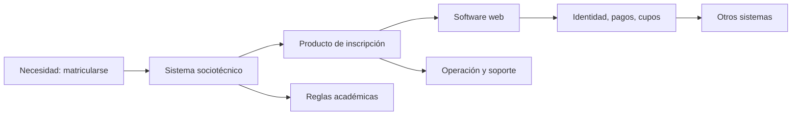

# SE-001 — Software, sistemas y productos: fronteras de la disciplina

← Inicio del programa · [↑ Parte 00](../../classes/part-00-ingenieria-de-software-como-profesion/README.md) · [📚 Índice completo](../../classes/README.md) · [🌐 Portal](https://vladimiracunadev-create.github.io/software-engineering-learning-suite/classes/SE-001.html) · [SE-002 →](../../classes/part-00-ingenieria-de-software-como-profesion/se-002-historia-de-la-crisis-del-software-a-la-ingenieria-continua/README.md)

> Estado: **GUIDED**. Clase desarrollada y revisada contra el estándar pedagógico; no implica evidencia de ejecución productiva.

## Prerrequisitos

Puedes comenzar sin programar. Necesitas distinguir una observación de una opinión y representar relaciones con cajas y flechas. Si no has trabajado en un producto digital, usa como caso un sistema de matrícula, una biblioteca o una tienda.

## Problema auténtico

Un equipo recibe «mejorar el sistema de inscripción». Antes de estimar debe saber qué cambia. ¿El software es solo código? ¿El sistema incluye secretaría y procedimientos manuales? ¿El producto termina en la interfaz o incluye soporte, datos y operación? Una frontera mal trazada permite optimizar una pieza mientras el problema persiste fuera de ella.

## Objetivos observables

Podrás delimitar software, sistema, producto, servicio y plataforma; explicar cómo una frontera cambia requisitos y responsabilidad; construir un mapa con actores, elementos e interfaces; y detectar una mejora local que empeora el resultado global.

## Temas y por qué importan

| Tema | Mecanismo | Por qué importa |
| --- | --- | --- |
| Software | instrucciones, datos y configuración producen comportamiento | evita reducir el trabajo a pantallas |
| Sistema | elementos técnicos y humanos cooperan para una capacidad | revela fallos fuera del código |
| Producto | una propuesta de valor se sostiene durante un ciclo de vida | conecta técnica con resultados y costos |
| Frontera | decide qué se modela y quién responde | impide trasladar silenciosamente el riesgo |

## Mapa conceptual

El software implementa parte de la capacidad, pero la inscripción depende de reglas, personas, datos y sistemas externos. Ninguna frontera es natural: se elige para razonar y debe declararse.

## Conceptos y decisiones

**Software** es un artefacto ejecutable y evolutivo: código, datos necesarios, configuración y documentación operativa colaboran para producir comportamiento. Un repositorio sin entorno ni configuración puede contener código sin constituir un producto reproducible.

Un **sistema** combina elementos que interactúan para lograr una capacidad. En un sistema sociotécnico, una cola manual, una política y una persona con autoridad pueden ser tan determinantes como una API. Si la aplicación acepta 500 solicitudes pero secretaría revisa 50 al día, acelerar la interfaz aumenta inventario y demora total.

Un **producto** organiza capacidades para producir valor sostenido a personas concretas. Tiene usuarios, resultados, costos, riesgos, evolución y retiro. Un **servicio** enfatiza provisión continua; una **plataforma** ofrece capacidades reutilizables a otros productos. Autenticación puede ser función para un estudiante, servicio para matrícula y capacidad de plataforma para varios equipos.

La frontera útil responde: qué resultado debe producirse, qué controla el equipo y qué dependencias gestiona mediante contratos. Ampliarla demasiado vuelve inmanejable el modelo; estrecharla oculta causas. Cambiarla obliga a revisar requisitos, amenazas, métricas y responsables.

Contraejemplo: una biblioteca de cifrado puede ser un componente con contrato, no un producto con usuarios finales inventados. En cambio, llamar «componente» a un portal de beneficios no elimina su impacto social.

## Definiciones de trabajo

- **capacidad:** resultado que un sistema produce bajo condiciones declaradas;
- **componente:** elemento con responsabilidades e interfaces delimitadas;
- **entorno:** elementos fuera de la frontera que condicionan el comportamiento;
- **interfaz:** punto de intercambio de información, control o responsabilidad;
- **stakeholder:** persona o grupo afectado, use o no la interfaz.

## Glosario

**Sociotécnico** indica que conducta humana, reglas y tecnología se afectan mutuamente. **Contexto de uso** reúne usuarios, tareas, recursos y entorno. **Propietario** tiene autoridad y obligación de sostener una decisión, no necesariamente escribió el código.

## Ejemplo mínimo

Una calculadora tributaria contiene software. El sistema relevante incluye reglas, datos introducidos, navegador y persona que interpreta el resultado. Si el producto promete una declaración correcta, debe gestionar vigencia normativa y casos no cubiertos. El mismo código, con otra frontera, cambia de responsabilidad.

## Ejemplo profesional

En matrícula, «cupos disponibles» proviene de un legado que actualiza cada quince minutos. Mostrarlo como tiempo real genera decisiones erróneas. Las opciones son ocultarlo, declarar antigüedad o crear reserva transaccional. Si el equipo controla solo visualización, explicita la dependencia; si posee el flujo, diseña consistencia y recuperación.

## Práctica guiada

1. Elige reservar hora médica, pagar una factura o inscribirse.
2. Escribe resultado y condición de fracaso en lenguaje de usuario.
3. Dibuja personas, software, datos, reglas y sistemas externos.
4. Traza dos fronteras y asigna responsables a sus interfaces.
5. Identifica una optimización local que empeore el sistema.
6. Guarda `system-map.md`, `boundaries.md` y `review.md`.

## Ejercicios

1. Clasifica navegador, base de datos, mesa de ayuda y política de devolución; explica la dependencia del propósito.
2. Compara producto, servicio y plataforma usando autenticación.
3. Externaliza pagos en tu mapa y señala qué responsabilidad no se externaliza.

## Reto verificable

Otra persona reconstruye capacidad, fronteras y cinco interfaces solo desde tus archivos y señala un riesgo que cambia al mover la frontera. Si necesita explicación oral para saber quién responde, el mapa no pasa.

## Preguntas frecuentes

### ¿Todo sistema contiene software?

No. Puede ser manual; aquí interesan sistemas intensivos en software.

### ¿La frontera coincide con el organigrama?

No. El organigrama distribuye autoridad; el modelo distribuye responsabilidades causales.

## Fallo controlado y diagnóstico

Elimina del mapa la aprobación manual y simula un rechazo. Síntoma: «en revisión» indefinidamente. Causa: no hay estado ni responsable para trabajo manual. Corrige incorporando cola, plazo, escalamiento y estado visible, no un temporizador cosmético.

## Entorno y archivos clave

Markdown y Mermaid, con datos ficticios. Entrega `system-map.md`, `boundaries.md`, `review.md` y un README con fecha y alcance.

## Seguridad, ética y accesibilidad

Incluye actores sin interfaz, datos sensibles y alternativas para personas sin conectividad o con tecnología asistiva. No uses la frontera para declarar fuera de alcance un daño previsible.

## Transferencia

Repite el mapa para un dispositivo médico o un juego sin conexión. Compara interfaces técnicas, organizativas y costo del error.

## Evaluación y evidencia

Se aprueba con fronteras explícitas, interfaces, responsables, un contraejemplo y revisión independiente. Una arquitectura sin capacidad explicada no demuestra comprensión.

## Fuentes

- [SWEBOK v4.0a](https://www.computer.org/education/bodies-of-knowledge/software-engineering/v4) sitúa la disciplina y sus áreas.
- [ISO/IEC/IEEE 12207:2026](https://www.iso.org/standard/90219.html) respalda la visión de ciclo de vida de sistemas, productos y servicios.
- [NASA Systems Engineering Handbook](https://www.nasa.gov/reference/systems-engineering-handbook/) relaciona necesidad, stakeholders y sistema.
- [ISO/IEC 25010:2023](https://www.iso.org/standard/78176.html) define el modelo de calidad del producto ICT.

## Límites y siguiente paso

El mapa no prueba funcionamiento ni sustituye requisitos. `SE-002` estudia por qué escala y cambio hicieron insuficiente tratar el software como artesanía aislada.

---

← Inicio del programa · [↑ Parte 00](../../classes/part-00-ingenieria-de-software-como-profesion/README.md) · [📚 Índice completo](../../classes/README.md) · [SE-002 →](../../classes/part-00-ingenieria-de-software-como-profesion/se-002-historia-de-la-crisis-del-software-a-la-ingenieria-continua/README.md)
