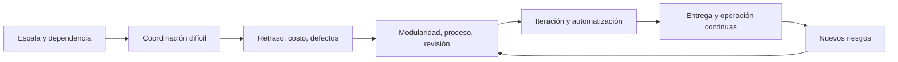

# SE-002 — Historia de la crisis del software a la ingeniería continua

[← SE-001](../../classes/part-00-ingenieria-de-software-como-profesion/se-001-software-sistemas-y-productos-fronteras-de-la-disciplina/README.md) · [↑ Parte 00](../../classes/part-00-ingenieria-de-software-como-profesion/README.md) · [📚 Índice completo](../../classes/README.md) · [SE-003 →](../../classes/part-00-ingenieria-de-software-como-profesion/se-003-ciclo-de-vida-completo-y-responsabilidades-profesionales/README.md)

> Estado: **GUIDED**. Clase desarrollada y revisada contra el estándar pedagógico; no implica evidencia de ejecución productiva.

## Antes de empezar

En `SE-001` delimitaste Campus Abierto como sistema sociotécnico. Ahora conserva ese
mapa e imagina que pasa de una facultad a veinte, integra nuevos proveedores y cambia
reglas cada semestre. La dificultad no crece solo porque haya más código: aumentan
dependencias, estados posibles, coordinación y costo de corregir tarde.

Esta clase explica **por qué aparecieron las prácticas de ingeniería**. No estudiarás
una cronología para memorizar fechas; construirás una cadena causal que conecte un
problema de escala con una práctica, su señal de control y aquello que no garantiza.
Esa cadena prepara `SE-003`, donde distribuiremos responsabilidad durante el ciclo de
vida completo.

## Prerrequisitos

Comprender componente, sistema y producto (`SE-001`).

## Problema auténtico

Un equipo adopta microservicios, CI o IA porque son modernos. Sin conocer el problema histórico que intentan resolver, conserva las causas originales y añade complejidad. La historia debe explicar mecanismos, no celebrar una cronología.

## Objetivos observables

Explicarás la llamada crisis del software, relacionarás escala con coordinación y defectos, distinguirás una práctica de una garantía y construirás una cadena causal hasta la ingeniería continua.

## Temas y por qué importan

| Tema | Pregunta de control |
| --- | --- |
| Crisis | ¿qué dejó de escalar? |
| Ingeniería | ¿qué hace observables decisiones y calidad? |
| Iteración | ¿cómo reduce el costo de aprender? |
| Continuidad | ¿cómo se controla el cambio frecuente? |

## Mapa conceptual

Cada respuesta desplaza el cuello de botella. Automatizar compilación no aclara requisitos; desplegar rápido no garantiza recuperación.

## Conceptos y decisiones

### 1. La “crisis” nombra causas persistentes, no una anécdota cerrada

Las conferencias de la OTAN de 1968 y 1969 reunieron problemas ya visibles en
proyectos grandes: resultados tardíos, estimaciones frágiles, interfaces mal
entendidas, dificultad para verificar y costos de mantenimiento. El valor histórico no
está en atribuir a una reunión el nacimiento exacto de la ingeniería de software, sino
en reconocer un cambio de escala. Técnicas que funcionaban para programas pequeños y
equipos próximos dejaban de ofrecer control cuando crecían tamaño, impacto y número de
personas involucradas.

“Crisis del software” tampoco significa que todo proyecto fracasaba ni que el problema
quedó resuelto. Cada generación amplía lo que puede construir y crea nuevas
dependencias. Hoy automatizamos compilación y despliegue, pero operamos cadenas de
suministro, servicios de terceros y sistemas que cambian mientras están en uso. La
pregunta profesional sigue siendo la misma: ¿cómo convertir trabajo invisible e
incierto en decisiones observables y corregibles?

### 2. Por qué la complejidad crece más rápido que el número de líneas

Añadir una función no suma solo su código. Introduce estados, interacciones y
excepciones. Si Campus Abierto integra veinte facultades, cada una puede aportar
calendarios, reglas y autoridades diferentes. Las combinaciones posibles aumentan y el
conocimiento se reparte entre personas. Un cambio local puede contradecir una regla
remota aunque ambas piezas funcionen por separado.

Hay al menos cuatro mecanismos distintos:

- **complejidad del dominio:** las reglas reales contienen excepciones y cambian;
- **complejidad técnica:** componentes y estados interactúan de formas no evidentes;
- **complejidad de coordinación:** personas necesitan alinear vocabulario, decisiones
  y tiempos;
- **demora de retroalimentación:** un error descubierto meses después exige reconstruir
  contexto y deshacer decisiones dependientes.

Contratar más personas puede aumentar capacidad cuando el trabajo es separable. En una
tarea muy acoplada también añade canales de coordinación y no recupera de inmediato el
conocimiento faltante. La conclusión no es “equipos pequeños siempre”, sino diseñar
límites, contratos y feedback acordes al acoplamiento real.

### 3. Una práctica de ingeniería actúa sobre un mecanismo concreto

El control de versiones conserva una secuencia de cambios y permite comparar o
recuperar estados; no explica por qué una decisión era correcta. La modularidad reduce
lo que debe comprenderse simultáneamente si sus límites corresponden a responsabilidades
cohesivas; aplicada arbitrariamente, multiplica interfaces. La revisión aporta otra
perspectiva y transmite conocimiento; no reemplaza pruebas ni elimina sesgos compartidos.

La integración continua reduce el tiempo durante el cual cambios compatibles por
separado pueden divergir. Requiere integrar realmente con frecuencia y ejecutar
verificaciones útiles: un servidor llamado “CI” que corre una prueba irrelevante una
vez por semana no produce el mecanismo. La entrega continua mantiene el producto en
estado desplegable; el despliegue continuo además publica cambios que superan el flujo.
Ninguno garantiza adopción, valor o recuperación.

La observabilidad convierte estados internos en señales que ayudan a formular
explicaciones durante operación. Logs sin contexto, métricas sin relación con una
decisión o trazas que exponen datos sensibles pueden aumentar costo sin reducir
incertidumbre. La práctica vale por la pregunta que permite responder a tiempo.

### 4. Iterar cambia el costo del aprendizaje, no la obligación de pensar

Un plan predictivo busca reducir incertidumbre antes de comprometer recursos; resulta
razonable cuando el cambio físico o regulatorio es costoso y existe conocimiento
suficiente. Un enfoque iterativo construye incrementos para obtener feedback cuando el
problema o la solución aún son inciertos. Ambos son estrategias de riesgo, no bandos
morales.

Iterar mal significa fraccionar la construcción sin validar supuestos: doce sprints
pueden producir el mismo gran lote de aprendizaje al final. Predecir mal significa
convertir el plan en promesa y ocultar información nueva para aparentar cumplimiento.
La pregunta útil es qué incertidumbre se resolverá, con qué incremento, ante quién y
qué decisión cambiará como resultado.

### 5. De entregar una versión a sostener un flujo de cambio

La ingeniería continua acorta los bucles entre especificar, construir, verificar,
liberar, observar y aprender. No elimina controles; procura que actúen mientras todavía
es barato corregir. Cambios pequeños facilitan aislar causas y revertir, siempre que
datos, contratos y operación sean también compatibles con la reversión.

Al reducir el tamaño de lote aparece un riesgo nuevo: hacer daño más rápido. Por eso
frecuencia necesita pruebas relevantes, revisión proporcional, despliegue gradual,
telemetría, límites y recuperación. “Más despliegues” es una medida de actividad. La
capacidad profesional es cambiar con una exposición controlada y aprender del resultado.

## Caso conductor: de una facultad a veinte

Campus Abierto comenzó con una regla de elegibilidad, una base de datos y dos personas
que hablaban a diario. Al crecer, cada facultad añade reglas y calendarios; identidad y
pagos cambian por separado; una entrega semestral reúne cientos de cambios. El fallo no
es simplemente “mucho código”: las incompatibilidades se descubren cuando el contexto
original ya se perdió.

La respuesta se diseña por cadena causal:

| Causa observable | Práctica candidata | Señal temprana | Lo que no garantiza |
| --- | --- | --- | --- |
| reglas contradictorias entre facultades | vocabulario y contratos versionados | prueba de ejemplo incompatible | que la regla sea justa o útil |
| cambios divergen durante meses | integración frecuente | fallo cercano al cambio | que producción sea recuperable |
| gran lote hace difícil aislar causa | cambios pequeños y trazables | regresión asociada a un cambio | ausencia de efectos combinados |
| operación no puede explicar un rechazo | eventos con contexto y privacidad | ruta reconstruible de la decisión | causalidad automática |

El estudiante elige una cadena, identifica el supuesto que la sostiene y define un
caso que obligaría a abandonarla. La historia se convierte así en instrumento de
diseño, no en una lista de fechas.

## Definiciones de trabajo

- **crisis del software:** dificultad persistente para entregar y evolucionar software confiable bajo restricciones;
- **retroalimentación:** información que llega a tiempo para modificar una decisión;
- **integración continua:** integrar y verificar cambios con frecuencia;
- **ingeniería continua:** especificar, construir, observar y corregir de forma sostenida.

## Glosario

**Lote** es un grupo grande de cambios validado tarde. **Lead time** mide desde petición hasta disponibilidad. **Deuda** es costo futuro creado por una decisión, no sinónimo de código viejo.

## Ejemplo mínimo

Dos personas editan copias durante un mes. Cada copia funciona; al unirlas, discrepan interfaces. Probar al final detecta el defecto, pero no reduce el mes de divergencia. Integrar diariamente con prueba de contrato cambia el momento del aprendizaje.

## Ejemplo profesional

Una institución pasa de dos entregas anuales a despliegues semanales. Una migración irreversible sigue exigiendo ensayo, respaldo y coordinación. Frecuencia no elimina diferencias de riesgo.

## Práctica guiada

Crea `timeline.md` con cinco hitos: problema, respuesta, evidencia, límite y riesgo nuevo. Analiza una práctica actual en `causal-chain.md`: señal que recibe, demora que reduce y garantía que no ofrece.

## Ejercicios

1. Explica por qué añadir personas puede retrasar trabajo acoplado.
2. Da un caso donde desplegar menos sea responsable.
3. Distingue qué resuelven Git, CI y feature flags.

## Reto verificable

Defiende una práctica sin usar «moderna» ni «mejor práctica»: conecta causa, mecanismo, señal y límite. Otra persona debe poder refutarla cambiando una condición.

## Preguntas frecuentes

### ¿La crisis terminó?
No. Mejoraron capacidades y crecieron escala e impacto. Debe indicarse qué riesgo está controlado.

### ¿DevOps es el final?
No. Reduce separación entre construcción y operación, pero puede acelerar daño sin controles.

## Fallo controlado y diagnóstico

Agrupa diez cambios en una entrega y mide aislamiento de un fallo; repite con cambios identificables. Usa solo un repositorio de práctica.

## Errores comunes y cómo corregirlos

| Síntoma | Causa | Corrección |
| --- | --- | --- |
| “antes se usaba cascada; ahora Agile” | relato binario sin mecanismo ni contexto | compara incertidumbre, costo de cambio y feedback de cada estrategia |
| una herramienta aparece como solución | se confundió instalación con práctica | declara conducta, frecuencia, señal y decisión que habilita |
| CI “garantiza calidad” | se atribuyó a la práctica más de lo que observa | enumera verificaciones reales y aquello que queda fuera |
| velocidad es el único resultado | se midió actividad en vez de riesgo o valor | incorpora estabilidad, recuperación, adopción e impacto |
| la cronología termina en DevOps | se presentó una moda como destino final | documenta nuevos riesgos y el siguiente cuello de botella |

## Entorno y archivos clave

Markdown e historial Git local: `timeline.md`, `causal-chain.md`, `comparison.md`.

## Seguridad, ética y accesibilidad

No uses commits por persona como productividad: incentiva volumen y daña colaboración. La velocidad no justifica omitir revisión de impactos.

## Transferencia

Aplica la cadena a datos o firmware e identifica feedback automatizable y feedback físico o humano.

## Evaluación y evidencia

Se evalúan causalidad, un contraejemplo y límites. Una cronología sin mecanismos no aprueba.

## Fuentes

- [NATO Software Engineering, 1968](https://homepages.cs.ncl.ac.uk/brian.randell/NATO/nato1968.PDF), informe primario.
- [Fifty Years of Software Engineering](https://eprints.ncl.ac.uk/247869), retrospectiva de Brian Randell.
- [SWEBOK v4.0a](https://www.computer.org/education/bodies-of-knowledge/software-engineering/v4), mapa contemporáneo.
- [ISO/IEC/IEEE 12207:2026](https://www.iso.org/standard/90219.html), procesos sin imponer metodología.

## Límites y siguiente paso

No se demuestra que una práctica funcione en todo contexto. `SE-003` convierte la historia en responsabilidades de ciclo de vida.

---

[← SE-001](../../classes/part-00-ingenieria-de-software-como-profesion/se-001-software-sistemas-y-productos-fronteras-de-la-disciplina/README.md) · [↑ Parte 00](../../classes/part-00-ingenieria-de-software-como-profesion/README.md) · [SE-003 →](../../classes/part-00-ingenieria-de-software-como-profesion/se-003-ciclo-de-vida-completo-y-responsabilidades-profesionales/README.md)
