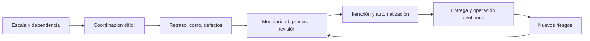

# SE-002 — Historia de la crisis del software a la ingeniería continua

[← SE-001](../../classes/part-00-ingenieria-de-software-como-profesion/se-001-software-sistemas-y-productos-fronteras-de-la-disciplina/README.md) · [↑ Parte 00](../../classes/part-00-ingenieria-de-software-como-profesion/README.md) · [📚 Índice completo](../../classes/README.md) · [SE-003 →](../../classes/part-00-ingenieria-de-software-como-profesion/se-003-ciclo-de-vida-completo-y-responsabilidades-profesionales/README.md)

> Estado: **GUIDED**. Clase desarrollada y revisada contra el estándar pedagógico; no implica evidencia de ejecución productiva.

## Prerrequisitos

Comprender componente, sistema y producto (`SE-001`).

## Problema auténtico

Un equipo adopta microservicios, CI o IA porque son modernos. Sin conocer el problema histórico que intentan resolver, conserva las causas originales y añade complejidad. La historia debe explicar mecanismos, no celebrar una cronología.

## Objetivos observables

Explicarás la llamada crisis del software, relacionarás escala con coordinación y defectos, distinguirás una práctica de una garantía y construirás una cadena causal hasta la ingeniería continua.

## Temas y por qué importan

| Tema | Pregunta de control |
| --- | --- |
| Crisis | ¿qué dejó de escalar? |
| Ingeniería | ¿qué hace observables decisiones y calidad? |
| Iteración | ¿cómo reduce el costo de aprender? |
| Continuidad | ¿cómo se controla el cambio frecuente? |

## Mapa conceptual

Cada respuesta desplaza el cuello de botella. Automatizar compilación no aclara requisitos; desplegar rápido no garantiza recuperación.

## Conceptos y decisiones

El informe NATO de 1968 documentó dificultades con sistemas grandes, estimación, interfaces, pruebas y mantenimiento. No hubo un día único en que naciera la disciplina ni una crisis ya resuelta. El cambio fue tratar el desarrollo como actividad que necesita modelos, controles y aprendizaje acumulable.

Al crecer un sistema aumentan estados posibles, dependencias, actores y consecuencias. Una práctica ayuda si acorta una cadena causal concreta: control de versiones conserva decisiones; integración continua descubre incompatibilidades temprano; observabilidad reduce incertidumbre operativa.

La evolución no es «cascada mala, ágil bueno». Un enfoque predictivo puede ser adecuado cuando cambiar es extremadamente costoso; uno iterativo ayuda cuando la incertidumbre se reduce con incrementos. Ambos fallan al confundir documentos con conocimiento o velocidad con valor.

## Definiciones de trabajo

- **crisis del software:** dificultad persistente para entregar y evolucionar software confiable bajo restricciones;
- **retroalimentación:** información que llega a tiempo para modificar una decisión;
- **integración continua:** integrar y verificar cambios con frecuencia;
- **ingeniería continua:** especificar, construir, observar y corregir de forma sostenida.

## Glosario

**Lote** es un grupo grande de cambios validado tarde. **Lead time** mide desde petición hasta disponibilidad. **Deuda** es costo futuro creado por una decisión, no sinónimo de código viejo.

## Ejemplo mínimo

Dos personas editan copias durante un mes. Cada copia funciona; al unirlas, discrepan interfaces. Probar al final detecta el defecto, pero no reduce el mes de divergencia. Integrar diariamente con prueba de contrato cambia el momento del aprendizaje.

## Ejemplo profesional

Una institución pasa de dos entregas anuales a despliegues semanales. Una migración irreversible sigue exigiendo ensayo, respaldo y coordinación. Frecuencia no elimina diferencias de riesgo.

## Práctica guiada

Crea `timeline.md` con cinco hitos: problema, respuesta, evidencia, límite y riesgo nuevo. Analiza una práctica actual en `causal-chain.md`: señal que recibe, demora que reduce y garantía que no ofrece.

## Ejercicios

1. Explica por qué añadir personas puede retrasar trabajo acoplado.
2. Da un caso donde desplegar menos sea responsable.
3. Distingue qué resuelven Git, CI y feature flags.

## Reto verificable

Defiende una práctica sin usar «moderna» ni «mejor práctica»: conecta causa, mecanismo, señal y límite. Otra persona debe poder refutarla cambiando una condición.

## Preguntas frecuentes

### ¿La crisis terminó?
No. Mejoraron capacidades y crecieron escala e impacto. Debe indicarse qué riesgo está controlado.

### ¿DevOps es el final?
No. Reduce separación entre construcción y operación, pero puede acelerar daño sin controles.

## Fallo controlado y diagnóstico

Agrupa diez cambios en una entrega y mide aislamiento de un fallo; repite con cambios identificables. Usa solo un repositorio de práctica.

## Entorno y archivos clave

Markdown e historial Git local: `timeline.md`, `causal-chain.md`, `comparison.md`.

## Seguridad, ética y accesibilidad

No uses commits por persona como productividad: incentiva volumen y daña colaboración. La velocidad no justifica omitir revisión de impactos.

## Transferencia

Aplica la cadena a datos o firmware e identifica feedback automatizable y feedback físico o humano.

## Evaluación y evidencia

Se evalúan causalidad, un contraejemplo y límites. Una cronología sin mecanismos no aprueba.

## Fuentes

- [NATO Software Engineering, 1968](https://homepages.cs.ncl.ac.uk/brian.randell/NATO/nato1968.PDF), informe primario.
- [Fifty Years of Software Engineering](https://eprints.ncl.ac.uk/247869), retrospectiva de Brian Randell.
- [SWEBOK v4.0a](https://www.computer.org/education/bodies-of-knowledge/software-engineering/v4), mapa contemporáneo.
- [ISO/IEC/IEEE 12207:2026](https://www.iso.org/standard/90219.html), procesos sin imponer metodología.

## Límites y siguiente paso

No se demuestra que una práctica funcione en todo contexto. `SE-003` convierte la historia en responsabilidades de ciclo de vida.

---

[← SE-001](../../classes/part-00-ingenieria-de-software-como-profesion/se-001-software-sistemas-y-productos-fronteras-de-la-disciplina/README.md) · [↑ Parte 00](../../classes/part-00-ingenieria-de-software-como-profesion/README.md) · [SE-003 →](../../classes/part-00-ingenieria-de-software-como-profesion/se-003-ciclo-de-vida-completo-y-responsabilidades-profesionales/README.md)
