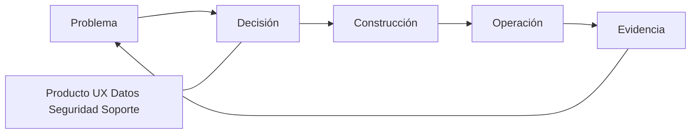

# SE-005 — Roles, especialidades y colaboración interdisciplinaria

[← SE-004](../../classes/part-00-ingenieria-de-software-como-profesion/se-004-etica-interes-publico-y-consecuencias-de-las-decisiones-tecnicas/README.md) · [↑ Parte 00](../../classes/part-00-ingenieria-de-software-como-profesion/README.md) · [📚 Índice completo](../../classes/README.md) · [SE-006 →](../../classes/part-00-ingenieria-de-software-como-profesion/se-006-evidencia-incertidumbre-y-pensamiento-critico-en-ingenieria/README.md)

> Estado: **GUIDED**. Clase desarrollada y revisada contra el estándar pedagógico; no implica evidencia de ejecución productiva.

## Prerrequisitos

Responsabilidad y juicio profesional de `SE-003`–`SE-004`.

## Problema auténtico

Un incidente pasa entre desarrollo, datos, seguridad y soporte. Todos participaron, nadie tenía la imagen completa y cada equipo optimizó su métrica. Nombrar más roles no repara interfaces de colaboración.

## Objetivos observables

Relacionarás roles con decisiones, diseñarás transferencias y revisiones, distinguirás especialización de silo y crearás una matriz de autoridad.

## Temas y por qué importan

| Área | Pregunta |
| --- | --- |
| Producto | ¿qué resultado y para quién? |
| Diseño/UX | ¿qué tarea y contexto? |
| Ingeniería | ¿qué comportamiento y cambio? |
| Calidad/seguridad | ¿qué riesgo y evidencia? |
| Operación/soporte | ¿qué ocurre realmente? |

## Mapa conceptual

Los roles aportan perspectivas al mismo bucle; no son etapas que lanzan trabajo sobre una pared.

## Conceptos y decisiones

Un rol agrupa responsabilidades, no define valor personal ni limita aprendizaje. Especialidad profundiza juicio; silo impide que señales crucen fronteras. La colaboración necesita lenguaje compartido, artefactos revisables y autoridad de decisión.

La reunión no es el mecanismo central. Una interfaz sana declara entrada, salida, plazo, calidad y escalamiento. La revisión temprana evita que seguridad, accesibilidad u operación aparezcan como aprobación final tardía.

Equipos pequeños combinan sombreros; eso no elimina conflictos. La misma persona puede proponer y revisar, pero debe registrar la limitación y buscar revisión independiente en decisiones de alto riesgo.

## Definiciones de trabajo

- **rol:** conjunto contextual de responsabilidades;
- **especialidad:** profundidad para emitir juicio en un dominio;
- **handoff:** transferencia de trabajo y contexto con aceptación;
- **revisión independiente:** evaluación sin autoría directa ni incentivo dominante;
- **escalamiento:** traslado explícito a autoridad capaz de decidir.

## Glosario

**Bus factor** mide concentración de conocimiento. **Team topology** describe límites e interacción de equipos. **Facilitación** estructura participación sin apropiarse de la decisión.

## Ejemplo mínimo

«Backend entrega endpoint» es insuficiente. Un contrato útil incluye semántica, errores, privacidad, ejemplos, compatibilidad y persona que acepta.

## Ejemplo profesional

En recuperación de cuenta, producto define resultado, UX diseña prueba comprensible, seguridad modela abuso, soporte aporta casos y plataforma implementa identidad. La decisión sobre fricción pertenece al conjunto porque reduce fraude y puede excluir usuarios.

## Práctica guiada

Crea `decision-map.md` con diez decisiones y roles que proponen, deciden, revisan y operan. Modela un handoff y realiza una revisión con una perspectiva ausente.

## Ejercicios

1. Convierte un organigrama en mapa de decisiones.
2. Detecta un rol con responsabilidad sin autoridad.
3. Diseña colaboración asincrónica para dos zonas horarias.

## Reto verificable

Simula un incidente: otra persona debe encontrar dueño, experto, autoridad de parada y canal de comunicación en menos de tres minutos.

## Preguntas frecuentes

### ¿Quién tiene la última palabra?
Depende de la decisión. Debe declararse antes del conflicto y respetar obligaciones profesionales.

### ¿Un generalista reemplaza especialistas?
No en riesgos que requieren competencia profunda; sí puede mejorar interfaces y visión sistémica.

## Fallo controlado y diagnóstico

Entrega un artefacto sin criterio de aceptación. Registra espera y reproceso; corrige la interfaz, no culpes al receptor.

## Entorno y archivos clave

`decision-map.md`, `handoff.md`, `review-log.md`, con nombres de roles ficticios.

## Seguridad, ética y accesibilidad

Evita exponer a personas en retrospectivas; analiza condiciones. Incluye representación de usuarios y canales accesibles.

## Transferencia

Adapta el mapa a open source y a una organización regulada; compara autoridad formal e influencia.

## Evaluación y evidencia

Se exige autoridad explícita, interfaces, revisión, manejo de desacuerdo y reducción del bus factor.

## Fuentes

- [SWEBOK v4.0a](https://www.computer.org/education/bodies-of-knowledge/software-engineering/v4), práctica profesional y trabajo en equipo.
- [ACM Code of Ethics](https://www.acm.org/code-of-ethics), competencia, revisión y liderazgo responsable.
- [NASA Software Activities Review](https://swehb.nasa.gov/spaces/7150/pages/16449741/SWE-018+-+Software+Activities+Review), participación de stakeholders y cierre de asuntos.

## Límites y siguiente paso

La matriz no garantiza buenas decisiones. `SE-006` evalúa la calidad de la evidencia con que se decide.

---

[← SE-004](../../classes/part-00-ingenieria-de-software-como-profesion/se-004-etica-interes-publico-y-consecuencias-de-las-decisiones-tecnicas/README.md) · [↑ Parte 00](../../classes/part-00-ingenieria-de-software-como-profesion/README.md) · [SE-006 →](../../classes/part-00-ingenieria-de-software-como-profesion/se-006-evidencia-incertidumbre-y-pensamiento-critico-en-ingenieria/README.md)
