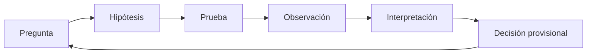

# SE-006 — Evidencia, incertidumbre y pensamiento crítico en ingeniería

[← SE-005](../../classes/part-00-ingenieria-de-software-como-profesion/se-005-roles-especialidades-y-colaboracion-interdisciplinaria/README.md) · [↑ Parte 00](../../classes/part-00-ingenieria-de-software-como-profesion/README.md) · [📚 Índice completo](../../classes/README.md) · [SE-007 →](../../classes/part-00-ingenieria-de-software-como-profesion/se-007-calidad-interna-externa-y-calidad-en-uso/README.md)

> Estado: **GUIDED**. Clase desarrollada y revisada contra el estándar pedagógico; no implica evidencia de ejecución productiva.

## Prerrequisitos

Poder formular decisiones y reconocer perspectivas de `SE-001`–`SE-005`.

## Problema auténtico

Tras optimizar una consulta, un benchmark muestra 40% menos tiempo. ¿El cambio es mejor? Puede medir caché caliente, pocos datos o una máquina distinta. El número es observación; la conclusión necesita modelo e incertidumbre.

## Objetivos observables

Separarás hecho, inferencia e hipótesis; diseñarás comprobaciones que puedan refutarte; estimarás incertidumbre práctica y decidirás cuándo obtener más evidencia.

## Temas y por qué importan

| Elemento | Pregunta |
| --- | --- |
| Observación | ¿qué ocurrió y cómo se midió? |
| Inferencia | ¿qué explicación conecta datos y conclusión? |
| Incertidumbre | ¿qué no sabemos y cuánto cambia la decisión? |
| Falsación | ¿qué resultado demostraría que estamos equivocados? |

## Mapa conceptual

La decisión es provisional: nueva evidencia puede cambiarla.

## Conceptos y decisiones

Evidencia no es volumen de datos sino información relevante, trazable y suficiente para discriminar opciones. Un test que siempre pasa aporta poca información. Una métrica sin contexto de recolección no es reproducible.

Correlación ayuda a predecir; causalidad explica intervención. En ingeniería muchas decisiones no permiten experimento perfecto, por lo que se triangulan pruebas, trazas, revisión y conocimiento del mecanismo.

La incertidumbre se registra como rango, escenario o confianza justificada. Obtener más evidencia tiene costo; conviene cuando puede cambiar una decisión importante. En cambios reversibles de bajo impacto puede ser racional experimentar pequeño.

Sesgos frecuentes: confirmación, supervivencia, selección y autoridad. La defensa es diseñar búsqueda de contraevidencia y revisión, no asumir neutralidad personal.

## Definiciones de trabajo

- **hecho observado:** registro producido por un método declarado;
- **inferencia:** conclusión derivada de observaciones y supuestos;
- **hipótesis:** explicación contrastable;
- **confusor:** variable que altera relación aparente;
- **reproducibilidad:** posibilidad de repetir método con información suficiente.

## Glosario

**Base rate** es frecuencia previa relevante. **Proxy** es medida indirecta. **Intervalo** expresa rango compatible con método y datos, no promesa absoluta.

## Ejemplo mínimo

«La API estuvo lenta» mezcla observación e interpretación. Mejor: p95 subió de 220 a 480 ms durante 15 minutos en región A; coincidió con despliegue X; faltan datos de dependencia Y.

## Ejemplo profesional

El benchmark de consulta se repite con datos fríos y calientes, mismos recursos y múltiples corridas. La mediana mejora, pero la cola empeora con alta concurrencia. La decisión cambia de «adoptar» a «probar bajo carga representativa».

## Práctica guiada

Escribe `evidence-log.md` con afirmación, observación, método, supuesto y contraevidencia. Diseña dos pruebas que podrían cambiar la decisión y priorízalas por costo de información.

## Ejercicios

1. Reescribe cinco afirmaciones absolutas como hipótesis.
2. Encuentra un proxy que pueda incentivar conducta indeseada.
3. Decide con evidencia incompleta y declara condición de revisión.

## Reto verificable

Otra persona reproduce una medición y obtiene resultado compatible o explica la diferencia. Debe existir un resultado que refute tu hipótesis.

## Preguntas frecuentes

### ¿Más datos siempre reducen incertidumbre?
No; datos sesgados o irrelevantes pueden reforzar una conclusión incorrecta.

### ¿Sin certeza no se decide?
Se decide con riesgo explícito, reversibilidad y señales de revisión.

## Fallo controlado y diagnóstico

Ejecuta una medición una vez, concluye y luego cambia orden o caché. Registra por qué la primera evidencia era débil.

## Entorno y archivos clave

Datos sintéticos, reloj monotónico cuando midas tiempo: `evidence-log.md`, `experiment.md`, `decision.md`.

## Seguridad, ética y accesibilidad

No recolectes datos personales «por si acaso». Documenta exclusiones de muestra y evita presentar promedios como experiencia universal.

## Transferencia

Aplica el método a rendimiento, usabilidad y seguridad; compara qué evidencia puede producirse sin causar daño.

## Evaluación y evidencia

Se exige trazabilidad, método reproducible, contraevidencia e incertidumbre que cambie la decisión.

## Fuentes

- [NASA Systems Engineering Handbook](https://www.nasa.gov/reference/systems-engineering-handbook/), revisiones y criterios de éxito.
- [SWEBOK v4.0a](https://www.computer.org/education/bodies-of-knowledge/software-engineering/v4), medición y práctica profesional.
- [ACM Code of Ethics](https://www.acm.org/code-of-ethics), honestidad y evaluaciones exhaustivas.

## Límites y siguiente paso

No es un curso de estadística. `SE-007` usa esta disciplina para distinguir perspectivas de calidad.

---

[← SE-005](../../classes/part-00-ingenieria-de-software-como-profesion/se-005-roles-especialidades-y-colaboracion-interdisciplinaria/README.md) · [↑ Parte 00](../../classes/part-00-ingenieria-de-software-como-profesion/README.md) · [SE-007 →](../../classes/part-00-ingenieria-de-software-como-profesion/se-007-calidad-interna-externa-y-calidad-en-uso/README.md)
