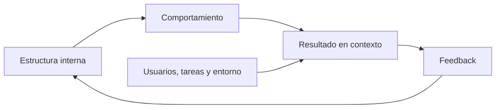

# SE-007 — Calidad interna, externa y calidad en uso

[← SE-006](../../classes/part-00-ingenieria-de-software-como-profesion/se-006-evidencia-incertidumbre-y-pensamiento-critico-en-ingenieria/README.md) · [↑ Parte 00](../../classes/part-00-ingenieria-de-software-como-profesion/README.md) · [📚 Índice completo](../../classes/README.md) · [SE-008 →](../../classes/part-00-ingenieria-de-software-como-profesion/se-008-restricciones-riesgos-y-compromisos-entre-atributos/README.md)

> Estado: **GUIDED**. Clase desarrollada y revisada contra el estándar pedagógico; no implica evidencia de ejecución productiva.

## Prerrequisitos
Formular afirmaciones y evidencia (`SE-006`).

## Problema auténtico
Un equipo presume 90% de cobertura, baja complejidad y cero errores del linter. Usuarios abandonan el flujo y soporte recibe reclamos. Las métricas internas describen propiedades reales, pero no demuestran calidad en uso.

## Objetivos observables
Distinguirás calidad interna, comportamiento externo y consecuencias en contexto; convertirás atributos en escenarios medibles; evitarás usar una métrica como sustituto del resultado.

## Temas y por qué importan
| Perspectiva | Evidencia |
| --- | --- |
| Interna | estructura, dependencias, analizabilidad |
| Producto en ejecución | corrección, rendimiento, seguridad, compatibilidad |
| Calidad en uso | efectividad, eficiencia y consecuencias para stakeholders |

## Mapa conceptual

Una cadena plausible no es garantía: código legible facilita cambio, pero no asegura una tarea útil.

## Conceptos y decisiones
Calidad es adecuación respecto de necesidades y contexto, no adorno añadido al final. ISO/IEC 25010:2023 modela calidad del producto ICT; ISO/IEC 25019:2023 separa calidad en uso. Esta separación evita atribuir a una propiedad interna un resultado que depende también de tarea, entorno y persona.

Un atributo se vuelve accionable mediante escenario: fuente, estímulo, entorno, artefacto, respuesta y medida. «Rápido» no es verificable; «durante matrícula, 95% de confirmaciones responde en menos de dos segundos con 2.000 sesiones» sí, aunque todavía requiere justificar el umbral.

Métricas crean incentivos. Cobertura indica código ejecutado, no calidad de aserciones; disponibilidad promedio puede ocultar caída en hora crítica. Combina señales y revisa efectos no deseados.

## Definiciones de trabajo
- **calidad interna:** propiedades estáticas que influyen en evolución;
- **calidad del producto:** características observables del producto;
- **calidad en uso:** resultados al utilizarlo en contexto;
- **escenario de calidad:** situación y respuesta medible.

## Glosario
**Atributo** es una dimensión evaluable. **Guardrail** limita daño mientras se optimiza otra métrica. **p95** es el valor bajo el cual cae 95% de observaciones.

## Ejemplo mínimo
Renombrar variables mejora analizabilidad sin cambiar salida. Añadir validación cambia comportamiento externo. Simplificar el flujo puede mejorar efectividad en uso; debe probarse con tareas y personas representativas.

## Ejemplo profesional
Una API tiene disponibilidad 99,9%, pero falla durante cierre financiero. El escenario crítico pondera momento y consecuencia; el promedio anual era insuficiente.

## Práctica guiada
Crea `quality-scenarios.md` con un escenario interno, uno externo y uno en uso. Para cada uno define método, umbral, guardrail y limitación. Relaciona las tres perspectivas sin afirmar causalidad no medida.

## Ejercicios
1. Refuta «sin bugs» como objetivo de calidad.
2. Diseña una métrica que no premie ocultar incidentes.
3. Distingue accesibilidad del código y accesibilidad en uso.

## Reto verificable
Otra persona debe ejecutar o inspeccionar una medida y decir qué conclusión no permite. Si el umbral carece de contexto, no aprueba.

## Preguntas frecuentes
### ¿Calidad interna importa al usuario?
Indirectamente: afecta velocidad y riesgo de cambio, pero no sustituye evidencia de uso.
### ¿ISO 25010 incluye calidad en uso?
La edición 2023 define producto; el modelo de calidad en uso está en ISO/IEC 25019:2023.

## Fallo controlado y diagnóstico
Optimiza una métrica aislada y describe el incentivo adverso. Añade guardrail y condición de revisión.

## Entorno y archivos clave
`quality-scenarios.md`, `measures.md`, `review.md`; datos sintéticos y método fechado.

## Seguridad, ética y accesibilidad
No excluyas experiencias minoritarias mediante promedios. Minimiza telemetría y declara propósito y retención.

## Transferencia
Aplica escenarios a biblioteca, servicio y dispositivo; observa qué cambia con el contexto.

## Evaluación y evidencia
Se exigen tres perspectivas, escenarios medibles, límites y guardrails.

## Fuentes
- [ISO/IEC 25010:2023](https://www.iso.org/standard/78176.html), modelo de calidad del producto.
- [ISO/IEC 25019:2023](https://www.iso.org/standard/78177.html), calidad en uso.
- [SWEBOK v4.0a](https://www.computer.org/education/bodies-of-knowledge/software-engineering/v4), fundamentos de calidad.

## Límites y siguiente paso
El modelo no elige prioridades. `SE-008` trata restricciones, riesgos y trade-offs.

---
[← SE-006](../../classes/part-00-ingenieria-de-software-como-profesion/se-006-evidencia-incertidumbre-y-pensamiento-critico-en-ingenieria/README.md) · [↑ Parte 00](../../classes/part-00-ingenieria-de-software-como-profesion/README.md) · [SE-008 →](../../classes/part-00-ingenieria-de-software-como-profesion/se-008-restricciones-riesgos-y-compromisos-entre-atributos/README.md)
