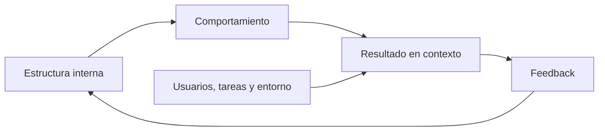

# SE-007 — Calidad interna, externa y calidad en uso

[← SE-006](../../classes/part-00-ingenieria-de-software-como-profesion/se-006-evidencia-incertidumbre-y-pensamiento-critico-en-ingenieria/README.md) · [↑ Parte 00](../../classes/part-00-ingenieria-de-software-como-profesion/README.md) · [📚 Índice completo](../../classes/README.md) · [SE-008 →](../../classes/part-00-ingenieria-de-software-como-profesion/se-008-restricciones-riesgos-y-compromisos-entre-atributos/README.md)

## Antes de empezar

En `SE-006` aprendiste que una observación necesita contexto antes de sostener una
decisión. Aplícalo ahora a Campus Abierto: el equipo muestra cobertura alta y tiempos
de API aceptables, mientras estudiantes con conexiones lentas abandonan el flujo. Las
dos afirmaciones pueden ser verdaderas porque observan capas distintas.

Construirás una cadena entre estructura interna, comportamiento del producto y
resultado en uso. El artefacto principal será un conjunto de escenarios medibles, no
una lista de adjetivos. `SE-008` tomará esos escenarios y mostrará por qué no todos
pueden maximizarse al mismo tiempo.

## Prerrequisitos
Formular afirmaciones y evidencia (`SE-006`).

## Problema auténtico
Un equipo presume 90% de cobertura, baja complejidad y cero errores del linter. Usuarios abandonan el flujo y soporte recibe reclamos. Las métricas internas describen propiedades reales, pero no demuestran calidad en uso.

## Objetivos observables
Distinguirás calidad interna, comportamiento externo y consecuencias en contexto; convertirás atributos en escenarios medibles; evitarás usar una métrica como sustituto del resultado.

## Temas y por qué importan
| Perspectiva | Evidencia |
| --- | --- |
| Interna | estructura, dependencias, analizabilidad |
| Producto en ejecución | corrección, rendimiento, seguridad, compatibilidad |
| Calidad en uso | efectividad, eficiencia y consecuencias para stakeholders |

## Mapa conceptual

Una cadena plausible no es garantía: código legible facilita cambio, pero no asegura una tarea útil.

## Conceptos y decisiones

### 1. Calidad es una relación entre propiedades, necesidades y contexto

Calidad no es una capa añadida después de implementar ni un sinónimo de “sin defectos”.
Una propiedad es valiosa porque permite satisfacer necesidades bajo condiciones y
riesgos concretos. La misma latencia puede ser aceptable para consultar un historial y
dañina para confirmar un cupo que expira. La evaluación necesita contexto, personas,
tarea y consecuencia.

ISO/IEC 25010:2023 ofrece un modelo para calidad de producto ICT e
ISO/IEC 25019:2023 trata calidad en uso. Los modelos aportan vocabulario y relaciones;
no eligen prioridades, umbrales ni métodos por el equipo. Decir “cumplimos ISO 25010”
sin declarar características, medidas y alcance convierte una referencia en eslogan.

### 2. Tres perspectivas conectadas, pero no intercambiables

La **calidad interna** observa propiedades sin ejecutar el producto: estructura,
dependencias, consistencia o analizabilidad. Influyen en la capacidad de comprender y
cambiar, pero una arquitectura elegante puede implementar la regla equivocada. La
**calidad del producto en ejecución** observa respuestas como corrección funcional,
rendimiento, interoperabilidad, seguridad o fiabilidad. Aun así, una respuesta correcta
puede no permitir completar la tarea real.

La **calidad en uso** considera resultados obtenidos por personas y otros stakeholders
en su contexto: efectividad, eficiencia, satisfacción, libertad respecto de riesgos y
cobertura del contexto. Depende del producto y también de conectividad, dispositivo,
conocimiento, apoyo y proceso organizativo.

La cadena interna → comportamiento → resultado formula una hipótesis, no una garantía.
Reducir acoplamiento puede facilitar corregir errores; no demuestra que se corregirán.
Mejorar tiempo de respuesta puede reducir abandono; no prueba que la persona comprenda
el resultado. Cada flecha necesita evidencia apropiada.

### 3. De un atributo abstracto a un escenario verificable

“El sistema debe ser rápido y fácil” no orienta diseño ni prueba. Un escenario de
calidad contiene:

1. **fuente** que origina el estímulo;
2. **estímulo** o evento relevante;
3. **entorno** en que sucede, incluido modo degradado;
4. **artefacto** afectado;
5. **respuesta** esperada;
6. **medida** que permite juzgarla.

“Durante la apertura de matrícula, con 2.000 sesiones y conectividad móvil inestable,
una confirmación repetida conserva un único cupo, muestra estado comprensible en diez
segundos y permite consultarlo después” une fiabilidad, rendimiento y uso. Los números
deben justificarse por necesidad, evidencia histórica, presupuesto técnico o prueba
con personas; copiar un umbral común no lo vuelve adecuado.

### 4. Métricas, proxies y comportamiento inducido

Una métrica representa una parte del fenómeno. Cobertura indica qué código ejecutaron
las pruebas, no la calidad de sus aserciones. Número de incidentes puede bajar porque
mejoró el producto o porque reportar es difícil. Disponibilidad anual puede ocultar que
el servicio cayó durante el único intervalo crítico.

Cuando una medida se convierte en objetivo, las personas adaptan conducta. La respuesta
no es abandonar medición, sino combinar señales, inspeccionar distribución y añadir
**guardrails**. Si se optimiza tiempo de finalización, se observa también error,
abandono, accesibilidad y carga de soporte. La revisión pregunta qué resultado podría
empeorar mientras el indicador mejora.

### 5. Priorizar calidad es aceptar responsabilidad por una pérdida

No todos los atributos pueden maximizarse ni toda mejora tiene el mismo valor. La
prioridad depende de consecuencia, contexto y capacidad de recuperación. La calidad no
funcional tampoco es “opcional”: rendimiento, seguridad o accesibilidad pueden cambiar
la función efectiva del sistema.

La decisión debe declarar lo que no cubre. Un escenario probado en escritorio no
demuestra uso móvil; un p95 no describe el peor caso; una auditoría automática no
demuestra comprensión. Los límites guían la siguiente evidencia en vez de disminuir el
valor del trabajo.

## Caso conductor: métricas verdes, matrícula fallida

El tablero de Campus Abierto muestra 90 % de cobertura, linter limpio y p95 de API por
debajo del objetivo. Sin embargo, personas con conexión intermitente repiten la
confirmación, reciben mensajes contradictorios y llaman a soporte. Las métricas internas
y externas son verdaderas, pero no observan idempotencia ni calidad en uso.

El equipo encadena tres escenarios: internamente, la lógica de confirmación tiene una
responsabilidad aislada y pruebas de propiedades; en ejecución, reintentos con la misma
clave no duplican cupo y el estado converge; en uso, la persona entiende si quedó
matriculada y puede recuperar confirmación sin reiniciar el proceso. Cada escenario
tiene método, umbral, señal de protección y limitación. El resultado deja de ser un
“score de calidad” único y se convierte en evidencia para decidir.

## Definiciones de trabajo
- **calidad interna:** propiedades estáticas que influyen en evolución;
- **calidad del producto:** características observables del producto;
- **calidad en uso:** resultados al utilizarlo en contexto;
- **escenario de calidad:** situación y respuesta medible.

## Glosario
**Atributo** es una dimensión evaluable. **Guardrail** limita daño mientras se optimiza otra métrica. **p95** es el valor bajo el cual cae 95% de observaciones.

## Ejemplo mínimo
Renombrar variables mejora analizabilidad sin cambiar salida. Añadir validación cambia comportamiento externo. Simplificar el flujo puede mejorar efectividad en uso; debe probarse con tareas y personas representativas.

## Ejemplo profesional
Una API tiene disponibilidad 99,9%, pero falla durante cierre financiero. El escenario crítico pondera momento y consecuencia; el promedio anual era insuficiente.

## Práctica guiada
Crea `quality-scenarios.md` con un escenario interno, uno externo y uno en uso. Para cada uno define método, umbral, guardrail y limitación. Relaciona las tres perspectivas sin afirmar causalidad no medida.

## Ejercicios
1. Refuta «sin bugs» como objetivo de calidad.
2. Diseña una métrica que no premie ocultar incidentes.
3. Distingue accesibilidad del código y accesibilidad en uso.

## Reto verificable
Otra persona debe ejecutar o inspeccionar una medida y decir qué conclusión no permite. Si el umbral carece de contexto, no aprueba.

## Preguntas frecuentes
### ¿Calidad interna importa al usuario?
Indirectamente: afecta velocidad y riesgo de cambio, pero no sustituye evidencia de uso.
### ¿ISO 25010 incluye calidad en uso?
La edición 2023 define producto; el modelo de calidad en uso está en ISO/IEC 25019:2023.

## Fallo controlado y diagnóstico
Optimiza una métrica aislada y describe el incentivo adverso. Añade guardrail y condición de revisión.

## Errores comunes y cómo corregirlos

| Síntoma | Causa | Corrección |
| --- | --- | --- |
| lista de adjetivos sin contexto | atributo no convertido en escenario | añade estímulo, entorno, respuesta y medida |
| cobertura se usa como calidad total | proxy confundido con resultado | inspecciona aserciones y enlaza con comportamiento y uso |
| un promedio oculta hora crítica | agregación no representa consecuencia | segmenta por intervalo, cohorte y severidad |
| “cumple ISO” sin alcance | el modelo se usó como certificación | declara característica, edición, método y límite |
| accesibilidad se revisa solo en HTML | se redujo uso a propiedad técnica | prueba tarea, tecnología asistiva, canal y recuperación |

## Entorno y archivos clave
`quality-scenarios.md`, `measures.md`, `review.md`; datos sintéticos y método fechado.

## Seguridad, ética y accesibilidad
No excluyas experiencias minoritarias mediante promedios. Minimiza telemetría y declara propósito y retención.

## Transferencia
Aplica escenarios a biblioteca, servicio y dispositivo; observa qué cambia con el contexto.

## Evaluación y evidencia
Se exigen tres perspectivas, escenarios medibles, límites y guardrails.

## Fuentes
- [ISO/IEC 25010:2023](https://www.iso.org/standard/78176.html), modelo de calidad del producto.
- [ISO/IEC 25019:2023](https://www.iso.org/standard/78177.html), calidad en uso.
- [SWEBOK v4.0a](https://www.computer.org/education/bodies-of-knowledge/software-engineering/v4), fundamentos de calidad.

## Límites y siguiente paso
El modelo no elige prioridades. `SE-008` trata restricciones, riesgos y trade-offs.

---
[← SE-006](../../classes/part-00-ingenieria-de-software-como-profesion/se-006-evidencia-incertidumbre-y-pensamiento-critico-en-ingenieria/README.md) · [↑ Parte 00](../../classes/part-00-ingenieria-de-software-como-profesion/README.md) · [SE-008 →](../../classes/part-00-ingenieria-de-software-como-profesion/se-008-restricciones-riesgos-y-compromisos-entre-atributos/README.md)
