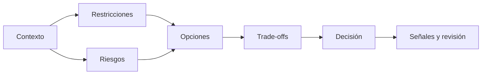

# SE-008 — Restricciones, riesgos y compromisos entre atributos

[← SE-007](../../classes/part-00-ingenieria-de-software-como-profesion/se-007-calidad-interna-externa-y-calidad-en-uso/README.md) · [↑ Parte 00](../../classes/part-00-ingenieria-de-software-como-profesion/README.md) · [📚 Índice completo](../../classes/README.md) · [SE-009 →](../../classes/part-00-ingenieria-de-software-como-profesion/se-009-sostenibilidad-inclusion-y-responsabilidad-social/README.md)

## Antes de empezar

Los escenarios de `SE-007` hicieron visible qué significa rapidez, seguridad y
accesibilidad para Campus Abierto. Ahora aparece el conflicto real: reservar cupos de
forma estricta reduce sobreventa, pero puede aumentar latencia y dependencia; relajar
consistencia mejora respuesta, pero cambia quién soporta el error.

Hoy compararás opciones sin esconder pérdidas. Separarás restricciones de preferencias,
formularás riesgos y declararás qué nueva señal haría revisar la decisión. `SE-009`
ampliará nuevamente la frontera: algunos costos no recaen en el equipo ni aparecen en
el tablero operativo.

## Prerrequisitos
Escenarios de calidad (`SE-007`) y evidencia (`SE-006`).

## Problema auténtico
Se pide máxima seguridad, respuesta instantánea, costo mínimo y entrega inmediata. Aceptar todos los objetivos oculta incompatibilidades; elegir uno sin explicarlo traslada costo a otra persona.

## Objetivos observables
Clasificarás restricciones, modelarás riesgo, compararás opciones con atributos y documentarás condiciones que cambian una decisión.

## Temas y por qué importan
| Concepto | Función |
| --- | --- |
| Restricción | elimina opciones inviables |
| Riesgo | combina incertidumbre y consecuencia |
| Trade-off | hace visible ganancia y pérdida |
| Reversibilidad | limita costo de aprender |

## Mapa conceptual

Una restricción dura invalida; una preferencia pondera. Confundirlas manipula la decisión.

## Conceptos y decisiones

### 1. Restricción, preferencia y supuesto cumplen funciones distintas

Una **restricción** excluye opciones dentro del alcance: una obligación legal, un límite
físico, una fecha externa o compatibilidad contractual. Debe registrar fuente, vigencia,
interpretación y autoridad capaz de cambiarla. “Debe usar la tecnología X” puede ser una
restricción si existe un contrato vigente; también puede ser costumbre o una preferencia
disfrazada para evitar comparación.

Una **preferencia** permite graduar opciones: menor costo, entrega más rápida o
familiaridad. Un **supuesto** completa provisionalmente información faltante y exige una
condición de revisión. Mezclarlos manipula el espacio de decisión: si cada deseo se
declara innegociable, solo queda la opción elegida de antemano.

### 2. Un riesgo conecta causa, evento incierto y consecuencia

“Caída del sistema” es demasiado general. Un riesgo útil puede decir: “debido a que la
reserva y el pago se confirman en sistemas distintos, una demora del proveedor puede
liberar un cupo ya cobrado y exigir reparación manual”. La causa orienta prevención;
el evento define señales; la consecuencia permite priorizar; la respuesta distribuye
autoridad.

Probabilidad y consecuencia rara vez se conocen con precisión. Rangos o categorías
argumentadas son preferibles a multiplicar números inventados. También importan
velocidad del daño, detectabilidad, población expuesta y acumulación. Un evento poco
frecuente no se ignora si es catastrófico o afecta derechos.

La **mitigación** reduce probabilidad o impacto antes del evento. La **contingencia**
indica cómo responder si ocurre. Observabilidad puede mejorar detección sin reducir la
probabilidad; seguro puede transferir costo financiero sin reparar dignidad o acceso.
Nombrar el tipo de control evita prometer más de lo que hace.

### 3. Los atributos se relacionan mediante mecanismos, no eslóganes

Caché puede reducir latencia porque evita trabajo repetido, pero introduce copias cuyo
estado puede quedar antiguo. Cifrado protege confidencialidad bajo ciertas amenazas y
añade gestión de claves y costo. Redundancia tolera fallos independientes, pero eleva
superficie operativa y no ayuda si todas las réplicas comparten el mismo defecto.

Un trade-off no significa que toda mejora empeore necesariamente otra cosa. A veces un
diseño elimina desperdicio y mejora rendimiento, costo y mantenibilidad. La obligación
es buscar alternativas antes de aceptar una pérdida y, cuando permanece, declarar
quién la soporta. “CAP”, “seguridad versus usabilidad” o “rápido versus correcto” no
reemplazan el mecanismo específico del caso.

### 4. Reversibilidad y valor de conservar opciones

Una decisión reversible permite aprender con exposición limitada. Feature flags,
compatibilidad progresiva o pruebas piloto conservan alternativas si están diseñadas
para retirarse y no crean estados irreconciliables. Llamar “experimento” a un cambio de
datos irreversible no lo vuelve reversible.

El **valor de opción** consiste en postergar un compromiso costoso hasta obtener
información, sin paralizar todo. Puede implementarse con una interfaz estable y dos
adaptadores, una migración expandir–migrar–contraer o una cohorte pequeña. Mantener
opciones también cuesta; debe existir un plazo y criterio para cerrarlas.

### 5. Una decisión termina con señales y gobierno, no con una puntuación

Las tablas de decisión ayudan a comparar, pero ponderaciones arbitrarias pueden dar
apariencia matemática a una preferencia. Los derechos, obligaciones y umbrales de
seguridad actúan primero como límites; las opciones viables se comparan después. Una
sensibilidad muestra si pequeños cambios en pesos alteran el resultado.

El registro final incluye contexto, restricciones, opciones descartadas, evidencia,
riesgos aceptados, mitigaciones, contingencias, propietario, fecha y disparadores de
revisión. Así una decisión razonable hoy puede cambiar sin reescribir la historia.

## Caso conductor: consistencia de cupos bajo alta demanda

Campus Abierto debe responder rápido sin vender el mismo cupo dos veces. Se comparan
tres opciones: confirmación síncrona central, reserva temporal con expiración y
aceptación asincrónica con conciliación. La primera simplifica verdad visible pero
concentra dependencia; la segunda conserva experiencia rápida y exige relojes,
idempotencia y recuperación; la tercera absorbe picos, pero traslada incertidumbre a la
persona si se comunica como confirmación.

La elección adopta reserva temporal porque el negocio tolera una espera breve y puede
mostrar estado honesto. La condición dura es no comunicar matrícula definitiva antes
de confirmación. Los riesgos incluyen expiración durante pago, reintento y cola manual.
Se definen claves idempotentes, estado consultable, conciliación y autoridad de
suspensión. Si la tasa de compensaciones supera el umbral o el proveedor cambia su
contrato, se reabre la decisión.

## Definiciones de trabajo
- **restricción dura:** condición no negociable dentro del alcance;
- **preferencia:** criterio graduable;
- **exposición:** combinación razonada de probabilidad y consecuencia;
- **mitigación:** reduce probabilidad o impacto;
- **contingencia:** responde si el evento ocurre.

## Glosario
**Risk appetite** es nivel aceptable de exposición. **Option value** es beneficio de conservar alternativas. **Blast radius** es alcance del daño.

## Ejemplo mínimo
Guardar sesión en memoria reduce latencia, pero perder proceso cierra sesiones. La decisión cambia si autenticación es crítica o si reingresar es barato.

## Ejemplo profesional
Una entidad evalúa biometría: reduce fraude, pero agrega datos sensibles, exclusión y dependencia. Compara biometría obligatoria, opcional con alternativa y no adopción; incluye borrado y apelación.

## Práctica guiada
Crea `constraints.md`, `risk-register.md` y `tradeoff-table.md`. Compara tres opciones con cuatro atributos, evidencia, incertidumbre y reversión. Realiza pre-mortem.

## Ejercicios
1. Convierte una preferencia disfrazada en restricción verificable.
2. Distingue mitigación de contingencia.
3. Explica por qué una opción barata puede aumentar costo total.

## Reto verificable
Un revisor cambia una restricción y tu tabla debe producir una conclusión diferente sin reescribir criterios después de conocer el resultado.

## Preguntas frecuentes
### ¿Todo trade-off es inevitable?
No. A veces otra arquitectura mejora varios atributos; aun así tiene costo y límites.
### ¿Riesgo bajo se ignora?
No si la consecuencia es catastrófica o acumulativa.

## Fallo controlado y diagnóstico
Marca todas las restricciones como duras y observa que queda una sola opción. Revalida fuente y autoridad de cada una.

## Errores comunes y cómo corregirlos

| Síntoma | Causa | Corrección |
| --- | --- | --- |
| solo existe una opción “viable” | preferencias se presentaron como restricciones | verifica fuente, vigencia y autoridad de cada límite |
| riesgo escrito como sustantivo | faltan causa y consecuencia | formula cadena causal, señal, mitigación y contingencia |
| matriz con puntuación precisa y evidencia débil | exactitud aparente | usa rangos, sensibilidad y razonamiento explícito |
| rollback solo cambia binario | se ignoraron datos y efectos externos | define compensación, compatibilidad y punto de no retorno |
| decisión sin fecha ni señal | se trató contexto actual como permanente | añade propietario y disparadores verificables de revisión |

## Entorno y archivos clave
Markdown u hoja local: `constraints.md`, `risk-register.md`, `tradeoff-table.md`, `decision.md`.

## Seguridad, ética y accesibilidad
Incluye cargas trasladadas a usuarios, operadores y ambiente. No reduzcas derechos a una puntuación intercambiable sin justificar límites.

## Transferencia
Repite para sistema crítico y aplicación recreativa; compara apetito y reversibilidad.

## Evaluación y evidencia
Se exigen restricciones trazables, riesgos causales, opciones reales y condición de revisión.

## Fuentes
- [ISO/IEC 25010:2023](https://www.iso.org/standard/78176.html), atributos del producto.
- [NASA Systems Engineering Handbook](https://www.nasa.gov/reference/systems-engineering-handbook/), gestión técnica y riesgo.
- [ACM Code of Ethics](https://www.acm.org/code-of-ethics), evaluación de riesgos e impactos.

## Límites y siguiente paso
La matriz no monetiza dignidad ni resuelve regulación. `SE-009` amplía horizonte social y ambiental.

---
[← SE-007](../../classes/part-00-ingenieria-de-software-como-profesion/se-007-calidad-interna-externa-y-calidad-en-uso/README.md) · [↑ Parte 00](../../classes/part-00-ingenieria-de-software-como-profesion/README.md) · [SE-009 →](../../classes/part-00-ingenieria-de-software-como-profesion/se-009-sostenibilidad-inclusion-y-responsabilidad-social/README.md)
