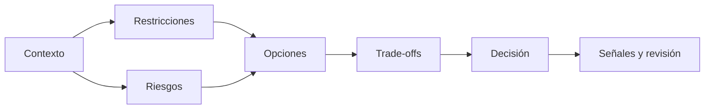

# SE-008 — Restricciones, riesgos y compromisos entre atributos

[← SE-007](../../classes/part-00-ingenieria-de-software-como-profesion/se-007-calidad-interna-externa-y-calidad-en-uso/README.md) · [↑ Parte 00](../../classes/part-00-ingenieria-de-software-como-profesion/README.md) · [📚 Índice completo](../../classes/README.md) · [SE-009 →](../../classes/part-00-ingenieria-de-software-como-profesion/se-009-sostenibilidad-inclusion-y-responsabilidad-social/README.md)

> Estado: **GUIDED**. Clase desarrollada y revisada contra el estándar pedagógico; no implica evidencia de ejecución productiva.

## Prerrequisitos
Escenarios de calidad (`SE-007`) y evidencia (`SE-006`).

## Problema auténtico
Se pide máxima seguridad, respuesta instantánea, costo mínimo y entrega inmediata. Aceptar todos los objetivos oculta incompatibilidades; elegir uno sin explicarlo traslada costo a otra persona.

## Objetivos observables
Clasificarás restricciones, modelarás riesgo, compararás opciones con atributos y documentarás condiciones que cambian una decisión.

## Temas y por qué importan
| Concepto | Función |
| --- | --- |
| Restricción | elimina opciones inviables |
| Riesgo | combina incertidumbre y consecuencia |
| Trade-off | hace visible ganancia y pérdida |
| Reversibilidad | limita costo de aprender |

## Mapa conceptual

Una restricción dura invalida; una preferencia pondera. Confundirlas manipula la decisión.

## Conceptos y decisiones
Restricciones pueden ser físicas, legales, contractuales, temporales u organizativas. Deben incluir fuente, vigencia y responsable de reinterpretarlas. «Debe usar tecnología X» puede ser mandato o hábito.

Riesgo no es una lista de cosas malas: describe evento, causa, consecuencia, probabilidad o exposición, señales y respuesta. La precisión numérica falsa es peor que rangos honestos.

Los atributos interactúan. Cifrado puede aumentar costo computacional; caché mejora latencia y complica frescura; redundancia mejora disponibilidad y eleva costo y superficie operativa. El objetivo es una decisión defendible, no maximizar todo.

## Definiciones de trabajo
- **restricción dura:** condición no negociable dentro del alcance;
- **preferencia:** criterio graduable;
- **exposición:** combinación razonada de probabilidad y consecuencia;
- **mitigación:** reduce probabilidad o impacto;
- **contingencia:** responde si el evento ocurre.

## Glosario
**Risk appetite** es nivel aceptable de exposición. **Option value** es beneficio de conservar alternativas. **Blast radius** es alcance del daño.

## Ejemplo mínimo
Guardar sesión en memoria reduce latencia, pero perder proceso cierra sesiones. La decisión cambia si autenticación es crítica o si reingresar es barato.

## Ejemplo profesional
Una entidad evalúa biometría: reduce fraude, pero agrega datos sensibles, exclusión y dependencia. Compara biometría obligatoria, opcional con alternativa y no adopción; incluye borrado y apelación.

## Práctica guiada
Crea `constraints.md`, `risk-register.md` y `tradeoff-table.md`. Compara tres opciones con cuatro atributos, evidencia, incertidumbre y reversión. Realiza pre-mortem.

## Ejercicios
1. Convierte una preferencia disfrazada en restricción verificable.
2. Distingue mitigación de contingencia.
3. Explica por qué una opción barata puede aumentar costo total.

## Reto verificable
Un revisor cambia una restricción y tu tabla debe producir una conclusión diferente sin reescribir criterios después de conocer el resultado.

## Preguntas frecuentes
### ¿Todo trade-off es inevitable?
No. A veces otra arquitectura mejora varios atributos; aun así tiene costo y límites.
### ¿Riesgo bajo se ignora?
No si la consecuencia es catastrófica o acumulativa.

## Fallo controlado y diagnóstico
Marca todas las restricciones como duras y observa que queda una sola opción. Revalida fuente y autoridad de cada una.

## Entorno y archivos clave
Markdown u hoja local: `constraints.md`, `risk-register.md`, `tradeoff-table.md`, `decision.md`.

## Seguridad, ética y accesibilidad
Incluye cargas trasladadas a usuarios, operadores y ambiente. No reduzcas derechos a una puntuación intercambiable sin justificar límites.

## Transferencia
Repite para sistema crítico y aplicación recreativa; compara apetito y reversibilidad.

## Evaluación y evidencia
Se exigen restricciones trazables, riesgos causales, opciones reales y condición de revisión.

## Fuentes
- [ISO/IEC 25010:2023](https://www.iso.org/standard/78176.html), atributos del producto.
- [NASA Systems Engineering Handbook](https://www.nasa.gov/reference/systems-engineering-handbook/), gestión técnica y riesgo.
- [ACM Code of Ethics](https://www.acm.org/code-of-ethics), evaluación de riesgos e impactos.

## Límites y siguiente paso
La matriz no monetiza dignidad ni resuelve regulación. `SE-009` amplía horizonte social y ambiental.

---
[← SE-007](../../classes/part-00-ingenieria-de-software-como-profesion/se-007-calidad-interna-externa-y-calidad-en-uso/README.md) · [↑ Parte 00](../../classes/part-00-ingenieria-de-software-como-profesion/README.md) · [SE-009 →](../../classes/part-00-ingenieria-de-software-como-profesion/se-009-sostenibilidad-inclusion-y-responsabilidad-social/README.md)
