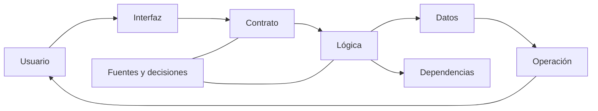

# SE-011 — Taller: anatomía verificable de un producto real

[← SE-010](../../classes/part-00-ingenieria-de-software-como-profesion/se-010-como-leer-estandares-documentacion-y-literatura-tecnica/README.md) · [↑ Parte 00](../../classes/part-00-ingenieria-de-software-como-profesion/README.md) · [📚 Índice completo](../../classes/README.md) · [SE-012 →](../../classes/part-00-ingenieria-de-software-como-profesion/se-012-proyecto-mapa-profesional-y-contrato-personal-de-aprendizaje/README.md)

> Estado: **GUIDED**. Clase desarrollada y revisada contra el estándar pedagógico; no implica evidencia de ejecución productiva.

## Antes de empezar

Hasta aquí estudiaste una lente por vez y la aplicaste a Campus Abierto. El taller
cambia la dirección: recibirás un producto real y deberás reconstruirlo desde evidencia.
Necesitarás decidir su frontera, seguir una tarea, ubicar responsabilidades, leer
fuentes, formular riesgos y distinguir lo observado de lo inferido.

La anatomía resultante debe mostrar una ruta vertical desde la necesidad hasta la
operación, además de huecos honestos. No ejecutes código desconocido para llenar esos
huecos. `SE-012` usará esta evidencia integrada para que tu plan profesional parta de
capacidades demostradas y no de una lista aspiracional de tecnologías.

## Prerrequisitos
Clases `SE-001`–`SE-010` y capacidad de leer un repositorio sin ejecutar código desconocido.

## Problema auténtico
Recibes un producto y una descripción comercial. Debes determinar qué hace realmente, para quién, con qué dependencias, evidencia y riesgos. Repetir el README no constituye una revisión.

## Objetivos observables
Reconstruirás una anatomía desde evidencia, diferenciarás afirmación de observación, seguirás un flujo vertical y producirás preguntas que puedan cambiar una decisión.

## Temas y por qué importan
| Capa | Evidencia buscada |
| --- | --- |
| Propósito | problema, usuarios, resultado y límites |
| Contrato | entradas, salidas, errores y compatibilidad |
| Implementación | módulos, datos, dependencias y decisiones |
| Entrega | build, artefactos, configuración y procedencia |
| Operación | señales, recuperación, soporte y retiro |

## Mapa conceptual

El recorrido es vertical: una tarea cruza superficies. Inventariar carpetas sin seguir comportamiento produce una anatomía nominal.

## Conceptos y decisiones
### 1. Una anatomía responde una pregunta, no enumera directorios

El inventario “frontend, backend, base de datos” reproduce etiquetas del repositorio.
Una anatomía explica cómo una persona obtiene un resultado y qué mecanismos lo
sostienen. Por eso se elige primero una tarea acotada —por ejemplo, crear y recuperar
una solicitud— y se formula qué se desea verificar.

El flujo vertical comienza en la interfaz o punto de entrada, sigue contrato,
validación, autorización, lógica, persistencia, dependencias y respuesta, y termina en
prueba, señal operativa y recuperación. No todas las capas existen ni están en el mismo
repositorio. Un salto se registra como incógnita con la evidencia que permitiría
resolverla; no se rellena por intuición.

### 2. Cada fuente muestra una perspectiva distinta

La documentación expresa intención y uso esperado. El contrato define una superficie.
El código y configuración muestran implementación bajo una versión. Las pruebas
documentan ejemplos que fueron ejecutados en algún entorno. El historial explica
decisiones y evolución. Un artefacto de construcción indica cómo se empaqueta. Logs y
métricas pueden mostrar operación real si se tiene acceso autorizado.

Ninguna fuente es una verdad universal. Un README puede estar desactualizado; una
prueba puede no cubrir configuración de producción; el código puede contener rutas no
desplegadas; ausencia de evidencia no demuestra ausencia de control. Se triangulan
fuentes y se clasifica cada hallazgo:

- **observado:** visible directamente en una ruta, salida o fuente citada;
- **inferido:** explicación razonada desde observaciones y supuestos;
- **desconocido:** pregunta relevante que la evidencia no responde.

### 3. La revisión debe ser segura antes de ser exhaustiva

Un repositorio es entrada no confiable. Antes de ejecutar se leen instrucciones,
scripts, dependencias, acceso de red, variables, escritura en disco y necesidad de
credenciales. Se trabaja en un entorno aislado o copia autorizada, con datos sintéticos
y privilegio mínimo. No se abren secretos ni se conecta producción para completar un
ejercicio.

La revisión estática es válida si se declara. “No ejecutado; inferido desde prueba X y
configuración Y” es mejor que una afirmación ficticia. Si se autoriza ejecutar, se
conservan comando, versión, entorno, salida y recuperación. El objetivo no es maximizar
herramientas, sino obtener evidencia proporcional sin crear otro riesgo.

### 4. Seguir una ruta normal y una degradada

El camino feliz muestra cómo se espera producir valor. El degradado revela si el
sistema conserva una capacidad limitada, comunica estado y permite recuperación.
Conviene elegir un fallo coherente con la frontera: dependencia lenta, entrada repetida,
credencial vencida o dato incompatible.

Para cada paso se pregunta: ¿qué contrato se aplica?, ¿qué estado cambia?, ¿puede
repetirse?, ¿cómo se observa?, ¿qué ve la persona?, ¿quién repara? Esta secuencia
integra fronteras, ciclo, calidad, riesgo y ética. Un error técnicamente manejado puede
seguir siendo una mala experiencia si deja incertidumbre o no ofrece apelación.

### 5. Priorizar gaps y preparar una revisión reproducible

Un **gap** no es cualquier ausencia de documentación. Es una pregunta necesaria para
evaluar la capacidad que no puede resolverse con evidencia disponible. Se prioriza por
consecuencia, probabilidad razonada, alcance y costo de obtener evidencia. “No conozco
el color del tablero interno” puede ser desconocido y no relevante; “no sé si repetir
la solicitud duplica el cobro” cambia la decisión.

El informe enlaza rutas y líneas específicas cuando son estables, explica el método y
separa recomendaciones de hallazgos. Una revisión cruzada intenta reproducir al menos
tres afirmaciones. Si requiere la explicación oral del autor, falta trazabilidad.

## Demostración guiada: una solicitud de Campus Abierto

Aunque el taller usa un producto real autorizado, Campus Abierto muestra el método. La
pregunta es: “¿una confirmación repetida conserva un único cupo y comunica estado?”. Se
ubica el contrato de confirmación, la clave idempotente, la validación, el cambio de
estado, la prueba de repetición y la señal de duplicado. Después se busca el camino en
que el proveedor tarda y la persona consulta el estado.

El README afirma “operación segura”, pero esa frase no basta. La prueba muestra dos
solicitudes iguales y una escritura; la configuración define expiración; no aparece
evidencia de conciliación tras el vencimiento. El hallazgo responsable es: “La ruta
probada evita duplicado dentro de la ventana configurada. No se encontró evidencia
suficiente para determinar el comportamiento después de expirar; verificar runbook o
prueba de conciliación”. No se declara una vulnerabilidad ni una garantía total.

## Protocolo completo del taller

1. **Autoriza y acota:** producto, versión, tarea, métodos permitidos y datos.
2. **Formula preguntas:** capacidad, fallo y decisión que cambiará la revisión.
3. **Reconoce superficies:** documentación, contrato, entrada, datos, build y operación.
4. **Traza un flujo normal:** enlaza cada salto y clasifica evidencia.
5. **Traza un flujo degradado:** observa comunicación, estado y recuperación.
6. **Audita afirmaciones:** contrasta README, código, prueba y configuración.
7. **Prioriza gaps:** consecuencia, evidencia necesaria y propietario posible.
8. **Revisa en cruz:** otra persona reproduce hallazgos y cuestiona inferencias.
9. **Corrige y entrega:** conserva límites, comandos autorizados y preguntas abiertas.

## Definiciones de trabajo
- **flujo vertical:** recorrido completo de una tarea por capas;
- **punto de entrada:** interfaz que inicia comportamiento;
- **fuente de verdad:** artefacto autorizado para una afirmación concreta;
- **evidencia negativa:** ausencia o contradicción relevante, no prueba automática de defecto;
- **gap:** pregunta necesaria que la evidencia disponible no responde.

## Glosario
**Happy path** es recorrido esperado; **degraded path** conserva capacidad limitada; **traceability** conecta necesidad, decisión, implementación y evidencia.

## Ejemplo mínimo
El README dice «datos cifrados». La configuración muestra TLS para tránsito, pero no cifrado de almacenamiento. La conclusión correcta delimita lo observado y pregunta por la capa ausente.

## Ejemplo profesional
En el producto de referencia, sigue la creación de una solicitud desde OpenAPI hasta requisitos, arquitectura, pruebas y runbook. Si el contrato admite reintento pero no hay idempotencia documentada, registra riesgo, no afirmes defecto ejecutado.

## Práctica guiada
1. Selecciona el producto de `blueprints/reference-product/` u otro repositorio autorizado.
2. Declara alcance y método en `review-plan.md`.
3. Sigue un flujo normal y uno degradado.
4. Construye `evidence-map.md` con enlaces por afirmación.
5. Registra cinco gaps y prioriza por consecuencia.
6. Pide revisión cruzada y corrige inferencias excesivas.

## Ejercicios
1. Encuentra una afirmación documentada que el código no basta para confirmar.
2. Distingue dependencia directa, transitiva y servicio externo.
3. Explica cómo retirarías una capacidad sin romper consumidores.

## Reto verificable
Una segunda persona reproduce tres hallazgos desde tus rutas y clasifica cada uno como hecho, inferencia o incógnita. Ningún enlace puede apuntar solo a la raíz del repositorio.

## Preguntas frecuentes
### ¿Debo ejecutar todo?
No. Ejecuta solo lo autorizado y seguro; declara qué quedó estático.
### ¿Más archivos significan más evidencia?
No. Importan relevancia, trazabilidad y capacidad de refutar.

## Fallo controlado y diagnóstico
Sigue deliberadamente el README como única fuente y compara con contrato o configuración. Documenta la primera contradicción y corrige el método.

## Errores comunes y cómo corregirlos

| Síntoma | Causa | Corrección |
| --- | --- | --- |
| informe organizado por carpetas | se inventarió estructura sin seguir capacidad | elige tarea y traza flujo vertical normal y degradado |
| README tratado como prueba | intención confundida con comportamiento | contrasta contrato, implementación, pruebas y configuración |
| ausencia de archivo se declara defecto | evidencia negativa exagerada | registra gap y evidencia necesaria antes de concluir |
| se ejecuta instalación por defecto | no se evaluaron efectos ni autorización | comienza estático, inspecciona scripts y aísla ejecución |
| hallazgo no reproducible | enlaces genéricos y método implícito | cita rutas precisas, versión, pasos y clasificación epistemológica |

## Entorno y archivos clave
Editor, Git y navegador. Entrega `review-plan.md`, `system-map.md`, `evidence-map.md`, `gaps.md`, `review.md`. No instales dependencias innecesarias.

## Seguridad, ética y accesibilidad
No abras secretos, datos reales ni producción. Examina si la interfaz y soporte contemplan acceso alternativo y recuperación.

## Transferencia
Repite el flujo en un proyecto de otro stack; conserva preguntas y cambia herramientas.

## Evaluación y evidencia
Se evalúan flujo vertical, citas precisas, límites, riesgo y revisión reproducible. Una ficha descriptiva no aprueba.

## Fuentes
- [SWEBOK v4.0a](https://www.computer.org/education/bodies-of-knowledge/software-engineering/v4), áreas de conocimiento usadas en la inspección.
- [NASA Systems Engineering Handbook](https://www.nasa.gov/reference/systems-engineering-handbook/), trazabilidad y revisiones técnicas.
- [ACM Code of Ethics](https://www.acm.org/code-of-ethics), autorización, competencia y evaluación exhaustiva.

## Límites y siguiente paso
Es una revisión acotada, no certificación de seguridad ni producción. `SE-012` convierte resultados en un plan profesional verificable.

---
[← SE-010](../../classes/part-00-ingenieria-de-software-como-profesion/se-010-como-leer-estandares-documentacion-y-literatura-tecnica/README.md) · [↑ Parte 00](../../classes/part-00-ingenieria-de-software-como-profesion/README.md) · [SE-012 →](../../classes/part-00-ingenieria-de-software-como-profesion/se-012-proyecto-mapa-profesional-y-contrato-personal-de-aprendizaje/README.md)
