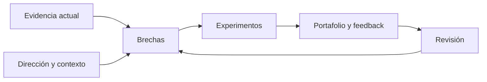

# SE-012 — Proyecto: mapa profesional y contrato personal de aprendizaje

[← SE-011](../../classes/part-00-ingenieria-de-software-como-profesion/se-011-taller-anatomia-verificable-de-un-producto-real/README.md) · [↑ Parte 00](../../classes/part-00-ingenieria-de-software-como-profesion/README.md) · [📚 Índice completo](../../classes/README.md) · [SE-013 →](../../classes/part-01-computadores-y-representacion-de-informacion/se-013-arquitectura-basica-de-un-computador-moderno/README.md)

> Estado: **GUIDED**. Clase desarrollada y revisada contra el estándar pedagógico; no implica evidencia de ejecución productiva.

## Antes de empezar

El taller `SE-011` dejó evidencia concreta de cómo observas un producto: qué pudiste
explicar, qué decisión defendiste y dónde tuviste que declarar un hueco. Esa evidencia
es la entrada de este proyecto. Empezar desde “quiero aprender X” volvería a ocultar
capacidades, contexto y criterio de salida.

Cerrarás la parte conectando todos los artefactos que construiste alrededor de
**Campus Abierto**: fronteras, ciclo de vida, análisis ético, colaboración, evidencia,
calidad, riesgo, impacto y lectura de fuentes. El
resultado será un contrato personal revisable que enlaza cada brecha con una práctica
y una prueba. La Parte 01 podrá entonces aportar fundamentos de computación a una ruta
que ya sabe por qué los necesita.

## Prerrequisitos
Evidencias de `SE-001`–`SE-011` y el diagnóstico en `assessments/diagnostic.md`.

## Problema auténtico
«Quiero ser senior» o «aprender todo» no orienta decisiones. Un plan profesional debe conectar capacidad observable, contexto deseado, brecha, práctica y evidencia sin convertir una ruta en promesa laboral.

## Objetivos observables
Construirás un mapa basado en evidencia, seleccionarás una ruta con límites, formularás experimentos de aprendizaje y definirás revisión, recuperación y criterios de salida.

## Temas y por qué importan
| Elemento | Pregunta |
| --- | --- |
| Evidencia actual | ¿qué puedes demostrar hoy? |
| Dirección | ¿qué problemas y responsabilidades buscas? |
| Brecha | ¿qué capacidad falta, no solo qué tema? |
| Experimento | ¿qué práctica produce evidencia? |
| Revisión | ¿qué señal cambia la ruta? |

## Mapa conceptual

El contrato es adaptativo: evidencia y contexto actualizan brechas. No es una lista infinita de cursos.

## Conceptos y decisiones
### 1. Una competencia combina saber, hacer, juzgar y responder

“Conozco Docker” puede significar reconocer el nombre, repetir un comando o diseñar una
entrega recuperable. Una competencia observable declara acción, contexto, criterio y
límite: “puedo construir e inspeccionar una imagen local reproducible, explicar su
procedencia, ejecutar con privilegio mínimo y recuperar un fallo sin afirmar seguridad
de producción”. El conocimiento conceptual permite explicar; la ejecución produce un
resultado; el juicio elige; la responsabilidad reconoce consecuencias.

El mapa usa cuatro estados que no son rangos personales: **aún no tengo evidencia**,
**puedo reconocer y explicar**, **puedo ejecutar con guía** y **puedo transferir y
defender en otro contexto**. Una misma persona puede estar en estados distintos según
la capacidad. Avanzar requiere evidencia, no autoestima ni años de experiencia.

### 2. El portafolio contiene decisiones, no solo resultados bonitos

Un artefacto demuestra más cuando conserva propósito, contexto, alternativas, método,
resultado, revisión y límite. El mapa de SE-001 muestra frontera; el caso de SE-004,
deliberación; el log de SE-006, calidad de inferencia; la anatomía de SE-011, integración.
Una captura final sin proceso puede probar que algo existió, no quién lo produjo ni qué
capacidad movilizó.

La convalidación reconoce evidencia previa si otra persona puede evaluarla contra el
mismo criterio. No obliga a repetir trabajo por obediencia curricular. Tampoco permite
saltar una obligación transversal porque el artefacto “parece avanzado”: seguridad,
ética, accesibilidad, fuentes y recuperación se revisan donde sean relevantes.

### 3. Elegir dirección significa elegir problemas y responsabilidades

“Ser backend” es una orientación útil, pero insuficiente para priorizar. Conviene
describir contextos y responsabilidades: diseñar contratos, conservar integridad de
datos, diagnosticar operación, evolucionar sin romper consumidores. Esta formulación
permite identificar fundamentos transferibles y no ata la identidad a una herramienta.

La brecha es la distancia entre evidencia actual y capacidad requerida. Si una persona
construye APIs, pero nunca migra datos ni recupera un fallo, la brecha no es “aprender
Kubernetes”: es demostrar evolución y recuperación. La herramienta se elige después,
como medio apropiado para el experimento.

### 4. Priorizar por dependencia, riesgo y feedback

Una ruta no necesita contener todo el campo. Ordena subcapacidades que habilitan otras,
reduce riesgos importantes y produce feedback pronto. Los fundamentos suelen preceder
a una herramienta cuando permiten explicar su comportamiento; una exploración pequeña
puede precederlos si ayuda a formular preguntas.

El trabajo en curso limitado evita acumular diez cursos sin evidencia. Un experimento
breve produce un artefacto revisable y una decisión: avanzar, repetir, dividir o cambiar
estrategia. El criterio de salida no es “sentirme experto”, sino una observación que una
persona revisora puede verificar.

### 5. Un experimento de aprendizaje puede confirmar o refutar progreso

Cada experimento contiene capacidad, tarea, condiciones, recursos, evidencia esperada,
criterio, feedback, duración y seguridad. Debe existir un resultado que muestre que la
estrategia no funcionó. Si siempre termina marcado “completo” por consumir contenido,
no es experimento.

Por ejemplo: “en dos semanas diseñaré y ejecutaré una migración local compatible hacia
adelante y atrás con datos sintéticos; otra persona seguirá el runbook y recuperará una
interrupción; registraré lo que no cubre producción”. El resultado puede revelar que
falta modelado de datos antes de continuar. Ese hallazgo mejora el mapa; no es fracaso.

### 6. Sostenibilidad y revisión forman parte del contrato

El contrato declara capacidad real, horario, apoyo, accesibilidad, descanso y respuesta
ante bloqueo. No necesita diagnósticos de salud ni datos privados. Un plan que solo
funciona sacrificando sueño o acumulando deuda no es profesionalmente sostenible.

La revisión tiene fecha y preguntas: ¿qué evidencia apareció?, ¿qué supuesto cambió?,
¿qué práctica produjo feedback?, ¿qué debe detenerse? La dirección puede cambiar sin
invalidar aprendizaje previo. El contrato gobierna una etapa; no fija identidad ni
promete empleo.

## Integración final de Campus Abierto

El proyecto reúne los artefactos como una cadena, no como carpeta:

| Evidencia previa | Capacidad demostrada | Pregunta de revisión |
| --- | --- | --- |
| mapa de fronteras | delimitar sistema y responsabilidad | ¿explica interfaces y afectados? |
| ciclo y handoff | sostener decisiones en el tiempo | ¿incluye operación, autoridad y retiro? |
| caso ético y mapa de roles | deliberar y coordinar | ¿cambia diseño y permite reparación? |
| log de evidencia | razonar bajo incertidumbre | ¿puede refutarse y reproducirse? |
| escenarios, riesgos e impactos | comparar consecuencias | ¿declara pérdidas, señales y grupos? |
| trazabilidad de fuentes | fundamentar afirmaciones | ¿edición, pasaje, interpretación y límite? |
| anatomía del producto | integrar las lentes | ¿otra persona reproduce hallazgos? |

El estudiante selecciona cinco evidencias fuertes y cinco ausencias honestas. Para una
ruta backend puede reconocer buena formulación de contratos, ejecución guiada de
pruebas y ausencia de migración operativa. Define tres experimentos encadenados, no
tres tecnologías independientes. La salida incluye revisión externa y desacuerdos;
ocultarlos impediría saber qué desarrollar.

## Gate del proyecto final

La parte se considera completada cuando:

1. cada prioridad se vincula con una responsabilidad profesional concreta;
2. cada brecha compara evidencia actual con criterio requerido;
3. cada experimento produce un artefacto y una revisión observable;
4. el plan limita trabajo en curso y cabe en la capacidad declarada;
5. existen respuesta ante bloqueo, fecha y disparadores de revisión;
6. seguridad, ética, accesibilidad y recuperación aparecen donde corresponden;
7. las afirmaciones sobre competencia conservan contexto y límites.

No aprueba una tabla de cursos, una lista de tecnologías ni una promesa de dominar todo.
El proyecto demuestra capacidad para dirigir el propio aprendizaje con el mismo rigor
empleado al dirigir una decisión técnica.

## Definiciones de trabajo
- **competencia:** capacidad observable en contexto con criterio de calidad;
- **brecha:** distancia entre evidencia actual y requerida;
- **experimento de aprendizaje:** práctica acotada que puede confirmar o refutar avance;
- **portafolio:** evidencia seleccionada con contexto, decisiones y límites;
- **criterio de salida:** condición verificable para avanzar.

## Glosario
**Deliberate practice** enfoca una subcapacidad con feedback. **WIP** es trabajo en curso. **Convalidación** reconoce evidencia previa sin omitir obligaciones transversales.

## Ejemplo mínimo
Objetivo débil: «aprender pruebas». Objetivo verificable: «diseñar para una regla de transferencia pruebas unitarias, de contrato y negativas, ejecutar una y justificar límites antes del 30 de noviembre».

## Ejemplo profesional
Una persona busca backend. Su evidencia muestra APIs básicas, pero no migración ni operación. La ruta prioriza datos y recuperación antes de distribuir sistemas; cada bloque aporta un artefacto al producto transversal y una revisión.

## Práctica guiada
1. Completa el diagnóstico sin puntaje.
2. Reúne cinco evidencias y cinco «aún no» honestos.
3. Elige un contexto profesional y tres responsabilidades.
4. Construye `competency-map.md` con dependencias.
5. Define tres experimentos de máximo dos semanas.
6. Escribe criterios de salida, feedback y plan ante bloqueo.
7. Pide revisión y conserva desacuerdos.

## Ejercicios
1. Reescribe tres objetivos de herramienta como capacidades transferibles.
2. Elimina un objetivo que no contribuye a la dirección actual.
3. Diseña convalidación para una competencia ya demostrada.

## Reto verificable
Un revisor debe enlazar cada prioridad con brecha, evidencia esperada y responsabilidad profesional. La ruta debe caber en capacidad real y contener fecha de revisión, no de «dominio total».

## Preguntas frecuentes
### ¿La ruta garantiza empleo?
No. Produce evidencia y mejora capacidad; mercado y selección tienen factores externos.
### ¿Debo empezar desde SE-001?
No necesariamente. Puedes convalidar evidencia, pero no saltar obligaciones críticas sin demostrarla.

## Fallo controlado y diagnóstico
Planifica diez objetivos simultáneos. Estima capacidad, dependencias y feedback; reduce WIP hasta que cada experimento tenga resultado revisable.

## Errores comunes y cómo corregirlos

| Síntoma | Causa | Corrección |
| --- | --- | --- |
| objetivos son nombres de herramientas | se confundió medio con capacidad | añade acción, contexto, criterio, responsabilidad y límite |
| autoevaluación sin enlaces | familiaridad se tomó como evidencia | vincula artefacto revisable o declara “aún no” |
| diez objetivos simultáneos | se optimizó cobertura, no feedback | prioriza dependencia y limita trabajo en curso |
| completar un curso es criterio de salida | consumo confundido con desempeño | exige tarea, evidencia y revisión externa |
| el plan depende de sobreesfuerzo | se ignoró sostenibilidad humana | ajusta alcance, ritmo, apoyos y recuperación |

## Entorno y archivos clave
`diagnostic.md`, `competency-map.md`, `learning-contract.md`, `experiments.md`, `review-log.md`. No incluyas información privada innecesaria.

## Seguridad, ética y accesibilidad
El plan debe ser voluntario, realista y accesible. No compares públicamente diagnósticos ni uses vulnerabilidades personales como evaluación.

## Transferencia
Adapta el mismo mapa a frontend, datos o liderazgo. Conserva competencias transversales y cambia evidencias de especialidad.

## Evaluación y evidencia
La salida exige diagnóstico honesto, mapa causal, tres experimentos, criterios de aceptación, feedback y plan de recuperación. Cantidad de temas no puntúa.

## Fuentes
- [SWEBOK v4.0a](https://www.computer.org/education/bodies-of-knowledge/software-engineering/v4), alcance de la profesión.
- [Software Engineering 2014 Curriculum Guidelines](https://ieeecs-media.computer.org/assets/pdf/se2014.pdf), resultados y práctica profesional como referencia curricular histórica.
- [ACM Code of Ethics](https://www.acm.org/code-of-ethics), competencia, aprendizaje y responsabilidad.
- [Estándar pedagógico del programa](../../docs/PEDAGOGICAL-STANDARD.md), contrato local de evidencia y madurez.

## Límites y siguiente paso
El mapa no certifica competencia ni fija una identidad permanente. `SE-013` inicia fundamentos de computadores; la ruta puede ajustarse con evidencia posterior.

---
[← SE-011](../../classes/part-00-ingenieria-de-software-como-profesion/se-011-taller-anatomia-verificable-de-un-producto-real/README.md) · [↑ Parte 00](../../classes/part-00-ingenieria-de-software-como-profesion/README.md) · [📚 Índice completo](../../classes/README.md) · [SE-013 →](../../classes/part-01-computadores-y-representacion-de-informacion/se-013-arquitectura-basica-de-un-computador-moderno/README.md)
