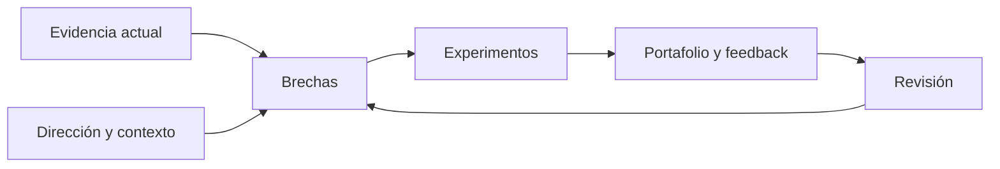

# SE-012 — Proyecto: mapa profesional y contrato personal de aprendizaje

[← SE-011](../../classes/part-00-ingenieria-de-software-como-profesion/se-011-taller-anatomia-verificable-de-un-producto-real/README.md) · [↑ Parte 00](../../classes/part-00-ingenieria-de-software-como-profesion/README.md) · [📚 Índice completo](../../classes/README.md) · [SE-013 →](../../classes/part-01-computadores-y-representacion-de-informacion/se-013-arquitectura-basica-de-un-computador-moderno/README.md)

> Estado: **GUIDED**. Clase desarrollada y revisada contra el estándar pedagógico; no implica evidencia de ejecución productiva.

## Prerrequisitos
Evidencias de `SE-001`–`SE-011` y el diagnóstico en `assessments/diagnostic.md`.

## Problema auténtico
«Quiero ser senior» o «aprender todo» no orienta decisiones. Un plan profesional debe conectar capacidad observable, contexto deseado, brecha, práctica y evidencia sin convertir una ruta en promesa laboral.

## Objetivos observables
Construirás un mapa basado en evidencia, seleccionarás una ruta con límites, formularás experimentos de aprendizaje y definirás revisión, recuperación y criterios de salida.

## Temas y por qué importan
| Elemento | Pregunta |
| --- | --- |
| Evidencia actual | ¿qué puedes demostrar hoy? |
| Dirección | ¿qué problemas y responsabilidades buscas? |
| Brecha | ¿qué capacidad falta, no solo qué tema? |
| Experimento | ¿qué práctica produce evidencia? |
| Revisión | ¿qué señal cambia la ruta? |

## Mapa conceptual

El contrato es adaptativo: evidencia y contexto actualizan brechas. No es una lista infinita de cursos.

## Conceptos y decisiones
Una competencia integra conocimiento, ejecución, juicio y responsabilidad. «Conozco Docker» es ambiguo; «puedo construir, inspeccionar y recuperar un contenedor local explicando límites» es observable.

El mapa usa cuatro estados: aún no, puedo reconocer, puedo ejecutar con guía y puedo transferir/defender. Autoevaluar no basta; enlaza un artefacto o declara ausencia. No uses tiempo de experiencia como sustituto de capacidad.

Una ruta prioriza dependencias y riesgo. Fundamentos pueden preceder herramientas; seguridad, accesibilidad y recuperación no se omiten por especialización. Limitar trabajo en curso mejora feedback.

El contrato personal define ritmo sostenible, apoyo, alternativas ante bloqueo y revisión. No debe exigir datos de salud ni justificar explotación. Descanso y cambio de estrategia son controles, no fracaso moral.

## Definiciones de trabajo
- **competencia:** capacidad observable en contexto con criterio de calidad;
- **brecha:** distancia entre evidencia actual y requerida;
- **experimento de aprendizaje:** práctica acotada que puede confirmar o refutar avance;
- **portafolio:** evidencia seleccionada con contexto, decisiones y límites;
- **criterio de salida:** condición verificable para avanzar.

## Glosario
**Deliberate practice** enfoca una subcapacidad con feedback. **WIP** es trabajo en curso. **Convalidación** reconoce evidencia previa sin omitir obligaciones transversales.

## Ejemplo mínimo
Objetivo débil: «aprender pruebas». Objetivo verificable: «diseñar para una regla de transferencia pruebas unitarias, de contrato y negativas, ejecutar una y justificar límites antes del 30 de noviembre».

## Ejemplo profesional
Una persona busca backend. Su evidencia muestra APIs básicas, pero no migración ni operación. La ruta prioriza datos y recuperación antes de distribuir sistemas; cada bloque aporta un artefacto al producto transversal y una revisión.

## Práctica guiada
1. Completa el diagnóstico sin puntaje.
2. Reúne cinco evidencias y cinco «aún no» honestos.
3. Elige un contexto profesional y tres responsabilidades.
4. Construye `competency-map.md` con dependencias.
5. Define tres experimentos de máximo dos semanas.
6. Escribe criterios de salida, feedback y plan ante bloqueo.
7. Pide revisión y conserva desacuerdos.

## Ejercicios
1. Reescribe tres objetivos de herramienta como capacidades transferibles.
2. Elimina un objetivo que no contribuye a la dirección actual.
3. Diseña convalidación para una competencia ya demostrada.

## Reto verificable
Un revisor debe enlazar cada prioridad con brecha, evidencia esperada y responsabilidad profesional. La ruta debe caber en capacidad real y contener fecha de revisión, no de «dominio total».

## Preguntas frecuentes
### ¿La ruta garantiza empleo?
No. Produce evidencia y mejora capacidad; mercado y selección tienen factores externos.
### ¿Debo empezar desde SE-001?
No necesariamente. Puedes convalidar evidencia, pero no saltar obligaciones críticas sin demostrarla.

## Fallo controlado y diagnóstico
Planifica diez objetivos simultáneos. Estima capacidad, dependencias y feedback; reduce WIP hasta que cada experimento tenga resultado revisable.

## Entorno y archivos clave
`diagnostic.md`, `competency-map.md`, `learning-contract.md`, `experiments.md`, `review-log.md`. No incluyas información privada innecesaria.

## Seguridad, ética y accesibilidad
El plan debe ser voluntario, realista y accesible. No compares públicamente diagnósticos ni uses vulnerabilidades personales como evaluación.

## Transferencia
Adapta el mismo mapa a frontend, datos o liderazgo. Conserva competencias transversales y cambia evidencias de especialidad.

## Evaluación y evidencia
La salida exige diagnóstico honesto, mapa causal, tres experimentos, criterios de aceptación, feedback y plan de recuperación. Cantidad de temas no puntúa.

## Fuentes
- [SWEBOK v4.0a](https://www.computer.org/education/bodies-of-knowledge/software-engineering/v4), alcance de la profesión.
- [Software Engineering 2014 Curriculum Guidelines](https://ieeecs-media.computer.org/assets/pdf/se2014.pdf), resultados y práctica profesional como referencia curricular histórica.
- [ACM Code of Ethics](https://www.acm.org/code-of-ethics), competencia, aprendizaje y responsabilidad.
- [Estándar pedagógico del programa](../../docs/PEDAGOGICAL-STANDARD.md), contrato local de evidencia y madurez.

## Límites y siguiente paso
El mapa no certifica competencia ni fija una identidad permanente. `SE-013` inicia fundamentos de computadores; la ruta puede ajustarse con evidencia posterior.

---
[← SE-011](../../classes/part-00-ingenieria-de-software-como-profesion/se-011-taller-anatomia-verificable-de-un-producto-real/README.md) · [↑ Parte 00](../../classes/part-00-ingenieria-de-software-como-profesion/README.md) · [📚 Índice completo](../../classes/README.md) · [SE-013 →](../../classes/part-01-computadores-y-representacion-de-informacion/se-013-arquitectura-basica-de-un-computador-moderno/README.md)
