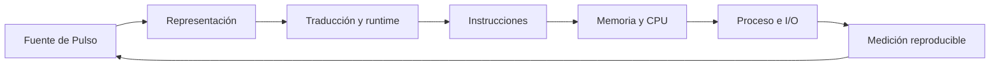

# Parte 01 — Computadores y representación de información

- **Etapa:** A · Fundamentos de la profesión
- **Audiencia:** personas que programan o diseñan software y necesitan explicar qué ocurre debajo del lenguaje
- **Estado:** 12 clases `GUIDED`, revisadas contra el estándar pedagógico
- **Dedicación estimada:** 54 horas entre clases, taller y proyecto

## Antes de comenzar: el caso que conecta la parte

Durante doce clases construirás y observarás **Pulso**, un programa local y pequeño
que recibe una confirmación ficticia de matrícula, la codifica, calcula estadísticas,
la conserva y devuelve un resumen. El comportamiento parece sencillo, pero atraviesa
representación binaria, texto, aritmética, instrucciones, memoria, procesos, I/O,
compilación y runtime. Cada clase abre una capa sin fingir que la capa inferior deja de
existir.

El diagrama no dice que la ejecución sea estrictamente lineal. Runtime, sistema
operativo y hardware cooperan y retroalimentan el resultado. Sirve para localizar qué
contrato se observa en cada clase y qué inferencias quedan fuera.

## Propósito profesional

Esta parte desarrolla un modelo por capas que permite explicar errores de datos,
portabilidad y rendimiento sin recurrir a “la máquina hace magia”. La meta no es
diseñar un procesador ni memorizar una arquitectura particular. Es poder relacionar una
decisión de software con la representación y los recursos que la hacen posible,
producir observaciones repetibles y distinguir una interfaz arquitectónica de una
implementación concreta.

## Resultados acumulativos

Al completar la parte podrás:

1. seguir información desde una intención humana hasta bytes y estados de máquina;
2. razonar sobre bases, signo, endianess, Unicode y error numérico;
3. distinguir ISA, microarquitectura, runtime y sistema operativo;
4. explicar localidad, jerarquía de memoria, proceso, hilo, interrupción e I/O;
5. comparar compilación, interpretación, bytecode, JIT y gestión automática de memoria;
6. diseñar mediciones de tiempo y recursos sin extrapolar una observación local;
7. entregar un informe reproducible que otra persona pueda refutar o extender.

## Prerrequisitos y preparación

Se recomienda completar la [Parte 00](../../classes/part-00-ingenieria-de-software-como-profesion/README.md), especialmente evidencia e incertidumbre. Necesitas Python 3.11 o posterior, una terminal y un editor. Las prácticas usan solo biblioteca estándar y datos sintéticos. Registra versión, sistema operativo y arquitectura; nunca ejecutes binarios desconocidos ni cambies configuración del sistema.

## Progresión por bloques

### Bloque 1 — Representar información

`SE-013` ubica las capas del computador. `SE-014` introduce bits, bytes, bases y
orden. `SE-015` muestra por qué carácter, punto de código y byte no son sinónimos.
`SE-016` explica rango, precisión y redondeo.

**Pregunta de control:** ¿qué significado pertenece a los bits y cuál lo aporta el
contrato que los interpreta?

### Bloque 2 — Ejecutar y mover información

`SE-017` sigue instrucciones y registros. `SE-018` introduce localidad y jerarquía de
memoria. `SE-019` conecta proceso, hilo, interrupción e I/O.

**Pregunta de control:** ¿qué estado cambia, quién inicia el cambio y qué señal permite
observarlo sin confundir modelo con implementación?

### Bloque 3 — Traducir y administrar la ejecución

`SE-020` recorre fuente, representaciones intermedias y código. `SE-021` estudia
runtime, máquina virtual, pila, heap y recolección. `SE-022` integra medición,
rendimiento, energía y límites físicos.

**Pregunta de control:** ¿qué costo fue desplazado del código fuente al compilador,
runtime, sistema operativo o hardware?

### Bloque 4 — Integrar evidencia

`SE-023` sigue Pulso desde el código hasta señales del proceso. `SE-024` exige un
informe reproducible con hipótesis rivales, entorno y límites.

**Pregunta de control:** ¿puede otra persona repetir la observación y decir qué no
demuestra?

## Guía razonada clase por clase

La parte sigue el mismo dato de Pulso desde su significado hasta el hardware, el runtime
y la medición. Cada clase declara qué capa explica una transición, qué observación puede
respaldarla y qué límite impide convertir un modelo didáctico en una afirmación sobre
cualquier máquina.

### Bloque 1 — Representar información sin perder significado

#### SE-013 — Arquitectura básica de un computador moderno

Construye el mapa inicial: entrada/salida, CPU, memoria, almacenamiento e interfaces.
Distingue arquitectura visible para el software de microarquitectura interna. Pulso se
usa para seguir una solicitud desde el fuente hasta una salida, declarando qué capa
explica cada transición. Produce `machine-map.md`.

El estudiante anota qué conoce por interfaz y qué solo infiere de la implementación. El
mapa evita que «la CPU hizo» sustituya una cadena causal. `SE-014` entra en la unidad más
pequeña del recorrido y pregunta qué convierte patrones binarios en información.

#### SE-014 — Bits, bytes, bases numéricas y representación

Explica que un bit no contiene significado por sí solo. El contrato decide si una
secuencia representa entero, texto, color o instrucción. Se practican conversión
posicional, signo, rango, endianess y serialización con `int.to_bytes`. Produce un
cuaderno de conversiones verificadas, no una lista de equivalencias memorizadas.

La práctica predice bytes antes de inspeccionarlos y comprueba ida y vuelta, rango y
orden. Un mismo patrón produce interpretaciones distintas bajo contratos distintos.
`SE-015` aplica ese principio al texto, donde carácter visible y bytes no coinciden de
manera uno-a-uno.

#### SE-015 — Texto, Unicode, codificaciones y mojibake

Separa carácter abstracto, punto de código, unidad de código, secuencia de bytes y
grafema visible. Pulso recibe `Matrícula ✓`; se inspecciona UTF-8, normalización y el
mecanismo exacto del mojibake. Produce casos de ida y vuelta y una política de error.

El estudiante reproduce la degradación decodificando con el contrato incorrecto, en
lugar de tratarla como caracteres mágicos. También prueba normalización y grafemas que
ocupan varios puntos de código. `SE-016` conserva la pregunta por representación y la
lleva a cantidades y precisión.

#### SE-016 — Enteros, coma flotante, precisión y errores numéricos

Compara enteros de ancho fijo con enteros arbitrarios y explica representación de coma
flotante, redondeo y valores especiales. Pulso calcula un promedio que parece exacto y
se decide entre binario, decimal y entero escalado según el dominio. Produce pruebas de
frontera y un registro de decisión numérica.

La evidencia incluye desbordamiento conceptual, acumulación de redondeo y comparación
inadecuada. No se declara «float impreciso» como regla absoluta: se relacionan rango,
error y dominio. `SE-017` observa cómo esas operaciones se expresan en el contrato de
instrucciones de una máquina.

### Bloque 2 — Seguir la ejecución y el movimiento de datos

#### SE-017 — CPU, instrucciones, registros y ciclos de ejecución

Presenta la ISA como contrato software–máquina y la distingue de la implementación.
Una traza didáctica sigue carga, operación, comparación y salto, mientras pipeline y
ejecución especulativa se explican como optimizaciones que no cambian el resultado
arquitectónico correcto. Produce una traza estado por estado.

Cada paso declara registros y memoria antes y después, evitando confundir bytecode con
instrucciones físicas. El modelo explica semántica visible, no tiempos exactos de una
microarquitectura. `SE-018` amplía la traza hacia la jerarquía que alimenta y conserva
esos datos.

#### SE-018 — Memoria, cachés, almacenamiento y jerarquías

Relaciona latencia, capacidad, costo, persistencia y localidad. Pulso procesa datos
contiguos y dispersos; la medición controla tamaño y repeticiones sin atribuir a una
caché concreta lo que Python no permite observar directamente. Produce un mapa de
jerarquía y un experimento de conjunto de trabajo.

El estudiante predice qué patrón favorece localidad y contrasta la tendencia, registrando
ruido y entorno. No atribuye la diferencia a un nivel de caché sin contadores adecuados.
`SE-019` incorpora procesos, planificación y operaciones de entrada/salida que pueden
hacer esperar a la ejecución.

#### SE-019 — Procesos, hilos, interrupciones y entrada/salida

Ubica el aislamiento del proceso, el estado compartido entre hilos, la planificación y
la frontera de llamada al sistema. Pulso pasa de cálculo puro a leer y escribir. Se
comparan I/O bloqueante y concurrencia sin afirmar paralelismo automático. Produce una
línea temporal causal.

Pulso registra creación, lectura, espera, escritura y terminación, diferenciando trabajo
de CPU de tiempo bloqueado. El estudiante marca qué recursos se comparten y cuáles se
aíslan. `SE-020` retrocede desde el proceso en marcha para explicar cómo el fuente llegó
a una forma ejecutable.

### Bloque 3 — Traducir, administrar y medir la ejecución

#### SE-020 — Compilación, interpretación, bytecode y JIT

Rompe la falsa oposición compilado–interpretado: un sistema puede traducir en varias
etapas. Con `ast` y `dis`, Pulso se observa como fuente, árbol y bytecode de CPython;
esas instrucciones no se confunden con la ISA física. Produce un mapa de traducción con
artefactos y decisiones por etapa.

La comparación muestra que traducción anticipada y ejecución por un runtime pueden
coexistir. El estudiante conserva versión y artefacto, y señala qué optimización no
observó. `SE-021` estudia los servicios que mantienen tipos, llamadas, errores y memoria
durante esa ejecución.

#### SE-021 — Runtimes, máquinas virtuales y recolección de basura

Explica los servicios que sostienen ejecución: carga, tipos, excepciones, llamadas,
asignación y memoria automática. Se comparan conteo de referencias y trazado, y se
separa liberar memoria de cerrar recursos. Pulso mide asignaciones con `tracemalloc` y
produce un mapa de vida de objetos.

Pulso crea referencias, ciclos y recursos externos para distinguir alcanzabilidad de
liberación y liberación de cierre oportuno. La evidencia no promete cuándo ocurrirá una
colección. `SE-022` transforma todas estas capas en preguntas medibles sobre tiempo,
trabajo y recursos.

#### SE-022 — Rendimiento, consumo energético y límites físicos

Convierte “rápido” en latencia, throughput y trabajo útil bajo condiciones declaradas.
Se controla calentamiento, ruido y variación; la energía se trata como una frontera de
medición distinta y no se inventan julios desde tiempo de pared. Produce un protocolo
de benchmark y un análisis de cuello de botella.

El estudiante formula una hipótesis, controla carga y entorno, reporta distribución y
declara qué señal energética no tiene disponible. Optimizar sin perfil se rechaza.
`SE-023` reunirá representación, traducción, proceso y recursos en una observación de
extremo a extremo.

### Bloque 4 — Integrar observaciones y sostener una conclusión

#### SE-023 — Taller: observar un programa desde el código hasta la máquina

Integra las diez lentes. El estudiante ejecuta únicamente Pulso, inspecciona bytes,
AST, bytecode, proceso, tiempo y memoria, y mantiene una columna separada para aquello
que infiere. Una revisión cruzada intenta reconstruir tres hallazgos.

El taller alinea artefactos en una sola historia y obliga a citar la herramienta o
interfaz que sustenta cada observación. Una contradicción no se oculta: genera una nueva
hipótesis. `SE-024` convierte esa práctica guiada en una investigación pequeña elegida y
defendida por el estudiante.

#### SE-024 — Proyecto: informe reproducible de comportamiento y recursos

El proyecto formula una pregunta propia sobre representación o recursos, compara dos
hipótesis y entrega código mínimo, datos, entorno, resultados y límites. La aprobación
depende de reproducibilidad y calidad causal, no de obtener un resultado llamativo.

Una segunda persona ejecuta desde un entorno declarado y revisa si los datos permiten la
conclusión. El informe separa observado, inferido y no medido. Ese hábito prepara la
Parte 2, donde Pulso se convierte en Faro y el entorno operativo pasa de contexto a
objeto explícito de diagnóstico.

## Resumen operativo del recorrido

| Clase | Evidencia principal |
| --- | --- |
| [SE-013](../../classes/part-01-computadores-y-representacion-de-informacion/se-013-arquitectura-basica-de-un-computador-moderno/README.md) | mapa de capas y contratos |
| [SE-014](../../classes/part-01-computadores-y-representacion-de-informacion/se-014-bits-bytes-bases-numericas-y-representacion/README.md) | cuaderno de representaciones |
| [SE-015](../../classes/part-01-computadores-y-representacion-de-informacion/se-015-texto-unicode-codificaciones-y-mojibake/README.md) | laboratorio de codificación |
| [SE-016](../../classes/part-01-computadores-y-representacion-de-informacion/se-016-enteros-coma-flotante-precision-y-errores-numericos/README.md) | decisión numérica y pruebas límite |
| [SE-017](../../classes/part-01-computadores-y-representacion-de-informacion/se-017-cpu-instrucciones-registros-y-ciclos-de-ejecucion/README.md) | traza de instrucciones |
| [SE-018](../../classes/part-01-computadores-y-representacion-de-informacion/se-018-memoria-caches-almacenamiento-y-jerarquias/README.md) | mapa y experimento de memoria |
| [SE-019](../../classes/part-01-computadores-y-representacion-de-informacion/se-019-procesos-hilos-interrupciones-y-entrada-salida/README.md) | línea temporal de proceso e I/O |
| [SE-020](../../classes/part-01-computadores-y-representacion-de-informacion/se-020-compilacion-interpretacion-bytecode-y-jit/README.md) | mapa de traducción |
| [SE-021](../../classes/part-01-computadores-y-representacion-de-informacion/se-021-runtimes-maquinas-virtuales-y-recoleccion-de-basura/README.md) | mapa de runtime y objetos |
| [SE-022](../../classes/part-01-computadores-y-representacion-de-informacion/se-022-rendimiento-consumo-energetico-y-limites-fisicos/README.md) | protocolo de medición |
| [SE-023](../../classes/part-01-computadores-y-representacion-de-informacion/se-023-taller-observar-un-programa-desde-el-codigo-hasta-la-maquina/README.md) | dossier de observación vertical |
| [SE-024](../../classes/part-01-computadores-y-representacion-de-informacion/se-024-proyecto-informe-reproducible-de-comportamiento-y-recursos/README.md) | informe reproducible revisado |

## Proyecto integrador y criterio de salida

El dossier final contiene pregunta, programa mínimo, entorno, representaciones
intermedias, mediciones repetidas, hipótesis alternativas y límites. Otra persona debe
poder ejecutar el procedimiento con Python compatible y explicar una diferencia. No
aprueba una captura, un benchmark único ni una descripción de hardware deducida solo
desde el lenguaje.

## Fuentes de la parte

- [RISC-V Ratified Specifications Library](https://docs.riscv.org/reference/isa/) sustenta la distinción entre ISA e implementación y los ejemplos de instrucciones.
- [The Unicode Standard 17.0](https://www.unicode.org/versions/Unicode17.0.0/) sustenta texto, codificación y normalización.
- [Python 3 documentation](https://docs.python.org/3/) sustenta los experimentos con representación, `ast`, `dis`, `gc`, `timeit` y `tracemalloc`.
- [Java Virtual Machine Specification](https://docs.oracle.com/javase/specs/) aporta una máquina virtual especificada y deja explícitas decisiones de implementación.
- [LLVM documentation](https://llvm.org/docs/) respalda las etapas de representaciones intermedias, generación y JIT.
- [Software Carbon Intensity](https://greensoftware.foundation/standards/sci/) aporta una frontera explícita para energía y emisiones sin reducirlas a tiempo de CPU.

## Límites

La parte observa principalmente CPython desde interfaces portables. No enseña diseño
digital, ensamblador productivo, kernel ni microarquitectura avanzada. Las inferencias
sobre caché, energía o instrucciones físicas se presentan como hipótesis salvo que una
herramienta autorizada las mida.

[Volver al índice de clases](../../classes/README.md)
