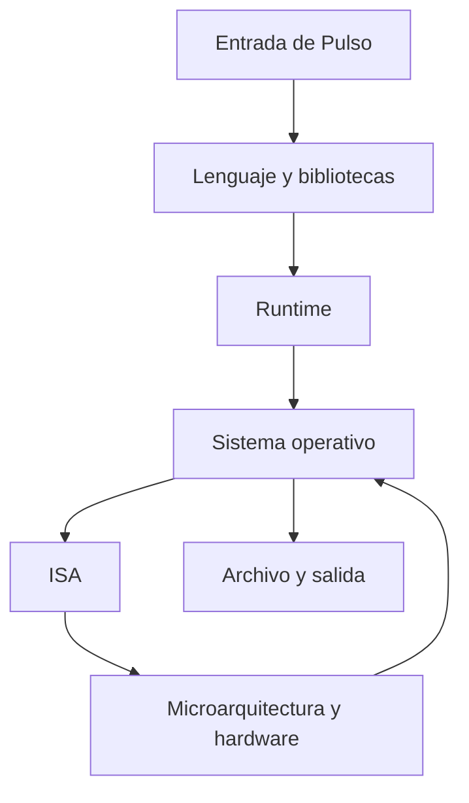

# SE-013 — Arquitectura básica de un computador moderno

[← SE-012](../../classes/part-00-ingenieria-de-software-como-profesion/se-012-proyecto-mapa-profesional-y-contrato-personal-de-aprendizaje/README.md) · [↑ Parte 01](../../classes/part-01-computadores-y-representacion-de-informacion/README.md) · [📚 Índice completo](../../classes/README.md) · [SE-014 →](../../classes/part-01-computadores-y-representacion-de-informacion/se-014-bits-bytes-bases-numericas-y-representacion/README.md)

> Estado: **GUIDED**. Clase conceptual con observaciones locales; no certifica una arquitectura física.

## Antes de empezar

En `SE-012` convertiste objetivos en evidencia. Ahora comienza la base técnica: antes
de optimizar o depurar necesitas saber **en qué capa ocurre una afirmación**. Abrimos
**Pulso**, un programa Python que recibirá `Matrícula confirmada ✓`, producirá un
resumen y lo guardará. Hoy no lo optimizarás: construirás el mapa que permitirá seguir
sus datos y decisiones durante toda la parte.

## Prerrequisitos

Parte 00 o capacidad para separar observación e inferencia. Python 3.11+, terminal y un directorio de práctica sin datos reales.

## Problema auténtico

Un fallo se atribuye a “la CPU” porque el programa tarda. La evidencia disponible solo
muestra tiempo de pared de un proceso que también espera disco. Sin un modelo de
capas, el equipo modifica componentes que no causan el síntoma.

## Objetivos observables

Podrás distinguir arquitectura, ISA, microarquitectura y organización del sistema;
seguir entrada, transformación, almacenamiento y salida; ubicar una observación en su
capa; y declarar qué no puede inferirse desde Python.

## Temas y por qué importan

| Tema | Mecanismo | Por qué importa |
| --- | --- | --- |
| Capas y contratos | cada nivel ofrece una interfaz al superior | evita explicaciones que saltan de fuente a transistor |
| CPU, memoria e I/O | transforman, conservan y comunican estado | permite localizar recursos y esperas |
| ISA y microarquitectura | contrato visible frente a implementación | evita confundir compatibilidad con rendimiento idéntico |
| Observación | cada herramienta ve una frontera | limita conclusiones y orienta la siguiente medición |

## Mapa conceptual

La flecha descendente representa contratos de ejecución; la ascendente, resultados e
interrupciones. El mapa no afirma que una línea de Python corresponda a una instrucción.

## Conceptos y decisiones

### 1. Arquitectura es una interfaz observable

La arquitectura describe propiedades que un consumidor puede usar sin conocer toda la
implementación. Una ISA especifica instrucciones, registros y efectos visibles para el
software de bajo nivel. RISC-V, por ejemplo, separa deliberadamente la ISA de una
microarquitectura particular. Dos procesadores pueden ejecutar el mismo binario y
organizar internamente pipeline, cachés o unidades de ejecución de modo distinto.

### 2. CPU, memoria y dispositivos cooperan

La CPU obtiene y ejecuta instrucciones; los registros conservan estado inmediato; la
memoria principal mantiene código y datos activos; el almacenamiento preserva datos;
los dispositivos intercambian información. Interconexiones y controladores coordinan
movimientos. Esta lista no explica por sí sola un programa: hay que seguir qué dato
cambia, dónde vive y quién inicia la transición.

### 3. El sistema moderno es una pila de abstracciones

Pulso no escribe directamente celdas físicas. El lenguaje define valores; CPython los
representa como objetos; el sistema operativo ofrece procesos, memoria virtual y
archivos; la ISA define efectos de instrucciones; el hardware implementa esos efectos.
Cada capa simplifica y añade costo. Saltarse una capa produce afirmaciones falsas como
“una variable es un registro” o “guardar un archivo escribe inmediatamente en disco”.

### 4. Estado, control y flujo de datos

Una ejecución puede describirse como estados y transiciones: llegan bytes, se
decodifican, se crean objetos, se calcula, se solicita una escritura y se informa el
resultado. El control decide qué transición sigue; el flujo de datos muestra qué valor
la alimenta. Separarlos ayuda a explicar por qué una espera de I/O detiene un hilo sin
que la CPU esté calculando esa solicitud.

### 5. Observar una capa no revela automáticamente las demás

`platform.machine()` informa una etiqueta de plataforma que el runtime expone;
`sys.byteorder` informa el orden nativo que Python observa. No demuestran modelo exacto
de CPU, tamaño de caché ni frecuencia efectiva. Virtualización, emulación y contenedores
pueden interponer capas. Una observación correcta se acompaña de su fuente y límite.

## Caso conductor: localizar Pulso

Pulso recibe texto por argumentos, lo codifica, calcula longitud y escribe JSON. El
mapa asigna: semántica al programa, objetos a CPython, proceso y archivo al sistema
operativo, instrucciones a la ISA y ejecución física al procesador. Si escribir tarda,
el mapa ofrece hipótesis —serialización, llamada, caché del sistema, dispositivo— sin
elegir una antes de medir.

## Definiciones de trabajo

- **arquitectura:** propiedades e interfaces visibles de un sistema;
- **ISA:** contrato de instrucciones y estado visible para software de máquina;
- **microarquitectura:** organización concreta que implementa una ISA;
- **runtime:** servicios que sostienen un programa durante ejecución;
- **dispositivo:** componente que intercambia datos o señales con el sistema.

## Glosario

**Estado** es información suficiente para explicar una transición. **ABI** es un
contrato binario que incluye llamadas y representación. **Firmware** es software ligado
al control de hardware. **Memoria virtual** es el espacio de direcciones que el sistema
presenta a un proceso.

## Ejemplo mínimo

Dos equipos muestran `x86_64`. Comparten una familia de ISA, pero no necesariamente
cachés, núcleos ni desempeño. La etiqueta permite decidir compatibilidad aproximada; no
permite predecir tiempo.

## Ejemplo profesional

Un servicio consume CPU baja y latencia alta. La traza muestra espera de red. Escalar
frecuencia de CPU no ataca el mecanismo; reducir rondas, usar concurrencia controlada o
mejorar la dependencia sí podrían hacerlo.

## Práctica guiada

1. Crea `work/SE-013/` y registra `python --version` y sistema operativo.
2. Escribe `probe.py` que imprima `platform.machine()`, `sys.byteorder` y el texto ficticio.
3. Dibuja `machine-map.md` con las cinco capas y un contrato por frontera.
4. Marca cada dato como observado, documentado o inferido.
5. Añade una hipótesis de latencia y una medición que podría refutarla.
6. Borra solo `work/SE-013/` para recuperar el entorno.

## Ejercicios

1. Explica dónde viven conceptualmente una variable, un objeto y sus bytes.
2. Compara ISA y microarquitectura con un contraejemplo.
3. Añade una capa de virtualización y revisa qué observaciones cambian.

## Reto verificable

Otra persona debe ubicar cinco afirmaciones de tu informe en su capa y señalar una
inferencia inválida. Aprueba si el mapa contiene contratos, señales y límites, no solo
cajas.

## Preguntas frecuentes

### ¿Arquitectura es lo mismo que hardware?
No. Puede describir interfaces del hardware o de un sistema de software.

### ¿Python impide aprender la máquina?
No; permite observar varias capas, siempre que no confundas bytecode con ISA.

## Fallo controlado y diagnóstico

Afirma que `platform.machine()` identifica el procesador exacto. Contrasta en
documentación qué devuelve, registra el síntoma conceptual y corrige la conclusión a
“etiqueta de arquitectura expuesta por la plataforma”.

## Errores comunes y cómo corregirlos

| Síntoma | Causa | Corrección |
| --- | --- | --- |
| una línea equivale a una instrucción | se saltaron compilador y runtime | traza representaciones intermedias |
| CPU y computador se usan como sinónimos | se omitieron memoria e I/O | sigue dato y control por componentes |
| misma ISA implica mismo rendimiento | arquitectura confundida con implementación | mide cada entorno y declara microarquitectura desconocida |
| diagrama sin contratos | inventario sin mecanismo | anota entrada, salida y responsable de cada frontera |

## Entorno y archivos clave

Python 3.11+, `platform`, `sys`; `probe.py`, `machine-map.md`, `observations.md`. No instala paquetes ni modifica el sistema.

## Seguridad, ética y accesibilidad

No publiques nombres de host, identificadores o rutas privadas. Proporciona texto
alternativo al diagrama. La etiqueta de arquitectura no justifica excluir dispositivos
sin medir la capacidad necesaria.

## Transferencia

Aplica el mapa a un navegador o microcontrolador y explica qué capas desaparecen, se combinan o cambian de propietario.

## Evaluación y evidencia

Se exige mapa causal, cinco observaciones trazables, una inferencia refutada y límites.

## Fuentes

- [RISC-V Unprivileged ISA](https://docs.riscv.org/reference/isa/unpriv/) respalda la ISA como interfaz separada de microarquitectura.
- [Python `platform`](https://docs.python.org/3/library/platform.html) define las etiquetas observables usadas en la práctica.
- [Python `sys`](https://docs.python.org/3/library/sys.html) documenta `byteorder` y propiedades del runtime.

## Límites y siguiente paso

No se inspeccionan transistores ni instrucciones nativas. `SE-014` abre la representación binaria que atraviesa el mapa.

---
[← SE-012](../../classes/part-00-ingenieria-de-software-como-profesion/se-012-proyecto-mapa-profesional-y-contrato-personal-de-aprendizaje/README.md) · [↑ Parte 01](../../classes/part-01-computadores-y-representacion-de-informacion/README.md) · [SE-014 →](../../classes/part-01-computadores-y-representacion-de-informacion/se-014-bits-bytes-bases-numericas-y-representacion/README.md)
