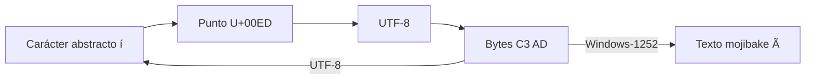

# SE-015 — Texto, Unicode, codificaciones y mojibake

[← SE-014](../../classes/part-01-computadores-y-representacion-de-informacion/se-014-bits-bytes-bases-numericas-y-representacion/README.md) · [↑ Parte 01](../../classes/part-01-computadores-y-representacion-de-informacion/README.md) · [📚 Índice completo](../../classes/README.md) · [SE-016 →](../../classes/part-01-computadores-y-representacion-de-informacion/se-016-enteros-coma-flotante-precision-y-errores-numericos/README.md)

> Estado: **PLANNED** · Borrador público conservado íntegramente y sometido a auditoría técnica y pedagógica.

## Punto profesional y fundamento pedagógico

**Punto profesional.** La clase existe para distinguir carácter, punto de código, unidades de código, bytes y glifo al diagnosticar texto.

**Por qué aparece aquí.** Se sitúa después de **Bits, bytes, bases numéricas y representación** y antes de **Enteros, coma flotante, precisión y errores numéricos**: convierte el conocimiento anterior en una decisión observable que la clase siguiente podrá reutilizar. La continuidad se comprueba en el artefacto, no por compartir vocabulario.

**Error conceptual que debe corregir.** Tratar Unicode como una codificación única o suponer que toda corrupción es reversible.

**Secuencia de aprendizaje.** Antes de leer la solución, el estudiante predice el resultado del caso normal y del error conceptual anterior. Luego explica un caso resuelto paso a paso, construye un contraejemplo que cambie la decisión y, sin consultar el texto, reconstruye el mecanismo y lo aplica a una entrada nueva. La secuencia usa predicción, explicación propia, contraste y recuperación. [ICAP](https://icap.education.asu.edu/research) distingue participación de construcción de conocimiento; [How People Learn II](https://nap.nationalacademies.org/catalog/24783/how-people-learn-ii-learners-contexts-and-cultures) exige conectar conocimiento previo, contexto y transferencia; la [práctica de recuperación](https://pubmed.ncbi.nlm.nih.gov/16507066/) respalda producir de nuevo la explicación tras una demora; y [Education for Life and Work](https://nap.nationalacademies.org/resource/13398/dbasse_084153.pdf) exige devolución que explique la causa del error.

**Evidencia de aprendizaje.** Text-lab.md con code points, hex, normalización y un fallo de decodificación reproducible. Debe contener predicción previa, observación, explicación causal, contraejemplo, criterio de aceptación y una nota de qué dato haría cambiar la conclusión.

**Límite de la conclusión.** Unicode no determina por sí solo tipografía, shaping ni bidi.

### Trazabilidad fuente → afirmación

| Fuente primaria u oficial | Afirmación que respalda | Lo que no prueba |
|---|---|---|
| [The Unicode Standard 17.0](https://www.unicode.org/versions/Unicode17.0.0/) |  define modelo y propiedades | No demuestra por sí sola que el artefacto del estudiante sea correcto. |
| [Unicode UTF FAQ](https://www.unicode.org/faq/utf_bom.html) |  explica UTF-8, UTF-16 y BOM | No demuestra por sí sola que el artefacto del estudiante sea correcto. |
| [Unicode Normalization Annex #15](https://www.unicode.org/reports/tr15/) |  define las formas de normalización | No demuestra por sí sola que el artefacto del estudiante sea correcto. |

## Antes de empezar

`SE-014` mostró que los bits necesitan un contrato. Ahora el analizador local de eventos debe conservar
`Matrícula José ✓`. La pantalla parece mostrar “caracteres”, pero el sistema intercambia
bytes. Construirás la cadena carácter → punto de código → codificación → bytes y la
usarás para provocar y reparar mojibake de forma explicada.

## Prerrequisitos

Bits, bytes y hexadecimal de `SE-014`; Python 3.11+; archivos desechables.

## Problema auténtico

Un CSV correcto llega como `Matrícula`. Reemplazar visualmente `í` por `í` puede
corromper otros datos porque el síntoma procede de decodificar UTF-8 como otra
codificación y volver a serializar. Se necesita reconstruir la transformación.

## Objetivos observables

Distinguirás carácter, grafema, punto y unidad de código; explicarás UTF-8; demostrarás
ida y vuelta; compararás normalizaciones; y diagnosticarás mojibake conservando bytes.

## Temas y por qué importan

| Tema | Mecanismo | Por qué importa |
| --- | --- | --- |
| Modelo Unicode | asigna puntos de código a caracteres abstractos | permite intercambio entre escrituras |
| UTF-8 | transforma puntos en bytes únicos | sostiene archivos y protocolos modernos |
| Normalización | compara secuencias equivalentes según forma | evita claves visualmente iguales pero distintas |
| Mojibake | bytes se decodifican con contrato incorrecto | permite reparar causa, no apariencia |
## Mapa conceptual

La última flecha muestra el mecanismo del síntoma. El dibujo simplifica grafemas: lo
visible puede contener varios puntos de código.

## Conceptos y decisiones

### 1. Texto visible no equivale a una unidad técnica

Un carácter abstracto pertenece al repertorio Unicode. Un **punto de código** es su
número. Una **unidad de código** es una unidad de una forma como UTF-16. Un **grafema**
es una unidad que una persona percibe como carácter y puede reunir varios puntos. Por
eso `len()` depende del modelo del lenguaje y no siempre cuenta símbolos percibidos.

### 2. Unicode es repertorio; UTF-8 es una forma de codificación

Unicode asigna puntos de código. UTF-8 los transforma en secuencias de uno a cuatro
bytes y conserva ASCII como bytes iguales. Es reversible para secuencias válidas. El
orden de bytes del procesador no altera UTF-8 porque se interpreta byte a byte. Un BOM
en UTF-8 puede actuar como firma, no como indicador de endianess.

### 3. Codificar y decodificar son operaciones inversas bajo el mismo contrato

`text.encode('utf-8')` produce bytes; `data.decode('utf-8')` produce texto. Sin una
codificación declarada, los bytes no contienen una etiqueta universal. Las políticas
`strict`, `replace` o `ignore` cambian si el error se detiene, se hace visible o se
pierde. Ignorar puede ser aceptable en visualización no crítica, pero es peligroso para
identidades o registros auditables.

### 4. Normalización trata equivalencias, no apariencia universal

`é` puede ser U+00E9 o `e` más un acento combinante. NFC y NFD transforman entre formas
canónicas; NFKC/NFKD aplican compatibilidad y pueden cambiar distinciones significativas.
Normalizar ayuda a comparar, pero no reemplaza reglas de dominio ni resuelve caracteres
visualmente similares de escrituras diferentes.

### 5. Mojibake conserva un rastro causal

Si bytes UTF-8 `C3 AD` se decodifican como Windows-1252 aparecen `í`. Si ese texto se
guarda en UTF-8, nace una segunda capa. Reparar exige conocer o inferir con evidencia la
cadena; aplicar sustituciones globales puede dañar texto legítimo. Se conserva copia,
se prueba en muestra y se valida round-trip.

## Caso conductor: confirmar una matrícula sin perder el nombre

El analizador local de eventos serializa JSON con UTF-8 y declara el encoding al abrir archivos. Guarda texto
normalizado solo si el dominio lo exige y conserva el original cuando la forma importa.
El laboratorio compara `José`, `Jose\u0301` y `✓`; registra puntos, nombres Unicode,
bytes y longitud en cada nivel.

## Definiciones de trabajo

- **punto de código:** valor del espacio Unicode;
- **codificación:** transformación entre texto modelado y unidades binarias;
- **grafema:** unidad aproximada percibida por una persona;
- **normalización:** conversión a una forma Unicode definida;
- **mojibake:** texto ilegible por interpretación incompatible de bytes.

## Glosario

**Code unit** es unidad de una forma de codificación. **BOM** es U+FEFF al inicio bajo
ciertos protocolos. **Replacement character** U+FFFD hace visible una decodificación no
recuperada.

## Ejemplo mínimo

`'í'.encode('utf-8').hex()` devuelve `c3ad`. Decodificar esos bytes como latin-1 crea
dos puntos de código; volver a codificar no recupera significado sin conocer el error.

## Ejemplo profesional

Una importación recibe CSV sin charset. En vez de probar hasta “verse bien”, se obtiene
metadato del productor, se conserva original, se valida muestra multilingüe y se
rechazan secuencias inválidas con informe de fila.

## Práctica guiada

1. Crea `unicode_probe.py` con `unicodedata.name`, `normalize`, `encode` y `decode`.
2. Inspecciona `Matrícula José ✓` y la forma descompuesta de `é`.
3. Demuestra UTF-8 → latin-1/Windows-1252 → mojibake sin sobrescribir el original.
4. Compara NFC, NFD y longitudes; explica qué cambia y qué no.
5. Prueba `strict` y `replace` con bytes inválidos.
6. Entrega `text-cases.json`, `observations.md` y procedimiento de recuperación.

## Ejercicios

1. Explica por qué “Unicode de 16 bits” es incorrecto.
2. Diseña un contrato para CSV con encoding y política de error.
3. Analiza cuándo NFKC dañaría una identidad o código.

## Reto verificable

Otra persona debe reconstruir bytes originales de dos casos y decir cuál no puede
repararse sin información adicional. No aprueba una tabla de reemplazos visuales.

## Preguntas frecuentes

### ¿UTF-8 representa todos los caracteres Unicode?
Sí, salvo puntos sustitutos que no son valores escalares codificables.

### ¿Normalizar arregla mojibake?
No. Opera sobre texto ya decodificado; el error de encoding requiere reconstruir bytes.

## Fallo controlado y diagnóstico

Decodifica bytes UTF-8 con una codificación incompatible. Captura bytes antes y después,
explica cada transformación y recupera solo desde una copia verificable.

## Errores comunes y cómo corregirlos

| Síntoma | Causa | Corrección |
| --- | --- | --- |
| `len()` se interpreta como caracteres visibles | puntos y grafemas confundidos | declara la unidad que cuentas |
| texto “arreglado” con reemplazos | se atacó apariencia | reconstruye codificación y conserva original |
| `errors='ignore'` en datos críticos | pérdida silenciosa | usa `strict` y ruta de cuarentena |
| normalización universal | dominio no considerado | elige forma y campos con criterio explícito |

## Entorno y archivos clave

Python 3.11+, `unicodedata`, `pathlib`; `unicode_probe.py`, `text-cases.json`, `observations.md`. Limpieza local por directorio.

## Seguridad, ética y accesibilidad

No uses nombres reales. Conservar correctamente una escritura es una cuestión de
identidad e inclusión. No uses transliteración como sustituto automático del original.

## Transferencia

Repite con emoji compuesto y una escritura no latina; identifica puntos, grafema y bytes.

## Evaluación y evidencia

Se exige cadena reversible, normalización explicada, error controlado y política de entrada.

## Fuentes

- [The Unicode Standard 17.0](https://www.unicode.org/versions/Unicode17.0.0/) define modelo y propiedades.
- [Unicode UTF FAQ](https://www.unicode.org/faq/utf_bom.html) explica UTF-8, UTF-16 y BOM.
- [Unicode Normalization Annex #15](https://www.unicode.org/reports/tr15/) define las formas de normalización.
- [Python Unicode HOWTO](https://docs.python.org/3/howto/unicode.html) respalda el laboratorio.

## Límites y siguiente paso

No cubre segmentación completa ni seguridad de identificadores. `SE-016` estudia números y precisión.

---
[← SE-014](../../classes/part-01-computadores-y-representacion-de-informacion/se-014-bits-bytes-bases-numericas-y-representacion/README.md) · [↑ Parte 01](../../classes/part-01-computadores-y-representacion-de-informacion/README.md) · [SE-016 →](../../classes/part-01-computadores-y-representacion-de-informacion/se-016-enteros-coma-flotante-precision-y-errores-numericos/README.md)
