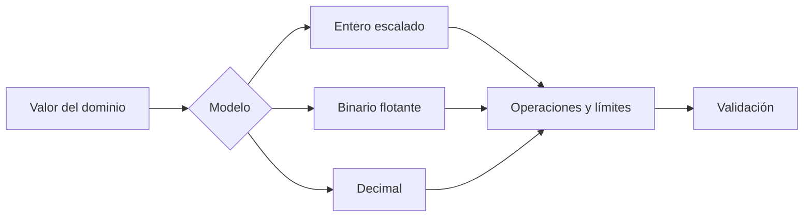

# SE-016 — Enteros, coma flotante, precisión y errores numéricos

[← SE-015](../../classes/part-01-computadores-y-representacion-de-informacion/se-015-texto-unicode-codificaciones-y-mojibake/README.md) · [↑ Parte 01](../../classes/part-01-computadores-y-representacion-de-informacion/README.md) · [📚 Índice completo](../../classes/README.md) · [SE-017 →](../../classes/part-01-computadores-y-representacion-de-informacion/se-017-cpu-instrucciones-registros-y-ciclos-de-ejecucion/README.md)

> Estado: **PLANNED** · Borrador público conservado íntegramente y sometido a auditoría técnica y pedagógica.

## Punto profesional y fundamento pedagógico

**Punto profesional.** La clase existe para evaluar precisión según representación, propagación del error y tolerancia ligada a la escala.

**Por qué aparece aquí.** Se sitúa después de **Texto, Unicode, codificaciones y mojibake** y antes de **CPU, instrucciones, registros y ciclos de ejecución**: convierte el conocimiento anterior en una decisión observable que la clase siguiente podrá reutilizar. La continuidad se comprueba en el artefacto, no por compartir vocabulario.

**Error conceptual que debe corregir.** Esperar aritmética decimal exacta de coma flotante o elegir epsilon por costumbre.

**Secuencia de aprendizaje.** Antes de leer la solución, el estudiante predice el resultado del caso normal y del error conceptual anterior. Luego explica un caso resuelto paso a paso, construye un contraejemplo que cambie la decisión y, sin consultar el texto, reconstruye el mecanismo y lo aplica a una entrada nueva. La secuencia usa predicción, explicación propia, contraste y recuperación. [ICAP](https://icap.education.asu.edu/research) distingue participación de construcción de conocimiento; [How People Learn II](https://nap.nationalacademies.org/catalog/24783/how-people-learn-ii-learners-contexts-and-cultures) exige conectar conocimiento previo, contexto y transferencia; la [práctica de recuperación](https://pubmed.ncbi.nlm.nih.gov/16507066/) respalda producir de nuevo la explicación tras una demora; y [Education for Life and Work](https://nap.nationalacademies.org/resource/13398/dbasse_084153.pdf) exige devolución que explique la causa del error.

**Evidencia de aprendizaje.** Numeric-errors.md con predicción, error absoluto/relativo y contraejemplo inestable. Debe contener predicción previa, observación, explicación causal, contraejemplo, criterio de aceptación y una nota de qué dato haría cambiar la conclusión.

**Límite de la conclusión.** El ejercicio no certifica estabilidad de algoritmos científicos completos.

### Trazabilidad fuente → afirmación

| Fuente primaria u oficial | Afirmación que respalda | Lo que no prueba |
|---|---|---|
| [Python Floating-Point Tutorial](https://docs.python.org/3/tutorial/floatingpoint.html) |  explica representación y aproximación | No demuestra por sí sola que el artefacto del estudiante sea correcto. |
| [Python `decimal`](https://docs.python.org/3/library/decimal.html) |  documenta aritmética decimal y contextos | No demuestra por sí sola que el artefacto del estudiante sea correcto. |
| [Java Virtual Machine Specification §2.8](https://docs.oracle.com/javase/specs/jvms/se25/html/jvms-2.html#jvms-2.8) |  ofrece otro contrato IEEE 754 especificado | No demuestra por sí sola que el artefacto del estudiante sea correcto. |

## Antes de empezar

Ya sabes que los bits necesitan interpretación. El analizador local de eventos calcula el promedio de tiempos y
un importe ficticio. Si usa el mismo tipo para ambos, puede mostrar `0.30000000000000004`
o acumular una cantidad incorrecta. Esta clase conecta representación con decisión de
dominio antes de seguir las operaciones hasta la CPU en `SE-017`.

## Prerrequisitos

Representación binaria de `SE-014`, Python 3.11+, fracciones y exponentes básicos.

## Problema auténtico

Un sistema compara `0.1 + 0.2 == 0.3` y rechaza una conciliación. Redondear la pantalla
oculta el síntoma, pero no define cómo calcular, comparar ni acumular.

## Objetivos observables

Explicarás rango de enteros fijos, representación binaria aproximada, redondeo, NaN e
infinito; elegirás entre entero escalado, decimal y float; y diseñarás pruebas de frontera.

## Temas y por qué importan

| Tema | Mecanismo | Por qué importa |
| --- | --- | --- |
| Enteros | rango depende de ancho y signo | controla IDs, contadores y overflow |
| Coma flotante | significando y exponente aproximan reales | permite gran rango con precisión finita |
| Redondeo | asigna resultados no representables | acumula error y afecta comparaciones |
| Modelo de dominio | elige representación por invariantes | evita usar float por costumbre |
## Mapa conceptual

No existe un tipo mejor en absoluto. La decisión depende de rango, exactitud, operaciones, interoperabilidad y costo.

## Conceptos y decisiones

### 1. Los enteros de máquina tienen ancho; Python abstrae ese límite

En formatos fijos, rango y overflow siguen las reglas de `SE-014`. Python expande sus
enteros mientras haya memoria, pero al serializar, llamar código nativo o usar una base
de datos reaparece el ancho. Probar solo en Python puede ocultar incompatibilidad con un
campo de 32 bits.

### 2. Coma flotante distribuye precisión sobre un rango amplio

IEEE 754 representa valores mediante signo, exponente y significando. Entre valores
representables hay huecos que crecen con la magnitud. `0.1` no tiene expansión binaria
finita, por lo que se guarda el valor representable más cercano bajo una regla de
redondeo. La salida corta de Python es una representación decimal conveniente, no los
bits exactos.

### 3. Error de representación no significa implementación defectuosa

La operación puede ser correctamente redondeada y diferir del número real ideal. Sumar
muchos términos, restar magnitudes cercanas o mezclar escalas cambia el error. Reordenar
operaciones puede cambiar el resultado. Para comparar floats se usa una tolerancia
justificada por escala y dominio; una constante universal crea falsos positivos.

### 4. NaN, infinito y cero con signo requieren política

IEEE 754 incluye infinitos, NaN y ceros con signo. NaN no es igual a sí mismo y puede
propagarse; usarlo como dato faltante sin política mezcla ausencia con resultado
indefinido. Validar entrada y salida evita que un valor especial atraviese decisiones
que esperaban números finitos.

### 5. Dinero, mediciones y probabilidades piden modelos distintos

Para dinero, entero en unidad mínima o decimal puede conservar reglas legales; aun así
se debe fijar redondeo y escala. Float es adecuado para muchas mediciones científicas si
se modela incertidumbre. Decimal no vuelve exacta una medición incierta ni elimina
overflow o costo. La representación se elige por invariantes, no por apariencia.

## Caso conductor: promedio y tarifa del analizador local de eventos

El analizador local de eventos calcula latencia media con float y conserva muestras originales; no usa igualdad
exacta. Una tarifa ficticia se representa en centavos enteros. El informe declara rango,
unidad y política de redondeo. Cambiar a Decimal se evalúa por contrato externo, no para
“arreglar todos los decimales”.

## Definiciones de trabajo

- **precisión:** cantidad de información significativa representada;
- **rango:** intervalo de magnitudes disponibles;
- **redondeo:** selección de un valor representable;
- **ULP:** distancia local entre valores flotantes consecutivos;
- **NaN:** valor especial para resultados no numéricos.

## Glosario

**Significando** contiene dígitos significativos. **Overflow/underflow** exceden rango
alto o pequeño. **Cancelación** pierde información al restar valores cercanos.

## Ejemplo mínimo

`0.1 + 0.2` produce un float cercano a 0.3. `math.isclose` puede comparar mediciones con
tolerancia; para tres pagos de 10 centavos se prefieren `10 + 10 + 10` centavos.

## Ejemplo profesional

Un contador Java de 32 bits se exporta desde Python. Aunque Python no desborde, el
contrato sí. Se valida rango antes de serializar y se prueba máximo, máximo+1 y valores negativos.

## Práctica guiada

1. Usa `float.hex()` y `as_integer_ratio()` para inspeccionar 0.1.
2. Compara suma repetida, `math.fsum` y Decimal bajo el mismo conjunto.
3. Modela importe como centavos y tiempo como float con unidad.
4. Prueba infinito, NaN, -0.0 y límites de serialización de 32 bits.
5. Registra criterio de comparación y contraejemplo en `numeric-decision.md`.
6. Entrega `numbers.py`, resultados y limpieza local.

## Ejercicios

1. Explica por qué imprimir 0.1 no muestra necesariamente todos sus bits.
2. Diseña tolerancia para una medición y justifica escala.
3. Compara entero escalado y Decimal al cambiar número de decimales.

## Reto verificable

Una revisión recibe cinco operaciones y debe predecir cuáles son exactas, aproximadas o
inválidas bajo tu contrato. Aprueba si las pruebas cubren fronteras y valores especiales.

## Preguntas frecuentes

### ¿Nunca debo usar float para dinero?
La regla depende del contrato, pero binario flotante rara vez conserva exactamente fracciones decimales legales.

### ¿Redondear al final elimina el error?
No; define presentación, pero operaciones previas pueden haber acumulado o amplificado error.

## Fallo controlado y diagnóstico

Usa igualdad exacta para `0.1 + 0.2`. Inspecciona ratios, identifica representación y
reemplaza la comparación o el modelo según el dominio, no solo el literal.

## Errores comunes y cómo corregirlos

| Síntoma | Causa | Corrección |
| --- | --- | --- |
| centavos faltantes | float usado sin política decimal | usa entero escalado o Decimal con redondeo |
| prueba pasa en Python y falla al integrar | ancho externo omitido | valida rango del contrato |
| tolerancia fija para toda magnitud | escala ignorada | combina tolerancia relativa y absoluta justificadas |
| NaN atraviesa el cálculo | valores especiales no validados | define entrada, propagación y rechazo |

## Entorno y archivos clave

Python 3.11+, `math`, `decimal`, `struct`; `numbers.py`, `numeric-decision.md`, `results.json`.

## Seguridad, ética y accesibilidad

Un error numérico puede distribuir dinero, riesgo o acceso de forma desigual. Muestra
unidad y redondeo en lenguaje comprensible; no uses precisión visual para aparentar certeza.

## Transferencia

Compara el mismo cálculo en una hoja o segundo lenguaje y atribuye diferencias a representación y reglas.

## Evaluación y evidencia

Se exigen bits o ratios observados, decisión por dominio, pruebas límite y explicación de error.

## Fuentes

- [Python Floating-Point Tutorial](https://docs.python.org/3/tutorial/floatingpoint.html) explica representación y aproximación.
- [Python `decimal`](https://docs.python.org/3/library/decimal.html) documenta aritmética decimal y contextos.
- [Java Virtual Machine Specification §2.8](https://docs.oracle.com/javase/specs/jvms/se25/html/jvms-2.html#jvms-2.8) ofrece otro contrato IEEE 754 especificado.

## Límites y siguiente paso

No es análisis numérico completo. `SE-017` sigue las operaciones desde instrucciones y registros.

---
[← SE-015](../../classes/part-01-computadores-y-representacion-de-informacion/se-015-texto-unicode-codificaciones-y-mojibake/README.md) · [↑ Parte 01](../../classes/part-01-computadores-y-representacion-de-informacion/README.md) · [SE-017 →](../../classes/part-01-computadores-y-representacion-de-informacion/se-017-cpu-instrucciones-registros-y-ciclos-de-ejecucion/README.md)
