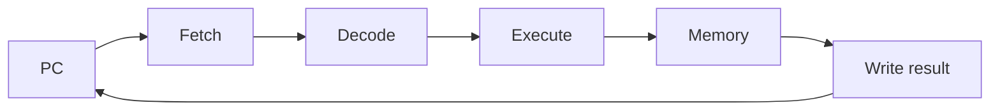

# SE-017 — CPU, instrucciones, registros y ciclos de ejecución

[← SE-016](../../classes/part-01-computadores-y-representacion-de-informacion/se-016-enteros-coma-flotante-precision-y-errores-numericos/README.md) · [↑ Parte 01](../../classes/part-01-computadores-y-representacion-de-informacion/README.md) · [📚 Índice completo](../../classes/README.md) · [SE-018 →](../../classes/part-01-computadores-y-representacion-de-informacion/se-018-memoria-caches-almacenamiento-y-jerarquias/README.md)

> Estado: **PLANNED** · Borrador público conservado íntegramente y sometido a auditoría técnica y pedagógica.

## Punto profesional y fundamento pedagógico

**Punto profesional.** La clase existe para explicar instrucciones como transiciones de estado sin confundir bytecode con ISA.

**Por qué aparece aquí.** Se sitúa después de **Enteros, coma flotante, precisión y errores numéricos** y antes de **Memoria, cachés, almacenamiento y jerarquías**: convierte el conocimiento anterior en una decisión observable que la clase siguiente podrá reutilizar. La continuidad se comprueba en el artefacto, no por compartir vocabulario.

**Error conceptual que debe corregir.** Leer la salida de dis como ensamblador o convertir bytecodes en ciclos de CPU.

**Secuencia de aprendizaje.** Antes de leer la solución, el estudiante predice el resultado del caso normal y del error conceptual anterior. Luego explica un caso resuelto paso a paso, construye un contraejemplo que cambie la decisión y, sin consultar el texto, reconstruye el mecanismo y lo aplica a una entrada nueva. La secuencia usa predicción, explicación propia, contraste y recuperación. [ICAP](https://icap.education.asu.edu/research) distingue participación de construcción de conocimiento; [How People Learn II](https://nap.nationalacademies.org/catalog/24783/how-people-learn-ii-learners-contexts-and-cultures) exige conectar conocimiento previo, contexto y transferencia; la [práctica de recuperación](https://pubmed.ncbi.nlm.nih.gov/16507066/) respalda producir de nuevo la explicación tras una demora; y [Education for Life and Work](https://nap.nationalacademies.org/resource/13398/dbasse_084153.pdf) exige devolución que explique la causa del error.

**Evidencia de aprendizaje.** Execution-trace.md con estados antes/después y la frontera VM↔ISA. Debe contener predicción previa, observación, explicación causal, contraejemplo, criterio de aceptación y una nota de qué dato haría cambiar la conclusión.

**Límite de la conclusión.** Sin código nativo y contadores no se afirman instrucciones físicas ni ciclos.

### Trazabilidad fuente → afirmación

| Fuente primaria u oficial | Afirmación que respalda | Lo que no prueba |
|---|---|---|
| [RISC-V Unprivileged ISA](https://docs.riscv.org/reference/isa/unpriv/) |  define instrucciones y estado arquitectónico | No demuestra por sí sola que el artefacto del estudiante sea correcto. |
| [Python `dis`](https://docs.python.org/3/library/dis.html) |  documenta bytecode específico de CPython y su carácter cambiante | No demuestra por sí sola que el artefacto del estudiante sea correcto. |

## Antes de empezar

`SE-016` explicó qué representan los operandos. Ahora seguirás cómo una CPU cambia
estado al cargar, operar, comparar y saltar. Pulso aporta una suma sencilla; la clase la
convierte en una traza arquitectónica. `SE-018` añadirá el costo de obtener los datos.

## Prerrequisitos

Bits, hexadecimal, enteros y mapa de capas de `SE-013`–`SE-016`.

## Problema auténtico

Un equipo atribuye un retraso al “número de instrucciones” observado en bytecode. Pero
bytecode, instrucciones de ISA y operaciones internas no son la misma unidad. Optimiza
una métrica que no corresponde al procesador.

## Objetivos observables

Distinguirás ISA de microarquitectura; explicarás registros, contador de programa,
load/store, ALU y saltos; trazarás estado arquitectónico; y limitarás inferencias sobre
pipeline o ciclos.

## Temas y por qué importan

| Tema | Mecanismo | Por qué importa |
| --- | --- | --- |
| ISA | define operaciones y estado visibles | sostiene compatibilidad binaria |
| Registros y PC | conservan operandos y próxima instrucción | permiten seguir ejecución |
| Ciclo de instrucción | obtiene, decodifica y aplica efectos | conecta programa con transiciones |
| Microarquitectura | solapa y reordena trabajo internamente | explica rendimiento sin cambiar semántica |

## Mapa conceptual

Es un modelo lógico. Una implementación puede solapar etapas, ejecutar fuera de orden
y retirar resultados en orden; no debe leerse como un ciclo físico universal.

## Conceptos y decisiones

### 1. La ISA es el contrato, no el diagrama interno

Una ISA define instrucciones, registros, formatos y efectos observables. La misma ISA
puede tener implementaciones simples, segmentadas o fuera de orden. El software confía
en el resultado arquitectónico, no en cada señal interna.

### 2. Los registros sostienen el estado inmediato

Registros generales guardan operandos y resultados de acceso rápido. El contador de
programa localiza la siguiente instrucción; otros registros representan estado de
control. Su cantidad y reglas pertenecen a la ISA. “Variable” no significa “registro”:
compilador y runtime deciden ubicación y pueden moverla.

### 3. Load/store separa cálculo y acceso a memoria

En una ISA RISC típica, instrucciones load traen datos, la ALU opera registros y store
escribe. Direcciones, alineación y permisos pueden producir excepciones. Una suma de
alto nivel implica además comprobaciones, representación de objetos y llamadas según
lenguaje y runtime.

### 4. Saltos convierten condiciones en control

Comparaciones y branches cambian el PC. Bucles y decisiones surgen de esas transiciones.
Una predicción de salto intenta mantener ocupada la máquina; si falla, descarta trabajo
especulativo. La semántica correcta permanece, pero tiempo y efectos laterales
microarquitectónicos requieren análisis aparte.

### 5. Pipeline, ejecución fuera de orden y retiro

Solapar instrucciones mejora throughput cuando no existen dependencias. La CPU puede
ejecutar operaciones listas antes que otras y retirar resultados de manera que el
estado visible respete el contrato. Contar instrucciones no basta para predecir ciclos:
dependencias, memoria, unidades y predicción influyen.

## Caso conductor: sumar dos contadores de Pulso

La traza didáctica usa `LOAD r1,[a]`, `LOAD r2,[b]`, `ADD r3,r1,r2`, `STORE [c],r3`.
Para cada paso registra PC, registros y memoria afectada. Después marca qué aspectos no
conoce: caché, latencia, instrucciones generadas realmente y optimizaciones.

## Definiciones de trabajo

- **instrucción:** operación definida por una ISA;
- **registro:** almacenamiento nombrado visible para la ISA;
- **PC:** estado que identifica la próxima instrucción;
- **pipeline:** solapamiento de etapas;
- **retiro:** compromiso de resultados al estado arquitectónico.

## Glosario

**Opcode** identifica operación. **Operando** aporta datos. **Hazard** es una condición
que impide avanzar sin control. **Excepción** transfiere control por un evento síncrono.

## Ejemplo mínimo

`ADD r3,r1,r2` cambia `r3`, no memoria. Si `r1=2` y `r2=3`, el nuevo estado visible es
`r3=5`; la cantidad de transistores activados no forma parte del contrato.

## Ejemplo profesional

Dos procesadores ejecutan el mismo binario con tiempos distintos. La corrección se
evalúa por ISA/ABI; el rendimiento se mide por entorno. No se cambia algoritmo basándose
solo en frecuencia anunciada.

## Práctica guiada

1. Crea `trace.md` con ocho posiciones de memoria, cuatro registros y PC.
2. Ejecuta manualmente la secuencia de Pulso y anota pre/postestado.
3. Añade comparación y salto para manejar contador cero.
4. Introduce dirección inválida y describe excepción sin inventar manejo del SO.
5. Compara la traza con `dis.dis` de una función Python y explica por qué no son equivalentes.
6. Entrega `isa-model.md`, `trace.md`, `limits.md`.

## Ejercicios

1. Identifica dependencias de datos en cinco instrucciones.
2. Explica por qué más instrucciones pueden tardar menos en otra CPU.
3. Diseña un contraejemplo a “cada línea ejecuta una instrucción”.

## Reto verificable

Otra persona reproduce la traza y obtiene el mismo estado final. Debe distinguir tres
hechos de la ISA y tres incógnitas de microarquitectura.

## Preguntas frecuentes

### ¿Fetch–decode–execute describe cualquier CPU?
Es un modelo útil; no prescribe organización física ni número de ciclos.

### ¿Bytecode es ensamblador?
Es un conjunto de instrucciones para una máquina virtual, no necesariamente la ISA física.

## Fallo controlado y diagnóstico

Cambia un salto para usar la condición opuesta. Registra PC y primer estado divergente;
corrige la condición, no el resultado final a mano.

## Errores comunes y cómo corregirlos

| Síntoma | Causa | Corrección |
| --- | --- | --- |
| variable = registro | abstracciones mezcladas | documenta decisiones de compilador/runtime |
| una instrucción = un ciclo | modelo simplificado literal | separa ISA y microarquitectura |
| `dis` se presenta como código nativo | VM confundida con CPU | etiqueta el nivel de instrucción |
| traza solo muestra resultados | transiciones invisibles | registra preestado, operación y postestado |

## Entorno y archivos clave

Markdown y Python `dis`; `isa-model.md`, `trace.md`, `limits.md`. Sin ensamblador ejecutable.

## Seguridad, ética y accesibilidad

No ejecutes binarios ni uses contadores privilegiados. Describe el diagrama en texto y
no uses rendimiento supuesto para excluir hardware accesible.

## Transferencia

Compara una instrucción RISC-V documentada con bytecode de JVM o Python y delimita contratos.

## Evaluación y evidencia

Se exigen traza reproducible, dependencias, excepción y límites de microarquitectura.

## Fuentes

- [RISC-V Unprivileged ISA](https://docs.riscv.org/reference/isa/unpriv/) define instrucciones y estado arquitectónico.
- [Python `dis`](https://docs.python.org/3/library/dis.html) documenta bytecode específico de CPython y su carácter cambiante.

## Límites y siguiente paso

No mide ciclos físicos ni cubre ensamblador completo. `SE-018` añade jerarquías y localidad.

---
[← SE-016](../../classes/part-01-computadores-y-representacion-de-informacion/se-016-enteros-coma-flotante-precision-y-errores-numericos/README.md) · [↑ Parte 01](../../classes/part-01-computadores-y-representacion-de-informacion/README.md) · [SE-018 →](../../classes/part-01-computadores-y-representacion-de-informacion/se-018-memoria-caches-almacenamiento-y-jerarquias/README.md)
