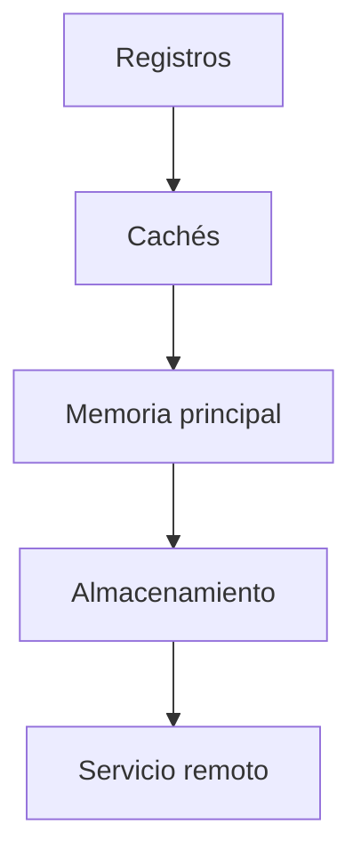

# SE-018 — Memoria, cachés, almacenamiento y jerarquías

[← SE-017](../../classes/part-01-computadores-y-representacion-de-informacion/se-017-cpu-instrucciones-registros-y-ciclos-de-ejecucion/README.md) · [↑ Parte 01](../../classes/part-01-computadores-y-representacion-de-informacion/README.md) · [📚 Índice completo](../../classes/README.md) · [SE-019 →](../../classes/part-01-computadores-y-representacion-de-informacion/se-019-procesos-hilos-interrupciones-y-entrada-salida/README.md)

> Estado: **GUIDED**. Las mediciones observan el proceso y no identifican una caché física sin instrumentación adicional.

## Antes de empezar

La traza de `SE-017` trató los accesos como pasos simples. En una máquina real, traer un
dato puede costar mucho más que operar con él. Pulso procesará colecciones con distinto
orden para estudiar localidad y conjunto de trabajo sin atribuir causas que la
biblioteca estándar no mide.

## Prerrequisitos

Instrucciones load/store, medición crítica de `SE-006` y Python 3.11+.

## Problema auténtico

Un cambio reduce operaciones aritméticas y empeora tiempo porque dispersa accesos y
aumenta asignaciones. El equipo cuenta instrucciones conceptuales, pero omite la ruta
de los datos.

## Objetivos observables

Explicarás jerarquía, latencia, capacidad y persistencia; relacionarás localidad con
caché; distinguirás memoria virtual y física; medirás un patrón sin sobreatribuir causa.

## Temas y por qué importan

| Tema | Mecanismo | Por qué importa |
| --- | --- | --- |
| Jerarquía | combina niveles rápidos/pequeños y lentos/grandes | acerca datos con costo razonable |
| Localidad | reutiliza datos cercanos en tiempo o espacio | hace eficaces cachés y páginas |
| Memoria virtual | mapea direcciones del proceso | aporta aislamiento y flexibilidad |
| Persistencia | conserva datos más allá del proceso | cambia garantías de escritura y recuperación |

## Mapa conceptual

Al descender suele crecer capacidad y latencia. Es una tendencia, no una tabla de
tiempos universal; hardware, sistema y carga cambian los valores.

## Conceptos y decisiones

### 1. La jerarquía explota diferencias de costo

No existe un único “lugar de memoria”. Registros, cachés, RAM y almacenamiento ofrecen
combinaciones distintas de latencia, ancho de banda, capacidad, costo y persistencia.
El sistema mueve copias y mantiene coherencia según contratos. Un acceso lógico puede
resolverse en varios niveles.

### 2. Localidad predice reutilización, no garantiza un hit

Localidad temporal significa volver a datos recientes; espacial, acceder a direcciones
cercanas. Cachés transfieren líneas, por lo que recorrer datos contiguos suele aprovechar
espacio. El resultado depende de representación, tamaño, asociatividad, otros procesos
y prefetch. Medir un patrón no prueba cuál mecanismo dominó.

### 3. Conjunto de trabajo conecta algoritmo y capacidad

El conjunto de trabajo es la información activamente reutilizada durante un intervalo.
Cuando deja de caber en un nivel, aumentan reemplazos y accesos al siguiente. Reducirlo
puede mejorar rendimiento más que reducir una operación aislada. Debe medirse con
tamaños progresivos y múltiples repeticiones.

### 4. Memoria virtual crea un espacio por proceso

Las direcciones que ve Pulso son virtuales. El sistema y hardware traducen páginas a
memoria física o manejan ausencia. Esto permite aislamiento, compartición controlada y
espacios mayores que RAM, pero un acceso puede provocar page fault. Una dirección
impresa no revela ubicación física estable.

### 5. Guardar no siempre significa persistir físicamente

Bibliotecas y sistema almacenan buffers; el dispositivo puede tener caché. Cerrar,
vaciar y sincronizar poseen garantías diferentes. Una aplicación debe definir si basta
entregar datos al sistema o si requiere durabilidad ante fallo, y aceptar el costo.

## Caso conductor: recorrer eventos de Pulso

Pulso compara una lista recorrida secuencialmente con índices barajados. El experimento
mantiene datos y operación, varía orden, prueba varios tamaños y registra distribución.
La conclusión correcta es “patrón compatible con efectos de localidad bajo este
entorno”; no “medimos la caché L2”.

## Definiciones de trabajo

- **latencia:** tiempo hasta completar una operación;
- **ancho de banda:** cantidad transferida por unidad de tiempo;
- **localidad:** tendencia de reutilización temporal o espacial;
- **página:** unidad de mapeo de memoria virtual;
- **persistencia:** conservación más allá del proceso o fallo definido.

## Glosario

**Cache hit/miss** indica si un nivel satisface acceso. **Working set** es conjunto
activo. **Page fault** requiere intervención para resolver una página.

## Ejemplo mínimo

Acceder diez veces al mismo elemento tiene localidad temporal. Recorrer una lista
contigua tiene espacial; saltar aleatoriamente reduce predictibilidad aunque haga la
misma suma.

## Ejemplo profesional

Un índice acelera búsqueda y aumenta memoria y escrituras. La decisión compara carga
real y conjunto de trabajo, no asume que “más caché siempre mejora”.

## Práctica guiada

1. Crea `memory_probe.py` con recorridos secuencial y barajado.
2. Usa tamaños progresivos, semilla fija y `time.perf_counter_ns()`.
3. Ejecuta varias rondas y conserva todas las muestras.
4. Usa `tracemalloc` para pico de asignación Python, etiquetándolo como tal.
5. Registra procesos de fondo y orden; alterna experimentos para reducir sesgo.
6. Entrega `hierarchy.md`, `samples.csv`, `analysis.md`.

## Ejercicios

1. Compara latencia y throughput con un ejemplo.
2. Diseña un algoritmo con mejor localidad sin cambiar resultado.
3. Explica cuándo `flush` no equivale a durabilidad total.

## Reto verificable

Otra persona repite el experimento y obtiene la misma tendencia o explica diferencias
con evidencia. Debe señalar al menos dos causas alternativas.

## Preguntas frecuentes

### ¿Más RAM hace más rápida cualquier aplicación?
No; ayuda si evita presión relevante, pero no corrige CPU, I/O o algoritmos dominantes.

### ¿Puedo medir caché con este script?
Observas tiempo compatible con varios mecanismos; medir eventos requiere herramientas específicas.

## Fallo controlado y diagnóstico

Ejecuta una sola vez el caso secuencial primero. Luego alterna orden y repite. Documenta
cómo calentamiento y orden cambiaron la inferencia.

## Errores comunes y cómo corregirlos

| Síntoma | Causa | Corrección |
| --- | --- | --- |
| “RAM” para toda jerarquía | niveles confundidos | declara nivel y garantía |
| tiempo atribuido a caché concreta | instrumento insuficiente | expresa hipótesis y alternativas |
| promedio único | variación oculta | conserva distribución y contexto |
| `write()` se presenta como duradero | buffers omitidos | define flush, sync y fallo considerado |

## Entorno y archivos clave

Python 3.11+, `random`, `time`, `tracemalloc`; sin paquetes ni archivos grandes. Elimina muestras al terminar si no se conservan como evidencia.

## Seguridad, ética y accesibilidad

Limita tamaños para no presionar el equipo. Informa unidades y ofrece tabla además de
gráfico. No conviertas hardware modesto en culpa del usuario sin medir requisitos.

## Transferencia

Repite con lectura de archivo y separa caché de aplicación, sistema y dispositivo como hipótesis.

## Evaluación y evidencia

Se exigen diseño controlado, muestras, causas alternativas y límite instrumental.

## Fuentes

- [Python `tracemalloc`](https://docs.python.org/3/library/tracemalloc.html) define la memoria Python observable.
- [RISC-V memory model](https://docs.riscv.org/reference/isa/unpriv/rvwmo.html) muestra que orden de memoria también es contrato arquitectónico.
- [Python `os`](https://docs.python.org/3/library/os.html) documenta interfaces de archivo y `fsync`.

## Límites y siguiente paso

No perfila cachés físicas ni NUMA. `SE-019` explica procesos, hilos e I/O que compiten por recursos.

---
[← SE-017](../../classes/part-01-computadores-y-representacion-de-informacion/se-017-cpu-instrucciones-registros-y-ciclos-de-ejecucion/README.md) · [↑ Parte 01](../../classes/part-01-computadores-y-representacion-de-informacion/README.md) · [SE-019 →](../../classes/part-01-computadores-y-representacion-de-informacion/se-019-procesos-hilos-interrupciones-y-entrada-salida/README.md)
