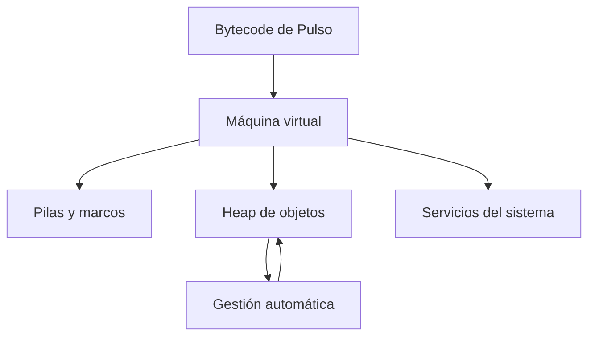

# SE-021 — Runtimes, máquinas virtuales y recolección de basura

[← SE-020](../../classes/part-01-computadores-y-representacion-de-informacion/se-020-compilacion-interpretacion-bytecode-y-jit/README.md) · [↑ Parte 01](../../classes/part-01-computadores-y-representacion-de-informacion/README.md) · [📚 Índice completo](../../classes/README.md) · [SE-022 →](../../classes/part-01-computadores-y-representacion-de-informacion/se-022-rendimiento-consumo-energetico-y-limites-fisicos/README.md)

> Estado: **GUIDED**. Observa CPython 3.11+ y contrasta con una VM especificada; no generaliza su gestor de memoria a todos los runtimes.

## Antes de empezar

`SE-020` dejó Pulso convertido a AST y bytecode. Esas representaciones necesitan un
entorno que cargue módulos, cree objetos, maneje llamadas y errores y administre memoria.
Hoy estudiarás ese runtime. `SE-022` medirá sus costos sin confundirlos con el algoritmo.

## Prerrequisitos

Proceso, pila conceptual, bytecode e incertidumbre de medición (`SE-019`–`SE-020`).

## Problema auténtico

La memoria de un servicio crece y el equipo concluye “el garbage collector tiene una
fuga”. Puede existir retención alcanzable, caché intencional, fragmentación o memoria
nativa. Forzar colecciones reduce momentáneamente una señal sin explicar la causa.

## Objetivos observables

Explicarás servicios de runtime, pila y heap; distinguirás especificación de VM e
implementación; compararás conteo de referencias y trazado; observarás asignación y
alcanzabilidad; separarás memoria de recursos externos.

## Temas y por qué importan

| Tema | Mecanismo | Por qué importa |
| --- | --- | --- |
| Runtime | implementa servicios no escritos en cada programa | sostiene tipos, errores y carga |
| VM | define una máquina abstracta | desacopla lenguaje y hardware |
| Pila/heap | separan llamadas y objetos de vida variable | orientan diagnóstico de memoria |
| Recolección | recupera objetos inalcanzables | intercambia pausas, throughput y memoria |

## Mapa conceptual

El mapa separa áreas lógicas. Una especificación puede no imponer su ubicación física ni algoritmo de GC.

## Conceptos y decisiones

### 1. El runtime hace visible una semántica

Un runtime implementa representación de valores, llamadas, excepciones, carga,
resolución de nombres, asignación y otras convenciones. Puede incluir intérprete, JIT,
bibliotecas y enlaces nativos. Su trabajo explica por qué dos implementaciones del mismo
lenguaje pueden tener perfiles distintos sin violar la semántica.

### 2. Una máquina virtual es un contrato abstracto

La JVM especifica tipos, class files, instrucciones y áreas de ejecución, pero deja a la
implementación políticas como el algoritmo de recolección. CPython tiene una máquina de
bytecode propia con detalles distintos. “Corre en una VM” no informa automáticamente
aislamiento de seguridad, portabilidad total ni costo.

### 3. Marcos y heap expresan vidas diferentes

Cada llamada crea estado lógico: parámetros, locales, retorno y operandos. Objetos cuya
vida no coincide con una llamada se asignan en un heap administrado. Optimización puede
evitar o mover asignaciones, por lo que este modelo orienta razonamiento pero no prueba
ubicación física de cada valor.

### 4. Recolectar significa demostrar inalcanzabilidad según un modelo

Conteo de referencias recupera cuando el conteo llega a cero, pero ciclos requieren
otro mecanismo. Un recolector por trazado parte de raíces y marca alcanzables; los demás
pueden recuperarse. Hipótesis generacionales usan el patrón de que muchos objetos mueren
jóvenes. Cada estrategia intercambia pausas, memoria, CPU y complejidad.

### 5. Memoria automática no administra todos los recursos

Un archivo, socket o transacción tiene vida externa. Que un objeto quede inalcanzable no
garantiza cierre oportuno. Se usan context managers y cierre explícito. Finalizadores
pueden ejecutarse tarde o bajo restricciones y no sustituyen propiedad clara.

## Caso conductor: objetos temporales de Pulso

Pulso crea miles de diccionarios temporales al parsear eventos. `tracemalloc` compara
dos versiones: conservar todos en una lista y procesar en streaming. La primera mantiene
referencias alcanzables; llamar `gc.collect()` no debe liberarlas. El rediseño reduce
retención y conserva el resultado.

## Definiciones de trabajo

- **runtime:** servicios que implementan ejecución de un lenguaje;
- **máquina virtual:** arquitectura abstracta ejecutada por software o hardware;
- **raíz:** referencia inicial para un trazado de alcanzabilidad;
- **objeto alcanzable:** objeto conectado desde raíces según referencias;
- **finalización:** acción asociada al fin de vida, no garantía de liberación inmediata.

## Glosario

**Heap** almacena objetos de vida dinámica. **Frame** representa una llamada. **Pause**
es intervalo de trabajo del recolector que puede afectar la aplicación.

## Ejemplo mínimo

Dos objetos se referencian mutuamente. Quitar nombres externos deja un ciclo: conteo de
referencias solo no llega a cero; un recolector de ciclos puede detectarlo.

## Ejemplo profesional

Un servicio guarda respuestas en una caché sin límite. Los objetos son alcanzables; no
es fallo del GC. Se define tamaño, expiración, métrica y comportamiento al saturarse.

## Práctica guiada

1. Crea `runtime_probe.py` con objetos temporales y una versión que los retiene.
2. Mide instantáneas con `tracemalloc`; registra versión y tamaño de entrada.
3. Usa `gc.get_count()` y `gc.collect()` solo como observación documentada.
4. Explica por qué la lista retenida impide liberar.
5. Abre un archivo con `with` y contrasta vida del recurso con la del objeto.
6. Entrega `object-lifecycle.md`, `snapshots.txt`, `runtime_probe.py`.

## Ejercicios

1. Dibuja raíces y objetos de un ciclo.
2. Compara una pausa corta frecuente con otra larga infrecuente según carga.
3. Explica por qué una VM no es necesariamente un sandbox.

## Reto verificable

Otra persona identifica qué objetos permanecen alcanzables y reproduce la diferencia de
pico. Debe proponer dos explicaciones alternativas antes de culpar al GC.

## Preguntas frecuentes

### ¿`del` libera memoria inmediatamente?
Elimina una referencia; el efecto depende de referencias restantes, runtime y asignador.

### ¿GC elimina fugas?
Recupera objetos inalcanzables; una referencia olvidada conserva el objeto legítimamente.

## Fallo controlado y diagnóstico

Retén objetos en una lista global y fuerza GC. Registra que siguen alcanzables, elimina
la causa y vuelve a medir. No uses entradas capaces de agotar memoria.

## Errores comunes y cómo corregirlos

| Síntoma | Causa | Corrección |
| --- | --- | --- |
| toda memoria creciente = fuga GC | causas no separadas | inspecciona alcanzabilidad, caché y memoria nativa |
| `del` = liberación física | niveles confundidos | habla de referencias y política del runtime |
| finalizador para cerrar recursos | oportunidad no garantizada | usa propiedad y context manager |
| VM = seguridad | abstracción confundida con aislamiento | evalúa permisos y sandbox real |

## Entorno y archivos clave

Python 3.11+, `gc`, `tracemalloc`; entradas acotadas. Limpieza: cerrar recursos y eliminar `work/SE-021/`.

## Seguridad, ética y accesibilidad

No fuerces agotamiento ni inspecciones datos sensibles en snapshots. Publica tablas textuales y unidades.

## Transferencia

Lee la JVM Specification y separa lo prescrito de la política de un recolector concreto.

## Evaluación y evidencia

Se exigen grafo de alcanzabilidad, medición acotada, manejo de recurso y límites.

## Fuentes

- [Python `gc`](https://docs.python.org/3/library/gc.html) y [`tracemalloc`](https://docs.python.org/3/library/tracemalloc.html) definen observaciones usadas.
- [JVM Specification, Run-Time Data Areas](https://docs.oracle.com/javase/specs/jvms/se25/html/jvms-2.html#jvms-2.5) distingue contrato y algoritmo no prescrito.

## Límites y siguiente paso

No perfila memoria nativa ni compara recolectores productivos. `SE-022` diseña mediciones de rendimiento y energía.

---
[← SE-020](../../classes/part-01-computadores-y-representacion-de-informacion/se-020-compilacion-interpretacion-bytecode-y-jit/README.md) · [↑ Parte 01](../../classes/part-01-computadores-y-representacion-de-informacion/README.md) · [SE-022 →](../../classes/part-01-computadores-y-representacion-de-informacion/se-022-rendimiento-consumo-energetico-y-limites-fisicos/README.md)
