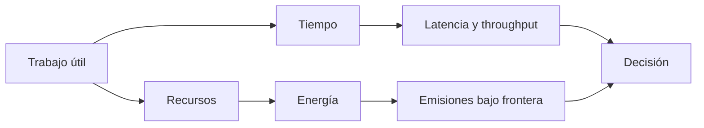

# SE-022 — Rendimiento, consumo energético y límites físicos

[← SE-021](../../classes/part-01-computadores-y-representacion-de-informacion/se-021-runtimes-maquinas-virtuales-y-recoleccion-de-basura/README.md) · [↑ Parte 01](../../classes/part-01-computadores-y-representacion-de-informacion/README.md) · [📚 Índice completo](../../classes/README.md) · [SE-023 →](../../classes/part-01-computadores-y-representacion-de-informacion/se-023-taller-observar-un-programa-desde-el-codigo-hasta-la-maquina/README.md)

## Punto profesional y fundamento pedagógico

**Punto profesional.** La clase existe para formular afirmaciones de rendimiento y energía con unidad funcional, protocolo, variación y frontera.

**Por qué aparece aquí.** Se sitúa después de **Runtimes, máquinas virtuales y recolección de basura** y antes de **Taller: observar un programa desde el código hasta la máquina**: convierte el conocimiento anterior en una decisión observable que la clase siguiente podrá reutilizar. La continuidad se comprueba en el artefacto, no por compartir vocabulario.

**Error conceptual que debe corregir.** Concluir que más rápido significa menor energía o comparar sin calentamiento.

**Secuencia de aprendizaje.** Define primero unidad funcional, oráculo de corrección, orden de ejecución y número de muestras. Alterna variantes, conserva datos crudos y decide de antemano cómo resumir variación. Luego intenta —y rechaza— inferir energía desde duración, indicando qué sensor, modelo y frontera serían necesarios.

**Evidencia de aprendizaje.** Performance-report.md con datos crudos, dispersión, unidad funcional y afirmaciones permitidas. Debe contener predicción previa, observación, explicación causal, contraejemplo, criterio de aceptación y una nota de qué dato haría cambiar la conclusión.

**Límite de la conclusión.** Sin sensor o modelo validado no se infiere consumo energético.

### Trazabilidad fuente → afirmación

| Fuente primaria u oficial | Afirmación que respalda | Lo que no prueba |
|---|---|---|
| [Python `time`](https://docs.python.org/3/library/time.html) |  y [`timeit`](https://docs.python.org/3/library/timeit.html) definen los relojes | No demuestra por sí sola que el artefacto del estudiante sea correcto. |
| [Software Carbon Intensity](https://greensoftware.foundation/standards/sci/) |  define frontera, energía, hardware y unidad funcional | No demuestra por sí sola que el artefacto del estudiante sea correcto. |

## Antes de empezar

El analizador local de eventos ya tiene representación, ejecución y runtime. Ahora responderás “¿es más
eficiente?” sin reducir la pregunta a un cronómetro. Definirás trabajo útil, carga,
latencia, throughput, recursos y frontera energética. `SE-023` aplicará el protocolo a
todo el recorrido.

## Prerrequisitos

Evidencia de `SE-006`, jerarquía de `SE-018`, runtime de `SE-021`, Python 3.11+.

## Problema auténtico

Una versión tarda 20 % menos en una corrida. Cambió el orden, la caché estaba caliente y
procesó menos datos válidos. La cifra mezcla rendimiento, corrección y ruido.

## Objetivos observables

Definirás carga y métrica; separarás latencia, throughput y utilización; diseñarás
benchmark repetible; aplicarás razonamiento de cuello de botella; delimitarás energía y emisiones.

## Temas y por qué importan

| Tema | Mecanismo | Por qué importa |
| --- | --- | --- |
| Métrica y carga | fijan qué trabajo se compara | evita optimizaciones irrelevantes |
| Variación | entorno y calentamiento alteran muestras | obliga a distribuciones y control |
| Cuello de botella | limita mejora del sistema completo | orienta esfuerzo donde cambia resultado |
| Energía y carbono | amplían frontera a electricidad y hardware | evita equiparar rapidez con sostenibilidad |
## Mapa conceptual

Tiempo, energía y emisiones se relacionan pero no son intercambiables. La intensidad de
la red y el hardware incorporado requieren datos adicionales.

## Conceptos y decisiones

### 1. Rendimiento empieza por trabajo útil y condiciones

Latencia mide cuánto tarda una unidad; throughput, cuántas se completan por tiempo;
utilización, cuánto ocupa un recurso. Mejorar una puede empeorar otra. La carga incluye
tamaño, distribución, concurrencia, estado y criterio de corrección. Comparar versiones
que producen resultados distintos no es benchmark.

### 2. Los relojes observan fronteras distintas

`perf_counter` mide tiempo transcurrido adecuado para duraciones; `process_time` mide
CPU del proceso. Ninguno explica por sí solo causa. Se registran versión, hardware
expuesto, carga, procesos relevantes y política de energía cuando esté disponible sin modificarla.

### 3. Calentamiento, ruido y distribución cambian la conclusión

Carga de módulos, cachés, JIT o frecuencia dinámica alteran primeras rondas. Se decide
si arranque forma parte del uso; no siempre debe descartarse. Múltiples muestras, orden
alternado, mediana y colas muestran variación. Eliminar outliers requiere regla previa y causa.

### 4. Acelerar una fracción tiene un límite sistémico

Si una parte representa una fracción pequeña, incluso eliminarla no acelera todo en la
misma proporción. Este razonamiento, relacionado con la ley de Amdahl, evita optimizar
lo visible y pequeño. Primero se perfila; luego se cambia una variable; finalmente se
verifica que no aumentó memoria, error o costo operativo.

### 5. Energía no se deriva automáticamente del tiempo

Energía depende de potencia a lo largo del tiempo, hardware y actividad. Un programa
más rápido puede usar más potencia y aun consumir menos o más energía. Emisiones añaden
intensidad de carbono y hardware incorporado. SCI exige una frontera y unidad funcional.
Sin medidor fiable, se reporta tiempo/recursos observados y se declara energía no medida.

### 6. Los límites físicos orientan, no excusan

Movimiento de datos, disipación y paralelismo tienen costos. Frecuencia no crece sin
límites térmicos y energéticos. La respuesta de software incluye reducir trabajo,
reutilizar, elegir representación y evitar transferencias; no asumir que el siguiente hardware resolverá todo.

## Caso conductor: comparar dos parsers del analizador local de eventos

Una versión materializa todos los eventos; otra procesa en streaming. Se verifica mismo
hash y conteo, luego se miden tiempo, CPU y pico Python para tres tamaños. Se declara que
energía no fue medida. La decisión considera memoria y latencia de arranque, no solo la mediana.

## Definiciones de trabajo

- **latencia:** tiempo para una unidad de trabajo;
- **throughput:** unidades completadas por tiempo;
- **benchmark:** experimento comparativo bajo protocolo;
- **cuello de botella:** restricción dominante del resultado;
- **unidad funcional:** resultado respecto del cual se normaliza impacto.

## Glosario

**Warm-up** es transición inicial. **Baseline** es referencia. **Tail latency** describe
colas de distribución. **Potencia** es tasa; **energía**, acumulación en tiempo.

## Ejemplo mínimo

Dormir 100 ms eleva pared, no CPU. Un bucle eleva ambas. Ninguna observación entrega julios.

## Ejemplo profesional

Comprimir reduce red y aumenta CPU. En red lenta puede mejorar latencia y energía total;
en dispositivo limitado puede empeorar. Se mide el sistema bajo su unidad funcional.

## Práctica guiada

Usa como base el [laboratorio ejecutable de la Parte 01](https://github.com/vladimiracunadev-create/modern-software-engineering-program/tree/main/labs/part-01-machine-observer); trabaja sobre una copia o conserva tus salidas en el directorio `work/SE-022/`.

1. Define “procesar N eventos válidos y obtener hash H”.
2. Implementa materialización y streaming con mismo resultado.
3. Usa `timeit` o bucle controlado, alterna orden y conserva muestras.
4. Mide CPU y pico con instrumentos ya usados, uno por vez si interfieren.
5. Reporta mediana, rango y límites; no inventes energía.
6. Entrega `benchmark.py`, `protocol.md`, `samples.csv`, `decision.md`.

## Ejercicios

1. Da un caso donde baja latencia y baja throughput.
2. Calcula el límite de acelerar una fracción de 20 %.
3. Define frontera energética y unidad funcional para una carga por lotes.

## Reto verificable

Otra persona reproduce la comparación y verifica equivalencia funcional. Aprueba si
puede identificar carga, relojes, calentamiento, variación y conclusión no permitida.

## Preguntas frecuentes

### ¿La mediana basta?
No siempre; las colas pueden dominar experiencia o capacidad.

### ¿Menos CPU significa menos carbono?
No necesariamente; faltan tiempo, otros recursos, intensidad y hardware.

## Fallo controlado y diagnóstico

Compara una corrida fría de A con una caliente de B. Luego alterna y repite. Conserva
ambos resultados para mostrar cómo el método cambió la conclusión.

## Errores comunes y cómo corregirlos

| Síntoma | Causa | Corrección |
| --- | --- | --- |
| una corrida decide | variación ignorada | repite, alterna y reporta distribución |
| versión rápida procesa menos | trabajo útil no verificado | compara salida/invariantes antes del tiempo |
| tiempo = energía | frontera incompleta | mide energía o declara no medida |
| microbenchmark = producción | carga no representativa | limita conclusión y valida con contexto |

## Entorno y archivos clave

Python 3.11+, `time`, `timeit`, `tracemalloc`; entrada sintética y límites de tamaño. Limpieza de resultados temporales.

## Seguridad, ética y accesibilidad

No desactives controles térmicos ni satures equipos compartidos. Publica datos tabulares y no conviertas hardware costoso en prerrequisito educativo.

## Transferencia

Diseña el mismo protocolo para una función de red sin ejecutarla contra servicios externos.

## Evaluación y evidencia

Se exige equivalencia, protocolo, muestras, análisis de cuello y frontera energética honesta.

## Fuentes

- [Python `time`](https://docs.python.org/3/library/time.html) y [`timeit`](https://docs.python.org/3/library/timeit.html) definen los relojes.
- [Software Carbon Intensity](https://greensoftware.foundation/standards/sci/) define frontera, energía, hardware y unidad funcional.

## Límites y siguiente paso

No mide energía física ni simula producción. `SE-023` integra todas las observaciones en un taller vertical.

---
[← SE-021](../../classes/part-01-computadores-y-representacion-de-informacion/se-021-runtimes-maquinas-virtuales-y-recoleccion-de-basura/README.md) · [↑ Parte 01](../../classes/part-01-computadores-y-representacion-de-informacion/README.md) · [SE-023 →](../../classes/part-01-computadores-y-representacion-de-informacion/se-023-taller-observar-un-programa-desde-el-codigo-hasta-la-maquina/README.md)
