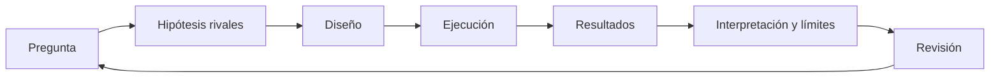

# SE-024 — Proyecto: informe reproducible de comportamiento y recursos

[← SE-023](../../classes/part-01-computadores-y-representacion-de-informacion/se-023-taller-observar-un-programa-desde-el-codigo-hasta-la-maquina/README.md) · [↑ Parte 01](../../classes/part-01-computadores-y-representacion-de-informacion/README.md) · [📚 Índice completo](../../classes/README.md) · [SE-025 →](../../classes/part-02-sistemas-operativos-terminal-y-automatizacion-base/se-025-windows-linux-macos-y-sus-modelos-operativos/README.md)

> Estado: **PLANNED** · Borrador público conservado íntegramente y sometido a auditoría técnica y pedagógica.

## Punto profesional y fundamento pedagógico

**Punto profesional.** La clase existe para convertir observaciones en un informe reproducible que otra persona pueda repetir y disputar.

**Por qué aparece aquí.** Se sitúa después de **Taller: observar un programa desde el código hasta la máquina** y antes de **Windows, Linux, macOS y sus modelos operativos**: convierte el conocimiento anterior en una decisión observable que la clase siguiente podrá reutilizar. La continuidad se comprueba en el artefacto, no por compartir vocabulario.

**Error conceptual que debe corregir.** Confundir reproducibilidad con capturas o correlación con causalidad.

**Secuencia de aprendizaje.** Antes de leer la solución, el estudiante predice el resultado del caso normal y del error conceptual anterior. Luego explica un caso resuelto paso a paso, construye un contraejemplo que cambie la decisión y, sin consultar el texto, reconstruye el mecanismo y lo aplica a una entrada nueva. La secuencia usa predicción, explicación propia, contraste y recuperación. [ICAP](https://icap.education.asu.edu/research) distingue participación de construcción de conocimiento; [How People Learn II](https://nap.nationalacademies.org/catalog/24783/how-people-learn-ii-learners-contexts-and-cultures) exige conectar conocimiento previo, contexto y transferencia; la [práctica de recuperación](https://pubmed.ncbi.nlm.nih.gov/16507066/) respalda producir de nuevo la explicación tras una demora; y [Education for Life and Work](https://nap.nationalacademies.org/resource/13398/dbasse_084153.pdf) exige devolución que explique la causa del error.

**Evidencia de aprendizaje.** Protocolo, datos crudos, script, checksum, informe y resultados no validados. Debe contener predicción previa, observación, explicación causal, contraejemplo, criterio de aceptación y una nota de qué dato haría cambiar la conclusión.

**Límite de la conclusión.** Un procedimiento reproducible no garantiza representatividad ni exactitud física.

### Trazabilidad fuente → afirmación

| Fuente primaria u oficial | Afirmación que respalda | Lo que no prueba |
|---|---|---|
| [Python documentation](https://docs.python.org/3/) | las APIs del proyecto | No demuestra por sí sola que el artefacto del estudiante sea correcto. |
| [Unicode Standard](https://www.unicode.org/versions/latest/) |  y [RISC-V specifications](https://docs.riscv.org/reference/isa/) respaldan los contratos elegidos | No demuestra por sí sola que el artefacto del estudiante sea correcto. |
| [Software Carbon Intensity](https://greensoftware.foundation/standards/sci/) |  delimita afirmaciones energéticas si el proyecto las considera | No demuestra por sí sola que el artefacto del estudiante sea correcto. |

## Antes de empezar

`SE-023` te dio un protocolo integrado. Ahora elegirás una pregunta acotada y defenderás
un informe que una persona pueda reproducir, cuestionar y extender. El resultado cierra
la Parte 01 y se convertirá en insumo de la Parte 02, donde aprenderás a preparar y
diagnosticar el entorno que hizo posibles las observaciones.

## Prerrequisitos

Dossier de `SE-023`, artefactos `SE-013`–`SE-022`, Git y Python 3.11+.

## Problema auténtico

Un informe afirma “la opción B usa menos recursos” sin definir carga, equivalencia,
entorno ni variación. Nadie puede repetirlo y el resultado se usa para decidir hardware.

## Objetivos observables

Formularás una pregunta contrastable; diseñarás dos hipótesis; construirás un caso
mínimo; conservarás datos y procedencia; interpretarás incertidumbre; y responderás una revisión adversarial.

## Temas y por qué importan

| Elemento | Función | Por qué importa |
| --- | --- | --- |
| Pregunta | delimita variable y decisión | evita medir sin propósito |
| Diseño | controla carga e invariantes | permite atribución prudente |
| Evidencia | conserva datos y entorno | hace posible reproducción |
| Discusión | separa resultado, inferencia y límite | impide generalización indebida |
## Mapa conceptual

La revisión vuelve a la pregunta porque puede descubrir que el experimento no la respondía.

## Conceptos y decisiones

### 1. Una buena pregunta conecta mecanismo y decisión

“¿Qué es más rápido?” es insuficiente. “Para archivos UTF-8 de 1–20 MB, ¿procesar en
streaming reduce pico de memoria Python sin aumentar más de 10 % la latencia bajo este
runtime?” fija carga, métricas y decisión. El umbral debe justificarse por contexto.

### 2. Hipótesis rivales evitan diseñar solo para confirmar

La hipótesis principal predice resultado y mecanismo; una rival ofrece explicación
alternativa, por ejemplo overhead de lectura frente a materialización. Se escribe qué
observación debilita cada una antes de ejecutar.

### 3. Reproducibilidad requiere procedencia completa

Se registran commit, versión, plataforma expuesta, entrada, semilla, comandos, orden,
repeticiones, salida y limpieza. Los datos crudos se conservan; el resumen se deriva.
La ausencia de hardware idéntico no invalida reproducción: obliga a comparar patrones y explicar diferencias.

### 4. Un resultado local no es una ley

El informe distingue: observamos X; bajo supuestos inferimos Y; no medimos Z. Se discuten
amenazas como calentamiento, instrumento, representatividad y cambios de runtime. Un
resultado inconcluso es válido si el método permite comprender por qué.

### 5. La revisión forma parte del producto

La persona revisora intenta ejecutar, cuestiona unidades e identifica afirmaciones que
exceden evidencia. El autor responde cambiando texto, diseño o conclusión y conserva el
desacuerdo. Aprobar no significa coincidir, sino que la cadena pueda inspeccionarse.

## Caso conductor: opciones de proyecto sobre el analizador local de eventos

Puedes investigar representación Unicode y tamaño, enteros/float y error, orden de
acceso y tiempo, materialización/streaming, o arranque/estado estable. Solo eliges una
pregunta. El resto sirve como control o límite, no como excusa para un informe enciclopédico.

## Definiciones de trabajo

- **variable independiente:** factor que se cambia deliberadamente;
- **variable respuesta:** observación comparada;
- **control:** condición mantenida o referencia;
- **amenaza a validez:** mecanismo que ofrece otra explicación;
- **procedencia:** cadena que permite rastrear evidencia.

## Glosario

**Raw data** son observaciones sin resumen. **Replication** repite método; **reproduction**
puede recalcular desde artefactos según convención declarada. Aquí se exige repetir el procedimiento documentado.

## Ejemplo mínimo

Pregunta, dos scripts equivalentes, diez muestras por tamaño y un límite explícito
constituyen mejor informe que cien métricas sin decisión.

## Ejemplo profesional

Un benchmark de librerías publica código, dataset permitido, versiones y resultados.
Evita nombres promocionales y permite que mantenedores expliquen diferencias.

## Práctica guiada

1. Escribe `proposal.md` con pregunta, decisión, hipótesis y riesgos.
2. Obtén revisión antes de ejecutar.
3. Construye el caso mínimo y pruebas de equivalencia.
4. Ejecuta con protocolo y guarda datos crudos en CSV/JSON.
5. Genera tabla resumen desde esos datos, no a mano.
6. Redacta método, resultados, discusión y límites.
7. Pide reproducción y registra cambios en `review.md`.
8. Verifica limpieza y entrega commit identificable.

## Ejercicios

1. Refuta una generalización de tu propio resultado.
2. Cambia una condición y predice antes de medir.
3. Escribe una decisión responsable si el resultado es inconcluso.

## Reto verificable

Un revisor clona o copia el directorio, ejecuta el comando documentado, obtiene salida
válida y puede recalcular la tabla. Debe señalar qué afirmación no puede extenderse a producción.

## Preguntas frecuentes

### ¿Debo obtener una mejora?
No. Se evalúa método, explicación y honestidad, no una dirección deseada.

### ¿Puedo instalar herramientas?
No son necesarias. Una herramienta opcional requiere versión, licencia, autorización y alternativa.

## Fallo controlado y diagnóstico

Omite deliberadamente la semilla o versión en un primer intento. Registra el fracaso de
reproducción y corrige el contrato; no borres la evidencia del aprendizaje.

## Errores comunes y cómo corregirlos

| Síntoma | Causa | Corrección |
| --- | --- | --- |
| pregunta amplia | decisión no delimitada | fija carga, variable, métrica y umbral |
| solo hay resumen | datos crudos ausentes | conserva y deriva automáticamente |
| variantes no equivalentes | resultado no verificado | prueba invariantes antes de medir |
| conclusión universal | contexto borrado | añade amenazas, límites y próxima prueba |

## Entorno y archivos clave

`proposal.md`, `src/`, `tests/`, `data/raw.csv`, `report.md`, `review.md`, `cleanup.md`; Python 3.11+ y biblioteca estándar.

## Seguridad, ética y accesibilidad

Datos sintéticos, carga acotada, sin identificadores de dispositivo innecesarios. El
reporte ofrece tablas y descripciones; respeta licencias y no desacredita proyectos por una prueba local.

## Transferencia

Reformula la pregunta para otro lenguaje o equipo y distingue qué parte del método permanece.

## Evaluación y evidencia

Aprueba con pregunta contrastable, equivalencia, datos crudos, reproducción, revisión y límites. No puntúa cantidad de gráficos.

## Fuentes

- [Python documentation](https://docs.python.org/3/) respalda las APIs del proyecto.
- [Unicode Standard](https://www.unicode.org/versions/latest/) y [RISC-V specifications](https://docs.riscv.org/reference/isa/) respaldan los contratos elegidos.
- [Software Carbon Intensity](https://greensoftware.foundation/standards/sci/) delimita afirmaciones energéticas si el proyecto las considera.

## Límites y siguiente paso

El proyecto no certifica hardware ni producción. `SE-025` empieza a estudiar cómo el sistema operativo ofrece y gobierna el entorno observado.

---
[← SE-023](../../classes/part-01-computadores-y-representacion-de-informacion/se-023-taller-observar-un-programa-desde-el-codigo-hasta-la-maquina/README.md) · [↑ Parte 01](../../classes/part-01-computadores-y-representacion-de-informacion/README.md) · [📚 Índice completo](../../classes/README.md) · [SE-025 →](../../classes/part-02-sistemas-operativos-terminal-y-automatizacion-base/se-025-windows-linux-macos-y-sus-modelos-operativos/README.md)
