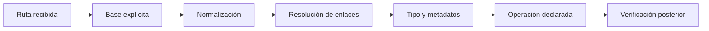
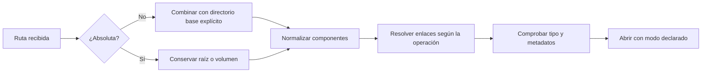

# SE-026 — Sistemas de archivos, rutas, enlaces y metadatos

[← SE-025](../../classes/part-02-sistemas-operativos-terminal-y-automatizacion-base/se-025-windows-linux-macos-y-sus-modelos-operativos/README.md) · [↑ Parte 02](../../classes/part-02-sistemas-operativos-terminal-y-automatizacion-base/README.md) · [📚 Índice completo](../../classes/README.md) · [SE-027 →](../../classes/part-02-sistemas-operativos-terminal-y-automatizacion-base/se-027-usuarios-grupos-permisos-y-elevacion-de-privilegios/README.md)

> Estado: **PLANNED** · Borrador público conservado íntegramente y sometido a auditoría técnica y pedagógica.

## Punto profesional y fundamento pedagógico

**Punto profesional.** La clase existe para razonar sobre identidad de archivos mediante rutas, enlaces, metadatos y resolución.

**Por qué aparece aquí.** Se sitúa después de **Windows, Linux, macOS y sus modelos operativos** y antes de **Usuarios, grupos, permisos y elevación de privilegios**: convierte el conocimiento anterior en una decisión observable que la clase siguiente podrá reutilizar. La continuidad se comprueba en el artefacto, no por compartir vocabulario.

**Error conceptual que debe corregir.** Equiparar nombre de ruta con identidad o tratar symlink como copia.

**Secuencia de aprendizaje.** Antes de leer la solución, el estudiante predice el resultado del caso normal y del error conceptual anterior. Luego explica un caso resuelto paso a paso, construye un contraejemplo que cambie la decisión y, sin consultar el texto, reconstruye el mecanismo y lo aplica a una entrada nueva. La secuencia usa predicción, explicación propia, contraste y recuperación. [ICAP](https://icap.education.asu.edu/research) distingue participación de construcción de conocimiento; [How People Learn II](https://nap.nationalacademies.org/catalog/24783/how-people-learn-ii-learners-contexts-and-cultures) exige conectar conocimiento previo, contexto y transferencia; la [práctica de recuperación](https://pubmed.ncbi.nlm.nih.gov/16507066/) respalda producir de nuevo la explicación tras una demora; y [Education for Life and Work](https://nap.nationalacademies.org/resource/13398/dbasse_084153.pdf) exige devolución que explique la causa del error.

**Evidencia de aprendizaje.** Filesystem-fixture.md con árbol temporal, enlaces, permisos y resolución paso a paso. Debe contener predicción previa, observación, explicación causal, contraejemplo, criterio de aceptación y una nota de qué dato haría cambiar la conclusión.

**Límite de la conclusión.** La semántica exacta depende del sistema de archivos y opciones de montaje.

### Trazabilidad fuente → afirmación

| Fuente primaria u oficial | Afirmación que respalda | Lo que no prueba |
|---|---|---|
| [The Open Group — Pathname Resolution](https://pubs.opengroup.org/onlinepubs/9799919799/basedefs/V1_chap04.html#tag_04_16) | define el contrato portable de procesos, rutas, entorno o shell que se contrasta entre sistemas | No demuestra por sí sola que el artefacto del estudiante sea correcto. |
| [Microsoft Learn — Naming Files, Paths, and Namespaces](https://learn.microsoft.com/windows/win32/fileio/naming-a-file) | documenta el comportamiento de Windows o PowerShell que se compara con el contrato POSIX | No demuestra por sí sola que el artefacto del estudiante sea correcto. |
| [Python documentation — pathlib](https://docs.python.org/3/library/pathlib.html) | define la semántica y los límites de la API de Python utilizada en el experimento | No demuestra por sí sola que el artefacto del estudiante sea correcto. |

## Antes de empezar

Faro ya sabe describir la plataforma. Su siguiente tarea parece trivial: encontrar `config.json`. En un equipo funciona con una ruta relativa; en otro, el proceso se inició desde un directorio diferente; en un tercero, la ruta cambia de mayúsculas y apunta a un enlace. La cadena de texto es parecida, pero la resolución no es la misma.

### Resultado de aprendizaje

Al terminar podrás explicar cómo se resuelve una ruta, distinguir nombre, contenido y metadatos, y diseñar operaciones de archivo que sean explícitas, seguras y verificables.

## Prerrequisitos

`SE-025`, distinción entre texto y bytes de `SE-015`, y una carpeta desechable. Debes poder identificar directorio de trabajo y plataforma sin elevar permisos.

## Problema auténtico

Pulso recibe `config/pulso.json` y funciona solo cuando se inicia desde el repositorio. Un acceso directo, servicio o tarea usa otro directorio y resuelve la misma cadena hacia un objeto distinto. El error se atribuye al archivo, aunque cambió el contexto de resolución.

## Objetivos observables

Podrás resolver rutas desde una base explícita; distinguir archivo, directorio y enlace; interpretar metadatos con límites; diseñar actualización segura; y demostrar por qué concatenar cadenas no modela un sistema de archivos.

## Temas y por qué importan

| Tema | Mecanismo | Decisión habilitada |
| --- | --- | --- |
| Espacio de nombres | vincula rutas con objetos | localizar sin depender de la sesión |
| Enlaces | introducen nombres alternativos y saltos | contener recorridos y limpiezas |
| Metadatos | describen tipo, tamaño, tiempos y acceso | contrastar hipótesis sin leer contenido |
| Actualización | combina apertura, escritura y reemplazo | evitar estados parciales |

## Mapa conceptual

La cadena se interpreta antes de abrir. Normalizar no autoriza; resolver no garantiza existencia; abrir no garantiza durabilidad. Cada flecha añade una condición distinta.

## Conceptos y decisiones

### Un sistema de archivos crea un espacio de nombres sobre almacenamiento

El archivo que una aplicación percibe no es simplemente “un bloque del disco”. El sistema de archivos relaciona nombres con objetos, organiza directorios y conserva metadatos como tipo, tamaño, marcas temporales y permisos. El kernel traduce operaciones de alto nivel a la implementación montada y, finalmente, al dispositivo o servicio remoto.

La abstracción permite que distintas tecnologías presenten operaciones semejantes, pero no garantiza idénticas reglas de nombres, sensibilidad a mayúsculas, durabilidad o bloqueo.

### Una ruta se interpreta desde un contexto

Una ruta absoluta parte de una raíz o volumen definido por la plataforma. Una ruta relativa parte del directorio de trabajo del proceso, no necesariamente del directorio donde está el script. Ese detalle causa muchos “funciona en mi máquina”.

Normalizar `.` y `..` no prueba que el objetivo exista ni que esté permitido. Resolver una ruta es una operación semántica; concatenar cadenas con `/` o `\` es apenas manipulación textual.

### Windows y POSIX modelan raíces de forma diferente

En sistemas POSIX, `/` encabeza un árbol único donde pueden montarse otros sistemas. Windows admite volúmenes, rutas UNC y prefijos con reglas propias. Las bibliotecas de rutas de un lenguaje modelan estas diferencias mejor que separadores escritos a mano.

No todo nombre válido en una plataforma lo es en otra. Tampoco debe asumirse sensibilidad o insensibilidad a mayúsculas solo por el nombre del sistema: depende del sistema de archivos y su configuración. Faro prueba el comportamiento que necesita o declara su requisito.

### Enlace simbólico y enlace físico no son copias

Un enlace simbólico almacena una referencia que puede quedar colgante si cambia el objetivo. Un enlace físico agrega otro nombre a un mismo objeto subyacente y suele estar limitado al mismo sistema de archivos. Borrar un nombre no necesariamente borra los datos si quedan otros enlaces o descriptores abiertos.

Seguir enlaces automáticamente puede escapar del directorio esperado. Una herramienta que limpia archivos debe resolver y validar el destino antes de modificarlo; comparar prefijos de texto no basta frente a `..`, enlaces y diferencias de normalización.

### Metadatos y contenido cambian de manera independiente

Tamaño, propietario, permisos y tiempos describen el objeto, pero sus significados y granularidad varían. Una marca de modificación no prueba quién cambió un archivo ni que el contenido sea distinto. Para verificar igualdad se puede comparar contenido o una función hash adecuada, considerando costo y amenaza.

Los atributos extendidos, listas de control de acceso y marcas de procedencia también pueden afectar la ejecución sin aparecer en una lectura básica. Faro reporta los campos que sustentan una hipótesis y señala cuando la plataforma no ofrece equivalencia directa.

### Abrir un archivo incluye decisiones de concurrencia y durabilidad

Leer, crear, truncar, agregar y reemplazar son modos distintos. Dos procesos pueden observar estados intermedios si una actualización se hace directamente sobre el archivo final. Un patrón común es escribir en un archivo temporal del mismo sistema, sincronizar cuando la garantía lo exige y reemplazar atómicamente; aun así, atomicidad y persistencia dependen del contrato documentado.

La especificación de [POSIX](https://pubs.opengroup.org/onlinepubs/9799919799/) y la documentación de [nombres y rutas de Windows](https://learn.microsoft.com/windows/win32/fileio/naming-a-file) ofrecen los contratos que deben verificarse, no memorizarse por analogía.

### Codificación del nombre no es codificación del contenido

Un nombre de archivo y los bytes guardados en él atraviesan capas diferentes. Poder abrir `inscripción.txt` no significa que el texto sea UTF-8; y decodificar el contenido no garantiza que dos formas Unicode del nombre se comparen igual. Esta separación recupera lo aprendido en SE-015.

## Definiciones de trabajo

- **ruta:** expresión interpretada bajo reglas y una base;
- **entrada de directorio:** asociación entre un nombre y un objeto del sistema de archivos;
- **resolución:** proceso de recorrer componentes, montajes y enlaces;
- **metadatos:** propiedades del objeto distintas de su contenido principal;
- **reemplazo atómico:** transición indivisible para observadores según garantías del sistema concreto.

## Caso conductor: Faro localiza la configuración

Faro define tres ubicaciones: directorio del programa, directorio de configuración del usuario y directorio de trabajo. Nunca las trata como sinónimos. Recibe una opción explícita `--config`; si no existe, consulta una variable documentada; por último usa una ubicación predeterminada de la plataforma.

Antes de abrir informa: ruta proporcionada, base utilizada, ruta normalizada, existencia, tipo de objeto y si atraviesa un enlace. No imprime el contenido porque puede contener secretos. Si encuentra un directorio donde esperaba un archivo, falla con un mensaje específico y un código distinto de “no existe”.

El mecanismo evita una trampa: cambiar automáticamente a cualquier archivo de nombre parecido haría que el programa “funcione” con configuración equivocada.

## Práctica guiada

1. Crea un árbol de laboratorio con archivo, subdirectorio, ruta con espacios y enlace simbólico si la plataforma lo permite.
2. Ejecuta la misma resolución desde dos directorios de trabajo.
3. Registra ruta textual, ruta resuelta, tipo, tamaño y permisos observables.
4. Diseña una escritura segura: temporal, validación y reemplazo.
5. Prueba los fallos `ausente`, `tipo incorrecto`, `sin permiso` y `enlace fuera del árbol` sin usar datos reales.

Entrega una matriz donde cada observación conduce a una decisión, no una colección de comandos.

## Ejemplo mínimo

Desde `C:\lab\pulso`, `config\pulso.json` apunta al laboratorio. Desde `C:\Users\ana`, la misma cadena apunta a otra ubicación. Resolver desde el directorio del programa produce una intención distinta a resolver desde el directorio de trabajo; Faro debe nombrar cuál eligió.

## Ejemplo profesional

Un actualizador escribe sobre el archivo final y se interrumpe, dejando JSON truncado. El equipo cambia a temporal en el mismo volumen, valida el contenido y reemplaza según la garantía documentada. Mantiene copia o recuperación porque atomicidad no equivale a persistencia ante toda falla.

## Ejercicios

1. Predice el resultado de tres rutas relativas bajo dos directorios de trabajo.
2. Explica cómo un enlace puede escapar de un árbol aunque la cadena inicial comience dentro.
3. Diseña casos para archivo ausente, directorio inesperado y nombre Unicode normalizado de manera distinta.

## Reto verificable

Construye un resolvedor de solo lectura que produzca ruta de entrada, base, ruta final, tipo y límite. Debe rechazar de forma explicable un enlace que salga del laboratorio.

## Preguntas frecuentes

### ¿Una ruta absoluta siempre es segura?

No. Puede apuntar fuera del alcance, atravesar enlaces o pertenecer a un recurso remoto; solo elimina una ambigüedad de base.

### ¿Comparar hashes demuestra que dos archivos son legítimos?

Demuestra igualdad respecto de la función y bytes comparados, no procedencia ni autorización.

## Fallo controlado y diagnóstico

Inicia Faro desde otro directorio y conserva una ruta relativa. Registra el objeto incorrecto, cambia a una base explícita y repite. La corrección debe explicar el contexto; no codificar una ruta personal absoluta.

## Errores comunes y cómo corregirlos

| Síntoma | Causa conceptual | Corrección |
|---|---|---|
| El archivo se busca en lugares distintos | Se confundió directorio del script con directorio de trabajo | Elegir una base explícita y mostrarla en diagnóstico |
| Una ruta portable se construye reemplazando `/` | Se trataron rutas como cadenas | Usar la biblioteca de rutas y probar raíces, volúmenes y UNC |
| La limpieza borra fuera del directorio | Se validó un prefijo textual antes de resolver enlaces | Resolver, comparar objetos/caminos canónicos y negar ambigüedad |
| Una actualización deja JSON incompleto | Se escribió directamente sobre el destino | Escribir, validar y reemplazar con la garantía documentada |
| Dos nombres visualmente iguales no coinciden | Se ignoró normalización Unicode o reglas del sistema | Registrar unidades exactas y evitar renombrados automáticos destructivos |

## Entorno y archivos clave

Carpeta `work/SE-026/` con `config/`, enlaces de laboratorio y contenido ficticio; `path-report.json`, `write-plan.md`. No uses directorios del sistema.

## Seguridad, ética y accesibilidad

No sigas ni borres enlaces fuera del laboratorio. Redacta rutas personales. Ofrece rutas copiables y mensajes que no dependan solo de color o iconos.

## Transferencia

Compara un volumen local con una carpeta sincronizada o montaje de red. Enumera qué garantías de bloqueo, tiempo y disponibilidad no puedes trasladar.

## Evaluación y evidencia

Se aprueba con resolución reproducible, cuatro fallos controlados, política de escritura razonada y reversión limpia. Una lista de separadores de ruta no es evidencia suficiente.

## Criterio de cierre

Puedes predecir desde qué base se resuelve una ruta, explicar enlaces y metadatos, demostrar fallos controlados y justificar una política de lectura/escritura para Faro en las tres familias de sistema.

## Límites y siguiente paso

No cubrimos recuperación forense, sistemas distribuidos ni todas las garantías de cada sistema de archivos. Una ruta resoluble todavía puede estar prohibida. La próxima clase incorpora identidad, grupos, permisos y elevación para explicar esa decisión.

## Fuentes

- [The Open Group — Pathname Resolution](https://pubs.opengroup.org/onlinepubs/9799919799/basedefs/V1_chap04.html#tag_04_16)
- [Microsoft Learn — Naming Files, Paths, and Namespaces](https://learn.microsoft.com/windows/win32/fileio/naming-a-file)
- [Python documentation — pathlib](https://docs.python.org/3/library/pathlib.html)
- [Apple Platform Deployment — File system basics](https://support.apple.com/guide/deployment/intro-to-file-system-apd0b895e8e1/web)

## Glosario

- **Directorio de trabajo:** base que el proceso usa para interpretar rutas relativas.
- **Enlace simbólico:** objeto que referencia otra ruta y puede quedar sin destino.
- **Metadatos:** información que describe un objeto sin ser su contenido principal.
- **Ruta canónica:** representación resuelta bajo reglas concretas; no implica autorización.
- **Volumen:** unidad lógica con espacio de nombres y sistema de archivos asociados.

---
[← SE-025](../../classes/part-02-sistemas-operativos-terminal-y-automatizacion-base/se-025-windows-linux-macos-y-sus-modelos-operativos/README.md) · [↑ Parte 02](../../classes/part-02-sistemas-operativos-terminal-y-automatizacion-base/README.md) · [📚 Índice completo](../../classes/README.md) · [SE-027 →](../../classes/part-02-sistemas-operativos-terminal-y-automatizacion-base/se-027-usuarios-grupos-permisos-y-elevacion-de-privilegios/README.md)
