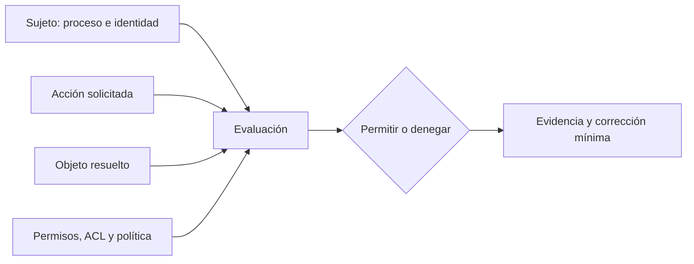
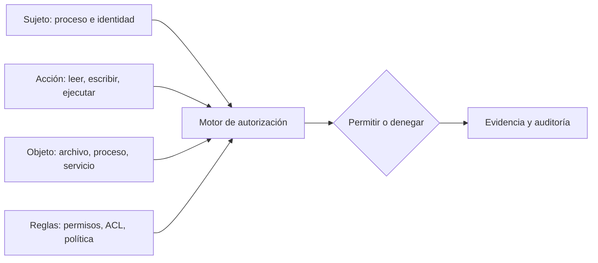

# SE-027 — Usuarios, grupos, permisos y elevación de privilegios

[← SE-026](../../classes/part-02-sistemas-operativos-terminal-y-automatizacion-base/se-026-sistemas-de-archivos-rutas-enlaces-y-metadatos/README.md) · [↑ Parte 02](../../classes/part-02-sistemas-operativos-terminal-y-automatizacion-base/README.md) · [📚 Índice completo](../../classes/README.md) · [SE-028 →](../../classes/part-02-sistemas-operativos-terminal-y-automatizacion-base/se-028-procesos-senales-servicios-y-tareas-programadas/README.md)

> Estado: **PLANNED** · Borrador público conservado íntegramente y sometido a auditoría técnica y pedagógica.

## Punto profesional y fundamento pedagógico

**Punto profesional.** La clase existe para explicar autorización como evaluación de identidad, pertenencia, ACL y elevación.

**Por qué aparece aquí.** Se sitúa después de **Sistemas de archivos, rutas, enlaces y metadatos** y antes de **Procesos, señales, servicios y tareas programadas**: convierte el conocimiento anterior en una decisión observable que la clase siguiente podrá reutilizar. La continuidad se comprueba en el artefacto, no por compartir vocabulario.

**Error conceptual que debe corregir.** Creer que ser propietario implica acceso efectivo o que elevar corrige diseño de permisos.

**Secuencia de aprendizaje.** Antes de leer la solución, el estudiante predice el resultado del caso normal y del error conceptual anterior. Luego explica un caso resuelto paso a paso, construye un contraejemplo que cambie la decisión y, sin consultar el texto, reconstruye el mecanismo y lo aplica a una entrada nueva. La secuencia usa predicción, explicación propia, contraste y recuperación. [ICAP](https://icap.education.asu.edu/research) distingue participación de construcción de conocimiento; [How People Learn II](https://nap.nationalacademies.org/catalog/24783/how-people-learn-ii-learners-contexts-and-cultures) exige conectar conocimiento previo, contexto y transferencia; la [práctica de recuperación](https://pubmed.ncbi.nlm.nih.gov/16507066/) respalda producir de nuevo la explicación tras una demora; y [Education for Life and Work](https://nap.nationalacademies.org/resource/13398/dbasse_084153.pdf) exige devolución que explique la causa del error.

**Evidencia de aprendizaje.** Access-matrix.md con sujeto, objeto, regla, resultado y recuperación. Debe contener predicción previa, observación, explicación causal, contraejemplo, criterio de aceptación y una nota de qué dato haría cambiar la conclusión.

**Límite de la conclusión.** El laboratorio local no modela políticas corporativas completas.

### Trazabilidad fuente → afirmación

| Fuente primaria u oficial | Afirmación que respalda | Lo que no prueba |
|---|---|---|
| [The Open Group — File Access Permissions](https://pubs.opengroup.org/onlinepubs/9799919799/basedefs/V1_chap04.html#tag_04_05) | define el contrato portable de procesos, rutas, entorno o shell que se contrasta entre sistemas | No demuestra por sí sola que el artefacto del estudiante sea correcto. |
| [Microsoft Learn — Access Control](https://learn.microsoft.com/windows/win32/secauthz/access-control) | documenta el comportamiento de Windows o PowerShell que se compara con el contrato POSIX | No demuestra por sí sola que el artefacto del estudiante sea correcto. |
| [Microsoft Learn — How User Account Control works](https://learn.microsoft.com/windows/security/application-security/application-control/user-account-control/how-it-works) | documenta el comportamiento de Windows o PowerShell que se compara con el contrato POSIX | No demuestra por sí sola que el artefacto del estudiante sea correcto. |
| [Apple Platform Security](https://support.apple.com/guide/security/welcome/web) | delimita el contrato técnico que debe cumplirse al explicar autorización como evaluación de identidad, pertenencia, ACL y elevación | No demuestra por sí sola que el artefacto del estudiante sea correcto. |

## Antes de empezar

El kit de diagnóstico multiplataforma encontró la configuración correcta, pero no puede leerla. Cambiar permisos a “todos” haría desaparecer el síntoma y crearía un problema mayor. El diagnóstico profesional pregunta: ¿qué identidad realiza la operación?, ¿qué autoridad posee?, ¿qué regla se aplicó?, ¿qué mínimo cambio sería suficiente?

### Resultado de aprendizaje

Al terminar podrás razonar sobre autenticación, autorización, propiedad, permisos y elevación sin reducir el problema a “ejecuta como administrador”.

## Prerrequisitos

`SE-026`, una carpeta desechable y una cuenta sin privilegios administrativos para la práctica. Debes poder distinguir ruta, objeto y metadatos.

## Problema auténtico

El kit de diagnóstico multiplataforma recibe “acceso denegado”. Un intento previo abrió permisos para todos y el síntoma desapareció, pero ahora cualquier proceso local puede modificar la configuración. Se reparó disponibilidad destruyendo la política de acceso.

## Objetivos observables

Podrás modelar una decisión como sujeto–acción–objeto–política; interpretar permisos POSIX y ACL de Windows sin traducirlos falsamente; justificar mínimo privilegio; y proponer una corrección reversible con menor autoridad.

## Temas y por qué importan

| Tema | Mecanismo | Decisión habilitada |
| --- | --- | --- |
| Identidad efectiva | acompaña al proceso que solicita | saber quién actúa realmente |
| Autorización | evalúa acción sobre objeto bajo reglas | explicar la denegación |
| ACL y permisos | expresan derechos e herencia | corregir sin acceso universal |
| Elevación | crea un contexto más poderoso | reservarla para una necesidad explícita |

## Mapa conceptual

La decisión no vive solo en el archivo. La identidad del proceso, cada directorio padre y reglas adicionales pueden cambiar el resultado; por eso el kit de diagnóstico multiplataforma conserva el conjunto causal.

## Conceptos y decisiones

### Identidad y autoridad no son lo mismo

La autenticación vincula una sesión con una identidad. La autorización decide si esa identidad puede realizar una acción sobre un recurso. Conocer el nombre del usuario no basta: importan grupos, credenciales, token o contexto efectivo, propietario del objeto y política aplicable.

Un proceso hereda un contexto de seguridad al iniciarse. Cambiar de identidad o elevar autoridad crea otro contexto; no corrige la lógica del programa. El kit de diagnóstico multiplataforma registra identidad efectiva y operación fallida sin exponer identificadores más allá de lo necesario.

### El control de acceso evalúa sujeto, acción, objeto y política

Una explicación útil tiene cuatro piezas:

El mismo usuario puede leer un archivo y no modificar su directorio. Poder modificar el directorio puede permitir reemplazar una entrada aunque el archivo tenga otros permisos. Por eso “tengo permiso sobre el archivo” es una afirmación incompleta.

### POSIX combina propietario, grupo y otros; las ACL amplían el modelo

Los bits clásicos expresan lectura, escritura y ejecución para propietario, grupo y otros. En un directorio, estos bits tienen semánticas distintas de un archivo: lectura enumera nombres, escritura modifica entradas y ejecución permite atravesar la ruta. Bits especiales y ACL agregan reglas que requieren análisis adicional.

El permiso efectivo puede depender de identidad efectiva, grupos suplementarios, máscara de ACL y de cada directorio padre. `chmod 777` ignora intención y amplía autoridad indiscriminadamente.

### Windows usa tokens, descriptores de seguridad y ACL

En Windows, el proceso opera con un token que representa usuario, grupos y privilegios. Los objetos pueden tener propietarios y listas de control de acceso con entradas de permitir o denegar e herencia. La evaluación no se traduce correctamente a tres dígitos octales.

UAC separa el uso cotidiano de un token elevado; aceptar una elevación amplía la autoridad del proceso completo. La documentación de [Access Control](https://learn.microsoft.com/windows/win32/secauthz/access-control) detalla el modelo. El kit de diagnóstico multiplataforma evita “traducir” ACL de Windows a permisos POSIX como si fueran equivalentes.

### Mínimo privilegio reduce impacto y mejora el diagnóstico

Un programa debe solicitar solo la autoridad necesaria y durante el tiempo necesario. Si el kit de diagnóstico multiplataforma puede leer estado con permisos normales, no debe ejecutarse elevado “por si acaso”. La elevación también puede cambiar directorio personal, variables, mapeos de red o acceso a la sesión, generando un contexto diferente del fallo original.

Un buen flujo intenta una operación segura, captura la denegación exacta y explica qué capacidad falta. Solo propone elevación si el objetivo la requiere por diseño y ofrece una acción acotada.

### Permiso denegado puede proteger otra frontera

La causa no siempre es el modo del archivo. Puede intervenir una ACL, política de ejecución, sandbox, control de aplicaciones, atributo de procedencia, recurso bloqueado o montaje de solo lectura. La corrección comienza por clasificar la frontera, no por desactivar controles.

### Los secretos exigen permisos y también disciplina de uso

Restringir un archivo no impide que un proceso autorizado imprima su contenido en logs, lo pase como argumento visible o lo herede a un proceso hijo. La protección combina almacenamiento, acceso mínimo, redacción, rotación y ciclo de vida. La clase SE-031 desarrollará esta cadena.

## Definiciones de trabajo

- **sujeto:** proceso y contexto de identidad que solicita una acción;
- **objeto:** recurso sobre el que se evalúa la solicitud;
- **permiso efectivo:** autoridad resultante después de reglas, grupos, herencia y contexto;
- **elevación:** cambio a un contexto con más autoridad;
- **mínimo privilegio:** autoridad mínima, acotada en acción, alcance y duración.

## Caso conductor: el kit de diagnóstico multiplataforma explica una denegación

El kit de diagnóstico multiplataforma intenta leer la configuración del analizador local de eventos con una operación no destructiva. Ante una denegación registra:

- identidad efectiva y grupos relevantes, redactados si el informe se comparte;
- acción exacta y objeto resuelto;
- propietario, permisos o ACL que sea seguro consultar;
- directorio padre que podría impedir el recorrido;
- hipótesis y prueba mínima siguiente.

No cambia permisos automáticamente. Si el archivo pertenece a otra cuenta, distingue entre un error de instalación y un recurso deliberadamente compartido. Si la corrección propuesta es “cambiar propietario”, declara qué procesos podrían dejar de acceder.

## Práctica guiada

En un directorio de laboratorio:

1. crea un archivo legible y otro restringido;
2. observa identidad real y efectiva;
3. compara permiso de archivo y permisos de sus directorios padre;
4. provoca una denegación y conserva su mensaje/código;
5. propone tres correcciones, ordénalas por autoridad añadida y elige la mínima;
6. revierte todos los cambios y demuestra el estado final.

No uses carpetas del sistema ni datos personales. La reversión es parte de la evidencia.

## Ejemplo mínimo

Un archivo permite lectura al propietario, pero su directorio padre niega atravesar la ruta. Mirar solo el archivo sugiere acceso; evaluar el recorrido completo explica la denegación.

## Ejemplo profesional

Un servicio fue instalado por una cuenta administrativa y su configuración quedó inaccesible a la identidad de servicio. En vez de ejecutar el servicio como administrador, se asigna lectura al sujeto específico sobre el objeto específico y se valida que no obtuvo escritura ni acceso a otros secretos.

## Ejercicios

1. Modela tres operaciones con la cuádrupla sujeto, acción, objeto y política.
2. Explica por qué `chmod 777` y “Control total para Todos” no son diagnósticos.
3. Compara el contexto antes y después de elevar: perfil, entorno, rutas y recursos de sesión.

## Reto verificable

Provoca una denegación en laboratorio y presenta dos correcciones posibles ordenadas por autoridad añadida. Aplica y revierte únicamente la mínima, demostrando el estado final.

## Preguntas frecuentes

### ¿Ser propietario concede siempre todas las acciones?

No. La semántica depende del objeto y plataforma; políticas adicionales o montajes pueden restringir incluso al propietario.

### ¿Elevar confirma que faltaban permisos?

Solo indica que un contexto distinto logró la operación; también pudo cambiar rutas, variables o recursos. Hay que aislar el mecanismo.

## Fallo controlado y diagnóstico

Intenta leer un archivo de laboratorio sin permiso y captura el error exacto. Luego comprueba directorios padre y contexto efectivo. Corrige el único derecho necesario y revierte; no desactives controles globales.

## Errores comunes y cómo corregirlos

| Síntoma | Causa conceptual | Corrección |
|---|---|---|
| “Funciona como administrador” se declara solución | Se ocultó la regla que denegó acceso | Reproducir sin elevar e identificar capacidad mínima |
| Se aplica acceso universal | Se confunde disponibilidad con autorización | Definir quién necesita qué acción y limitar alcance |
| Se revisa solo el archivo | Se ignoran directorios padre, ACL o montaje | Trazar la ruta completa y la política efectiva |
| Un script elevado usa otra configuración | Cambió el contexto de identidad | Registrar identidad, HOME/perfil y ruta antes y después |
| El informe publica usuarios o ACL completas | Se confundió evidencia con exposición | Minimizar y redactar datos sin perder la relación causal |

## Entorno y archivos clave

`work/SE-027/`, dos archivos ficticios y `access-report.md`. Usa únicamente recursos propios; documenta comandos equivalentes sin forzar una traducción entre ACL y bits POSIX.

## Seguridad, ética y accesibilidad

No practiques sobre cuentas, servicios o datos de terceros. La salida debe explicar la acción negada en texto claro, no solo mediante un código o color.

## Transferencia

Aplica el modelo a una base de datos o repositorio Git. Identifica sujeto, acción, objeto y política aunque el mecanismo no sean permisos de archivo.

## Evaluación y evidencia

Se exige denegación reproducida, explicación efectiva, corrección mínima, verificación negativa y reversión. “Funcionó como administrador” cuenta como síntoma, no como solución.

## Criterio de cierre

Puedes explicar una decisión de acceso como relación entre sujeto, acción, objeto y política; comparar modelos sin falsas equivalencias; y proponer una corrección reversible que no amplíe privilegios innecesariamente.

## Límites y siguiente paso

No cubrimos administración empresarial de identidades, dominios, SELinux, AppArmor ni todos los detalles de ACL. El contexto de seguridad pertenece a un proceso en ejecución. La siguiente clase estudia cómo nacen, se planifican, coordinan y terminan esos procesos.

## Fuentes

- [The Open Group — File Access Permissions](https://pubs.opengroup.org/onlinepubs/9799919799/basedefs/V1_chap04.html#tag_04_05)
- [Microsoft Learn — Access Control](https://learn.microsoft.com/windows/win32/secauthz/access-control)
- [Microsoft Learn — How User Account Control works](https://learn.microsoft.com/windows/security/application-security/application-control/user-account-control/how-it-works)
- [Apple Platform Security](https://support.apple.com/guide/security/welcome/web)

## Glosario

- **ACL:** lista de reglas que asocia identidades o grupos con derechos sobre un objeto.
- **Autenticación:** proceso de establecer una identidad.
- **Autorización:** decisión sobre una acción solicitada por una identidad.
- **Elevación:** ejecución con un contexto de autoridad mayor al habitual.
- **Mínimo privilegio:** principio de conceder la menor autoridad suficiente, con alcance y duración acotados.

---
[← SE-026](../../classes/part-02-sistemas-operativos-terminal-y-automatizacion-base/se-026-sistemas-de-archivos-rutas-enlaces-y-metadatos/README.md) · [↑ Parte 02](../../classes/part-02-sistemas-operativos-terminal-y-automatizacion-base/README.md) · [📚 Índice completo](../../classes/README.md) · [SE-028 →](../../classes/part-02-sistemas-operativos-terminal-y-automatizacion-base/se-028-procesos-senales-servicios-y-tareas-programadas/README.md)
