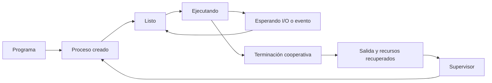
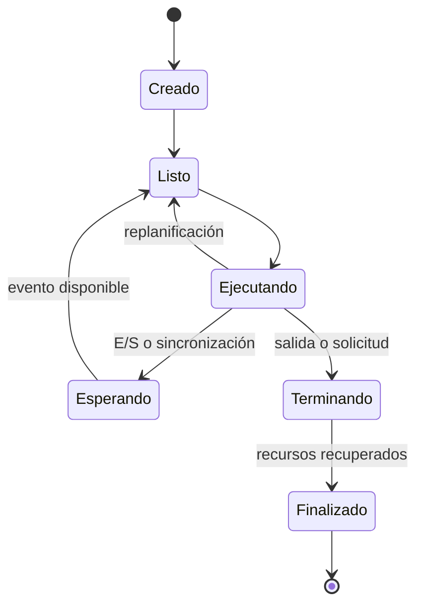

# SE-028 — Procesos, señales, servicios y tareas programadas

[← SE-027](../../classes/part-02-sistemas-operativos-terminal-y-automatizacion-base/se-027-usuarios-grupos-permisos-y-elevacion-de-privilegios/README.md) · [↑ Parte 02](../../classes/part-02-sistemas-operativos-terminal-y-automatizacion-base/README.md) · [📚 Índice completo](../../classes/README.md) · [SE-029 →](../../classes/part-02-sistemas-operativos-terminal-y-automatizacion-base/se-029-terminales-shells-y-composicion-de-comandos/README.md)

> Estado: **PLANNED** · Borrador público conservado íntegramente y sometido a auditoría técnica y pedagógica.

## Punto profesional y fundamento pedagógico

**Punto profesional.** La clase existe para modelar ciclo de vida, señales, supervisión y reinicio de procesos y servicios.

**Por qué aparece aquí.** Se sitúa después de **Usuarios, grupos, permisos y elevación de privilegios** y antes de **Terminales, shells y composición de comandos**: convierte el conocimiento anterior en una decisión observable que la clase siguiente podrá reutilizar. La continuidad se comprueba en el artefacto, no por compartir vocabulario.

**Error conceptual que debe corregir.** Tratar proceso, daemon, servicio y tarea programada como sinónimos.

**Secuencia de aprendizaje.** Antes de leer la solución, el estudiante predice el resultado del caso normal y del error conceptual anterior. Luego explica un caso resuelto paso a paso, construye un contraejemplo que cambie la decisión y, sin consultar el texto, reconstruye el mecanismo y lo aplica a una entrada nueva. La secuencia usa predicción, explicación propia, contraste y recuperación. [ICAP](https://icap.education.asu.edu/research) distingue participación de construcción de conocimiento; [How People Learn II](https://nap.nationalacademies.org/catalog/24783/how-people-learn-ii-learners-contexts-and-cultures) exige conectar conocimiento previo, contexto y transferencia; la [práctica de recuperación](https://pubmed.ncbi.nlm.nih.gov/16507066/) respalda producir de nuevo la explicación tras una demora; y [Education for Life and Work](https://nap.nationalacademies.org/resource/13398/dbasse_084153.pdf) exige devolución que explique la causa del error.

**Evidencia de aprendizaje.** Lifecycle.md con estados, señal, código de salida, política de reinicio y fallo controlado. Debe contener predicción previa, observación, explicación causal, contraejemplo, criterio de aceptación y una nota de qué dato haría cambiar la conclusión.

**Límite de la conclusión.** Los administradores de servicios difieren y no se infiere disponibilidad distribuida.

### Trazabilidad fuente → afirmación

| Fuente primaria u oficial | Afirmación que respalda | Lo que no prueba |
|---|---|---|
| [The Open Group — Process Concepts](https://pubs.opengroup.org/onlinepubs/9799919799/basedefs/V1_chap03.html) | define el contrato portable de procesos, rutas, entorno o shell que se contrasta entre sistemas | No demuestra por sí sola que el artefacto del estudiante sea correcto. |
| [systemd.service](https://www.freedesktop.org/software/systemd/man/latest/systemd.service.html) | define ciclo de vida, supervisión o consulta de eventos en systemd | No demuestra por sí sola que el artefacto del estudiante sea correcto. |
| [Microsoft Learn — Services](https://learn.microsoft.com/windows/win32/services/services) | documenta el comportamiento de Windows o PowerShell que se compara con el contrato POSIX | No demuestra por sí sola que el artefacto del estudiante sea correcto. |

## Antes de empezar

Una aplicación instalada no está “corriendo” de forma permanente. El sistema crea procesos, asigna recursos, los planifica y finalmente recupera su estado. Cuando Pulso queda bloqueado, Faro debe distinguir espera legítima, consumo de CPU, dependencia externa y terminación defectuosa.

### Resultado de aprendizaje

Al terminar podrás describir el ciclo de vida de un proceso, interpretar relaciones padre-hijo, terminación y servicios, y diagnosticar sin asumir que matar un proceso corrige la causa.

## Prerrequisitos

`SE-027`, nociones de proceso e I/O de `SE-019`, y permiso para ejecutar únicamente procesos de laboratorio. No se requiere administrar servicios reales.

## Problema auténtico

Pulso no responde y el equipo propone terminarlo. La CPU está casi inactiva, pero nadie sabe si espera entrada, un bloqueo o un servicio externo. El PID fue copiado hace minutos y podría identificar otra instancia.

## Objetivos observables

Podrás distinguir programa, proceso e hilo; interpretar estados de ejecución y espera; explicar terminación cooperativa y forzada; diseñar una política de servicio; y modelar tareas repetibles sin asumir “exactamente una vez”.

## Temas y por qué importan

| Tema | Mecanismo | Decisión habilitada |
| --- | --- | --- |
| Proceso | encapsula ejecución, identidad y recursos | identificar la instancia correcta |
| Planificación | alterna unidades listas y esperas | separar consumo de progreso |
| Terminación | comunica solicitud y resultado | cerrar sin corromper estado |
| Supervisión | inicia, reinicia y limita servicios | recuperar sin bucles infinitos |

## Mapa conceptual

El ciclo distingue “no usa CPU” de “no progresa”. El supervisor observa resultados y decide bajo una política; no debe reiniciar indefinidamente un fallo determinista.

## Conceptos y decisiones

### Programa y proceso pertenecen a niveles diferentes

Un programa es un artefacto con instrucciones y datos. Un proceso es una instancia en ejecución con espacio de direcciones, identificador, credenciales, descriptores o manejadores, entorno y estado planificable. Varias instancias pueden ejecutar el mismo programa sin compartir todo su estado.

El sistema carga el ejecutable y bibliotecas, prepara memoria y recursos iniciales, crea un hilo de ejecución y lo presenta al planificador. El identificador de proceso es temporal; reutilizarlo como identidad duradera es un error.

### Crear un proceso establece herencia y fronteras

En modelos POSIX, `fork` y `exec` explican conceptualmente la separación entre crear y reemplazar una imagen de proceso, aunque lenguajes de alto nivel ofrezcan una sola API. Windows usa su familia de creación con parámetros y objetos propios. En ambos casos se deciden argumentos, entorno, directorio, flujos estándar y manejadores heredables.

Una herencia accidental mantiene archivos o pipes abiertos y puede impedir la terminación. Faro registra quién inició a Pulso y qué recursos relevantes permanecen abiertos, sin pretender inspeccionar memoria privada.

### El planificador distribuye tiempo, no promete orden

Los hilos listos compiten por procesadores. Prioridades, afinidad, carga y políticas influyen, pero el orden observado una vez no es un contrato. Un proceso con 0 % de CPU puede estar esperando entrada; uno con uso alto puede progresar correctamente o girar en un bucle.

Muestrear CPU, memoria y espera a lo largo del tiempo aporta más que una captura. La medición altera algo el sistema y debe interpretarse junto con trabajo solicitado y duración.

### Señales, eventos y códigos de salida comunican finalización

POSIX define señales que notifican eventos; algunas pueden capturarse para limpiar, otras no. Windows ofrece eventos, mensajes, objetos sincronizables y mecanismos de control con semánticas diferentes. “Enviar SIGTERM en Windows” no es una descripción portable.

La terminación cooperativa permite dejar de aceptar trabajo, finalizar operaciones y liberar recursos. La terminación forzada reduce esa oportunidad. El código de salida comunica una categoría de resultado al proceso padre; no sustituye un diagnóstico detallado, pero forma parte del contrato.

Este modelo es deliberadamente conceptual: los estados y nombres reales varían. Sirve para preguntar si Pulso progresa, espera o terminó, no para adivinar internals del kernel.

### Un servicio añade supervisión y política de ciclo de vida

Un servicio o daemon suele ejecutarse sin una sesión interactiva y es gestionado por un supervisor como Windows Service Control Manager, `systemd` u otro sistema de inicio. El supervisor define inicio, dependencias, identidad, reinicio, límites y captura de logs.

Reiniciar siempre puede crear un bucle que oculte un fallo persistente. Una política profesional distingue fallos transitorios, limita reintentos y conserva evidencia. Las páginas de [systemd.service](https://www.freedesktop.org/software/systemd/man/latest/systemd.service.html) y la documentación de [Windows Services](https://learn.microsoft.com/windows/win32/services/services) describen contratos concretos.

### Un planificador temporal no garantiza exactamente una vez

Tareas programadas pueden omitirse, duplicarse o coincidir si una ejecución dura más que el intervalo. La tarea debe definir zona horaria, comportamiento tras suspensión, concurrencia y reintentos. Cuando el efecto no tolera repetición, se diseña idempotencia o deduplicación; el calendario solo decide intentos.

## Definiciones de trabajo

- **proceso:** instancia de un programa con contexto y recursos administrados;
- **hilo:** flujo de ejecución planificable dentro de un proceso;
- **espera:** estado en que el progreso depende de un evento o recurso;
- **servicio:** proceso gestionado por un supervisor y una política de ciclo de vida;
- **idempotencia:** propiedad por la que repetir una operación no multiplica su efecto previsto.

## Caso conductor: Faro observa a Pulso bloqueado

Faro recibe un identificador o criterio explícito y produce una línea temporal de muestras: estado observable, CPU, memoria, tiempo de inicio, proceso padre y resultado final. Primero verifica que el proceso corresponde al esperado; nombre y PID aislados no bastan.

Si Pulso espera un archivo bloqueado, Faro no concluye “está colgado” por CPU baja. Correlaciona la espera con logs y recursos. La acción propuesta escala: esperar con plazo, solicitar cierre cooperativo y, solo como último recurso, terminación forzada documentando posible pérdida de estado.

## Práctica guiada

1. Ejecuta un proceso corto, uno que espere entrada y uno que consuma CPU en un laboratorio controlado.
2. Observa padre, inicio, uso y salida durante varias muestras.
3. Solicita terminación cooperativa al proceso preparado para ella.
4. Compara evidencia y efectos con una terminación forzada.
5. Diseña una unidad de servicio o tarea en pseudoconfiguración: identidad, dependencias, reintentos y logs.

No termines procesos ajenos ni servicios del sistema.

## Ejemplo mínimo

Un proceso que lee desde entrada estándar muestra CPU baja. Al proporcionar la línea, continúa y termina con cero. No estaba colgado: esperaba una precondición observable.

## Ejemplo profesional

Un servicio reinicia cada segundo porque la configuración es inválida. Limitar reintentos y conservar el primer error evita saturación; corregir la configuración resuelve la causa. Aumentar prioridad o matar instancias repetidamente no lo hace.

## Ejercicios

1. Clasifica tres procesos como listos, ejecutando o esperando a partir de evidencia temporal.
2. Diseña códigos de salida para uso inválido, dependencia ausente y fallo interno.
3. Especifica una tarea diaria que evite solapamiento y tolere repetición.

## Reto verificable

Entrega una línea temporal de un proceso de laboratorio con al menos cuatro muestras, una solicitud cooperativa y el estado final. Otra persona debe distinguir espera de consumo sin ver tu código.

## Preguntas frecuentes

### ¿Un proceso con CPU alta está necesariamente fallando?

No. Puede ejecutar trabajo útil. Se compara consumo con progreso y objetivo.

### ¿Un reinicio automático siempre mejora disponibilidad?

No. Frente a fallos persistentes puede crear un bucle, perder evidencia y aumentar impacto.

## Fallo controlado y diagnóstico

Ejecuta un proceso que espere entrada con plazo. Primero diagnostícalo erróneamente como “colgado”; luego usa estado, flujos y progreso para refutar esa conclusión. Solicita cierre cooperativo y registra el código final.

## Errores comunes y cómo corregirlos

| Síntoma | Causa conceptual | Corrección |
|---|---|---|
| Se mata un PID copiado minutos antes | El PID se trató como identidad permanente | Revalidar ejecutable, propietario e inicio antes de actuar |
| CPU baja se interpreta como bloqueo | Se ignoró espera útil | Correlacionar estado, tiempo, E/S y progreso funcional |
| El servicio reinicia sin límite | Se sustituyó recuperación por repetición | Clasificar fallo, aplicar espera creciente y cortar el bucle |
| El hijo no recibe EOF | Conserva un extremo del pipe heredado | Controlar herencia y cerrar descriptores no usados |
| Una tarea duplica efectos | Se asumió ejecución exactamente una vez | Diseñar idempotencia, exclusión o deduplicación |

## Entorno y archivos clave

Scripts pequeños en `work/SE-028/`, `timeline.csv`, `service-policy.md`. Solo procesos iniciados por la práctica y sin cambios en servicios del sistema.

## Seguridad, ética y accesibilidad

No enumeres ni termines procesos de otras personas. Redacta argumentos sensibles y explica estados con texto, no solo color o animación.

## Transferencia

Aplica el ciclo a un trabajador de cola. Explica qué representa reintento, reconocimiento, deduplicación y apagado cooperativo.

## Evaluación y evidencia

Se exige línea temporal, identidad revalidada, cierre cooperativo, política de servicio/tarea y límites. Una captura del administrador de tareas no demuestra la causa.

## Criterio de cierre

Puedes explicar creación, planificación, espera y terminación; distinguir proceso interactivo, servicio y tarea; y justificar una intervención gradual con evidencia del estado real.

## Límites y siguiente paso

No hacemos depuración de kernel ni análisis forense de memoria. La observabilidad disponible depende de permisos y plataforma. La próxima clase estudia la interfaz más común para coordinar procesos: terminal, shell, flujos y códigos de salida.

## Fuentes

- [The Open Group — Process Concepts](https://pubs.opengroup.org/onlinepubs/9799919799/basedefs/V1_chap03.html)
- [Microsoft Learn — Processes and Threads](https://learn.microsoft.com/windows/win32/procthread/processes-and-threads)
- [systemd.service](https://www.freedesktop.org/software/systemd/man/latest/systemd.service.html)
- [Microsoft Learn — Services](https://learn.microsoft.com/windows/win32/services/services)

## Glosario

- **Código de salida:** valor con el que un proceso comunica una categoría de resultado.
- **Daemon/servicio:** proceso no interactivo administrado bajo una política de ciclo de vida.
- **Hilo:** flujo planificable de ejecución dentro de un proceso.
- **PID:** identificador temporal asignado a un proceso.
- **Terminación cooperativa:** solicitud que permite al programa cerrar ordenadamente.

---
[← SE-027](../../classes/part-02-sistemas-operativos-terminal-y-automatizacion-base/se-027-usuarios-grupos-permisos-y-elevacion-de-privilegios/README.md) · [↑ Parte 02](../../classes/part-02-sistemas-operativos-terminal-y-automatizacion-base/README.md) · [📚 Índice completo](../../classes/README.md) · [SE-029 →](../../classes/part-02-sistemas-operativos-terminal-y-automatizacion-base/se-029-terminales-shells-y-composicion-de-comandos/README.md)
