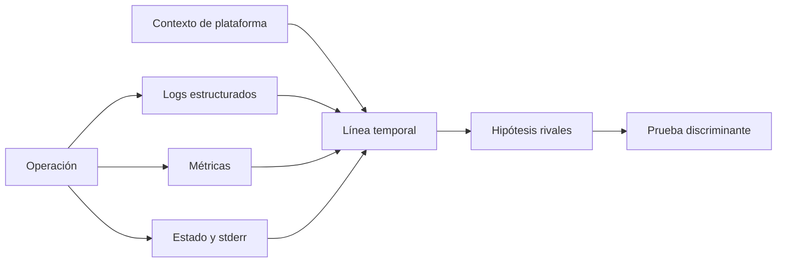
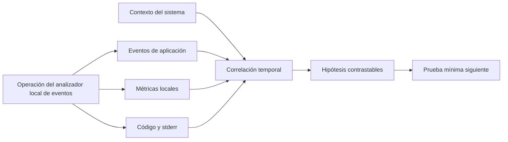

# SE-033 — Logs del sistema y diagnóstico de fallos

[← SE-032](../../classes/part-02-sistemas-operativos-terminal-y-automatizacion-base/se-032-instalacion-de-software-y-gestores-de-paquetes-del-sistema/README.md) · [↑ Parte 02](../../classes/part-02-sistemas-operativos-terminal-y-automatizacion-base/README.md) · [📚 Índice completo](../../classes/README.md) · [SE-034 →](../../classes/part-02-sistemas-operativos-terminal-y-automatizacion-base/se-034-virtualizacion-wsl-y-aislamiento-local/README.md)

> Estado: **PLANNED** · Borrador público conservado íntegramente y sometido a auditoría técnica y pedagógica.

## Punto profesional y fundamento pedagógico

**Punto profesional.** La clase existe para usar logs como observaciones parciales que deben correlacionarse con reloj, contexto y causalidad.

**Por qué aparece aquí.** Se sitúa después de **Instalación de software y gestores de paquetes del sistema** y antes de **Virtualización, WSL y aislamiento local**: convierte el conocimiento anterior en una decisión observable que la clase siguiente podrá reutilizar. La continuidad se comprueba en el artefacto, no por compartir vocabulario.

**Error conceptual que debe corregir.** Buscar una cadena y declarar causa sin línea temporal ni evidencia rival.

**Secuencia de aprendizaje.** Antes de leer la solución, el estudiante predice el resultado del caso normal y del error conceptual anterior. Luego explica un caso resuelto paso a paso, construye un contraejemplo que cambie la decisión y, sin consultar el texto, reconstruye el mecanismo y lo aplica a una entrada nueva. La secuencia usa predicción, explicación propia, contraste y recuperación. [ICAP](https://icap.education.asu.edu/research) distingue participación de construcción de conocimiento; [How People Learn II](https://nap.nationalacademies.org/catalog/24783/how-people-learn-ii-learners-contexts-and-cultures) exige conectar conocimiento previo, contexto y transferencia; la [práctica de recuperación](https://pubmed.ncbi.nlm.nih.gov/16507066/) respalda producir de nuevo la explicación tras una demora; y [Education for Life and Work](https://nap.nationalacademies.org/resource/13398/dbasse_084153.pdf) exige devolución que explique la causa del error.

**Evidencia de aprendizaje.** Incident-timeline.md con evento, fuente, reloj, hipótesis y dato ausente. Debe contener predicción previa, observación, explicación causal, contraejemplo, criterio de aceptación y una nota de qué dato haría cambiar la conclusión.

**Límite de la conclusión.** Los logs pueden omitir, retrasar o redactar hechos.

### Trazabilidad fuente → afirmación

| Fuente primaria u oficial | Afirmación que respalda | Lo que no prueba |
|---|---|---|
| [Microsoft Learn — Event Logging](https://learn.microsoft.com/windows/win32/eventlog/event-logging) | documenta el comportamiento de Windows o PowerShell que se compara con el contrato POSIX | No demuestra por sí sola que el artefacto del estudiante sea correcto. |
| [systemd — journalctl](https://www.freedesktop.org/software/systemd/man/latest/journalctl.html) | define ciclo de vida, supervisión o consulta de eventos en systemd | No demuestra por sí sola que el artefacto del estudiante sea correcto. |
| [Apple Developer — Logging](https://developer.apple.com/documentation/os/logging) | delimita el contrato técnico que debe cumplirse al usar logs como observaciones parciales que deben correlacionarse con reloj, contexto y causalidad | No demuestra por sí sola que el artefacto del estudiante sea correcto. |
| [OpenTelemetry — Logs data model](https://opentelemetry.io/docs/specs/otel/logs/data-model/) | delimita el contrato técnico que debe cumplirse al usar logs como observaciones parciales que deben correlacionarse con reloj, contexto y causalidad | No demuestra por sí sola que el artefacto del estudiante sea correcto. |

## Antes de empezar

Cuando el analizador local de eventos falla, un archivo de log puede contener miles de líneas y aun no responder qué ocurrió. Registrar más no equivale a observar mejor. El kit de diagnóstico multiplataforma necesita relacionar evento, contexto y resultado sin capturar secretos ni convertir una coincidencia temporal en causa.

### Resultado de aprendizaje

Al terminar podrás diseñar eventos útiles, correlacionar evidencia de varias fuentes y producir un paquete diagnóstico minimizado que separa hechos, inferencias y acciones.

## Prerrequisitos

`SE-031` para redacción, `SE-028` para ciclo de proceso y una ejecución local del analizador local de eventos/el kit de diagnóstico multiplataforma. Usa únicamente eventos sintéticos o propios.

## Problema auténtico

El analizador local de eventos falla y existen miles de líneas de log. No hay identificador de operación, los relojes difieren y una ruta personal aparece junto a un token. El volumen aumentó; la capacidad de explicar disminuyó.

## Objetivos observables

Podrás diseñar eventos estructurados; distinguir logs, métricas y trazas; correlacionar con incertidumbre temporal; separar hecho e inferencia; y exportar evidencia minimizada sin el secreto centinela.

## Temas y por qué importan

| Tema | Mecanismo | Decisión habilitada |
| --- | --- | --- |
| Evento estructurado | conserva código, tiempo, componente y campos | consultar sin parsear frases |
| Correlación | relaciona señales de una operación | reconstruir una línea temporal |
| Tiempo | separa marca de pared y duración monótona | evitar órdenes y duraciones falsas |
| Minimización | selecciona y redacta antes de persistir | compartir evidencia con menor riesgo |

## Mapa conceptual

Las señales convergen en una hipótesis, no en una certeza automática. La prueba siguiente debe poder cambiar la conclusión.

## Conceptos y decisiones

### Observabilidad permite inferir estado desde salidas

Un sistema es más observable cuando sus señales permiten responder preguntas sobre su comportamiento. Logs describen eventos; métricas agregan medidas; trazas relacionan pasos de una operación. En un diagnóstico local también importan códigos de salida, configuración efectiva, versión y estado del sistema.

Ninguna señal aislada es verdad completa. Un log registra lo que el programa alcanzó a emitir; un cierre abrupto puede dejar eventos pendientes.

### Un evento útil tiene estructura y propósito

Un registro profesional incluye tiempo con zona o referencia inequívoca, severidad, componente, evento estable, correlación y campos relevantes. El mensaje humano complementa, no sustituye, la estructura.

La correlación aproxima relaciones; no demuestra causalidad por sí sola. Un identificador de operación une eventos mejor que buscar textos parecidos.

### Severidad representa impacto operativo, no emoción

`DEBUG`, `INFO`, `WARN` y `ERROR` solo son útiles si el equipo define cuándo aplican. Un error recuperado puede ser advertencia para la operación global; una precondición ausente puede ser error sin excepción interna. Todo marcado como error crea fatiga y oculta señales.

El kit de diagnóstico multiplataforma conserva un evento estable como `config.read.denied` y una explicación localizada. Las automatizaciones dependen del código, no de frases traducidas.

### Tiempo y orden exigen cautela

Relojes pueden diferir, cambiar o tener distinta precisión. El tiempo de pared sirve para ubicar un evento; un reloj monótono es mejor para duraciones dentro de un proceso. En concurrencia, el orden de escritura no necesariamente reproduce el orden causal.

El kit de diagnóstico multiplataforma registra inicio, fin y duración con mecanismo apropiado, además de zona para marcas compartidas. Si combina fuentes, declara la incertidumbre de sincronización.

### La captura debe minimizar datos sensibles

Logs pueden revelar rutas personales, argumentos, nombres de usuario, tokens o contenido. La política define campos permitidos, redacción, retención, acceso y eliminación. Recolectar todo “por si acaso” aumenta riesgo y ruido.

La redacción debe ocurrir antes de serializar. Los valores secretos centinela de SE-031 vuelven a usarse para probar que no aparecen en eventos ni archivos comprimidos.

### Diagnosticar es iterar hipótesis, no buscar una línea roja

El flujo profesional define el síntoma, construye una línea temporal, formula causas alternativas y elige una prueba que las distinga. La bitácora conserva resultados negativos porque reducen el espacio de búsqueda.

Los sistemas ofrecen almacenes diferentes: Windows Event Log, journal de `systemd`, Unified Logging de Apple y archivos de aplicación. Sus filtros y permisos no son equivalentes. Se consulta documentación oficial como [Windows Event Log](https://learn.microsoft.com/windows/win32/eventlog/event-logging), [`journalctl`](https://www.freedesktop.org/software/systemd/man/latest/journalctl.html) y [Apple Unified Logging](https://developer.apple.com/documentation/os/logging).

## Definiciones de trabajo

- **evento:** observación estructurada con significado estable;
- **correlación:** relación explícita entre señales de una operación;
- **hecho:** observación respaldada por una fuente identificable;
- **inferencia:** explicación compatible con hechos, aún contrastable;
- **paquete diagnóstico:** evidencia seleccionada, contextualizada y minimizada para revisión.

## Caso conductor: el kit de diagnóstico multiplataforma construye una línea temporal

El analizador local de eventos devuelve código `3`: configuración ausente. El kit de diagnóstico multiplataforma recoge versión, configuración efectiva redactada, metadatos de la ruta y eventos con el mismo identificador. Descubre que la ruta provino de una variable heredada, no del archivo esperado. Esa relación ya está explicada por la precedencia de SE-031.

El informe separa:

- **hechos:** variable presente, ruta resuelta, archivo ausente, código 3;
- **inferencia:** la variable probablemente desvió la búsqueda;
- **prueba:** ejecutar en un entorno mínimo sin esa variable;
- **resultado:** el analizador local de eventos usa el archivo correcto;
- **corrección:** eliminar la configuración obsoleta en su ámbito, no codificar otra ruta.

## Práctica guiada

1. Instrumenta tres etapas del kit de diagnóstico multiplataforma con eventos estructurados y correlación.
2. Induce dos fallos que compartan un síntoma superficial.
3. Construye una línea temporal con hechos y fuentes.
4. Formula una prueba que discrimine las causas.
5. Exporta solo la evidencia necesaria y busca el secreto centinela.
6. Pide a otra persona reconstruir tu conclusión desde el paquete.

## Ejemplo mínimo

Dos eventos comparten `operation_id=abc`: inicio y `config.read.denied`. Ordenarlos por tiempo y código permite afirmar que pertenecen a la operación; no demuestra todavía que la ACL sea la causa.

## Ejemplo profesional

Un servicio presenta latencia y errores coincidentes con presión de disco. El equipo compara operaciones con y sin presión y conserva una hipótesis rival de dependencia externa. La correlación orienta el experimento; no se publica como causalidad cerrada.

## Ejercicios

1. Convierte tres mensajes libres en eventos con código estable y campos mínimos.
2. Distingue hechos e inferencias en una línea temporal dada.
3. Diseña una política de severidad, retención y redacción para el kit de diagnóstico multiplataforma.

## Reto verificable

Entrega un paquete con dos causas superficiales iguales pero evidencia discriminante. Otra persona debe identificar la causa correcta y no encontrar el secreto centinela.

## Preguntas frecuentes

### ¿Más detalle de log siempre ayuda?

No. Puede aumentar ruido, costo y exposición. Cada campo debe responder una pregunta operacional.

### ¿El evento inmediatamente anterior causó el fallo?

No necesariamente. Proximidad temporal es evidencia para explorar, no prueba causal.

## Fallo controlado y diagnóstico

Emite eventos sin correlación para dos ejecuciones simultáneas y demuestra la ambigüedad. Añade un identificador por operación, repite y documenta qué preguntas ahora sí pueden responderse.

## Errores comunes y cómo corregirlos

| Síntoma | Causa conceptual | Corrección |
|---|---|---|
| Hay mucho log pero no se relacionan eventos | Faltan identificadores y estructura | Añadir eventos estables y correlación por operación |
| Se culpa al evento anterior | Se confundió proximidad con causalidad | Formular alternativas y diseñar una prueba discriminante |
| Un archivo compartido expone rutas y tokens | Se recolectó sin política | Minimizar, redactar antes de escribir y revisar el paquete final |
| Duraciones negativas o extrañas | Se usó reloj de pared para medir intervalos | Usar reloj monótono para duración |
| El diagnóstico depende de buscar texto traducido | No hay códigos estables | Separar identificador estructurado y mensaje humano |

## Entorno y archivos clave

`work/SE-033/events.jsonl`, `timeline.md`, `diagnostic-package/` y política de redacción. El paquete usa datos ficticios y tamaño limitado.

## Seguridad, ética y accesibilidad

Recoge solo señales autorizadas y propias. Redacta antes de escribir, define retención y acompaña gráficos o severidades con texto y códigos estables.

## Transferencia

Aplica la bitácora a una investigación de fallo de red sin inspeccionar contenido personal. Indica qué nueva señal solicitarías y con qué autoridad.

## Evaluación y evidencia

Se exige esquema de evento, línea temporal, dos hipótesis, prueba discriminante, redacción comprobada y límite temporal. Buscar una palabra “error” no constituye diagnóstico.

## Criterio de cierre

Puedes producir una línea temporal reproducible, distinguir hecho de inferencia, y entregar evidencia suficiente para contrastar una hipótesis sin revelar el secreto centinela.

## Límites y siguiente paso

No implementamos una plataforma distribuida de observabilidad ni demostramos causalidad completa. En entornos virtualizados o WSL, una señal puede provenir de otra capa. La siguiente clase delimita qué está aislado y qué sigue compartido.

## Fuentes

- [Microsoft Learn — Event Logging](https://learn.microsoft.com/windows/win32/eventlog/event-logging)
- [systemd — journalctl](https://www.freedesktop.org/software/systemd/man/latest/journalctl.html)
- [Apple Developer — Logging](https://developer.apple.com/documentation/os/logging)
- [OpenTelemetry — Logs data model](https://opentelemetry.io/docs/specs/otel/logs/data-model/)

## Glosario

- **Correlación:** atributo que permite relacionar señales de una misma operación.
- **Evento:** registro estructurado de algo observado en un momento.
- **Métrica:** medida numérica agregable a lo largo del tiempo.
- **Observabilidad:** capacidad de inferir estado interno a partir de salidas disponibles.
- **Traza:** representación del recorrido de una operación por etapas relacionadas.

---
[← SE-032](../../classes/part-02-sistemas-operativos-terminal-y-automatizacion-base/se-032-instalacion-de-software-y-gestores-de-paquetes-del-sistema/README.md) · [↑ Parte 02](../../classes/part-02-sistemas-operativos-terminal-y-automatizacion-base/README.md) · [📚 Índice completo](../../classes/README.md) · [SE-034 →](../../classes/part-02-sistemas-operativos-terminal-y-automatizacion-base/se-034-virtualizacion-wsl-y-aislamiento-local/README.md)
