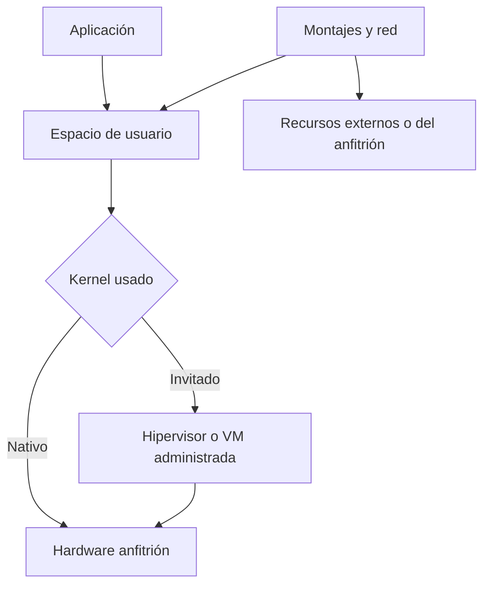
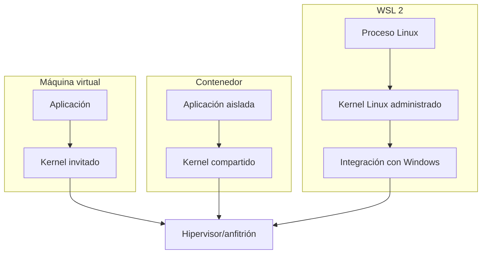

# SE-034 — Virtualización, WSL y aislamiento local

[← SE-033](../../classes/part-02-sistemas-operativos-terminal-y-automatizacion-base/se-033-logs-del-sistema-y-diagnostico-de-fallos/README.md) · [↑ Parte 02](../../classes/part-02-sistemas-operativos-terminal-y-automatizacion-base/README.md) · [📚 Índice completo](../../classes/README.md) · [SE-035 →](../../classes/part-02-sistemas-operativos-terminal-y-automatizacion-base/se-035-taller-preparar-y-reparar-un-entorno-reproducible/README.md)

> Estado: **PLANNED** · Borrador público conservado íntegramente y sometido a auditoría técnica y pedagógica.

## Punto profesional y fundamento pedagógico

**Punto profesional.** La clase existe para distinguir virtualización, namespaces, cgroups, WSL y contenedores por la frontera que aíslan.

**Por qué aparece aquí.** Se sitúa después de **Logs del sistema y diagnóstico de fallos** y antes de **Taller: preparar y reparar un entorno reproducible**: convierte el conocimiento anterior en una decisión observable que la clase siguiente podrá reutilizar. La continuidad se comprueba en el artefacto, no por compartir vocabulario.

**Error conceptual que debe corregir.** Tratar contenedor como máquina virtual o aislamiento como seguridad absoluta.

**Secuencia de aprendizaje.** Antes de leer la solución, el estudiante predice el resultado del caso normal y del error conceptual anterior. Luego explica un caso resuelto paso a paso, construye un contraejemplo que cambie la decisión y, sin consultar el texto, reconstruye el mecanismo y lo aplica a una entrada nueva. La secuencia usa predicción, explicación propia, contraste y recuperación. [ICAP](https://icap.education.asu.edu/research) distingue participación de construcción de conocimiento; [How People Learn II](https://nap.nationalacademies.org/catalog/24783/how-people-learn-ii-learners-contexts-and-cultures) exige conectar conocimiento previo, contexto y transferencia; la [práctica de recuperación](https://pubmed.ncbi.nlm.nih.gov/16507066/) respalda producir de nuevo la explicación tras una demora; y [Education for Life and Work](https://nap.nationalacademies.org/resource/13398/dbasse_084153.pdf) exige devolución que explique la causa del error.

**Evidencia de aprendizaje.** Isolation-matrix.md con kernel, filesystem, red, recursos y ruptura simulada. Debe contener predicción previa, observación, explicación causal, contraejemplo, criterio de aceptación y una nota de qué dato haría cambiar la conclusión.

**Límite de la conclusión.** Un laboratorio local no equivale a una evaluación de aislamiento hostil.

### Trazabilidad fuente → afirmación

| Fuente primaria u oficial | Afirmación que respalda | Lo que no prueba |
|---|---|---|
| [Microsoft Learn — WSL documentation](https://learn.microsoft.com/windows/wsl/) | documenta el comportamiento de Windows o PowerShell que se compara con el contrato POSIX | No demuestra por sí sola que el artefacto del estudiante sea correcto. |
| [Linux kernel — namespaces](https://man7.org/linux/man-pages/man7/namespaces.7.html) | delimita el contrato técnico que debe cumplirse al distinguir virtualización, namespaces, cgroups, WSL y contenedores por la frontera que aíslan | No demuestra por sí sola que el artefacto del estudiante sea correcto. |
| [Linux kernel — cgroup v2](https://docs.kernel.org/admin-guide/cgroup-v2.html) | delimita el contrato técnico que debe cumplirse al distinguir virtualización, namespaces, cgroups, WSL y contenedores por la frontera que aíslan | No demuestra por sí sola que el artefacto del estudiante sea correcto. |
| [Docker documentation — storage](https://docs.docker.com/engine/storage/) | delimita el contrato técnico que debe cumplirse al distinguir virtualización, namespaces, cgroups, WSL y contenedores por la frontera que aíslan | No demuestra por sí sola que el artefacto del estudiante sea correcto. |

## Antes de empezar

Faro puede ejecutarse dentro de una máquina virtual, un contenedor o WSL. Ver “Linux” en el informe ya no basta: el kernel, el sistema de archivos, la red y los recursos pueden pertenecer a capas diferentes. Aislamiento no significa independencia absoluta ni constituye por sí solo una frontera de seguridad suficiente.

### Resultado de aprendizaje

Al terminar podrás comparar máquinas virtuales, contenedores y WSL por lo que virtualizan, comparten y traducen, y predecir consecuencias sobre rutas, procesos, red y rendimiento.

## Prerrequisitos

`SE-025` a `SE-033`: plataforma, rutas, procesos y evidencia. La clase no requiere habilitar virtualización; puede trabajarse con un entorno ya disponible o un modelo documentado.

## Problema auténtico

Faro informa Linux y una ruta `/mnt/c`, mientras la persona afirma usar Windows. Un archivo es lento y `localhost` no alcanza al servicio esperado. El equipo mezcla proceso, kernel, anfitrión y sistemas de archivos como si fueran una sola capa.

## Objetivos observables

Podrás dibujar fronteras de VM, contenedor y WSL; identificar kernel y recursos compartidos; explicar persistencia y montajes; probar una consecuencia de cruzar capas; y limitar afirmaciones de aislamiento.

## Temas y por qué importan

| Tema | Mecanismo | Decisión habilitada |
| --- | --- | --- |
| VM | virtualiza hardware para un kernel invitado | reproducir otro sistema con frontera fuerte distinta |
| Contenedor | aísla procesos sobre kernel compartido | empaquetar espacio de usuario con menor costo |
| WSL | integra entorno Linux administrado con Windows | ubicar rutas, red y herramientas por capa |
| Persistencia | separa instancia de volúmenes/montajes | evitar pérdida y cruces inseguros |

## Mapa conceptual



La aplicación puede ver un sistema distinto del anfitrión. Montajes y red cruzan fronteras; deben modelarse aparte de la etiqueta del proceso.

## Conceptos y decisiones

### Virtualizar es presentar una interfaz lógica respaldada por otra capa

Un hipervisor presenta CPU, memoria y dispositivos virtuales a un sistema invitado. El invitado ejecuta su propio kernel y gestiona sus procesos. El anfitrión conserva recursos físicos y una capa de control. Esto ofrece una frontera distinta a ejecutar otro proceso directamente, pero configuración, integraciones y vulnerabilidades todavía importan.

Una VM completa consume más recursos que un proceso aislado y puede reproducir un sistema diferente con mayor fidelidad. Una instantánea captura cierto estado de discos/memoria según la herramienta; no sustituye backup ni garantiza consistencia de aplicaciones.

### Los contenedores aíslan procesos compartiendo kernel

En el modelo común de Linux, namespaces ofrecen vistas separadas de procesos, red, montajes y otras identidades; cgroups contabilizan y limitan recursos. La imagen aporta espacio de usuario, no otro kernel. Por eso una imagen Linux no ejecuta directamente sobre cualquier kernel sin una capa intermedia.



El diagrama compara fronteras, no calidad. La implementación concreta puede añadir sandboxing, VM ligera o políticas adicionales.

### Una imagen es plantilla; un contenedor es instancia

La imagen agrupa capas inmutables de referencia y metadatos. Al ejecutar se agrega estado escribible y montajes. Guardar datos importantes solo en la capa efímera los ata al ciclo de vida de esa instancia. Los volúmenes y bind mounts cruzan la frontera y necesitan permisos, backup y ruta explícita.

Fijar una etiqueta como `latest` no fija identidad. Para reproducibilidad se registra digest o versión y el archivo de construcción. Aun así, servicios externos y arquitectura pueden variar.

### WSL integra dos mundos con costos y semánticas visibles

WSL permite ejecutar entornos Linux en Windows; WSL 2 usa un kernel Linux dentro de una máquina virtual administrada e integra archivos, red y lanzamiento entre sistemas. Una ruta de Windows montada en Linux atraviesa una frontera distinta a un archivo dentro del sistema de archivos Linux de WSL.

La [documentación de WSL](https://learn.microsoft.com/windows/wsl/) recomienda considerar dónde se almacenan los archivos según las herramientas usadas. Rendimiento, permisos, sensibilidad a mayúsculas y observación de cambios pueden diferir al cruzar la frontera.

### Red, tiempo y recursos deben mapearse por capa

`localhost` nombra la pila de red del contexto actual; según modo de red y versión puede requerir publicación o traducción. CPU y memoria visibles pueden ser límites, no capacidad física completa. El reloj suele provenir del anfitrión con mecanismos de sincronización, pero suspensiones y snapshots complican intervalos.

Faro informa límites observables y evita equipararlos al hardware total.

### Aislamiento no elimina confianza ni persistencia

Montar el socket del motor, ejecutar privilegiado o compartir directorios sensibles perfora fronteras. Una imagen puede contener software malicioso; un contenedor no lo vuelve inocuo. Se usa mínimo privilegio, orígenes verificados, capacidades limitadas y datos ficticios en el laboratorio.

## Definiciones de trabajo

- **anfitrión:** sistema que posee o administra recursos físicos;
- **invitado:** sistema operativo ejecutado sobre hardware virtualizado;
- **contenedor:** conjunto de procesos con vistas y límites que suele compartir kernel;
- **montaje:** exposición de un sistema o ruta dentro de otro espacio de nombres;
- **frontera:** punto donde cambian autoridad, semántica, rendimiento o propiedad.

## Caso conductor: Faro dibuja sus fronteras

Faro detecta señales de entorno sin prometer certeza absoluta y produce un mapa:

```text
proceso: Linux
kernel: Linux bajo WSL 2 (evidencia disponible)
anfitrion: Windows (integración detectada)
ruta_objetivo: /mnt/c/... (cruza a volumen Windows)
limites: memoria visible, CPUs visibles
incertidumbre: versión/configuración del motor no accesible
```

Si Pulso es lento sobre `/mnt/c`, Faro compara una operación equivalente dentro del sistema Linux antes de atribuir la causa al código. Esa prueba aísla la frontera de almacenamiento; no generaliza a todas las cargas.

## Práctica guiada

1. Dibuja proceso, kernel, almacenamiento y anfitrión para ejecución nativa, VM, contenedor o WSL disponible.
2. Identifica qué recursos se comparten y cuáles se virtualizan.
3. Compara una operación pequeña a ambos lados de una frontera de archivos.
4. Detén y recrea la instancia; registra qué estado persiste.
5. Revisa montajes, publicación de puertos y privilegios antes de ejecutar.

Si no tienes virtualización disponible, trabaja con evidencia documental y manifiestos; no afirmes haber ejecutado la prueba.

## Ejemplo mínimo

Dentro de un contenedor, PID 1 no es necesariamente el PID 1 del anfitrión. La vista está aislada; el kernel subyacente puede ser el mismo. Esa pareja muestra aislamiento de espacio de nombres sin kernel invitado.

## Ejemplo profesional

Un repositorio se compila en WSL sobre `/mnt/c` y las operaciones de muchos archivos son lentas. Una prueba equivalente dentro del sistema de archivos Linux mejora. El equipo mueve el árbol activo y conserva interoperabilidad solo para artefactos necesarios, documentando el costo de frontera.

## Ejercicios

1. Dibuja proceso, kernel y almacenamiento para nativo, VM, contenedor y WSL 2.
2. Clasifica qué persiste al borrar una instancia en tres configuraciones.
3. Explica por qué publicar un puerto y usar `localhost` depende del contexto.

## Reto verificable

Construye un mapa de una ejecución real o documental con seis observaciones y tres incógnitas. Prueba una consecuencia de almacenamiento o red y evita extrapolarla a todo rendimiento.

## Preguntas frecuentes

### ¿Un contenedor es una VM pequeña?

No en el modelo común: comparte kernel y aísla procesos; algunas plataformas añaden una VM debajo.

### ¿Una snapshot reemplaza un backup?

No. Puede depender del mismo almacenamiento y capturar estado inconsistente; recuperación debe probarse por separado.

## Fallo controlado y diagnóstico

Guarda un archivo solo en la capa efímera de un entorno desechable y recrea la instancia. Registra la pérdida, añade un volumen de laboratorio y repite. Explica persistencia sin afirmar que el volumen ya tiene backup.

## Errores comunes y cómo corregirlos

| Síntoma | Causa conceptual | Corrección |
|---|---|---|
| “Está aislado porque está en un contenedor” | Se ignoraron kernel, montajes y privilegios compartidos | Enumerar fronteras y capacidades efectivas |
| Los datos desaparecen al recrear | Se confundió capa escribible con almacenamiento persistente | Definir volumen y probar ciclo de vida |
| `localhost` apunta al lugar inesperado | No se identificó la pila de red actual | Mapear procesos y puertos por contexto |
| Una carga en WSL es lenta | Cruza repetidamente el límite de sistemas de archivos | Medir en ambas ubicaciones y elegir según herramienta |
| Una snapshot se usa como backup | Se confundió estado operativo con copia independiente | Diseñar backup y restauración verificables |

## Entorno y archivos clave

Mapa en `work/SE-034/boundaries.md`, manifiesto o configuración inspeccionada y `experiment.md`. Si ejecutas, usa imágenes y datos ficticios autorizados.

## Seguridad, ética y accesibilidad

No habilites modo privilegiado, sockets administrativos ni montajes personales. Describe los diagramas en texto y marca explícitamente qué capas son inferidas.

## Transferencia

Aplica las fronteras a un runner de CI hospedado. Señala qué controla el repositorio, el proveedor y el job, y dónde persistiría un artefacto.

## Evaluación y evidencia

Se exige mapa por capas, recursos compartidos, prueba acotada, persistencia demostrada o diseñada y límites de seguridad. Decir “está aislado” sin enumerar fronteras no aprueba.

## Criterio de cierre

Puedes dibujar las capas reales de tu ejecución, explicar recursos compartidos y demostrar al menos una consecuencia observable de cruzar una frontera, sin exagerar garantías de seguridad.

## Límites y siguiente paso

No cubrimos orquestación, hardening avanzado ni escapes. Con el modelo de plataforma completo, la próxima clase integra los mecanismos en una reparación controlada de un entorno defectuoso.

## Fuentes

- [Microsoft Learn — WSL documentation](https://learn.microsoft.com/windows/wsl/)
- [Linux kernel — namespaces](https://man7.org/linux/man-pages/man7/namespaces.7.html)
- [Linux kernel — cgroup v2](https://docs.kernel.org/admin-guide/cgroup-v2.html)
- [Docker documentation — storage](https://docs.docker.com/engine/storage/)

## Glosario

- **Bind mount:** exposición de una ruta del anfitrión dentro de otro contexto.
- **Contenedor:** conjunto de procesos aislados que normalmente comparte kernel.
- **Hipervisor:** capa que administra máquinas virtuales y recursos virtualizados.
- **Imagen:** plantilla de sistema de archivos y metadatos para crear instancias.
- **Namespace:** mecanismo que proporciona a procesos una vista aislada de un recurso del kernel.

---
[← SE-033](../../classes/part-02-sistemas-operativos-terminal-y-automatizacion-base/se-033-logs-del-sistema-y-diagnostico-de-fallos/README.md) · [↑ Parte 02](../../classes/part-02-sistemas-operativos-terminal-y-automatizacion-base/README.md) · [📚 Índice completo](../../classes/README.md) · [SE-035 →](../../classes/part-02-sistemas-operativos-terminal-y-automatizacion-base/se-035-taller-preparar-y-reparar-un-entorno-reproducible/README.md)
