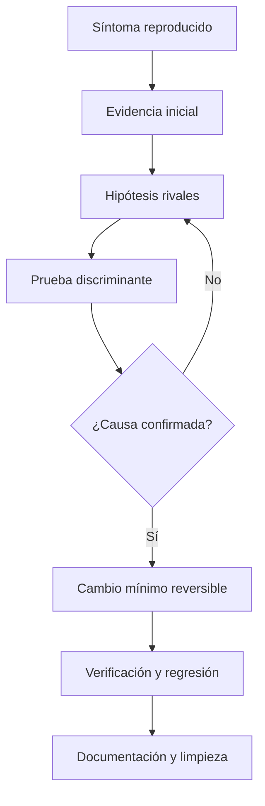
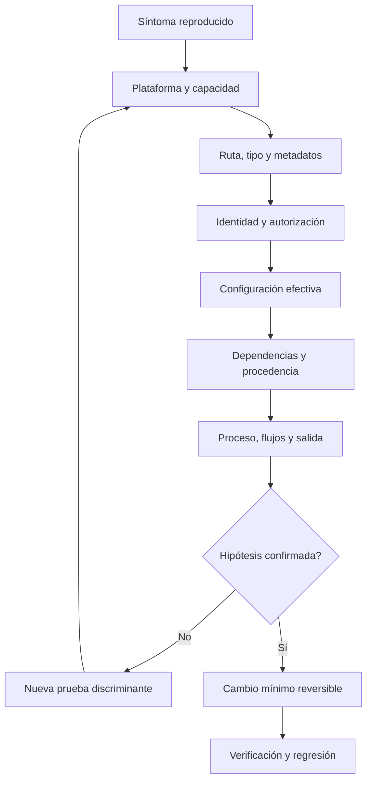

# SE-035 — Taller: preparar y reparar un entorno reproducible

[← SE-034](../../classes/part-02-sistemas-operativos-terminal-y-automatizacion-base/se-034-virtualizacion-wsl-y-aislamiento-local/README.md) · [↑ Parte 02](../../classes/part-02-sistemas-operativos-terminal-y-automatizacion-base/README.md) · [📚 Índice completo](../../classes/README.md) · [SE-036 →](../../classes/part-02-sistemas-operativos-terminal-y-automatizacion-base/se-036-proyecto-kit-de-diagnostico-multiplataforma/README.md)

> Estado: **PLANNED** · Borrador público conservado íntegramente y sometido a auditoría técnica y pedagógica.

## Punto profesional y fundamento pedagógico

**Punto profesional.** La clase existe para preparar, romper, diagnosticar y restaurar un entorno desde un runbook verificable.

**Por qué aparece aquí.** Se sitúa después de **Virtualización, WSL y aislamiento local** y antes de **Proyecto: kit de diagnóstico multiplataforma**: convierte el conocimiento anterior en una decisión observable que la clase siguiente podrá reutilizar. La continuidad se comprueba en el artefacto, no por compartir vocabulario.

**Error conceptual que debe corregir.** Resolver el síntoma cambiando varias variables sin conservar una reproducción.

**Secuencia de aprendizaje.** Antes de leer la solución, el estudiante predice el resultado del caso normal y del error conceptual anterior. Luego explica un caso resuelto paso a paso, construye un contraejemplo que cambie la decisión y, sin consultar el texto, reconstruye el mecanismo y lo aplica a una entrada nueva. La secuencia usa predicción, explicación propia, contraste y recuperación. [ICAP](https://icap.education.asu.edu/research) distingue participación de construcción de conocimiento; [How People Learn II](https://nap.nationalacademies.org/catalog/24783/how-people-learn-ii-learners-contexts-and-cultures) exige conectar conocimiento previo, contexto y transferencia; la [práctica de recuperación](https://pubmed.ncbi.nlm.nih.gov/16507066/) respalda producir de nuevo la explicación tras una demora; y [Education for Life and Work](https://nap.nationalacademies.org/resource/13398/dbasse_084153.pdf) exige devolución que explique la causa del error.

**Evidencia de aprendizaje.** Runbook.md con estado inicial, fallo, hipótesis, reparación, rollback y repetición limpia. Debe contener predicción previa, observación, explicación causal, contraejemplo, criterio de aceptación y una nota de qué dato haría cambiar la conclusión.

**Límite de la conclusión.** La reparación demostrada cubre solo las versiones declaradas.

### Trazabilidad fuente → afirmación

| Fuente primaria u oficial | Afirmación que respalda | Lo que no prueba |
|---|---|---|
| [Microsoft Learn — Sysinternals documentation](https://learn.microsoft.com/sysinternals/) | documenta el comportamiento de Windows o PowerShell que se compara con el contrato POSIX | No demuestra por sí sola que el artefacto del estudiante sea correcto. |
| [The Open Group Base Specifications, Issue 8](https://pubs.opengroup.org/onlinepubs/9799919799/) | define el contrato portable de procesos, rutas, entorno o shell que se contrasta entre sistemas | No demuestra por sí sola que el artefacto del estudiante sea correcto. |
| [systemd manual pages](https://www.freedesktop.org/software/systemd/man/latest/) | define ciclo de vida, supervisión o consulta de eventos en systemd | No demuestra por sí sola que el artefacto del estudiante sea correcto. |
| [Python documentation — subprocess](https://docs.python.org/3/library/subprocess.html) | define la semántica y los límites de la API de Python utilizada en el experimento | No demuestra por sí sola que el artefacto del estudiante sea correcto. |

## Antes de empezar

Este taller integra las clases 25 a 34. Recibirás una copia deliberadamente defectuosa del entorno del analizador local de eventos: ruta dependiente del directorio actual, configuración dominada por una variable obsoleta, dependencia incompatible y permisos excesivos aplicados como “solución”. El objetivo no es hacerlo funcionar lo antes posible. Es explicar cada fallo, intervenir con el menor cambio y dejar un procedimiento reproducible.

### Resultado de aprendizaje

Al terminar podrás conducir un diagnóstico completo desde síntoma hasta verificación y reversión, conservando evidencia y evitando reparaciones destructivas.

## Prerrequisitos

Clases `SE-025`–`SE-034`, carpeta desechable y bitácora. Debes poder ejecutar el kit de diagnóstico multiplataforma en solo lectura y explicar sus códigos, configuración y adaptadores.

## Problema auténtico

El entorno del analizador local de eventos acumula cuatro intentos de reparación: ruta absoluta personal, permisos amplios, dependencia global y variable obsoleta. Ahora funciona solo en una sesión y nadie puede atribuir qué cambio produjo qué resultado.

## Objetivos observables

Podrás estabilizar un escenario; convertir síntomas en afirmaciones; formular hipótesis rivales; aplicar un cambio mínimo; verificar regresión; y entregar reversión con riesgo residual explícito.

## Temas y por qué importan

| Tema | Mecanismo | Decisión habilitada |
| --- | --- | --- |
| Captura inicial | conserva estado antes de intervenir | reproducir y comparar |
| Hipótesis rival | exige pruebas con resultados distintos | evitar la primera explicación cómoda |
| Cambio mínimo | limita variables y radio de efecto | atribuir resultado y revertir |
| Regresión | repite contratos vecinos | comprobar que reparar no rompió otra cosa |
## Mapa conceptual

El ciclo puede repetirse varias veces. Cada iteración cambia una sola variable relevante y conserva el resultado negativo como evidencia.

## Conceptos y decisiones

### Estabilizar el escenario antes de intervenir

Se registra plataforma, versión, arquitectura, shell, hora de inicio y síntoma exacto. Luego se copia el laboratorio o se usa un entorno desechable. No se actualiza, reinstala o elimina nada antes de capturar el estado que permite reproducir.

Estabilizar no significa congelar un sistema productivo sin autorización. En este taller los datos son ficticios y el entorno está acotado.

### Convertir el síntoma en una afirmación comprobable

“No funciona” se transforma en: comando ejecutado, entrada, resultado esperado, resultado observado, código de salida y alcance. Se separa el primer fallo observable de mensajes secundarios.

Una buena hipótesis relaciona mecanismo y evidencia: “la variable `EVENT_ANALYZER_CONFIG` tiene mayor precedencia y dirige a una ruta inexistente”. La prueba mínima ejecuta con entorno saneado; reinstalar no discrimina esta causa.

### Reducir incertidumbre por capas

El orden se ajusta a la evidencia, pero impide saltar a una única explicación favorita.

### Aplicar un cambio mínimo y registrar su radio de efecto

Cada intervención declara archivos, usuarios y procesos afectados; autoridad requerida; reversión; y señal de éxito. Se prefiere corregir configuración del proyecto antes que una variable global, o restaurar permiso mínimo antes que abrir acceso general.

Si un cambio no explica el resultado, se revierte antes de probar otro. Acumular intentos impide atribuir causalidad.

### Verificar incluye el caso original y casos vecinos

Que el analizador local de eventos inicie una vez no prueba reparación. Se repite el escenario original desde otro directorio, con configuración ausente y con ruta con espacios. Se comprueba código de salida, stdout/stderr, ausencia del secreto centinela y estado final de permisos.

La regresión busca que la corrección no haya roto otro contrato. El kit de diagnóstico multiplataforma conserva versiones y matriz de plataforma para que otra persona pueda repetir.

### Documentar decisión y riesgo residual

El informe final contiene hechos, causa, corrección, evidencia posterior y límites. Si solo se mitigó el síntoma, se dice. Si no se reprodujo en macOS, no se marca esa plataforma como validada.

## Definiciones de trabajo

- **estado inicial:** conjunto mínimo de condiciones antes de intervenir;
- **hipótesis rival:** explicación alternativa compatible con el síntoma;
- **prueba discriminante:** observación cuyo resultado separa hipótesis;
- **cambio mínimo:** intervención acotada que permite atribuir efecto;
- **regresión:** pérdida de una propiedad previamente satisfecha.

## Caso conductor: incidente incidente-de-diagnóstico-01

Secuencia esperada del taller:

1. El analizador local de eventos termina con código de precondición ausente.
2. El kit de diagnóstico multiplataforma revela que `EVENT_ANALYZER_CONFIG` proviene del entorno y apunta a una ruta relativa.
3. La ruta cambia con el directorio de trabajo.
4. Un intento previo otorgó escritura amplia al directorio.
5. Al corregir la fuente de configuración aparece una dependencia fuera del rango soportado.
6. Se crea un entorno de proyecto con versión fijada, se restaura mínimo privilegio y se ejecutan pruebas.

Hay más de un fallo para evitar que la primera corrección se confunda con cierre completo.

## Práctica guiada

Prepara una carpeta de laboratorio, nunca una instalación real del sistema. Conserva una bitácora con esta estructura:

| Paso | Hipótesis | Evidencia buscada | Acción | Resultado | Decisión |
|---|---|---|---|---|---|
| 1 | La ruta viene del entorno | Configuración efectiva | `el kit de diagnóstico multiplataforma config explain` | Variable presente | Probar entorno mínimo |

Luego:

1. reproduce sin modificar;
2. captura ficha de plataforma;
3. traza ruta y permisos;
4. explica precedencia;
5. verifica dependencia y procedencia;
6. aplica cambios de uno en uno;
7. ejecuta matriz de regresión;
8. revierte el laboratorio y demuestra limpieza.

## Ejemplo mínimo

El analizador local de eventos busca una ruta relativa equivocada. Ejecutarlo desde otra carpeta reproduce el fallo; pasar una ruta absoluta de laboratorio lo evita. La prueba apunta al contexto de resolución, no a permisos ni dependencia.

## Ejemplo profesional

Una dependencia incompatible aparece después de corregir configuración. El equipo no deshace la primera conclusión: registra dos causas encadenadas, aísla la versión por proyecto y prueba ambos escenarios por separado.

## Ejercicios

1. Reescribe “no funciona” como resultado esperado/observado y alcance.
2. Propón dos hipótesis para acceso denegado y una prueba que las separe.
3. Diseña una matriz de regresión para ruta, configuración y dependencia.

## Reto verificable

Entrega el laboratorio defectuoso y tu bitácora a otra persona. Debe reproducir, reparar con tus decisiones y volver al estado limpio sin instrucciones orales.

## Preguntas frecuentes

### ¿Reinstalar puede ser una prueba válida?

Solo si discrimina una hipótesis y conserva evidencia; normalmente cambia demasiadas variables para ser el primer paso.

### ¿Una mitigación equivale a corregir la causa?

No. Puede reducir impacto mientras la causa permanece; el informe debe distinguirlas.

## Fallo controlado y diagnóstico

Aplica deliberadamente dos cambios a la vez y observa que no puedes atribuir el éxito. Revierte ambos, repite uno por uno y corrige la bitácora con esa limitación.

## Errores comunes y cómo corregirlos

| Síntoma | Causa conceptual | Corrección |
|---|---|---|
| Se borra y reinstala al comienzo | Se destruyó evidencia antes de formular hipótesis | Capturar y reproducir primero |
| Varias cosas cambian a la vez | No puede atribuirse el resultado | Un cambio mínimo, medir y revertir si no explica |
| Se repara solo el caso feliz | No se verificaron contratos vecinos | Ejecutar una matriz de regresión adversa |
| El informe enumera comandos sin razonamiento | Falta relación causal | Registrar hipótesis, evidencia y decisión por paso |
| Se declara soporte en tres sistemas | Solo se probó uno | Separar diseño esperado de evidencia ejecutada |

## Entorno y archivos clave

`work/SE-035/broken-environment/`, `baseline.json`, `diagnostic-log.md`, `regression.md` y `cleanup.md`. Todo debe poder borrarse sin afectar configuración global.

## Seguridad, ética y accesibilidad

No uses un equipo productivo ni datos reales. Declara toda acción que modifica estado, proporciona alternativa manual legible y evita que la guía dependa solo de capturas.

## Transferencia

Aplica el ciclo a un fallo de CI: conserva ejecución, formula hipótesis de entorno/código, cambia una variable y distingue mitigación de corrección.

## Evaluación y evidencia

Se exige reproducción, hipótesis rivales, pruebas discriminantes, cambios unitarios, regresión, reversión y revisión independiente. Velocidad sin trazabilidad no mejora la calificación.

## Criterio de cierre

El taller se aprueba cuando otra persona puede reproducir el fallo, seguir la evidencia, comprender la causa, aplicar la corrección mínima, ejecutar regresión y revertir el laboratorio usando tu documentación.

## Límites y siguiente paso

El escenario es local, deliberadamente controlado y no autoriza intervenir equipos de terceros. La clase final convierte el procedimiento en un producto pequeño: el kit el kit de diagnóstico multiplataforma, con contrato, adaptadores, pruebas y entrega profesional.

## Fuentes

- [Microsoft Learn — Sysinternals documentation](https://learn.microsoft.com/sysinternals/) — documenta el comportamiento de Windows o PowerShell que se compara con el contrato POSIX.
- [The Open Group Base Specifications, Issue 8](https://pubs.opengroup.org/onlinepubs/9799919799/) — define el contrato portable de procesos, rutas, entorno o shell que se contrasta entre sistemas.
- [systemd manual pages](https://www.freedesktop.org/software/systemd/man/latest/) — define ciclo de vida, supervisión o consulta de eventos en systemd.
- [Python documentation — subprocess](https://docs.python.org/3/library/subprocess.html) — define la semántica y los límites de la API de Python utilizada en el experimento.

## Glosario

- **Hipótesis discriminante:** explicación cuya prueba produce resultados diferentes frente a alternativas.
- **Radio de efecto:** recursos, personas o procesos que un cambio puede afectar.
- **Regresión:** fallo introducido en una capacidad previamente válida.
- **Reproducción:** procedimiento capaz de volver a mostrar el comportamiento bajo condiciones declaradas.
- **Reversión:** retorno verificable al estado anterior o a uno seguro definido.

---
[← SE-034](../../classes/part-02-sistemas-operativos-terminal-y-automatizacion-base/se-034-virtualizacion-wsl-y-aislamiento-local/README.md) · [↑ Parte 02](../../classes/part-02-sistemas-operativos-terminal-y-automatizacion-base/README.md) · [📚 Índice completo](../../classes/README.md) · [SE-036 →](../../classes/part-02-sistemas-operativos-terminal-y-automatizacion-base/se-036-proyecto-kit-de-diagnostico-multiplataforma/README.md)
