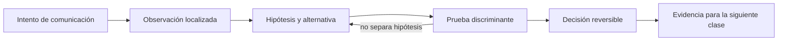

# SE-038 — Ethernet, Wi-Fi, direccionamiento y redes locales

[← SE-037 — Modelos OSI y TCP/IP como herramientas de diagnóstico](../../classes/part-03-redes-internet-y-protocolos/se-037-modelos-osi-y-tcp-ip-como-herramientas-de-diagnostico/README.md) · [↑ Parte 03](../../classes/part-03-redes-internet-y-protocolos/README.md) · [📚 Índice completo](../../classes/README.md) · [🌐 Portal](../../site/classes/SE-038.html) · [SE-039 — IPv4, IPv6, subredes, rutas y NAT →](../../classes/part-03-redes-internet-y-protocolos/se-039-ipv4-ipv6-subredes-rutas-y-nat/README.md)

> Estado: **PLANNED** · Borrador público conservado íntegramente y sometido a auditoría técnica y pedagógica.

## Punto profesional y fundamento pedagógico

**Punto profesional.** La clase existe para explicar entrega local mediante tramas, direcciones de enlace y resolución de vecinos.

**Por qué aparece aquí.** Se sitúa después de **Modelos OSI y TCP/IP como herramientas de diagnóstico** y antes de **IPv4, IPv6, subredes, rutas y NAT**: convierte el conocimiento anterior en una decisión observable que la clase siguiente podrá reutilizar. La continuidad se comprueba en el artefacto, no por compartir vocabulario.

**Error conceptual que debe corregir.** Confundir dirección MAC con identidad global o ARP con enrutamiento.

**Secuencia de aprendizaje.** Antes de leer la solución, el estudiante predice el resultado del caso normal y del error conceptual anterior. Luego explica un caso resuelto paso a paso, construye un contraejemplo que cambie la decisión y, sin consultar el texto, reconstruye el mecanismo y lo aplica a una entrada nueva. La secuencia usa predicción, explicación propia, contraste y recuperación. [ICAP](https://icap.education.asu.edu/research) distingue participación de construcción de conocimiento; [How People Learn II](https://nap.nationalacademies.org/catalog/24783/how-people-learn-ii-learners-contexts-and-cultures) exige conectar conocimiento previo, contexto y transferencia; la [práctica de recuperación](https://pubmed.ncbi.nlm.nih.gov/16507066/) respalda producir de nuevo la explicación tras una demora; y [Education for Life and Work](https://nap.nationalacademies.org/resource/13398/dbasse_084153.pdf) exige devolución que explique la causa del error.

**Evidencia de aprendizaje.** Lan-trace.md con trama, caché de vecino, broadcast y fallo de resolución. Debe contener predicción previa, observación, explicación causal, contraejemplo, criterio de aceptación y una nota de qué dato haría cambiar la conclusión.

**Límite de la conclusión.** Wi‑Fi y Ethernet comparten objetivos pero no todos los mecanismos físicos.

### Trazabilidad fuente → afirmación

| Fuente primaria u oficial | Afirmación que respalda | Lo que no prueba |
|---|---|---|
| [RFC 826 — An Ethernet Address Resolution Protocol](https://www.rfc-editor.org/rfc/rfc826) | define la semántica normativa del protocolo nombrado en el título y sus límites interoperables | No demuestra por sí sola que el artefacto del estudiante sea correcto. |
| [RFC 894 — IP Datagrams over Ethernet Networks](https://www.rfc-editor.org/rfc/rfc894) | define la semántica normativa del protocolo nombrado en el título y sus límites interoperables | No demuestra por sí sola que el artefacto del estudiante sea correcto. |
| [RFC 1122 — Requirements for Internet Hosts: Communication Layers](https://www.rfc-editor.org/rfc/rfc1122) | define la semántica normativa del protocolo nombrado en el título y sus límites interoperables | No demuestra por sí sola que el artefacto del estudiante sea correcto. |

## Antes de empezar

Esta clase continúa la **petición observable de extremo a extremo de la Parte 3**. No estudia redes como una lista de siglas: añade una decisión concreta al mismo recorrido y obliga a explicar dónde nace cada señal. Conserva una bitácora con cuatro columnas —hecho, interpretación, hipótesis rival y próxima prueba—; si una conclusión no apunta a evidencia, todavía no es diagnóstico.

## Prerrequisitos

- Haber completado `SE-037` o poder explicar su evidencia principal.
- Trabajar solo contra `localhost`, una red propia o un destino con autorización expresa.
- Disponer de navegador, `curl` y herramientas equivalentes del sistema; registra versiones y plataforma.

## Problema auténtico

La petición observable de extremo a extremo funciona por cable, pero pierde peticiones por Wi‑Fi. El equipo culpa a Internet aunque el fallo aparece antes del router. Debe distinguir asociación inalámbrica, acceso al medio, dirección de enlace, descubrimiento del vecino y puerta de enlace.

## Objetivos observables

Al terminar podrás:

1. distinguir alcance de una MAC y de una dirección IP;
2. explicar cómo un host descubre al siguiente salto en IPv4;
3. comparar Ethernet y Wi‑Fi sin reducirlos a cable versus radio;
4. diagnosticar congestión, señal y conflicto sin capturar tráfico ajeno;
5. comunicar límites y una siguiente prueba sin presentar inferencias como hechos.

## Mapa conceptual



El ciclo evita el diagnóstico por intuición. La observación se ubica antes de interpretarse; la prueba debe producir resultados diferentes bajo hipótesis rivales; la decisión conserva una salida de recuperación. En esta clase la pregunta rectora es: **¿Qué debe ocurrir antes de que un paquete pueda abandonar la red local?**

## Temas y por qué importan

| Núcleo | Pregunta de trabajo | Evidencia esperada |
|---|---|---|
| alcance | ¿dónde es válido este identificador o estado? | mapa de fronteras |
| mecanismo | ¿qué entrada produce qué transición? | secuencia comentada |
| garantía | ¿qué promete el protocolo y qué no? | ejemplo y contraejemplo |
| diagnóstico | ¿qué prueba separa causas plausibles? | comparación reproducible |
| operación | ¿cómo falla, se limita y se recupera? | caso sano, degradado y restaurado |

## Conceptos y decisiones

### 1. Enlace y dominio local

Una interfaz transmite tramas dentro de un enlace. La dirección MAC identifica una interfaz en ese alcance, no una identidad global de la persona ni una ruta por Internet. Switches aprenden asociaciones entre direcciones y puertos; ese aprendizaje expira y puede cambiar al mover un equipo.

### 2. Ethernet y acceso compartido

Ethernet moderno suele operar con enlaces conmutados full‑duplex: cada puerto es un dominio de colisión separado. Broadcast y multicast aún consumen alcance local. Velocidad negociada, errores, dúplex y saturación del uplink son señales distintas; una interfaz a 1 Gb/s no garantiza ese caudal extremo a extremo.

### 3. Wi‑Fi, asociación y medio

Wi‑Fi comparte espectro y coordina acceso por contención. Intensidad de señal no equivale a calidad: interferencia, canal, retransmisiones, distancia y capacidad del punto de acceso alteran latencia y pérdida. Asociarse al SSID solo prueba acceso al enlace, no dirección válida, ruta ni DNS.

### 4. ARP y siguiente salto

En IPv4, ARP resuelve una dirección de protocolo a una dirección de enlace en el dominio local. Para un destino remoto, el host resuelve la MAC de la puerta de enlace, no la del servidor. Una entrada vecina incompleta orienta el diagnóstico hacia enlace, VLAN o puerta de enlace.

### 5. Segmentación y fronteras

VLAN, redes invitadas y aislamiento de clientes crean dominios lógicos sobre infraestructura física. Dos dispositivos conectados al mismo punto de acceso pueden no comunicarse. La decisión de segmentar reduce movimiento lateral, pero exige documentar servicios permitidos y rutas de administración.

## Definiciones de trabajo

- **trama:** unidad transmitida por un protocolo de enlace.
- **MAC:** dirección utilizada en un dominio de enlace.
- **ARP:** protocolo IPv4 de resolución entre dirección IP y dirección de enlace.
- **gateway:** siguiente salto usado para alcanzar otras redes.
- **VLAN:** segmentación lógica de dominios de enlace sobre infraestructura compartida.

Estas definiciones son operativas: precisan el uso dentro de la petición observable de extremo a extremo y deben leerse junto a las fuentes. No convierten un término histórico o dependiente de implementación en una garantía universal.

## Ejemplo mínimo

Con una dirección local, máscara y destino remoto, determina cuál IP se consulta en la tabla de vecinos. Comprueba con `arp -a`, `ip neigh` o equivalente. Explica por qué no aparece la MAC del destino remoto.

El ejemplo se acepta cuando incluye predicción previa, salida relevante y explicación de qué hipótesis descarta. Copiar una salida sin interpretación no demuestra comprensión.

## Ejemplo profesional

La petición observable de extremo a extremo compara cable y Wi‑Fi con la misma petición, tamaño y ventana temporal. Registra RSSI si está disponible, pérdida al gateway, latencia al origen y retransmisiones observables. Solo atribuye el problema al Wi‑Fi si el deterioro ya existe hacia el gateway y desaparece bajo una condición controlada.

La diferencia profesional es la trazabilidad: la decisión conecta requisito, mecanismo, señal, riesgo y recuperación. El equipo puede cambiar de herramienta sin perder el razonamiento.

## Práctica guiada

1. identifica interfaz activa, dirección, prefijo y puerta de enlace sin publicar datos completos.
2. representa el dominio broadcast y los límites de VLAN.
3. vacía solo una entrada vecina de laboratorio o espera su expiración.
4. observa la consulta y respuesta ARP con tráfico propio.
5. compara dos ubicaciones Wi‑Fi conservando destino y carga.
6. entrega `trace.md` con comandos redactados, marcas de tiempo y condiciones de repetición.

## Ejercicios

1. **Reconstrucción:** explica el mecanismo a una persona que solo conoce la clase anterior; incluye un dibujo y un contraejemplo.
2. **Variación:** repite el caso cambiando una sola variable —familia IP, interfaz, caché o intermediario— y justifica la diferencia.
3. **Revisión adversarial:** escribe una hipótesis rival que también explique el síntoma y diseña la observación mínima que las separe.
4. **Transferencia:** aplica el modelo a una actualización de software o videollamada y marca qué supuestos dejan de ser válidos.

## Reto verificable

Entrega una traza comentada que permita a otra persona responder: qué se intentó, qué frontera se observó, qué garantía aplicaba, qué falló, qué alternativa fue descartada y cómo se restauró el estado. La persona revisora debe poder repetir al menos una prueba sin instrucciones orales.

## Demostración guiada

1. Predice el primer evento observable y el resultado sano.
2. Ejecuta una sola petición de la petición observable de extremo a extremo y asigna cada marca a una frontera.
3. Introduce el fallo controlado descrito abajo.
4. Compara por **primera divergencia**, no por cantidad de errores posteriores.
5. Restaura, repite y conserva evidencia de recuperación.

Una demostración que no incluye restauración solo prueba cómo romper el laboratorio.

## Preguntas frecuentes

### ¿Una respuesta a `ping` demuestra que el servicio funciona?

No. Puede demostrar una respuesta ICMP bajo una ruta y política concretas. No valida DNS, puerto, TLS, HTTP ni la operación de negocio.

### ¿Puedo concluir desde una única captura?

Solo afirmaciones limitadas al punto, instante y tráfico observados. Para causalidad necesitas una predicción, una intervención controlada o evidencia correlacionada adicional.

### ¿Debo usar exactamente las mismas herramientas?

No. Debes conservar preguntas, unidades, alcance y evidencia. Documenta equivalencias y diferencias de plataforma.

## Fallo controlado y diagnóstico

Configura en una red de laboratorio una puerta de enlace inexistente o desconecta el punto de acceso. Diferencia `sin asociación`, `sin dirección`, `vecino no resuelto` y `gateway sin respuesta`; restaura automáticamente la configuración original.

Registra estado previo, acción, síntoma, primera divergencia, causa, corrección y estado posterior. Si la acción afecta red compartida, requiere privilegios amplios o no tiene rollback probado, reemplázala por una simulación local.

## Errores comunes y cómo corregirlos

| Error | Por qué falla | Corrección |
|---|---|---|
| culpar al último componente nombrado | el síntoma puede aparecer lejos de la causa | localizar la primera divergencia |
| usar éxito parcial como prueba total | cada protocolo ofrece un alcance distinto | enumerar qué capas aún no se probaron |
| cambiar varias variables | impide atribuir el resultado | una intervención y una predicción por vez |
| capturar todo | aumenta riesgo y ruido | limitar interfaz, destino, tiempo y campos |
| ocultar el error con un bypass | elimina una protección sin explicar causa | aislar solo en laboratorio y restaurar |

## Entorno y archivos clave

```text
work/SE-038/
├── README.md          # alcance, autorización y reproducción
├── request.txt        # petición sin credenciales
├── trace.md           # línea temporal y evidencias
├── failure-report.md  # hipótesis, prueba y recuperación
└── diagram.mmd        # mapa accesible acompañado de texto
```

Los archivos son contenedores, no evidencia automática. `README.md` declara sistema operativo, versiones, red utilizada y limpieza. Nunca confirmes cambios de red destructivos sin una ruta de recuperación.

## Seguridad, ética y accesibilidad

- captura únicamente tráfico propio o autorizado y durante la ventana mínima;
- redacta cookies, tokens, query strings, IP privadas y nombres de personas;
- no desactives TLS, firewall o aislamiento como solución permanente;
- acompaña color y diagramas con orden, etiquetas y una explicación textual;
- ofrece comandos equivalentes o resultados esperados para quien no pueda modificar una red;
- considera que telemetría e IP pueden identificar o perfilar personas.

## Transferencia

Traslada el mecanismo a una segunda red o protocolo sin repetir comandos mecánicamente. Conserva la pregunta y el criterio de evidencia; cambia los supuestos de dirección, intermediación y política. Escribe qué observación seguiría siendo válida y cuál depende de la topología original.

## Evaluación y evidencia

| Criterio | Evidencia mínima | Señal de dominio |
|---|---|---|
| modelo causal | mapa con fronteras y unidades correctas | explica interacción y fugas del modelo |
| protocolo | garantía y límite apoyados en fuente | distingue semántica de implementación |
| diagnóstico | hipótesis rival y prueba discriminante | encuentra primera divergencia |
| reproducibilidad | contexto, comandos y salida redactada | otra persona repite el resultado |
| responsabilidad | autorización, minimización y rollback | reduce riesgo sin borrar evidencia |

La clase no se aprueba por ejecutar comandos. Se aprueba cuando la evidencia sostiene las conclusiones y declara lo que todavía no puede saberse.

## Fuentes


- [RFC 826 — An Ethernet Address Resolution Protocol](https://www.rfc-editor.org/rfc/rfc826) — define la semántica normativa del protocolo nombrado en el título y sus límites interoperables.
- [RFC 894 — IP Datagrams over Ethernet Networks](https://www.rfc-editor.org/rfc/rfc894) — define la semántica normativa del protocolo nombrado en el título y sus límites interoperables.
- [RFC 1122 — Requirements for Internet Hosts: Communication Layers](https://www.rfc-editor.org/rfc/rfc1122) — define la semántica normativa del protocolo nombrado en el título y sus límites interoperables.

Las RFC describen contratos de protocolo, no certifican una red, proveedor o herramienta. Cada afirmación de comportamiento local debe contrastarse con evidencia de ese entorno.

## Límites y siguiente paso

La captura local no ve decisiones internas del switch ni demuestra ausencia de interferencia. No se enseña a evadir segmentación. La clase siguiente explica cómo IP selecciona redes y próximos saltos.

## Glosario

- **trama:** unidad transmitida por un protocolo de enlace.
- **MAC:** dirección utilizada en un dominio de enlace.
- **ARP:** protocolo IPv4 de resolución entre dirección IP y dirección de enlace.
- **gateway:** siguiente salto usado para alcanzar otras redes.
- **VLAN:** segmentación lógica de dominios de enlace sobre infraestructura compartida.

---

[← SE-037 — Modelos OSI y TCP/IP como herramientas de diagnóstico](../../classes/part-03-redes-internet-y-protocolos/se-037-modelos-osi-y-tcp-ip-como-herramientas-de-diagnostico/README.md) · [↑ Parte 03](../../classes/part-03-redes-internet-y-protocolos/README.md) · [📚 Índice completo](../../classes/README.md) · [🌐 Portal](../../site/classes/SE-038.html) · [SE-039 — IPv4, IPv6, subredes, rutas y NAT →](../../classes/part-03-redes-internet-y-protocolos/se-039-ipv4-ipv6-subredes-rutas-y-nat/README.md)
