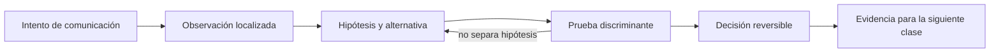

# SE-039 — IPv4, IPv6, subredes, rutas y NAT

[← SE-038 — Ethernet, Wi-Fi, direccionamiento y redes locales](../../classes/part-03-redes-internet-y-protocolos/se-038-ethernet-wi-fi-direccionamiento-y-redes-locales/README.md) · [↑ Parte 03](../../classes/part-03-redes-internet-y-protocolos/README.md) · [📚 Índice completo](../../classes/README.md) · [🌐 Portal](../../site/classes/SE-039.html) · [SE-040 — TCP, UDP, QUIC y decisiones de transporte →](../../classes/part-03-redes-internet-y-protocolos/se-040-tcp-udp-quic-y-decisiones-de-transporte/README.md)

> Estado: **PLANNED** · Borrador público conservado íntegramente y sometido a auditoría técnica y pedagógica.

## Punto profesional y fundamento pedagógico

**Punto profesional.** La clase existe para decidir entrega directa o por gateway usando prefijos, rutas y traducción de direcciones.

**Por qué aparece aquí.** Se sitúa después de **Ethernet, Wi-Fi, direccionamiento y redes locales** y antes de **TCP, UDP, QUIC y decisiones de transporte**: convierte el conocimiento anterior en una decisión observable que la clase siguiente podrá reutilizar. La continuidad se comprueba en el artefacto, no por compartir vocabulario.

**Error conceptual que debe corregir.** Creer que NAT es firewall o que una IP privada nunca aparece fuera de una LAN.

**Secuencia de aprendizaje.** Antes de leer la solución, el estudiante predice el resultado del caso normal y del error conceptual anterior. Luego explica un caso resuelto paso a paso, construye un contraejemplo que cambie la decisión y, sin consultar el texto, reconstruye el mecanismo y lo aplica a una entrada nueva. La secuencia usa predicción, explicación propia, contraste y recuperación. [ICAP](https://icap.education.asu.edu/research) distingue participación de construcción de conocimiento; [How People Learn II](https://nap.nationalacademies.org/catalog/24783/how-people-learn-ii-learners-contexts-and-cultures) exige conectar conocimiento previo, contexto y transferencia; la [práctica de recuperación](https://pubmed.ncbi.nlm.nih.gov/16507066/) respalda producir de nuevo la explicación tras una demora; y [Education for Life and Work](https://nap.nationalacademies.org/resource/13398/dbasse_084153.pdf) exige devolución que explique la causa del error.

**Evidencia de aprendizaje.** Routing-lab.md con longest-prefix match y transformaciones antes/después de NAT. Debe contener predicción previa, observación, explicación causal, contraejemplo, criterio de aceptación y una nota de qué dato haría cambiar la conclusión.

**Límite de la conclusión.** La topología simulada no demuestra políticas del proveedor.

### Trazabilidad fuente → afirmación

| Fuente primaria u oficial | Afirmación que respalda | Lo que no prueba |
|---|---|---|
| [RFC 8200 — Internet Protocol, Version 6](https://www.rfc-editor.org/rfc/rfc8200) | define la semántica normativa del protocolo nombrado en el título y sus límites interoperables | No demuestra por sí sola que el artefacto del estudiante sea correcto. |
| [RFC 1918 — Address Allocation for Private Internets](https://www.rfc-editor.org/rfc/rfc1918) | define la semántica normativa del protocolo nombrado en el título y sus límites interoperables | No demuestra por sí sola que el artefacto del estudiante sea correcto. |
| [RFC 3022 — Traditional IP Network Address Translator](https://www.rfc-editor.org/rfc/rfc3022) | define la semántica normativa del protocolo nombrado en el título y sus límites interoperables | No demuestra por sí sola que el artefacto del estudiante sea correcto. |

## Antes de empezar

Esta clase continúa la **petición observable de extremo a extremo de la Parte 3**. No estudia redes como una lista de siglas: añade una decisión concreta al mismo recorrido y obliga a explicar dónde nace cada señal. Conserva una bitácora con cuatro columnas —hecho, interpretación, hipótesis rival y próxima prueba—; si una conclusión no apunta a evidencia, todavía no es diagnóstico.

## Prerrequisitos

- Haber completado `SE-038` o poder explicar su evidencia principal.
- Trabajar solo contra `localhost`, una red propia o un destino con autorización expresa.
- Disponer de navegador, `curl` y herramientas equivalentes del sistema; registra versiones y plataforma.

## Problema auténtico

Una instancia de la petición observable de extremo a extremo responde desde una subred y desaparece desde otra. Hay direcciones privadas, doble NAT y rutas que se solapan con una VPN. El equipo necesita leer prefijos y tablas de ruta antes de abrir puertos al azar.

## Objetivos observables

Al terminar podrás:

1. calcular red, rango y pertenencia a partir de CIDR;
2. explicar selección de ruta por prefijo más específico;
3. contrastar alcance y autoconfiguración de IPv4 e IPv6;
4. explicar qué traduce NAT y qué problemas no resuelve;
5. comunicar límites y una siguiente prueba sin presentar inferencias como hechos.

## Mapa conceptual



El ciclo evita el diagnóstico por intuición. La observación se ubica antes de interpretarse; la prueba debe producir resultados diferentes bajo hipótesis rivales; la decisión conserva una salida de recuperación. En esta clase la pregunta rectora es: **¿Cómo decide un host si entrega localmente o envía a un router?**

## Temas y por qué importan

| Núcleo | Pregunta de trabajo | Evidencia esperada |
|---|---|---|
| alcance | ¿dónde es válido este identificador o estado? | mapa de fronteras |
| mecanismo | ¿qué entrada produce qué transición? | secuencia comentada |
| garantía | ¿qué promete el protocolo y qué no? | ejemplo y contraejemplo |
| diagnóstico | ¿qué prueba separa causas plausibles? | comparación reproducible |
| operación | ¿cómo falla, se limita y se recupera? | caso sano, degradado y restaurado |
## Conceptos y decisiones

### 1. Dirección y prefijo

Una dirección identifica una interfaz dentro de un alcance; el prefijo describe qué bits designan la red. En `192.0.2.18/28`, los primeros 28 bits determinan la red y quedan 16 valores en el bloque. Memorizar máscaras sin traducirlas a pertenencia conduce a rutas y reglas erróneas.

### 2. Tabla de rutas

Cada entrada combina destino, longitud de prefijo, siguiente salto, interfaz y a veces métrica. Se elige la coincidencia de prefijo más larga antes de considerar una ruta por defecto. `traceroute` muestra respuestas de algunos saltos, no la tabla completa ni necesariamente el camino inverso.

### 3. IPv4, espacio privado y NAT

RFC 1918 reserva bloques sin significado global. NAT modifica direcciones y, en NAPT, puertos, manteniendo estado temporal. Conserva escaso espacio público y permite topologías privadas, pero no es una política de autorización ni cifrado; rompe parte de la transparencia extremo a extremo.

### 4. IPv6 y múltiples alcances

IPv6 amplía direcciones a 128 bits, simplifica el encabezado base y usa Neighbor Discovery en lugar de ARP. Una interfaz puede tener link-local y direcciones de mayor alcance simultáneamente. La ausencia de NAT no implica exposición automática: el filtrado y las rutas siguen gobernando alcanzabilidad.

### 5. MTU, fragmentación y retorno

Una ruta puede transportar paquetes pequeños y fallar con tamaños mayores. IPv6 exige que el origen gestione Path MTU; filtrar indiscriminadamente ICMPv6 rompe funciones esenciales. Además, que el trayecto de ida exista no garantiza una ruta de retorno ni políticas simétricas.

## Definiciones de trabajo

- **prefijo:** cantidad de bits iniciales que identifican una red.
- **ruta:** regla para elegir interfaz y siguiente salto.
- **CIDR:** notación y asignación basada en prefijos de longitud variable.
- **NAT:** traducción de direcciones entre dominios.
- **MTU:** máximo tamaño de unidad que un enlace puede transportar sin tratamiento adicional.

Estas definiciones son operativas: precisan el uso dentro de la petición observable de extremo a extremo y deben leerse junto a las fuentes. No convierten un término histórico o dependiente de implementación en una garantía universal.

## Ejemplo mínimo

Para `192.0.2.18/28`, calcula dirección de red, último valor del bloque y si `192.0.2.31` pertenece. Luego predice qué entrada gana entre `0.0.0.0/0`, `192.0.2.0/24` y `192.0.2.16/28`.

El ejemplo se acepta cuando incluye predicción previa, salida relevante y explicación de qué hipótesis descarta. Copiar una salida sin interpretación no demuestra comprensión.

## Ejemplo profesional

La petición observable de extremo a extremo conserva un inventario redactado de dirección, prefijo, gateway y ruta elegida. Cuando la VPN anuncia `10.0.0.0/8` y la red local usa `10.20.30.0/24`, verifica la coincidencia más específica y documenta el conflicto. La solución puede ser renumerar, dividir rutas o cambiar política; desactivar todo el túnel solo oculta el diseño.

La diferencia profesional es la trazabilidad: la decisión conecta requisito, mecanismo, señal, riesgo y recuperación. El equipo puede cambiar de herramienta sin perder el razonamiento.

## Práctica guiada

1. calcula dos subredes a mano y confirma con una herramienta local.
2. lee la tabla de rutas en Windows o Unix.
3. predice la interfaz usada para tres destinos antes de probar.
4. observa IPv4 e IPv6 hacia un destino de documentación.
5. dibuja dónde cambia una tupla bajo NAT y dónde permanece igual.
6. entrega `trace.md` con comandos redactados, marcas de tiempo y condiciones de repetición.

## Ejercicios

1. **Reconstrucción:** explica el mecanismo a una persona que solo conoce la clase anterior; incluye un dibujo y un contraejemplo.
2. **Variación:** repite el caso cambiando una sola variable —familia IP, interfaz, caché o intermediario— y justifica la diferencia.
3. **Revisión adversarial:** escribe una hipótesis rival que también explique el síntoma y diseña la observación mínima que las separe.
4. **Transferencia:** aplica el modelo a una actualización de software o videollamada y marca qué supuestos dejan de ser válidos.

## Reto verificable

Entrega una traza comentada que permita a otra persona responder: qué se intentó, qué frontera se observó, qué garantía aplicaba, qué falló, qué alternativa fue descartada y cómo se restauró el estado. La persona revisora debe poder repetir al menos una prueba sin instrucciones orales.

## Demostración guiada

1. Predice el primer evento observable y el resultado sano.
2. Ejecuta una sola petición de la petición observable de extremo a extremo y asigna cada marca a una frontera.
3. Introduce el fallo controlado descrito abajo.
4. Compara por **primera divergencia**, no por cantidad de errores posteriores.
5. Restaura, repite y conserva evidencia de recuperación.

Una demostración que no incluye restauración solo prueba cómo romper el laboratorio.

## Preguntas frecuentes

### ¿Una respuesta a `ping` demuestra que el servicio funciona?

No. Puede demostrar una respuesta ICMP bajo una ruta y política concretas. No valida DNS, puerto, TLS, HTTP ni la operación de negocio.

### ¿Puedo concluir desde una única captura?

Solo afirmaciones limitadas al punto, instante y tráfico observados. Para causalidad necesitas una predicción, una intervención controlada o evidencia correlacionada adicional.

### ¿Debo usar exactamente las mismas herramientas?

No. Debes conservar preguntas, unidades, alcance y evidencia. Documenta equivalencias y diferencias de plataforma.

## Fallo controlado y diagnóstico

Añade, solo en un laboratorio y con recuperación preparada, una ruta más específica hacia un siguiente salto inexistente. Observa que vence a la ruta por defecto; elimina esa entrada y confirma recuperación. No modifiques equipos compartidos.

Registra estado previo, acción, síntoma, primera divergencia, causa, corrección y estado posterior. Si la acción afecta red compartida, requiere privilegios amplios o no tiene rollback probado, reemplázala por una simulación local.

## Errores comunes y cómo corregirlos

| Error | Por qué falla | Corrección |
|---|---|---|
| culpar al último componente nombrado | el síntoma puede aparecer lejos de la causa | localizar la primera divergencia |
| usar éxito parcial como prueba total | cada protocolo ofrece un alcance distinto | enumerar qué capas aún no se probaron |
| cambiar varias variables | impide atribuir el resultado | una intervención y una predicción por vez |
| capturar todo | aumenta riesgo y ruido | limitar interfaz, destino, tiempo y campos |
| ocultar el error con un bypass | elimina una protección sin explicar causa | aislar solo en laboratorio y restaurar |

## Entorno y archivos clave

```text
work/SE-039/
├── README.md          # alcance, autorización y reproducción
├── request.txt        # petición sin credenciales
├── trace.md           # línea temporal y evidencias
├── failure-report.md  # hipótesis, prueba y recuperación
└── diagram.mmd        # mapa accesible acompañado de texto
```

Los archivos son contenedores, no evidencia automática. `README.md` declara sistema operativo, versiones, red utilizada y limpieza. Nunca confirmes cambios de red destructivos sin una ruta de recuperación.

## Seguridad, ética y accesibilidad

- captura únicamente tráfico propio o autorizado y durante la ventana mínima;
- redacta cookies, tokens, query strings, IP privadas y nombres de personas;
- no desactives TLS, firewall o aislamiento como solución permanente;
- acompaña color y diagramas con orden, etiquetas y una explicación textual;
- ofrece comandos equivalentes o resultados esperados para quien no pueda modificar una red;
- considera que telemetría e IP pueden identificar o perfilar personas.

## Transferencia

Traslada el mecanismo a una segunda red o protocolo sin repetir comandos mecánicamente. Conserva la pregunta y el criterio de evidencia; cambia los supuestos de dirección, intermediación y política. Escribe qué observación seguiría siendo válida y cuál depende de la topología original.

## Evaluación y evidencia

| Criterio | Evidencia mínima | Señal de dominio |
|---|---|---|
| modelo causal | mapa con fronteras y unidades correctas | explica interacción y fugas del modelo |
| protocolo | garantía y límite apoyados en fuente | distingue semántica de implementación |
| diagnóstico | hipótesis rival y prueba discriminante | encuentra primera divergencia |
| reproducibilidad | contexto, comandos y salida redactada | otra persona repite el resultado |
| responsabilidad | autorización, minimización y rollback | reduce riesgo sin borrar evidencia |

La clase no se aprueba por ejecutar comandos. Se aprueba cuando la evidencia sostiene las conclusiones y declara lo que todavía no puede saberse.

## Fuentes


- [RFC 8200 — Internet Protocol, Version 6](https://www.rfc-editor.org/rfc/rfc8200) — define la semántica normativa del protocolo nombrado en el título y sus límites interoperables.
- [RFC 1918 — Address Allocation for Private Internets](https://www.rfc-editor.org/rfc/rfc1918) — define la semántica normativa del protocolo nombrado en el título y sus límites interoperables.
- [RFC 3022 — Traditional IP Network Address Translator](https://www.rfc-editor.org/rfc/rfc3022) — define la semántica normativa del protocolo nombrado en el título y sus límites interoperables.
- [RFC 1122 — Requirements for Internet Hosts: Communication Layers](https://www.rfc-editor.org/rfc/rfc1122) — define la semántica normativa del protocolo nombrado en el título y sus límites interoperables.

Las RFC describen contratos de protocolo, no certifican una red, proveedor o herramienta. Cada afirmación de comportamiento local debe contrastarse con evidencia de ese entorno.

## Límites y siguiente paso

No cubre protocolos de enrutamiento entre organizaciones ni diseño avanzado de direcciones. NAT puede variar por implementación. La siguiente clase estudia el contrato de transporte sobre IP.

## Glosario

- **prefijo:** cantidad de bits iniciales que identifican una red.
- **ruta:** regla para elegir interfaz y siguiente salto.
- **CIDR:** notación y asignación basada en prefijos de longitud variable.
- **NAT:** traducción de direcciones entre dominios.
- **MTU:** máximo tamaño de unidad que un enlace puede transportar sin tratamiento adicional.

---

[← SE-038 — Ethernet, Wi-Fi, direccionamiento y redes locales](../../classes/part-03-redes-internet-y-protocolos/se-038-ethernet-wi-fi-direccionamiento-y-redes-locales/README.md) · [↑ Parte 03](../../classes/part-03-redes-internet-y-protocolos/README.md) · [📚 Índice completo](../../classes/README.md) · [🌐 Portal](../../site/classes/SE-039.html) · [SE-040 — TCP, UDP, QUIC y decisiones de transporte →](../../classes/part-03-redes-internet-y-protocolos/se-040-tcp-udp-quic-y-decisiones-de-transporte/README.md)
