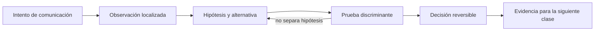

# SE-040 — TCP, UDP, QUIC y decisiones de transporte

[← SE-039 — IPv4, IPv6, subredes, rutas y NAT](../../classes/part-03-redes-internet-y-protocolos/se-039-ipv4-ipv6-subredes-rutas-y-nat/README.md) · [↑ Parte 03](../../classes/part-03-redes-internet-y-protocolos/README.md) · [📚 Índice completo](../../classes/README.md) · [🌐 Portal](../../site/classes/SE-040.html) · [SE-041 — DNS, nombres, resolución y fallos →](../../classes/part-03-redes-internet-y-protocolos/se-041-dns-nombres-resolucion-y-fallos/README.md)

> Estado: **PLANNED** · Borrador público conservado íntegramente y sometido a auditoría técnica y pedagógica.

## Punto profesional y fundamento pedagógico

**Punto profesional.** La clase existe para seleccionar TCP, UDP o QUIC por fiabilidad, orden, latencia y control de congestión.

**Por qué aparece aquí.** Se sitúa después de **IPv4, IPv6, subredes, rutas y NAT** y antes de **DNS, nombres, resolución y fallos**: convierte el conocimiento anterior en una decisión observable que la clase siguiente podrá reutilizar. La continuidad se comprueba en el artefacto, no por compartir vocabulario.

**Error conceptual que debe corregir.** Reducir la decisión a ‘TCP seguro, UDP rápido’.

**Secuencia de aprendizaje.** Antes de leer la solución, el estudiante predice el resultado del caso normal y del error conceptual anterior. Luego explica un caso resuelto paso a paso, construye un contraejemplo que cambie la decisión y, sin consultar el texto, reconstruye el mecanismo y lo aplica a una entrada nueva. La secuencia usa predicción, explicación propia, contraste y recuperación. [ICAP](https://icap.education.asu.edu/research) distingue participación de construcción de conocimiento; [How People Learn II](https://nap.nationalacademies.org/catalog/24783/how-people-learn-ii-learners-contexts-and-cultures) exige conectar conocimiento previo, contexto y transferencia; la [práctica de recuperación](https://pubmed.ncbi.nlm.nih.gov/16507066/) respalda producir de nuevo la explicación tras una demora; y [Education for Life and Work](https://nap.nationalacademies.org/resource/13398/dbasse_084153.pdf) exige devolución que explique la causa del error.

**Evidencia de aprendizaje.** Transport-decision.md con pérdidas, reordenamiento, handshake y requisito del producto. Debe contener predicción previa, observación, explicación causal, contraejemplo, criterio de aceptación y una nota de qué dato haría cambiar la conclusión.

**Límite de la conclusión.** La especificación no predice rendimiento en toda red.

### Trazabilidad fuente → afirmación

| Fuente primaria u oficial | Afirmación que respalda | Lo que no prueba |
|---|---|---|
| [RFC 9293 — Transmission Control Protocol](https://www.rfc-editor.org/rfc/rfc9293) | define la semántica normativa del protocolo nombrado en el título y sus límites interoperables | No demuestra por sí sola que el artefacto del estudiante sea correcto. |
| [RFC 768 — User Datagram Protocol](https://www.rfc-editor.org/rfc/rfc768) | define la semántica normativa del protocolo nombrado en el título y sus límites interoperables | No demuestra por sí sola que el artefacto del estudiante sea correcto. |
| [RFC 9000 — QUIC](https://www.rfc-editor.org/rfc/rfc9000) | define la semántica normativa del protocolo nombrado en el título y sus límites interoperables | No demuestra por sí sola que el artefacto del estudiante sea correcto. |

## Antes de empezar

Esta clase continúa la **petición observable de extremo a extremo de la Parte 3**. No estudia redes como una lista de siglas: añade una decisión concreta al mismo recorrido y obliga a explicar dónde nace cada señal. Conserva una bitácora con cuatro columnas —hecho, interpretación, hipótesis rival y próxima prueba—; si una conclusión no apunta a evidencia, todavía no es diagnóstico.

## Prerrequisitos

- Haber completado `SE-039` o poder explicar su evidencia principal.
- Trabajar solo contra `localhost`, una red propia o un destino con autorización expresa.
- Disponer de navegador, `curl` y herramientas equivalentes del sistema; registra versiones y plataforma.

## Problema auténtico

La petición observable de extremo a extremo debe enviar eventos pequeños, respuestas de API y actualizaciones interactivas. Elegir TCP, UDP o QUIC por moda puede introducir bloqueo, pérdida silenciosa o complejidad innecesaria. La decisión debe partir de orden, fiabilidad, latencia y despliegue.

## Objetivos observables

Al terminar podrás:

1. explicar conexión, flujo de bytes, datagrama y stream;
2. relacionar pérdida con retransmisión, orden y control de congestión;
3. comparar TCP, UDP y QUIC por garantía observable;
4. diseñar timeouts, reintentos e idempotencia en la aplicación;
5. comunicar límites y una siguiente prueba sin presentar inferencias como hechos.

## Mapa conceptual



El ciclo evita el diagnóstico por intuición. La observación se ubica antes de interpretarse; la prueba debe producir resultados diferentes bajo hipótesis rivales; la decisión conserva una salida de recuperación. En esta clase la pregunta rectora es: **¿Qué garantías necesita la aplicación y qué costo acepta para obtenerlas?**

## Temas y por qué importan

| Núcleo | Pregunta de trabajo | Evidencia esperada |
|---|---|---|
| alcance | ¿dónde es válido este identificador o estado? | mapa de fronteras |
| mecanismo | ¿qué entrada produce qué transición? | secuencia comentada |
| garantía | ¿qué promete el protocolo y qué no? | ejemplo y contraejemplo |
| diagnóstico | ¿qué prueba separa causas plausibles? | comparación reproducible |
| operación | ¿cómo falla, se limita y se recupera? | caso sano, degradado y restaurado |

## Conceptos y decisiones

### 1. Puertos y demultiplexación

IP lleva datos entre interfaces; transporte los entrega a endpoints lógicos identificados por puertos. Una conexión TCP se distingue por protocolo y tuplas de direcciones y puertos. Un puerto en escucha no es una identidad de negocio ni prueba que la aplicación esté sana.

### 2. TCP como flujo confiable

TCP ofrece un flujo ordenado de octetos, detecta pérdida, retransmite y regula envío. No conserva fronteras entre escrituras: dos `send` pueden leerse juntos o fragmentados. La aplicación necesita su propio framing y límites para no esperar indefinidamente.

### 3. UDP como datagramas

UDP preserva fronteras de datagrama y aporta comprobación mínima, pero no promete entrega, orden, unicidad ni control de congestión para la aplicación. Esa falta de garantías puede ser adecuada cuando importa la actualidad y perder una muestra es mejor que acumular retraso.

### 4. QUIC y streams sobre UDP

QUIC integra seguridad, recuperación y control de congestión, y multiplexa streams para que una pérdida no bloquee datos independientes como ocurre al ordenar todo en un único flujo TCP. UDP es el sustrato, no la semántica final. El beneficio depende del soporte en extremos y red.

### 5. Timeout, reintento e idempotencia

Un timeout expresa cuánto está dispuesto a esperar el consumidor; no demuestra que el servidor no ejecutó la operación. Reintentar puede duplicar efectos. La aplicación debe distinguir conexión, respuesta y deadline total, usar operaciones idempotentes o claves de deduplicación y limitar backoff.

## Definiciones de trabajo

- **flujo:** secuencia ordenada de octetos sin fronteras de mensaje.
- **datagrama:** mensaje independiente transportado como unidad.
- **stream:** canal lógico ordenado dentro de una conexión QUIC.
- **RTT:** tiempo de ida y vuelta observado.
- **idempotencia:** propiedad por la cual repetir una operación conserva el efecto esperado.

Estas definiciones son operativas: precisan el uso dentro de la petición observable de extremo a extremo y deben leerse junto a las fuentes. No convierten un término histórico o dependiente de implementación en una garantía universal.

## Ejemplo mínimo

Envía dos mensajes por un socket TCP local y demuestra que el receptor necesita longitud o delimitador. Repite conceptualmente con UDP y explica qué cambia si el segundo datagrama se pierde.

El ejemplo se acepta cuando incluye predicción previa, salida relevante y explicación de qué hipótesis descarta. Copiar una salida sin interpretación no demuestra comprensión.

## Ejemplo profesional

La petición observable de extremo a extremo usa HTTP sobre transporte confiable para informes y un canal de eventos donde las muestras antiguas pueden descartarse. La ficha de decisión compara orden, pérdida tolerable, movilidad, soporte de proxy, costo operativo y telemetría. QUIC se habilita solo si la ruta y la biblioteca lo soportan; existe fallback medido.

La diferencia profesional es la trazabilidad: la decisión conecta requisito, mecanismo, señal, riesgo y recuperación. El equipo puede cambiar de herramienta sin perder el razonamiento.

## Práctica guiada

1. lista garantías requeridas antes de nombrar protocolos.
2. observa un handshake TCP local y el cierre ordenado.
3. provoca lectura parcial con un mensaje mayor que el buffer.
4. simula pérdida o demora en un entorno local.
5. define deadline, máximo de reintentos y condición de no reintentar.
6. entrega `trace.md` con comandos redactados, marcas de tiempo y condiciones de repetición.

## Ejercicios

1. **Reconstrucción:** explica el mecanismo a una persona que solo conoce la clase anterior; incluye un dibujo y un contraejemplo.
2. **Variación:** repite el caso cambiando una sola variable —familia IP, interfaz, caché o intermediario— y justifica la diferencia.
3. **Revisión adversarial:** escribe una hipótesis rival que también explique el síntoma y diseña la observación mínima que las separe.
4. **Transferencia:** aplica el modelo a una actualización de software o videollamada y marca qué supuestos dejan de ser válidos.

## Reto verificable

Entrega una traza comentada que permita a otra persona responder: qué se intentó, qué frontera se observó, qué garantía aplicaba, qué falló, qué alternativa fue descartada y cómo se restauró el estado. La persona revisora debe poder repetir al menos una prueba sin instrucciones orales.

## Demostración guiada

1. Predice el primer evento observable y el resultado sano.
2. Ejecuta una sola petición de la petición observable de extremo a extremo y asigna cada marca a una frontera.
3. Introduce el fallo controlado descrito abajo.
4. Compara por **primera divergencia**, no por cantidad de errores posteriores.
5. Restaura, repite y conserva evidencia de recuperación.

Una demostración que no incluye restauración solo prueba cómo romper el laboratorio.

## Preguntas frecuentes

### ¿Una respuesta a `ping` demuestra que el servicio funciona?

No. Puede demostrar una respuesta ICMP bajo una ruta y política concretas. No valida DNS, puerto, TLS, HTTP ni la operación de negocio.

### ¿Puedo concluir desde una única captura?

Solo afirmaciones limitadas al punto, instante y tráfico observados. Para causalidad necesitas una predicción, una intervención controlada o evidencia correlacionada adicional.

### ¿Debo usar exactamente las mismas herramientas?

No. Debes conservar preguntas, unidades, alcance y evidencia. Documenta equivalencias y diferencias de plataforma.

## Fallo controlado y diagnóstico

Haz que el servidor local acepte la conexión pero no responda. Comprueba la diferencia entre timeout de conexión y timeout de lectura. Añade un deadline finito y una salida diagnóstica que indique fase, sin repetir automáticamente una operación no idempotente.

Registra estado previo, acción, síntoma, primera divergencia, causa, corrección y estado posterior. Si la acción afecta red compartida, requiere privilegios amplios o no tiene rollback probado, reemplázala por una simulación local.

## Errores comunes y cómo corregirlos

| Error | Por qué falla | Corrección |
|---|---|---|
| culpar al último componente nombrado | el síntoma puede aparecer lejos de la causa | localizar la primera divergencia |
| usar éxito parcial como prueba total | cada protocolo ofrece un alcance distinto | enumerar qué capas aún no se probaron |
| cambiar varias variables | impide atribuir el resultado | una intervención y una predicción por vez |
| capturar todo | aumenta riesgo y ruido | limitar interfaz, destino, tiempo y campos |
| ocultar el error con un bypass | elimina una protección sin explicar causa | aislar solo en laboratorio y restaurar |

## Entorno y archivos clave

```text
work/SE-040/
├── README.md          # alcance, autorización y reproducción
├── request.txt        # petición sin credenciales
├── trace.md           # línea temporal y evidencias
├── failure-report.md  # hipótesis, prueba y recuperación
└── diagram.mmd        # mapa accesible acompañado de texto
```

Los archivos son contenedores, no evidencia automática. `README.md` declara sistema operativo, versiones, red utilizada y limpieza. Nunca confirmes cambios de red destructivos sin una ruta de recuperación.

## Seguridad, ética y accesibilidad

- captura únicamente tráfico propio o autorizado y durante la ventana mínima;
- redacta cookies, tokens, query strings, IP privadas y nombres de personas;
- no desactives TLS, firewall o aislamiento como solución permanente;
- acompaña color y diagramas con orden, etiquetas y una explicación textual;
- ofrece comandos equivalentes o resultados esperados para quien no pueda modificar una red;
- considera que telemetría e IP pueden identificar o perfilar personas.

## Transferencia

Traslada el mecanismo a una segunda red o protocolo sin repetir comandos mecánicamente. Conserva la pregunta y el criterio de evidencia; cambia los supuestos de dirección, intermediación y política. Escribe qué observación seguiría siendo válida y cuál depende de la topología original.

## Evaluación y evidencia

| Criterio | Evidencia mínima | Señal de dominio |
|---|---|---|
| modelo causal | mapa con fronteras y unidades correctas | explica interacción y fugas del modelo |
| protocolo | garantía y límite apoyados en fuente | distingue semántica de implementación |
| diagnóstico | hipótesis rival y prueba discriminante | encuentra primera divergencia |
| reproducibilidad | contexto, comandos y salida redactada | otra persona repite el resultado |
| responsabilidad | autorización, minimización y rollback | reduce riesgo sin borrar evidencia |

La clase no se aprueba por ejecutar comandos. Se aprueba cuando la evidencia sostiene las conclusiones y declara lo que todavía no puede saberse.

## Fuentes


- [RFC 9293 — Transmission Control Protocol](https://www.rfc-editor.org/rfc/rfc9293) — define la semántica normativa del protocolo nombrado en el título y sus límites interoperables.
- [RFC 768 — User Datagram Protocol](https://www.rfc-editor.org/rfc/rfc768) — define la semántica normativa del protocolo nombrado en el título y sus límites interoperables.
- [RFC 9000 — QUIC](https://www.rfc-editor.org/rfc/rfc9000) — define la semántica normativa del protocolo nombrado en el título y sus límites interoperables.

Las RFC describen contratos de protocolo, no certifican una red, proveedor o herramienta. Cada afirmación de comportamiento local debe contrastarse con evidencia de ese entorno.

## Límites y siguiente paso

No implementa algoritmos de congestión ni criptografía de QUIC. Las condiciones de red reales varían y un benchmark local no decide producción. La siguiente clase resuelve nombres antes de iniciar estos transportes.

## Glosario

- **flujo:** secuencia ordenada de octetos sin fronteras de mensaje.
- **datagrama:** mensaje independiente transportado como unidad.
- **stream:** canal lógico ordenado dentro de una conexión QUIC.
- **RTT:** tiempo de ida y vuelta observado.
- **idempotencia:** propiedad por la cual repetir una operación conserva el efecto esperado.

---

[← SE-039 — IPv4, IPv6, subredes, rutas y NAT](../../classes/part-03-redes-internet-y-protocolos/se-039-ipv4-ipv6-subredes-rutas-y-nat/README.md) · [↑ Parte 03](../../classes/part-03-redes-internet-y-protocolos/README.md) · [📚 Índice completo](../../classes/README.md) · [🌐 Portal](../../site/classes/SE-040.html) · [SE-041 — DNS, nombres, resolución y fallos →](../../classes/part-03-redes-internet-y-protocolos/se-041-dns-nombres-resolucion-y-fallos/README.md)
