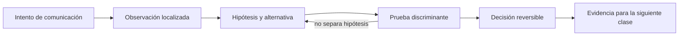

# SE-041 — DNS, nombres, resolución y fallos

[← SE-040 — TCP, UDP, QUIC y decisiones de transporte](../../classes/part-03-redes-internet-y-protocolos/se-040-tcp-udp-quic-y-decisiones-de-transporte/README.md) · [↑ Parte 03](../../classes/part-03-redes-internet-y-protocolos/README.md) · [📚 Índice completo](../../classes/README.md) · [🌐 Portal](../../site/classes/SE-041.html) · [SE-042 — HTTP, semántica, caché y negociación →](../../classes/part-03-redes-internet-y-protocolos/se-042-http-semantica-cache-y-negociacion/README.md)

> Estado: **PLANNED** · Borrador público conservado íntegramente y sometido a auditoría técnica y pedagógica.

## Punto profesional y fundamento pedagógico

**Punto profesional.** La clase existe para seguir resolución DNS, delegación, caché y TTL para distinguir ausencia, demora y respuesta obsoleta.

**Por qué aparece aquí.** Se sitúa después de **TCP, UDP, QUIC y decisiones de transporte** y antes de **HTTP, semántica, caché y negociación**: convierte el conocimiento anterior en una decisión observable que la clase siguiente podrá reutilizar. La continuidad se comprueba en el artefacto, no por compartir vocabulario.

**Error conceptual que debe corregir.** Tratar DNS como una sola base o asumir que limpiar una caché limpia todas.

**Secuencia de aprendizaje.** Antes de leer la solución, el estudiante predice el resultado del caso normal y del error conceptual anterior. Luego explica un caso resuelto paso a paso, construye un contraejemplo que cambie la decisión y, sin consultar el texto, reconstruye el mecanismo y lo aplica a una entrada nueva. La secuencia usa predicción, explicación propia, contraste y recuperación. [ICAP](https://icap.education.asu.edu/research) distingue participación de construcción de conocimiento; [How People Learn II](https://nap.nationalacademies.org/catalog/24783/how-people-learn-ii-learners-contexts-and-cultures) exige conectar conocimiento previo, contexto y transferencia; la [práctica de recuperación](https://pubmed.ncbi.nlm.nih.gov/16507066/) respalda producir de nuevo la explicación tras una demora; y [Education for Life and Work](https://nap.nationalacademies.org/resource/13398/dbasse_084153.pdf) exige devolución que explique la causa del error.

**Evidencia de aprendizaje.** Dns-trace.md con consultas, autoridad, TTL, cachés y fallo inducido. Debe contener predicción previa, observación, explicación causal, contraejemplo, criterio de aceptación y una nota de qué dato haría cambiar la conclusión.

**Límite de la conclusión.** Una consulta desde un resolver no describe todas las vistas.

### Trazabilidad fuente → afirmación

| Fuente primaria u oficial | Afirmación que respalda | Lo que no prueba |
|---|---|---|
| [RFC 1034 — Domain Names: Concepts and Facilities](https://www.rfc-editor.org/rfc/rfc1034) | define la semántica normativa del protocolo nombrado en el título y sus límites interoperables | No demuestra por sí sola que el artefacto del estudiante sea correcto. |
| [RFC 1035 — Domain Names: Implementation and Specification](https://www.rfc-editor.org/rfc/rfc1035) | define la semántica normativa del protocolo nombrado en el título y sus límites interoperables | No demuestra por sí sola que el artefacto del estudiante sea correcto. |
| [RFC 8499 — DNS Terminology](https://www.rfc-editor.org/rfc/rfc8499) | define la semántica normativa del protocolo nombrado en el título y sus límites interoperables | No demuestra por sí sola que el artefacto del estudiante sea correcto. |

## Antes de empezar

Esta clase continúa la **petición observable de extremo a extremo de la Parte 3**. No estudia redes como una lista de siglas: añade una decisión concreta al mismo recorrido y obliga a explicar dónde nace cada señal. Conserva una bitácora con cuatro columnas —hecho, interpretación, hipótesis rival y próxima prueba—; si una conclusión no apunta a evidencia, todavía no es diagnóstico.

## Prerrequisitos

- Haber completado `SE-040` o poder explicar su evidencia principal.
- Trabajar solo contra `localhost`, una red propia o un destino con autorización expresa.
- Disponer de navegador, `curl` y herramientas equivalentes del sistema; registra versiones y plataforma.

## Problema auténtico

La petición observable de extremo a extremo funciona por IP pero falla por nombre después de una migración. Algunas personas ven la dirección nueva y otras conservan respuestas anteriores. «Vaciar la caché» no basta: hay que reconstruir resolver, autoridad, tipo de registro, TTL y respuesta negativa.

## Objetivos observables

Al terminar podrás:

1. distinguir stub, resolver recursivo y servidor autoritativo;
2. leer registros A, AAAA, CNAME, NS y SOA en contexto;
3. explicar caché y TTL sin prometer propagación instantánea;
4. diagnosticar NXDOMAIN, NODATA, timeout y respuesta obsoleta;
5. comunicar límites y una siguiente prueba sin presentar inferencias como hechos.

## Mapa conceptual



El ciclo evita el diagnóstico por intuición. La observación se ubica antes de interpretarse; la prueba debe producir resultados diferentes bajo hipótesis rivales; la decisión conserva una salida de recuperación. En esta clase la pregunta rectora es: **¿Qué nombre se preguntó, a quién, qué respuesta obtuvo y cuánto puede reutilizarse?**

## Temas y por qué importan

| Núcleo | Pregunta de trabajo | Evidencia esperada |
|---|---|---|
| alcance | ¿dónde es válido este identificador o estado? | mapa de fronteras |
| mecanismo | ¿qué entrada produce qué transición? | secuencia comentada |
| garantía | ¿qué promete el protocolo y qué no? | ejemplo y contraejemplo |
| diagnóstico | ¿qué prueba separa causas plausibles? | comparación reproducible |
| operación | ¿cómo falla, se limita y se recupera? | caso sano, degradado y restaurado |

## Conceptos y decisiones

### 1. Espacio de nombres y delegación

DNS es una base distribuida y jerárquica. La raíz delega zonas; una zona no equivale necesariamente a un dominio visual. Los servidores autoritativos responden por datos de una zona, mientras un resolver recursivo persigue delegaciones y conserva resultados.

### 2. Pregunta y resource record

Una consulta contiene nombre, clase y tipo. A y AAAA asocian direcciones; CNAME redirige un nombre a otro; NS declara servidores de una zona; SOA contiene parámetros de autoridad. Pedir A y recibir solo AAAA no es lo mismo que NXDOMAIN.

### 3. Resolución recursiva

La aplicación suele hablar con un stub del sistema, que consulta un resolver configurado. Ese resolver puede responder desde caché o iterar por delegaciones. `/etc/hosts`, DNS corporativo, VPN y navegador con resolver propio pueden producir caminos diferentes en el mismo equipo.

### 4. TTL y caché negativa

TTL limita cuánto tiempo puede reutilizarse un registro, no fija una hora universal de propagación. Respuestas negativas también pueden almacenarse. Reducir TTL antes de una migración reduce cierta persistencia futura, pero no invalida copias ya almacenadas ni clientes que incumplen la política.

### 5. Selección de direcciones

Resolver un nombre puede devolver múltiples A y AAAA. El cliente decide orden e intenta conexiones; Happy Eyeballs evita esperar demasiado por una familia rota. Ver una dirección en `dig` no demuestra cuál eligió la aplicación ni que TLS acepte ese nombre.

## Definiciones de trabajo

- **resolver:** componente que obtiene respuestas DNS para un cliente.
- **autoritativo:** servidor que publica datos de una zona.
- **zona:** porción administrada del espacio DNS.
- **TTL:** tiempo máximo indicado para reutilizar un dato en caché.
- **NXDOMAIN:** respuesta que afirma que el nombre consultado no existe.

Estas definiciones son operativas: precisan el uso dentro de la petición observable de extremo a extremo y deben leerse junto a las fuentes. No convierten un término histórico o dependiente de implementación en una garantía universal.

## Ejemplo mínimo

Consulta A, AAAA y un nombre inexistente bajo un dominio que controles o de documentación. Registra código de respuesta, sección de respuesta, autoridad y TTL. Distingue `NOERROR` sin datos de `NXDOMAIN`.

El ejemplo se acepta cuando incluye predicción previa, salida relevante y explicación de qué hipótesis descarta. Copiar una salida sin interpretación no demuestra comprensión.

## Ejemplo profesional

Durante la migración de la petición observable de extremo a extremo, el equipo reduce TTL con antelación, verifica ambos autoritativos y consulta desde resolvers independientes. Conserva tiempo, servidor consultado y respuesta. Un override local se usa solo para aislar DNS; no se publica como solución definitiva.

La diferencia profesional es la trazabilidad: la decisión conecta requisito, mecanismo, señal, riesgo y recuperación. El equipo puede cambiar de herramienta sin perder el razonamiento.

## Práctica guiada

1. identifica qué resolver usa el sistema.
2. consulta el mismo nombre al resolver local y a un autoritativo.
3. sigue una delegación sin copiar información privada.
4. compara A y AAAA y la dirección elegida por curl.
5. documenta una política de migración y rollback.
6. entrega `trace.md` con comandos redactados, marcas de tiempo y condiciones de repetición.

## Ejercicios

1. **Reconstrucción:** explica el mecanismo a una persona que solo conoce la clase anterior; incluye un dibujo y un contraejemplo.
2. **Variación:** repite el caso cambiando una sola variable —familia IP, interfaz, caché o intermediario— y justifica la diferencia.
3. **Revisión adversarial:** escribe una hipótesis rival que también explique el síntoma y diseña la observación mínima que las separe.
4. **Transferencia:** aplica el modelo a una actualización de software o videollamada y marca qué supuestos dejan de ser válidos.

## Reto verificable

Entrega una traza comentada que permita a otra persona responder: qué se intentó, qué frontera se observó, qué garantía aplicaba, qué falló, qué alternativa fue descartada y cómo se restauró el estado. La persona revisora debe poder repetir al menos una prueba sin instrucciones orales.

## Demostración guiada

1. Predice el primer evento observable y el resultado sano.
2. Ejecuta una sola petición de la petición observable de extremo a extremo y asigna cada marca a una frontera.
3. Introduce el fallo controlado descrito abajo.
4. Compara por **primera divergencia**, no por cantidad de errores posteriores.
5. Restaura, repite y conserva evidencia de recuperación.

Una demostración que no incluye restauración solo prueba cómo romper el laboratorio.

## Preguntas frecuentes

### ¿Una respuesta a `ping` demuestra que el servicio funciona?

No. Puede demostrar una respuesta ICMP bajo una ruta y política concretas. No valida DNS, puerto, TLS, HTTP ni la operación de negocio.

### ¿Puedo concluir desde una única captura?

Solo afirmaciones limitadas al punto, instante y tráfico observados. Para causalidad necesitas una predicción, una intervención controlada o evidencia correlacionada adicional.

### ¿Debo usar exactamente las mismas herramientas?

No. Debes conservar preguntas, unidades, alcance y evidencia. Documenta equivalencias y diferencias de plataforma.

## Fallo controlado y diagnóstico

Añade en un dominio de laboratorio un registro con destino incorrecto y TTL corto, o usa un nombre reservado. Registra respuesta positiva equivocada versus NXDOMAIN. Corrige y espera/explica la expiración sin afirmar que todos los caches ya cambiaron.

Registra estado previo, acción, síntoma, primera divergencia, causa, corrección y estado posterior. Si la acción afecta red compartida, requiere privilegios amplios o no tiene rollback probado, reemplázala por una simulación local.

## Errores comunes y cómo corregirlos

| Error | Por qué falla | Corrección |
|---|---|---|
| culpar al último componente nombrado | el síntoma puede aparecer lejos de la causa | localizar la primera divergencia |
| usar éxito parcial como prueba total | cada protocolo ofrece un alcance distinto | enumerar qué capas aún no se probaron |
| cambiar varias variables | impide atribuir el resultado | una intervención y una predicción por vez |
| capturar todo | aumenta riesgo y ruido | limitar interfaz, destino, tiempo y campos |
| ocultar el error con un bypass | elimina una protección sin explicar causa | aislar solo en laboratorio y restaurar |

## Entorno y archivos clave

```text
work/SE-041/
├── README.md          # alcance, autorización y reproducción
├── request.txt        # petición sin credenciales
├── trace.md           # línea temporal y evidencias
├── failure-report.md  # hipótesis, prueba y recuperación
└── diagram.mmd        # mapa accesible acompañado de texto
```

Los archivos son contenedores, no evidencia automática. `README.md` declara sistema operativo, versiones, red utilizada y limpieza. Nunca confirmes cambios de red destructivos sin una ruta de recuperación.

## Seguridad, ética y accesibilidad

- captura únicamente tráfico propio o autorizado y durante la ventana mínima;
- redacta cookies, tokens, query strings, IP privadas y nombres de personas;
- no desactives TLS, firewall o aislamiento como solución permanente;
- acompaña color y diagramas con orden, etiquetas y una explicación textual;
- ofrece comandos equivalentes o resultados esperados para quien no pueda modificar una red;
- considera que telemetría e IP pueden identificar o perfilar personas.

## Transferencia

Traslada el mecanismo a una segunda red o protocolo sin repetir comandos mecánicamente. Conserva la pregunta y el criterio de evidencia; cambia los supuestos de dirección, intermediación y política. Escribe qué observación seguiría siendo válida y cuál depende de la topología original.

## Evaluación y evidencia

| Criterio | Evidencia mínima | Señal de dominio |
|---|---|---|
| modelo causal | mapa con fronteras y unidades correctas | explica interacción y fugas del modelo |
| protocolo | garantía y límite apoyados en fuente | distingue semántica de implementación |
| diagnóstico | hipótesis rival y prueba discriminante | encuentra primera divergencia |
| reproducibilidad | contexto, comandos y salida redactada | otra persona repite el resultado |
| responsabilidad | autorización, minimización y rollback | reduce riesgo sin borrar evidencia |

La clase no se aprueba por ejecutar comandos. Se aprueba cuando la evidencia sostiene las conclusiones y declara lo que todavía no puede saberse.

## Fuentes


- [RFC 1034 — Domain Names: Concepts and Facilities](https://www.rfc-editor.org/rfc/rfc1034) — define la semántica normativa del protocolo nombrado en el título y sus límites interoperables.
- [RFC 1035 — Domain Names: Implementation and Specification](https://www.rfc-editor.org/rfc/rfc1035) — define la semántica normativa del protocolo nombrado en el título y sus límites interoperables.
- [RFC 8499 — DNS Terminology](https://www.rfc-editor.org/rfc/rfc8499) — define la semántica normativa del protocolo nombrado en el título y sus límites interoperables.
- [RFC 8305 — Happy Eyeballs Version 2](https://www.rfc-editor.org/rfc/rfc8305) — define la semántica normativa del protocolo nombrado en el título y sus límites interoperables.

Las RFC describen contratos de protocolo, no certifican una red, proveedor o herramienta. Cada afirmación de comportamiento local debe contrastarse con evidencia de ese entorno.

## Límites y siguiente paso

No cubre operación completa de DNSSEC ni registradores. Las herramientas pueden omitir el camino usado por una aplicación. La siguiente clase interpreta la petición HTTP una vez resuelto y conectado el origen.

## Glosario

- **resolver:** componente que obtiene respuestas DNS para un cliente.
- **autoritativo:** servidor que publica datos de una zona.
- **zona:** porción administrada del espacio DNS.
- **TTL:** tiempo máximo indicado para reutilizar un dato en caché.
- **NXDOMAIN:** respuesta que afirma que el nombre consultado no existe.

---

[← SE-040 — TCP, UDP, QUIC y decisiones de transporte](../../classes/part-03-redes-internet-y-protocolos/se-040-tcp-udp-quic-y-decisiones-de-transporte/README.md) · [↑ Parte 03](../../classes/part-03-redes-internet-y-protocolos/README.md) · [📚 Índice completo](../../classes/README.md) · [🌐 Portal](../../site/classes/SE-041.html) · [SE-042 — HTTP, semántica, caché y negociación →](../../classes/part-03-redes-internet-y-protocolos/se-042-http-semantica-cache-y-negociacion/README.md)
