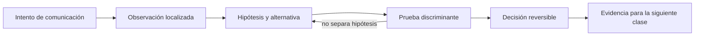

# SE-043 — TLS, certificados y confianza en tránsito

[← SE-042 — HTTP, semántica, caché y negociación](../../classes/part-03-redes-internet-y-protocolos/se-042-http-semantica-cache-y-negociacion/README.md) · [↑ Parte 03](../../classes/part-03-redes-internet-y-protocolos/README.md) · [📚 Índice completo](../../classes/README.md) · [🌐 Portal](../../site/classes/SE-043.html) · [SE-044 — Proxies, balanceadores, gateways y CDN →](../../classes/part-03-redes-internet-y-protocolos/se-044-proxies-balanceadores-gateways-y-cdn/README.md)


## Punto profesional y fundamento pedagógico

**Punto profesional.** La clase existe para explicar qué autentica y cifra TLS a partir de handshake, cadena y nombre del servicio.

**Por qué aparece aquí.** Se sitúa después de **HTTP, semántica, caché y negociación** y antes de **Proxies, balanceadores, gateways y CDN**: convierte el conocimiento anterior en una decisión observable que la clase siguiente podrá reutilizar. La continuidad se comprueba en el artefacto, no por compartir vocabulario.

**Error conceptual que debe corregir.** Creer que el candado prueba que el sitio es confiable o que TLS protege datos ya comprometidos en el endpoint.

**Secuencia de aprendizaje.** Antes de leer la solución, el estudiante predice el resultado del caso normal y del error conceptual anterior. Luego explica un caso resuelto paso a paso, construye un contraejemplo que cambie la decisión y, sin consultar el texto, reconstruye el mecanismo y lo aplica a una entrada nueva. La secuencia usa predicción, explicación propia, contraste y recuperación. [ICAP](https://icap.education.asu.edu/research) distingue participación de construcción de conocimiento; [How People Learn II](https://nap.nationalacademies.org/catalog/24783/how-people-learn-ii-learners-contexts-and-cultures) exige conectar conocimiento previo, contexto y transferencia; la [práctica de recuperación](https://pubmed.ncbi.nlm.nih.gov/16507066/) respalda producir de nuevo la explicación tras una demora; y [Education for Life and Work](https://nap.nationalacademies.org/resource/13398/dbasse_084153.pdf) exige devolución que explique la causa del error.

**Evidencia de aprendizaje.** Tls-evidence.md con certificado, SAN, cadena, protocolo y fallo de nombre. Debe contener predicción previa, observación, explicación causal, contraejemplo, criterio de aceptación y una nota de qué dato haría cambiar la conclusión.

**Límite de la conclusión.** La inspección del canal no audita la aplicación ni la CA.

### Trazabilidad fuente → afirmación

| Fuente primaria u oficial | Afirmación que respalda | Lo que no prueba |
|---|---|---|
| [RFC 8446 — TLS 1.3](https://www.rfc-editor.org/rfc/rfc8446) | define la semántica normativa del protocolo nombrado en el título y sus límites interoperables | No demuestra por sí sola que el artefacto del estudiante sea correcto. |
| [RFC 5280 — Internet X.509 PKI Certificate and CRL Profile](https://www.rfc-editor.org/rfc/rfc5280) | define la semántica normativa del protocolo nombrado en el título y sus límites interoperables | No demuestra por sí sola que el artefacto del estudiante sea correcto. |
| [RFC 9110 — HTTP Semantics](https://www.rfc-editor.org/rfc/rfc9110) | define la semántica normativa del protocolo nombrado en el título y sus límites interoperables | No demuestra por sí sola que el artefacto del estudiante sea correcto. |

## Antes de empezar

Esta clase continúa la **petición observable de extremo a extremo de la Parte 3**. No estudia redes como una lista de siglas: añade una decisión concreta al mismo recorrido y obliga a explicar dónde nace cada señal. Conserva una bitácora con cuatro columnas —hecho, interpretación, hipótesis rival y próxima prueba—; si una conclusión no apunta a evidencia, todavía no es diagnóstico.

## Prerrequisitos

- Haber completado `SE-042` o poder explicar su evidencia principal.
- Trabajar solo contra `localhost`, una red propia o un destino con autorización expresa.
- Disponer de navegador, `curl` y herramientas equivalentes del sistema; registra versiones y plataforma.

## Problema auténtico

La petición observable de extremo a extremo cifra tráfico, pero una instalación falla con «certificado inválido» y otra acepta un proxy corporativo. Cifrado no basta: el cliente debe validar nombre, cadena, vigencia y ancla de confianza, y el equipo debe distinguir una política administrada de una interceptación no autorizada.

## Objetivos observables

Al terminar podrás:

1. explicar objetivos y límites de TLS 1.3;
2. reconstruir cadena de certificación y validación de nombre;
3. distinguir certificado, clave privada y ancla de confianza;
4. diagnosticar fallos sin desactivar validación;
5. comunicar límites y una siguiente prueba sin presentar inferencias como hechos.

## Mapa conceptual



El ciclo evita el diagnóstico por intuición. La observación se ubica antes de interpretarse; la prueba debe producir resultados diferentes bajo hipótesis rivales; la decisión conserva una salida de recuperación. En esta clase la pregunta rectora es: **¿Qué identidad se autentica y qué garantías existen después del handshake?**

## Temas y por qué importan

| Núcleo | Pregunta de trabajo | Evidencia esperada |
|---|---|---|
| alcance | ¿dónde es válido este identificador o estado? | mapa de fronteras |
| mecanismo | ¿qué entrada produce qué transición? | secuencia comentada |
| garantía | ¿qué promete el protocolo y qué no? | ejemplo y contraejemplo |
| diagnóstico | ¿qué prueba separa causas plausibles? | comparación reproducible |
| operación | ¿cómo falla, se limita y se recupera? | caso sano, degradado y restaurado |
## Conceptos y decisiones

### 1. Handshake y claves de sesión

TLS negocia parámetros, autentica al servidor mediante su certificado y deriva claves efímeras para proteger registros posteriores. La clave privada no viaja. Un handshake exitoso acredita control de una identidad según la política del cliente; no demuestra que la aplicación sea segura o honesta.

### 2. Certificado y cadena

Un certificado vincula una clave pública con nombres y atributos durante un intervalo. El servidor suele enviar certificados intermedios; el cliente construye un camino hasta un ancla local. Un intermedio ausente puede fallar solo en clientes que no lo tienen almacenado.

### 3. Nombre, tiempo y propósito

La validación comprueba que el nombre solicitado esté autorizado por Subject Alternative Name, que el tiempo sea válido y que extensiones permitan el uso. Conectar por IP a un certificado para un DNS name falla correctamente aunque el cifrado matemático funcione.

### 4. SNI, ALPN y virtualización

SNI permite anunciar el nombre durante el handshake para que un servidor elija certificado; ALPN negocia protocolos como HTTP/2. Un balanceador puede terminar TLS y abrir una segunda conexión interna. El mapa de confianza debe incluir cada terminación, no asumir cifrado único extremo a extremo.

### 5. 0-RTT y límites de confianza

TLS 1.3 reduce viajes; algunos despliegues con QUIC permiten datos tempranos. Esos datos pueden reproducirse, por lo que no deben realizar efectos no idempotentes sin mitigación. TLS protege tránsito entre endpoints negociados, no datos en logs, caché o memoria del destino.

## Definiciones de trabajo

- **handshake:** negociación inicial de parámetros, identidad y claves.
- **certificado:** afirmación firmada que vincula una clave pública y atributos.
- **ancla de confianza:** certificado o clave aceptado localmente como inicio de validación.
- **SAN:** extensión que contiene identidades autorizadas.
- **ALPN:** negociación del protocolo de aplicación dentro de TLS.

Estas definiciones son operativas: precisan el uso dentro de la petición observable de extremo a extremo y deben leerse junto a las fuentes. No convierten un término histórico o dependiente de implementación en una garantía universal.

## Ejemplo mínimo

Inspecciona un sitio público con herramientas del navegador o `openssl s_client` sin copiar identificadores personales. Registra SAN pertinente, emisor, vigencia, cadena y protocolo negociado. Explica cuál dato valida el nombre.

El ejemplo se acepta cuando incluye predicción previa, salida relevante y explicación de qué hipótesis descarta. Copiar una salida sin interpretación no demuestra comprensión.

## Ejemplo profesional

La petición observable de extremo a extremo monitorea días hasta expiración y prueba la cadena desde un cliente limpio. La rotación instala certificado e intermedios antes del corte y conserva rollback. Ante un error, el informe distingue reloj incorrecto, nombre distinto, expiración, ancla ausente y cadena incompleta.

La diferencia profesional es la trazabilidad: la decisión conecta requisito, mecanismo, señal, riesgo y recuperación. El equipo puede cambiar de herramienta sin perder el razonamiento.

## Práctica guiada

1. observa el handshake de un origen autorizado.
2. dibuja hoja, intermedios y raíz local.
3. compara nombre solicitado con SAN.
4. prueba deliberadamente un nombre que no coincide en un servidor local.
5. documenta rotación de certificado y de clave como operaciones diferentes.
6. entrega `trace.md` con comandos redactados, marcas de tiempo y condiciones de repetición.

## Ejercicios

1. **Reconstrucción:** explica el mecanismo a una persona que solo conoce la clase anterior; incluye un dibujo y un contraejemplo.
2. **Variación:** repite el caso cambiando una sola variable —familia IP, interfaz, caché o intermediario— y justifica la diferencia.
3. **Revisión adversarial:** escribe una hipótesis rival que también explique el síntoma y diseña la observación mínima que las separe.
4. **Transferencia:** aplica el modelo a una actualización de software o videollamada y marca qué supuestos dejan de ser válidos.

## Reto verificable

Entrega una traza comentada que permita a otra persona responder: qué se intentó, qué frontera se observó, qué garantía aplicaba, qué falló, qué alternativa fue descartada y cómo se restauró el estado. La persona revisora debe poder repetir al menos una prueba sin instrucciones orales.

## Demostración guiada

1. Predice el primer evento observable y el resultado sano.
2. Ejecuta una sola petición de la petición observable de extremo a extremo y asigna cada marca a una frontera.
3. Introduce el fallo controlado descrito abajo.
4. Compara por **primera divergencia**, no por cantidad de errores posteriores.
5. Restaura, repite y conserva evidencia de recuperación.

Una demostración que no incluye restauración solo prueba cómo romper el laboratorio.

## Preguntas frecuentes

### ¿Una respuesta a `ping` demuestra que el servicio funciona?

No. Puede demostrar una respuesta ICMP bajo una ruta y política concretas. No valida DNS, puerto, TLS, HTTP ni la operación de negocio.

### ¿Puedo concluir desde una única captura?

Solo afirmaciones limitadas al punto, instante y tráfico observados. Para causalidad necesitas una predicción, una intervención controlada o evidencia correlacionada adicional.

### ¿Debo usar exactamente las mismas herramientas?

No. Debes conservar preguntas, unidades, alcance y evidencia. Documenta equivalencias y diferencias de plataforma.

## Fallo controlado y diagnóstico

Usa un certificado autofirmado en localhost. Comprueba que el cliente lo rechaza; confía solo en un almacén de laboratorio o pasa una CA explícita. Prohibido usar `-k` como arreglo: puede servir para aislar la hipótesis, pero el informe debe mantener el fallo visible.

Registra estado previo, acción, síntoma, primera divergencia, causa, corrección y estado posterior. Si la acción afecta red compartida, requiere privilegios amplios o no tiene rollback probado, reemplázala por una simulación local.

## Errores comunes y cómo corregirlos

| Error | Por qué falla | Corrección |
|---|---|---|
| culpar al último componente nombrado | el síntoma puede aparecer lejos de la causa | localizar la primera divergencia |
| usar éxito parcial como prueba total | cada protocolo ofrece un alcance distinto | enumerar qué capas aún no se probaron |
| cambiar varias variables | impide atribuir el resultado | una intervención y una predicción por vez |
| capturar todo | aumenta riesgo y ruido | limitar interfaz, destino, tiempo y campos |
| ocultar el error con un bypass | elimina una protección sin explicar causa | aislar solo en laboratorio y restaurar |

## Entorno y archivos clave

```text
work/SE-043/
├── README.md          # alcance, autorización y reproducción
├── request.txt        # petición sin credenciales
├── trace.md           # línea temporal y evidencias
├── failure-report.md  # hipótesis, prueba y recuperación
└── diagram.mmd        # mapa accesible acompañado de texto
```

Los archivos son contenedores, no evidencia automática. `README.md` declara sistema operativo, versiones, red utilizada y limpieza. Nunca confirmes cambios de red destructivos sin una ruta de recuperación.

### Laboratorio integrado de la Parte 03

El escenario `tls_name_mismatch` de la [petición observable](https://github.com/vladimiracunadev-create/modern-software-engineering-program/tree/main/labs/part-03-observable-request) evalúa el orden de la política: un nombre no coincidente se rechaza antes de HTTP. Es un modelo, no un handshake. Completa `tls-evidence.md` con una inspección autorizada que sí registre SAN, cadena, vigencia, protocolo y estrategia de revocación; nunca guardes una clave privada ni presentes `-k` como corrección.

## Seguridad, ética y accesibilidad

- captura únicamente tráfico propio o autorizado y durante la ventana mínima;
- redacta cookies, tokens, query strings, IP privadas y nombres de personas;
- no desactives TLS, firewall o aislamiento como solución permanente;
- acompaña color y diagramas con orden, etiquetas y una explicación textual;
- ofrece comandos equivalentes o resultados esperados para quien no pueda modificar una red;
- considera que telemetría e IP pueden identificar o perfilar personas.

## Transferencia

Traslada el mecanismo a una segunda red o protocolo sin repetir comandos mecánicamente. Conserva la pregunta y el criterio de evidencia; cambia los supuestos de dirección, intermediación y política. Escribe qué observación seguiría siendo válida y cuál depende de la topología original.

## Evaluación y evidencia

| Criterio | Evidencia mínima | Señal de dominio |
|---|---|---|
| modelo causal | mapa con fronteras y unidades correctas | explica interacción y fugas del modelo |
| protocolo | garantía y límite apoyados en fuente | distingue semántica de implementación |
| diagnóstico | hipótesis rival y prueba discriminante | encuentra primera divergencia |
| reproducibilidad | contexto, comandos y salida redactada | otra persona repite el resultado |
| responsabilidad | autorización, minimización y rollback | reduce riesgo sin borrar evidencia |

La clase no se aprueba por ejecutar comandos. Se aprueba cuando la evidencia sostiene las conclusiones y declara lo que todavía no puede saberse.

## Fuentes


- [RFC 8446 — TLS 1.3](https://www.rfc-editor.org/rfc/rfc8446) — define la semántica normativa del protocolo nombrado en el título y sus límites interoperables.
- [RFC 5280 — Internet X.509 PKI Certificate and CRL Profile](https://www.rfc-editor.org/rfc/rfc5280) — define la semántica normativa del protocolo nombrado en el título y sus límites interoperables.
- [RFC 9110 — HTTP Semantics](https://www.rfc-editor.org/rfc/rfc9110) — define la semántica normativa del protocolo nombrado en el título y sus límites interoperables.

Las RFC describen contratos de protocolo, no certifican una red, proveedor o herramienta. Cada afirmación de comportamiento local debe contrastarse con evidencia de ese entorno.

## Límites y siguiente paso

No enseña diseño criptográfico ni operación completa de una PKI. La revocación depende del ecosistema y la política. La clase siguiente ubica dónde terminan TLS y HTTP al introducir intermediarios.

## Glosario

- **handshake:** negociación inicial de parámetros, identidad y claves.
- **certificado:** afirmación firmada que vincula una clave pública y atributos.
- **ancla de confianza:** certificado o clave aceptado localmente como inicio de validación.
- **SAN:** extensión que contiene identidades autorizadas.
- **ALPN:** negociación del protocolo de aplicación dentro de TLS.

---

[← SE-042 — HTTP, semántica, caché y negociación](../../classes/part-03-redes-internet-y-protocolos/se-042-http-semantica-cache-y-negociacion/README.md) · [↑ Parte 03](../../classes/part-03-redes-internet-y-protocolos/README.md) · [📚 Índice completo](../../classes/README.md) · [🌐 Portal](../../site/classes/SE-043.html) · [SE-044 — Proxies, balanceadores, gateways y CDN →](../../classes/part-03-redes-internet-y-protocolos/se-044-proxies-balanceadores-gateways-y-cdn/README.md)
