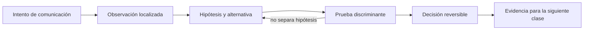

# SE-044 — Proxies, balanceadores, gateways y CDN

[← SE-043 — TLS, certificados y confianza en tránsito](../../classes/part-03-redes-internet-y-protocolos/se-043-tls-certificados-y-confianza-en-transito/README.md) · [↑ Parte 03](../../classes/part-03-redes-internet-y-protocolos/README.md) · [📚 Índice completo](../../classes/README.md) · [🌐 Portal](../../site/classes/SE-044.html) · [SE-045 — Sockets, conexiones persistentes y tiempo real →](../../classes/part-03-redes-internet-y-protocolos/se-045-sockets-conexiones-persistentes-y-tiempo-real/README.md)


## Punto profesional y fundamento pedagógico

**Punto profesional.** La clase existe para mapear cómo proxy, balanceador, gateway y CDN cambian conexiones, metadatos y caché.

**Por qué aparece aquí.** Se sitúa después de **TLS, certificados y confianza en tránsito** y antes de **Sockets, conexiones persistentes y tiempo real**: convierte el conocimiento anterior en una decisión observable que la clase siguiente podrá reutilizar. La continuidad se comprueba en el artefacto, no por compartir vocabulario.

**Error conceptual que debe corregir.** Suponer que el servidor ve directamente al cliente o que todos los intermediarios son transparentes.

**Secuencia de aprendizaje.** Antes de leer la solución, el estudiante predice el resultado del caso normal y del error conceptual anterior. Luego explica un caso resuelto paso a paso, construye un contraejemplo que cambie la decisión y, sin consultar el texto, reconstruye el mecanismo y lo aplica a una entrada nueva. La secuencia usa predicción, explicación propia, contraste y recuperación. [ICAP](https://icap.education.asu.edu/research) distingue participación de construcción de conocimiento; [How People Learn II](https://nap.nationalacademies.org/catalog/24783/how-people-learn-ii-learners-contexts-and-cultures) exige conectar conocimiento previo, contexto y transferencia; la [práctica de recuperación](https://pubmed.ncbi.nlm.nih.gov/16507066/) respalda producir de nuevo la explicación tras una demora; y [Education for Life and Work](https://nap.nationalacademies.org/resource/13398/dbasse_084153.pdf) exige devolución que explique la causa del error.

**Evidencia de aprendizaje.** Hop-map.md con terminaciones, headers confiables, caché y punto de fallo. Debe contener predicción previa, observación, explicación causal, contraejemplo, criterio de aceptación y una nota de qué dato haría cambiar la conclusión.

**Límite de la conclusión.** El diagrama de una arquitectura no generaliza a todos los proveedores.

### Trazabilidad fuente → afirmación

| Fuente primaria u oficial | Afirmación que respalda | Lo que no prueba |
|---|---|---|
| [RFC 9110 — HTTP Semantics](https://www.rfc-editor.org/rfc/rfc9110) | define la semántica normativa del protocolo nombrado en el título y sus límites interoperables | No demuestra por sí sola que el artefacto del estudiante sea correcto. |
| [RFC 9111 — HTTP Caching](https://www.rfc-editor.org/rfc/rfc9111) | define la semántica normativa del protocolo nombrado en el título y sus límites interoperables | No demuestra por sí sola que el artefacto del estudiante sea correcto. |
| [RFC 8446 — TLS 1.3](https://www.rfc-editor.org/rfc/rfc8446) | define la semántica normativa del protocolo nombrado en el título y sus límites interoperables | No demuestra por sí sola que el artefacto del estudiante sea correcto. |

## Antes de empezar

Esta clase continúa la **petición observable de extremo a extremo de la Parte 3**. No estudia redes como una lista de siglas: añade una decisión concreta al mismo recorrido y obliga a explicar dónde nace cada señal. Conserva una bitácora con cuatro columnas —hecho, interpretación, hipótesis rival y próxima prueba—; si una conclusión no apunta a evidencia, todavía no es diagnóstico.

## Prerrequisitos

- Haber completado `SE-043` o poder explicar su evidencia principal.
- Trabajar solo contra `localhost`, una red propia o un destino con autorización expresa.
- Disponer de navegador, `curl` y herramientas equivalentes del sistema; registra versiones y plataforma.

## Problema auténtico

La petición observable de extremo a extremo responde distinto según región. La petición atraviesa proxy de salida, CDN, balanceador y gateway. Llamarlos a todos «proxy» oculta propiedad, terminación TLS, caché, afinidad y encabezados de procedencia.

## Objetivos observables

Al terminar podrás:

1. distinguir forward proxy, reverse proxy, gateway, balanceador y CDN;
2. mapear terminaciones y cambios de identidad por salto;
3. explicar selección de backend, health checks y afinidad;
4. diagnosticar caché y errores generados por intermediarios;
5. comunicar límites y una siguiente prueba sin presentar inferencias como hechos.

## Mapa conceptual



El ciclo evita el diagnóstico por intuición. La observación se ubica antes de interpretarse; la prueba debe producir resultados diferentes bajo hipótesis rivales; la decisión conserva una salida de recuperación. En esta clase la pregunta rectora es: **¿Qué intermediario tomó qué decisión y qué identidad observó cada salto?**

## Temas y por qué importan

| Núcleo | Pregunta de trabajo | Evidencia esperada |
|---|---|---|
| alcance | ¿dónde es válido este identificador o estado? | mapa de fronteras |
| mecanismo | ¿qué entrada produce qué transición? | secuencia comentada |
| garantía | ¿qué promete el protocolo y qué no? | ejemplo y contraejemplo |
| diagnóstico | ¿qué prueba separa causas plausibles? | comparación reproducible |
| operación | ¿cómo falla, se limita y se recupera? | caso sano, degradado y restaurado |
## Conceptos y decisiones

### 1. Proxy directo y proxy inverso

El cliente elige o recibe política para un forward proxy que actúa hacia destinos. Un reverse proxy recibe en nombre del origen y selecciona servicios internos. La misma tecnología puede cumplir ambos roles; lo que importa es quién la configura, a qué lado representa y qué autoridad tiene.

### 2. Balanceo y salud

Round robin, menor carga o hashing son políticas de selección, no garantías de igualdad. Un health check confirma una ruta específica bajo un umbral; puede declarar sano un proceso incapaz de atender la operación real o expulsar todos los backends por una dependencia compartida.

### 3. Gateway y traducción de protocolo

Un gateway cruza contratos: autentica, aplica cuotas o traduce HTTP a otro protocolo. Cada transformación puede perder semántica o crear un nuevo timeout. Debe declarar qué cabeceras acepta, elimina y genera, y cómo correlaciona errores.

### 4. CDN y borde

Una CDN acerca caché y cómputo al consumidor. El punto de presencia puede responder sin contactar al origen, revalidar o fallar por política regional. `Age`, `Via`, identificadores de caché y logs de borde ayudan, pero son específicos del proveedor y no reemplazan un modelo.

### 5. Identidad, TLS y cabeceras reenviadas

Cada terminación ve una dirección de par diferente. Cabeceras como `Forwarded` o equivalentes solo son confiables si un perímetro elimina valores aportados por el cliente y agrega los suyos. De lo contrario, autorización y auditoría pueden aceptar identidad falsificada.

## Definiciones de trabajo

- **forward proxy:** intermediario que actúa por clientes hacia destinos.
- **reverse proxy:** intermediario que actúa frente a uno o más orígenes.
- **balanceador:** selector de un destino entre instancias elegibles.
- **CDN:** red de borde que distribuye y puede almacenar contenido.
- **health check:** prueba acotada usada para decidir elegibilidad de una instancia.

Estas definiciones son operativas: precisan el uso dentro de la petición observable de extremo a extremo y deben leerse junto a las fuentes. No convierten un término histórico o dependiente de implementación en una garantía universal.

## Ejemplo mínimo

Dibuja cliente → proxy → balanceador → dos backends. Marca en cada enlace quién inicia conexión, dónde termina TLS, qué Host se conserva y qué dirección ve el receptor.

El ejemplo se acepta cuando incluye predicción previa, salida relevante y explicación de qué hipótesis descarta. Copiar una salida sin interpretación no demuestra comprensión.

## Ejemplo profesional

La petición observable de extremo a extremo asigna un identificador de correlación en el primer componente confiable y lo propaga. El origen indica si la respuesta vino de caché y qué backend atendió sin exponer topología sensible al público. Los timeouts decrecen hacia dentro para que el gateway pueda responder antes del deadline del cliente.

La diferencia profesional es la trazabilidad: la decisión conecta requisito, mecanismo, señal, riesgo y recuperación. El equipo puede cambiar de herramienta sin perder el razonamiento.

## Práctica guiada

1. construye dos backends locales que revelen solo un ID.
2. configura un reverse proxy local.
3. observa distribución y retirada por health check.
4. añade caché a una ruta segura y comprueba hit/miss.
5. prueba una cabecera de cliente falsificada y demuestra que el perímetro la reemplaza.
6. entrega `trace.md` con comandos redactados, marcas de tiempo y condiciones de repetición.

## Ejercicios

1. **Reconstrucción:** explica el mecanismo a una persona que solo conoce la clase anterior; incluye un dibujo y un contraejemplo.
2. **Variación:** repite el caso cambiando una sola variable —familia IP, interfaz, caché o intermediario— y justifica la diferencia.
3. **Revisión adversarial:** escribe una hipótesis rival que también explique el síntoma y diseña la observación mínima que las separe.
4. **Transferencia:** aplica el modelo a una actualización de software o videollamada y marca qué supuestos dejan de ser válidos.

## Reto verificable

Entrega una traza comentada que permita a otra persona responder: qué se intentó, qué frontera se observó, qué garantía aplicaba, qué falló, qué alternativa fue descartada y cómo se restauró el estado. La persona revisora debe poder repetir al menos una prueba sin instrucciones orales.

## Demostración guiada

1. Predice el primer evento observable y el resultado sano.
2. Ejecuta una sola petición de la petición observable de extremo a extremo y asigna cada marca a una frontera.
3. Introduce el fallo controlado descrito abajo.
4. Compara por **primera divergencia**, no por cantidad de errores posteriores.
5. Restaura, repite y conserva evidencia de recuperación.

Una demostración que no incluye restauración solo prueba cómo romper el laboratorio.

## Preguntas frecuentes

### ¿Una respuesta a `ping` demuestra que el servicio funciona?

No. Puede demostrar una respuesta ICMP bajo una ruta y política concretas. No valida DNS, puerto, TLS, HTTP ni la operación de negocio.

### ¿Puedo concluir desde una única captura?

Solo afirmaciones limitadas al punto, instante y tráfico observados. Para causalidad necesitas una predicción, una intervención controlada o evidencia correlacionada adicional.

### ¿Debo usar exactamente las mismas herramientas?

No. Debes conservar preguntas, unidades, alcance y evidencia. Documenta equivalencias y diferencias de plataforma.

## Fallo controlado y diagnóstico

Marca un backend como sano en `/health` mientras falla la dependencia usada por `/report`. Registra el falso positivo y diseña readiness separada de liveness sin convertir la prueba en una llamada destructiva.

Registra estado previo, acción, síntoma, primera divergencia, causa, corrección y estado posterior. Si la acción afecta red compartida, requiere privilegios amplios o no tiene rollback probado, reemplázala por una simulación local.

## Errores comunes y cómo corregirlos

| Error | Por qué falla | Corrección |
|---|---|---|
| culpar al último componente nombrado | el síntoma puede aparecer lejos de la causa | localizar la primera divergencia |
| usar éxito parcial como prueba total | cada protocolo ofrece un alcance distinto | enumerar qué capas aún no se probaron |
| cambiar varias variables | impide atribuir el resultado | una intervención y una predicción por vez |
| capturar todo | aumenta riesgo y ruido | limitar interfaz, destino, tiempo y campos |
| ocultar el error con un bypass | elimina una protección sin explicar causa | aislar solo en laboratorio y restaurar |

## Entorno y archivos clave

```text
work/SE-044/
├── README.md          # alcance, autorización y reproducción
├── request.txt        # petición sin credenciales
├── trace.md           # línea temporal y evidencias
├── failure-report.md  # hipótesis, prueba y recuperación
└── diagram.mmd        # mapa accesible acompañado de texto
```

Los archivos son contenedores, no evidencia automática. `README.md` declara sistema operativo, versiones, red utilizada y limpieza. Nunca confirmes cambios de red destructivos sin una ruta de recuperación.

### Laboratorio integrado de la Parte 03

Usa el `request_id` de la [petición observable](https://github.com/vladimiracunadev-create/modern-software-engineering-program/tree/main/labs/part-03-observable-request) para diseñar `hop-map.md`. En cada frontera indica si conserva, valida, reemplaza o elimina `Forwarded`, `Via`, `X-Request-ID` y `traceparent`. Una cabecera aportada por Internet no adquiere autoridad por llamarse “forwarded”: el primer perímetro confiable debe aplicar una política explícita.

## Seguridad, ética y accesibilidad

- captura únicamente tráfico propio o autorizado y durante la ventana mínima;
- redacta cookies, tokens, query strings, IP privadas y nombres de personas;
- no desactives TLS, firewall o aislamiento como solución permanente;
- acompaña color y diagramas con orden, etiquetas y una explicación textual;
- ofrece comandos equivalentes o resultados esperados para quien no pueda modificar una red;
- considera que telemetría e IP pueden identificar o perfilar personas.

## Transferencia

Traslada el mecanismo a una segunda red o protocolo sin repetir comandos mecánicamente. Conserva la pregunta y el criterio de evidencia; cambia los supuestos de dirección, intermediación y política. Escribe qué observación seguiría siendo válida y cuál depende de la topología original.

## Evaluación y evidencia

| Criterio | Evidencia mínima | Señal de dominio |
|---|---|---|
| modelo causal | mapa con fronteras y unidades correctas | explica interacción y fugas del modelo |
| protocolo | garantía y límite apoyados en fuente | distingue semántica de implementación |
| diagnóstico | hipótesis rival y prueba discriminante | encuentra primera divergencia |
| reproducibilidad | contexto, comandos y salida redactada | otra persona repite el resultado |
| responsabilidad | autorización, minimización y rollback | reduce riesgo sin borrar evidencia |

La clase no se aprueba por ejecutar comandos. Se aprueba cuando la evidencia sostiene las conclusiones y declara lo que todavía no puede saberse.

## Fuentes


- [RFC 9110 — HTTP Semantics](https://www.rfc-editor.org/rfc/rfc9110) — define la semántica normativa del protocolo nombrado en el título y sus límites interoperables.
- [RFC 9111 — HTTP Caching](https://www.rfc-editor.org/rfc/rfc9111) — define la semántica normativa del protocolo nombrado en el título y sus límites interoperables.
- [RFC 8446 — TLS 1.3](https://www.rfc-editor.org/rfc/rfc8446) — define la semántica normativa del protocolo nombrado en el título y sus límites interoperables.
- [RFC 7239 — Forwarded HTTP Extension](https://www.rfc-editor.org/rfc/rfc7239) — estandariza metadatos reenviados y documenta sus consideraciones de seguridad y privacidad.

Las RFC describen contratos de protocolo, no certifican una red, proveedor o herramienta. Cada afirmación de comportamiento local debe contrastarse con evidencia de ese entorno.

## Límites y siguiente paso

No cubre configuración de un proveedor concreto ni DDoS. Más intermediarios aportan control y también estados de fallo. La siguiente clase estudia conexiones persistentes y comunicación en tiempo real.

## Glosario

- **forward proxy:** intermediario que actúa por clientes hacia destinos.
- **reverse proxy:** intermediario que actúa frente a uno o más orígenes.
- **balanceador:** selector de un destino entre instancias elegibles.
- **CDN:** red de borde que distribuye y puede almacenar contenido.
- **health check:** prueba acotada usada para decidir elegibilidad de una instancia.

---

[← SE-043 — TLS, certificados y confianza en tránsito](../../classes/part-03-redes-internet-y-protocolos/se-043-tls-certificados-y-confianza-en-transito/README.md) · [↑ Parte 03](../../classes/part-03-redes-internet-y-protocolos/README.md) · [📚 Índice completo](../../classes/README.md) · [🌐 Portal](../../site/classes/SE-044.html) · [SE-045 — Sockets, conexiones persistentes y tiempo real →](../../classes/part-03-redes-internet-y-protocolos/se-045-sockets-conexiones-persistentes-y-tiempo-real/README.md)
