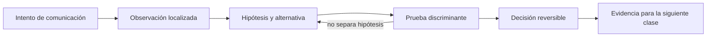

# SE-046 — Captura, medición y diagnóstico de tráfico

[← SE-045 — Sockets, conexiones persistentes y tiempo real](../../classes/part-03-redes-internet-y-protocolos/se-045-sockets-conexiones-persistentes-y-tiempo-real/README.md) · [↑ Parte 03](../../classes/part-03-redes-internet-y-protocolos/README.md) · [📚 Índice completo](../../classes/README.md) · [🌐 Portal](../../site/classes/SE-046.html) · [SE-047 — Taller: seguir una petición de extremo a extremo →](../../classes/part-03-redes-internet-y-protocolos/se-047-taller-seguir-una-peticion-de-extremo-a-extremo/README.md)


## Punto profesional y fundamento pedagógico

**Punto profesional.** La clase existe para capturar y medir tráfico con una pregunta previa y distinguir ausencia de evidencia de evidencia de ausencia.

**Por qué aparece aquí.** Se sitúa después de **Sockets, conexiones persistentes y tiempo real** y antes de **Taller: seguir una petición de extremo a extremo**: convierte el conocimiento anterior en una decisión observable que la clase siguiente podrá reutilizar. La continuidad se comprueba en el artefacto, no por compartir vocabulario.

**Error conceptual que debe corregir.** Filtrar hasta encontrar la hipótesis preferida o interpretar cifrado como falta de tráfico.

**Secuencia de aprendizaje.** Antes de leer la solución, el estudiante predice el resultado del caso normal y del error conceptual anterior. Luego explica un caso resuelto paso a paso, construye un contraejemplo que cambie la decisión y, sin consultar el texto, reconstruye el mecanismo y lo aplica a una entrada nueva. La secuencia usa predicción, explicación propia, contraste y recuperación. [ICAP](https://icap.education.asu.edu/research) distingue participación de construcción de conocimiento; [How People Learn II](https://nap.nationalacademies.org/catalog/24783/how-people-learn-ii-learners-contexts-and-cultures) exige conectar conocimiento previo, contexto y transferencia; la [práctica de recuperación](https://pubmed.ncbi.nlm.nih.gov/16507066/) respalda producir de nuevo la explicación tras una demora; y [Education for Life and Work](https://nap.nationalacademies.org/resource/13398/dbasse_084153.pdf) exige devolución que explique la causa del error.

**Evidencia de aprendizaje.** Capture-notes.md con interfaz, filtro, reloj, paquetes y conclusión acotada. Debe contener predicción previa, observación, explicación causal, contraejemplo, criterio de aceptación y una nota de qué dato haría cambiar la conclusión.

**Límite de la conclusión.** Una captura puede perder paquetes y no revela payload cifrado.

### Trazabilidad fuente → afirmación

| Fuente primaria u oficial | Afirmación que respalda | Lo que no prueba |
|---|---|---|
| [RFC 1122 — Requirements for Internet Hosts: Communication Layers](https://www.rfc-editor.org/rfc/rfc1122) | define la semántica normativa del protocolo nombrado en el título y sus límites interoperables | No demuestra por sí sola que el artefacto del estudiante sea correcto. |
| [RFC 9293 — Transmission Control Protocol](https://www.rfc-editor.org/rfc/rfc9293) | define la semántica normativa del protocolo nombrado en el título y sus límites interoperables | No demuestra por sí sola que el artefacto del estudiante sea correcto. |
| [RFC 9110 — HTTP Semantics](https://www.rfc-editor.org/rfc/rfc9110) | define la semántica normativa del protocolo nombrado en el título y sus límites interoperables | No demuestra por sí sola que el artefacto del estudiante sea correcto. |

## Antes de empezar

Esta clase continúa la **petición observable de extremo a extremo de la Parte 3**. No estudia redes como una lista de siglas: añade una decisión concreta al mismo recorrido y obliga a explicar dónde nace cada señal. Conserva una bitácora con cuatro columnas —hecho, interpretación, hipótesis rival y próxima prueba—; si una conclusión no apunta a evidencia, todavía no es diagnóstico.

## Prerrequisitos

- Haber completado `SE-045` o poder explicar su evidencia principal.
- Trabajar solo contra `localhost`, una red propia o un destino con autorización expresa.
- Disponer de navegador, `curl` y herramientas equivalentes del sistema; registra versiones y plataforma.

## Problema auténtico

La petición observable de extremo a extremo está «lento» de forma intermitente. Una captura enorme contiene datos sensibles y aun así no indica si el tiempo se pierde en DNS, conexión, TLS, servidor o descarga. El equipo necesita una estrategia mínima, temporal y correlacionada.

## Objetivos observables

Al terminar podrás:

1. definir latencia, RTT, pérdida, throughput y tiempo por fase;
2. diseñar capturas con alcance y filtros;
3. correlacionar observaciones entre cliente e intermediario;
4. reconocer sesgos de reloj, punto de captura y cifrado;
5. comunicar límites y una siguiente prueba sin presentar inferencias como hechos.

## Mapa conceptual



El ciclo evita el diagnóstico por intuición. La observación se ubica antes de interpretarse; la prueba debe producir resultados diferentes bajo hipótesis rivales; la decisión conserva una salida de recuperación. En esta clase la pregunta rectora es: **¿Qué medición diferencia las hipótesis sin convertir la observación en un riesgo?**

## Temas y por qué importan

| Núcleo | Pregunta de trabajo | Evidencia esperada |
|---|---|---|
| alcance | ¿dónde es válido este identificador o estado? | mapa de fronteras |
| mecanismo | ¿qué entrada produce qué transición? | secuencia comentada |
| garantía | ¿qué promete el protocolo y qué no? | ejemplo y contraejemplo |
| diagnóstico | ¿qué prueba separa causas plausibles? | comparación reproducible |
| operación | ¿cómo falla, se limita y se recupera? | caso sano, degradado y restaurado |
## Conceptos y decisiones

### 1. Métrica antes que herramienta

«Lento» debe traducirse a una variable y una población: p95 del tiempo a primer byte para cierta operación, por ejemplo. Promedio oculta colas largas. Throughput no es ancho de banda teórico, y RTT no es tiempo completo de una transacción.

### 2. Descomposición temporal

Una petición puede medirse en DNS, conexión, TLS, envío, espera del primer byte y transferencia. Las fases se solapan bajo reutilización, HTTP/2 o QUIC; por eso `0 ms de connect` puede significar conexión existente, no velocidad infinita.

### 3. Punto de observación

Una captura en cliente ve antes del túnel o después según interfaz; una en servidor observa otra dirección y otro reloj. Offload puede mostrar checksums aparentes incorrectos o segmentos agregados. La ausencia en un punto no demuestra que el paquete nunca existió.

### 4. Filtros y minimización

El filtro de captura limita qué entra; el filtro de visualización solo oculta después de recolectar. Se debe acotar interfaz, host, puerto, duración y tamaño, preferir metadatos y borrar payloads no necesarios. Nunca se captura tráfico de otras personas sin autorización.

### 5. Correlación y causalidad

Un ID de petición une logs de aplicación y proxy; tuplas y tiempos aproximados unen capas inferiores. Correlación temporal orienta, pero pérdida observada cerca del cliente puede originarse antes o después. Una hipótesis mejora al predecir otra señal y sobrevivir una prueba controlada.

## Definiciones de trabajo

- **latencia:** tiempo entre un inicio definido y un resultado definido.
- **RTT:** tiempo aproximado de ida y vuelta.
- **throughput:** cantidad útil transferida por unidad de tiempo.
- **punto de captura:** ubicación e interfaz desde la que se observa tráfico.
- **correlación:** vínculo entre señales que podrían pertenecer al mismo evento.

Estas definiciones son operativas: precisan el uso dentro de la petición observable de extremo a extremo y deben leerse junto a las fuentes. No convierten un término histórico o dependiente de implementación en una garantía universal.

## Ejemplo mínimo

Ejecuta `curl` con tiempos de resolución, conexión, TLS, primer byte y total contra un destino autorizado. Repite cinco veces, conserva mediana y rango, e indica si hubo reutilización.

El ejemplo se acepta cuando incluye predicción previa, salida relevante y explicación de qué hipótesis descarta. Copiar una salida sin interpretación no demuestra comprensión.

## Ejemplo profesional

La petición observable de extremo a extremo define un presupuesto de 800 ms: 100 DNS, 100 conexión/TLS, 400 procesamiento y 200 transferencia. La traza de incidente usa un ID, zona horaria, reloj monotónico local y ventana de dos minutos. Solo si la fase rompe presupuesto se solicita evidencia más invasiva.

La diferencia profesional es la trazabilidad: la decisión conecta requisito, mecanismo, señal, riesgo y recuperación. El equipo puede cambiar de herramienta sin perder el razonamiento.

## Práctica guiada

1. formula dos hipótesis que predigan fases distintas.
2. mide una línea base repetida.
3. aplica un filtro de captura a tráfico propio local.
4. marca SYN, handshake TLS cifrado y mensajes visibles.
5. redacta un informe que separe observado, inferido y desconocido.
6. entrega `trace.md` con comandos redactados, marcas de tiempo y condiciones de repetición.

## Ejercicios

1. **Reconstrucción:** explica el mecanismo a una persona que solo conoce la clase anterior; incluye un dibujo y un contraejemplo.
2. **Variación:** repite el caso cambiando una sola variable —familia IP, interfaz, caché o intermediario— y justifica la diferencia.
3. **Revisión adversarial:** escribe una hipótesis rival que también explique el síntoma y diseña la observación mínima que las separe.
4. **Transferencia:** aplica el modelo a una actualización de software o videollamada y marca qué supuestos dejan de ser válidos.

## Reto verificable

Entrega una traza comentada que permita a otra persona responder: qué se intentó, qué frontera se observó, qué garantía aplicaba, qué falló, qué alternativa fue descartada y cómo se restauró el estado. La persona revisora debe poder repetir al menos una prueba sin instrucciones orales.

## Demostración guiada

1. Predice el primer evento observable y el resultado sano.
2. Ejecuta una sola petición de la petición observable de extremo a extremo y asigna cada marca a una frontera.
3. Introduce el fallo controlado descrito abajo.
4. Compara por **primera divergencia**, no por cantidad de errores posteriores.
5. Restaura, repite y conserva evidencia de recuperación.

Una demostración que no incluye restauración solo prueba cómo romper el laboratorio.

## Preguntas frecuentes

### ¿Una respuesta a `ping` demuestra que el servicio funciona?

No. Puede demostrar una respuesta ICMP bajo una ruta y política concretas. No valida DNS, puerto, TLS, HTTP ni la operación de negocio.

### ¿Puedo concluir desde una única captura?

Solo afirmaciones limitadas al punto, instante y tráfico observados. Para causalidad necesitas una predicción, una intervención controlada o evidencia correlacionada adicional.

### ¿Debo usar exactamente las mismas herramientas?

No. Debes conservar preguntas, unidades, alcance y evidencia. Documenta equivalencias y diferencias de plataforma.

## Fallo controlado y diagnóstico

Introduce 300 ms de demora en un servidor local, no en toda la máquina. Comprueba aumento en espera del primer byte y no en DNS. Retira la demora y repite; conserva ambas series.

Registra estado previo, acción, síntoma, primera divergencia, causa, corrección y estado posterior. Si la acción afecta red compartida, requiere privilegios amplios o no tiene rollback probado, reemplázala por una simulación local.

## Errores comunes y cómo corregirlos

| Error | Por qué falla | Corrección |
|---|---|---|
| culpar al último componente nombrado | el síntoma puede aparecer lejos de la causa | localizar la primera divergencia |
| usar éxito parcial como prueba total | cada protocolo ofrece un alcance distinto | enumerar qué capas aún no se probaron |
| cambiar varias variables | impide atribuir el resultado | una intervención y una predicción por vez |
| capturar todo | aumenta riesgo y ruido | limitar interfaz, destino, tiempo y campos |
| ocultar el error con un bypass | elimina una protección sin explicar causa | aislar solo en laboratorio y restaurar |

## Entorno y archivos clave

```text
work/SE-046/
├── README.md          # alcance, autorización y reproducción
├── request.txt        # petición sin credenciales
├── trace.md           # línea temporal y evidencias
├── failure-report.md  # hipótesis, prueba y recuperación
└── diagram.mmd        # mapa accesible acompañado de texto
```

Los archivos son contenedores, no evidencia automática. `README.md` declara sistema operativo, versiones, red utilizada y limpieza. Nunca confirmes cambios de red destructivos sin una ruta de recuperación.

## Seguridad, ética y accesibilidad

- captura únicamente tráfico propio o autorizado y durante la ventana mínima;
- redacta cookies, tokens, query strings, IP privadas y nombres de personas;
- no desactives TLS, firewall o aislamiento como solución permanente;
- acompaña color y diagramas con orden, etiquetas y una explicación textual;
- ofrece comandos equivalentes o resultados esperados para quien no pueda modificar una red;
- considera que telemetría e IP pueden identificar o perfilar personas.

## Transferencia

Traslada el mecanismo a una segunda red o protocolo sin repetir comandos mecánicamente. Conserva la pregunta y el criterio de evidencia; cambia los supuestos de dirección, intermediación y política. Escribe qué observación seguiría siendo válida y cuál depende de la topología original.

## Evaluación y evidencia

| Criterio | Evidencia mínima | Señal de dominio |
|---|---|---|
| modelo causal | mapa con fronteras y unidades correctas | explica interacción y fugas del modelo |
| protocolo | garantía y límite apoyados en fuente | distingue semántica de implementación |
| diagnóstico | hipótesis rival y prueba discriminante | encuentra primera divergencia |
| reproducibilidad | contexto, comandos y salida redactada | otra persona repite el resultado |
| responsabilidad | autorización, minimización y rollback | reduce riesgo sin borrar evidencia |

La clase no se aprueba por ejecutar comandos. Se aprueba cuando la evidencia sostiene las conclusiones y declara lo que todavía no puede saberse.

## Fuentes


- [RFC 1122 — Requirements for Internet Hosts: Communication Layers](https://www.rfc-editor.org/rfc/rfc1122) — define la semántica normativa del protocolo nombrado en el título y sus límites interoperables.
- [RFC 9293 — Transmission Control Protocol](https://www.rfc-editor.org/rfc/rfc9293) — define la semántica normativa del protocolo nombrado en el título y sus límites interoperables.
- [RFC 9110 — HTTP Semantics](https://www.rfc-editor.org/rfc/rfc9110) — define la semántica normativa del protocolo nombrado en el título y sus límites interoperables.
- [RFC 8446 — TLS 1.3](https://www.rfc-editor.org/rfc/rfc8446) — define la semántica normativa del protocolo nombrado en el título y sus límites interoperables.

Las RFC describen contratos de protocolo, no certifican una red, proveedor o herramienta. Cada afirmación de comportamiento local debe contrastarse con evidencia de ese entorno.

## Límites y siguiente paso

Cifrado impide leer payload y eso es una propiedad deseable. Capturas no sustituyen telemetría de aplicación. La siguiente clase integra las señales siguiendo una petición completa.

## Glosario

- **latencia:** tiempo entre un inicio definido y un resultado definido.
- **RTT:** tiempo aproximado de ida y vuelta.
- **throughput:** cantidad útil transferida por unidad de tiempo.
- **punto de captura:** ubicación e interfaz desde la que se observa tráfico.
- **correlación:** vínculo entre señales que podrían pertenecer al mismo evento.

---

[← SE-045 — Sockets, conexiones persistentes y tiempo real](../../classes/part-03-redes-internet-y-protocolos/se-045-sockets-conexiones-persistentes-y-tiempo-real/README.md) · [↑ Parte 03](../../classes/part-03-redes-internet-y-protocolos/README.md) · [📚 Índice completo](../../classes/README.md) · [🌐 Portal](../../site/classes/SE-046.html) · [SE-047 — Taller: seguir una petición de extremo a extremo →](../../classes/part-03-redes-internet-y-protocolos/se-047-taller-seguir-una-peticion-de-extremo-a-extremo/README.md)
