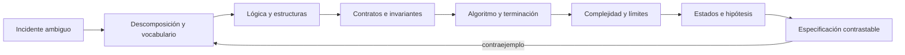

# Parte 4 — Pensamiento computacional y resolución de problemas

Pensar computacionalmente no consiste en «pensar como una máquina» ni en saltar a código. Consiste en elegir una representación que preserve lo importante, formular reglas que puedan discutirse, diseñar una estrategia finita y contrastar sus resultados y costos. Esta parte toma las trazas de Nexo y las convierte en **Atlas**, un planificador de diagnóstico que debe explicar por qué recomienda una prueba y cuándo su modelo no alcanza.

## Pregunta rectora

> ¿Cómo transformar un problema ambiguo en una solución cuya corrección, costo y límites puedan ser revisados?

## Antes del recorrido clase por clase

La parte alterna cuatro planos que deben permanecer conectados:

- **semántico:** qué significan las entradas, estados y resultados para las personas;
- **estructural:** conjuntos, relaciones, grafos y estados que representan el dominio;
- **procedimental:** algoritmo, invariante, variante, heurística y presupuesto;
- **empírico:** ejemplos, contraejemplos, mediciones y revisión adversarial.

El ciclo vuelve al problema cuando aparece un contraejemplo. No se «arregla» una prueba cambiando el resultado esperado: se revisa qué abstracción, regla o supuesto era insuficiente.

## Lo que cambia al completar esta parte

Podrás distinguir ejemplo de argumento, función de relación, estado de evento, corrección parcial de terminación y heurística de aproximación garantizada. Podrás estimar cómo crece una estrategia, decir honestamente cuándo no conoces el óptimo y entregar una especificación que una segunda persona pueda implementar y verificar.

## Guía razonada clase por clase

Atlas no se construye acumulando técnicas. Cada clase cambia la representación del
problema, declara qué propiedad debe conservarse y produce una evidencia que la técnica
siguiente puede refutar o ampliar. El recorrido va de la ambigüedad a una especificación
sin fingir que todo problema admite una solución óptima o barata.

### Bloque 1 — Representar el problema y sus obligaciones

#### SE-049 — Descomposición, abstracción y reconocimiento de patrones

La petición «diagnostica Nexo» mezcla resultados, síntomas, actores y restricciones. La
clase descompone por responsabilidades y dependencias, abstrae solo lo que no cambia la
decisión y usa patrones como hipótesis transferibles, no como permiso para ignorar el
contexto. Una división cómoda puede cortar precisamente la relación que explica el
fallo.

El estudiante produce un árbol de preguntas y contratos de entrada/salida para Atlas,
acompañado por un caso que no encaja en el patrón elegido. Esa frontera transforma
palabras ambiguas en proposiciones que `SE-050` podrá evaluar mediante lógica explícita.

#### SE-050 — Lógica proposicional, predicados e inferencia

Una regla como «si DNS responde, hay red» oculta cuantificadores, alcance y premisas. La
clase separa proposición, predicado, implicación, equivalencia, necesidad y suficiencia;
usa tablas y contraejemplos para mostrar por qué afirmar el consecuente produce un
diagnóstico convincente pero inválido.

Atlas expresa reglas con premisas observables y conclusión limitada. El estudiante
registra qué evidencia vuelve verdadera cada premisa y cuándo la conclusión no se
sigue. `SE-051` necesita organizar esas entidades y relaciones sin reducirlas a una
lista lineal.

#### SE-051 — Conjuntos, relaciones, funciones y grafos

Conjuntos responden pertenencia, relaciones conectan elementos, funciones exigen una
salida determinada por entrada y grafos representan caminos o dependencias. La clase
elige estructura por pregunta y demuestra por qué una relación muchos-a-muchos no debe
disfrazarse de función ni una jerarquía de grafo arbitrario.

El estudiante modela pruebas, síntomas y dependencias de Atlas, identifica nodos y
aristas con significado y construye consultas pequeñas. El grafo hace visibles ciclos y
rutas, pero todavía no garantiza que una ejecución preserve propiedades; `SE-052`
convierte esas obligaciones en precondiciones, invariantes y poscondiciones.

#### SE-052 — Invariantes, precondiciones y poscondiciones

Un algoritmo puede producir una salida plausible mientras viola autorización, pierde
un caso o corrompe el estado intermedio. La clase distingue lo exigido antes, lo que debe
permanecer cierto durante y lo garantizado después. Los contratos se formulan sobre
conceptos del dominio, no sobre detalles accidentales de una implementación.

Atlas incorpora invariantes como «solo recomendar pruebas autorizadas» y «cada descarte
conserva una causa». El estudiante intenta romperlos con ejemplos límite y registra qué
entrada queda fuera del contrato. `SE-053` mostrará cómo sostener una propiedad cuando
el problema y la solución se definen de manera recursiva.

### Bloque 2 — Demostrar progreso y estimar costo

#### SE-053 — Recursión, inducción y razonamiento estructural

Una estructura anidada invita a una función recursiva, pero semejanza sintáctica no
demuestra corrección ni terminación. La clase identifica caso base, reducción y medida
que decrece; relaciona inducción con la forma del dato y compara pila implícita con una
estructura iterativa explícita.

El estudiante recorre el árbol de hipótesis de Atlas, conserva visitados cuando aparecen
ciclos y justifica la propiedad por tamaño o estructura. La traza revela progreso y
profundidad. `SE-054` generaliza ese razonamiento a algoritmos con estados e invariantes
de bucle.

#### SE-054 — Algoritmos, corrección y terminación

Un procedimiento termina y puede estar equivocado; también puede preservar una
propiedad y no avanzar. La clase separa corrección parcial de terminación, formula
invariantes de bucle y variantes decrecientes, y exige especificar comportamiento para
entradas inválidas y resultados incompletos.

Atlas recibe un algoritmo que selecciona la próxima prueba. El estudiante argumenta
inicialización, preservación y salida, y construye un caso donde una estrategia ingenua
cicla. Saber que termina no dice si será utilizable con miles de hipótesis; `SE-055`
estudia crecimiento temporal y espacial.

#### SE-055 — Complejidad temporal y espacial

La clase explica costo por operación dominante y tamaño relevante, distingue cotas
asintóticas de tiempos medidos y recuerda que ocultar memoria auxiliar puede trasladar
el problema. Mejor `O` asintótico no gana siempre: constantes, distribución y tamaño
real forman parte de la decisión.

El estudiante cuenta expansiones de Atlas en grafos dispersos y densos, estima tiempo y
memoria y comprueba tendencias sin atribuirlas a una máquina universal. Cuando el costo
exacto excede el presupuesto, `SE-056` introduce heurísticas y aproximaciones con una
declaración honesta de calidad.

#### SE-056 — Heurísticas, aproximación y límites computacionales

Una heurística orienta búsqueda pero no promete óptimo; un algoritmo de aproximación
puede ofrecer una cota bajo condiciones precisas. La clase evita llamar «inteligente» a
una regla sin comparar y muestra que el límite puede venir del problema, de los datos o
del presupuesto disponible.

Atlas prioriza hipótesis por costo, poder discriminante y riesgo. El estudiante compara
la decisión con una referencia pequeña donde el óptimo sí es calculable y declara cuándo
la garantía desaparece. `SE-057` necesita representar cómo cambian hipótesis y pruebas a
lo largo del tiempo.

### Bloque 3 — Modelar cambio y diagnosticar sistemáticamente

#### SE-057 — Modelado de estado, transiciones y eventos

Estado resume información relevante; evento informa que algo ocurrió; transición cambia
el estado si se cumple una guarda. La clase separa esos papeles y detecta estados
inalcanzables, transiciones ambiguas y eventos duplicados. Un diagrama legible no prueba
que el modelo cubra concurrencia o pérdida.

El estudiante modela el ciclo de una hipótesis en Atlas —propuesta, comprobada,
descartada o inconclusa— y ensaya secuencias normales y fuera de orden. Ese historial
permite que `SE-058` organice la investigación por predicciones y primera divergencia.

#### SE-058 — Resolución sistemática y registro de hipótesis

Probar comandos hasta que el síntoma desaparezca produce una reparación sin explicación.
La clase construye hipótesis rivales, predicciones discriminantes, costo de prueba y
criterio de abandono; compara recorridos y busca el primer punto donde lo esperado y lo
observado dejan de coincidir.

Atlas conserva hechos, interpretaciones, alternativas y próxima prueba. El estudiante
debe poder explicar por qué una observación aumenta o reduce plausibilidad sin convertir
ausencia de evidencia en refutación. `SE-059` aplica todo el marco a una solicitud que
aún no viene limpia ni formalizada.

#### SE-059 — Taller: descomponer un problema ambiguo

El taller entrega síntomas contradictorios, intereses distintos y datos incompletos.
Antes de diseñar un algoritmo, el estudiante negocia vocabulario, resultado, frontera,
restricciones y preguntas abiertas. Luego propone representaciones rivales y busca un
contraejemplo que revele qué información perdería cada una.

La entrega incluye mapa del problema, reglas, invariantes, estados, estrategia y plan de
validación, con decisiones pendientes claramente marcadas. Una revisión adversarial
intenta encontrar ambigüedad o no terminación. `SE-060` convierte esa investigación en
una especificación implementable y verificable.

#### SE-060 — Proyecto: especificación y solución contrastable

El proyecto final define Atlas sin depender de la explicación oral de quien lo diseñó.
La especificación cubre entradas, salidas, errores, propiedades, algoritmo, presupuesto
y límites; cada ejemplo se vincula a una regla y cada regla a una prueba o argumento.

La aceptación compara implementación de referencia o pseudocódigo ejecutable con casos
normales, límite y adversariales. Se declara qué se demostró, qué solo se midió y qué
permanece supuesto. Esa especificación será la materia que la Parte 5 transforme en un
programa modular, probado y mantenible.

## Resumen operativo del recorrido

| Clase | Núcleo | Aporte acumulativo a Atlas |
|---|---|---|
| [SE-049](../../classes/part-04-pensamiento-computacional-y-resolucion-de-problemas/se-049-descomposicion-abstraccion-y-reconocimiento-de-patrones/) | Descomposición, abstracción y reconocimiento de patrones | Separa el problema en resultados y contratos |
| [SE-050](../../classes/part-04-pensamiento-computacional-y-resolucion-de-problemas/se-050-logica-proposicional-predicados-e-inferencia/) | Lógica proposicional, predicados e inferencia | Hace explícitas premisas e inferencias |
| [SE-051](../../classes/part-04-pensamiento-computacional-y-resolucion-de-problemas/se-051-conjuntos-relaciones-funciones-y-grafos/) | Conjuntos, relaciones, funciones y grafos | Elige estructuras para pertenencia, relación y camino |
| [SE-052](../../classes/part-04-pensamiento-computacional-y-resolucion-de-problemas/se-052-invariantes-precondiciones-y-poscondiciones/) | Invariantes, precondiciones y poscondiciones | Protege propiedades antes, durante y después |
| [SE-053](../../classes/part-04-pensamiento-computacional-y-resolucion-de-problemas/se-053-recursion-induccion-y-razonamiento-estructural/) | Recursión, inducción y razonamiento estructural | Razona sobre repetición estructural |
| [SE-054](../../classes/part-04-pensamiento-computacional-y-resolucion-de-problemas/se-054-algoritmos-correccion-y-terminacion/) | Algoritmos, corrección y terminación | Demuestra resultado y terminación |
| [SE-055](../../classes/part-04-pensamiento-computacional-y-resolucion-de-problemas/se-055-complejidad-temporal-y-espacial/) | Complejidad temporal y espacial | Predice crecimiento de recursos |
| [SE-056](../../classes/part-04-pensamiento-computacional-y-resolucion-de-problemas/se-056-heuristicas-aproximacion-y-limites-computacionales/) | Heurísticas, aproximación y límites computacionales | Declara calidad cuando no puede optimizar |
| [SE-057](../../classes/part-04-pensamiento-computacional-y-resolucion-de-problemas/se-057-modelado-de-estado-transiciones-y-eventos/) | Modelado de estado, transiciones y eventos | Modela eventos, guardas y progreso |
| [SE-058](../../classes/part-04-pensamiento-computacional-y-resolucion-de-problemas/se-058-resolucion-sistematica-y-registro-de-hipotesis/) | Resolución sistemática y registro de hipótesis | Ordena hipótesis y pruebas |
| [SE-059](../../classes/part-04-pensamiento-computacional-y-resolucion-de-problemas/se-059-taller-descomponer-un-problema-ambiguo/) | Taller: descomponer un problema ambiguo | Reduce una petición ambigua |
| [SE-060](../../classes/part-04-pensamiento-computacional-y-resolucion-de-problemas/se-060-proyecto-especificacion-y-solucion-contrastable/) | Proyecto: especificación y solución contrastable | Entrega una especificación contrastable |

## Hilo pedagógico

Las clases 49 a 51 enseñan a recortar y representar; 52 a 54 establecen contratos y argumentos; 55 y 56 introducen recursos y límites; 57 y 58 convierten la solución en un proceso observable. El taller 59 reabre el problema frente a ambigüedad humana. El proyecto 60 integra todo en una especificación que alimentará la implementación de la Parte 5.

## Evidencias acumulativas

1. mapa de problema, actores, alcance y exclusiones;
2. glosario, proposiciones y estructuras del dominio;
3. precondiciones, poscondiciones, invariantes y variante;
4. algoritmo con argumento de corrección y análisis de costo;
5. máquina de estados y registro de hipótesis;
6. matriz requisito–regla–caso–evidencia;
7. paquete `problem.md`, `model.md` y `checks.md` revisado por otra persona.

## Criterios de aprobación del proyecto

- el problema incluye decisión, actor, resultado y restricciones;
- toda notación tiene interpretación y cambia una comprobación;
- la solución conserva autorización, trazabilidad y presupuesto;
- corrección, terminación y complejidad declaran dominio y supuestos;
- heurísticas no se presentan como óptimas sin garantía;
- casos cubren normal, límite, inválido, contradicción y recuperación;
- preguntas abiertas y efectos sobre personas permanecen visibles.

## Preguntas de control

¿Qué detalle se omitió al abstraer?, ¿la conclusión se sigue?, ¿la estructura representa uno-a-muchos?, ¿qué se mantiene verdadero?, ¿qué disminuye?, ¿qué tamaño domina?, ¿qué garantía real tiene la heurística?, ¿qué evento tardío falta?, ¿qué evidencia cambiaría la hipótesis?

## Fuentes base

- [MIT Mathematics for Computer Science](https://ocw.mit.edu/courses/6-042j-mathematics-for-computer-science-spring-2015/)
- [MIT Introduction to Algorithms](https://ocw.mit.edu/courses/6-006-introduction-to-algorithms-spring-2020/)
- [MIT Theory of Computation](https://ocw.mit.edu/courses/18-404j-theory-of-computation-fall-2020/)
- [SWEBOK Guide v4.0a](https://www.computer.org/education/bodies-of-knowledge/software-engineering)

Estas fuentes sostienen los conceptos, no certifican una especificación concreta. Atlas se aprueba por la coherencia entre problema, modelo, solución y evidencia.
