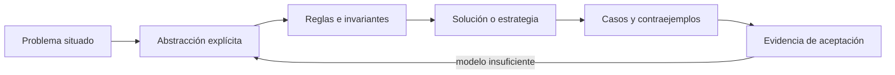

# SE-050 — Lógica proposicional, predicados e inferencia

[← SE-049 — Descomposición, abstracción y reconocimiento de patrones](../../classes/part-04-pensamiento-computacional-y-resolucion-de-problemas/se-049-descomposicion-abstraccion-y-reconocimiento-de-patrones/README.md) · [↑ Parte 04](../../classes/part-04-pensamiento-computacional-y-resolucion-de-problemas/README.md) · [📚 Índice completo](../../classes/README.md) · [🌐 Portal](../../site/classes/SE-050.html) · [SE-051 — Conjuntos, relaciones, funciones y grafos →](../../classes/part-04-pensamiento-computacional-y-resolucion-de-problemas/se-051-conjuntos-relaciones-funciones-y-grafos/README.md)

> Estado: **PLANNED** · Borrador público conservado íntegramente y sometido a auditoría técnica y pedagógica.

## Punto profesional y fundamento pedagógico

**Punto profesional.** La clase existe para usar lógica para comprobar validez de inferencias y hacer visibles supuestos.

**Por qué aparece aquí.** Se sitúa después de **Descomposición, abstracción y reconocimiento de patrones** y antes de **Conjuntos, relaciones, funciones y grafos**: convierte el conocimiento anterior en una decisión observable que la clase siguiente podrá reutilizar. La continuidad se comprueba en el artefacto, no por compartir vocabulario.

**Error conceptual que debe corregir.** Confundir una conclusión plausible con una consecuencia lógica.

**Secuencia de aprendizaje.** Antes de leer la solución, el estudiante predice el resultado del caso normal y del error conceptual anterior. Luego explica un caso resuelto paso a paso, construye un contraejemplo que cambie la decisión y, sin consultar el texto, reconstruye el mecanismo y lo aplica a una entrada nueva. La secuencia usa predicción, explicación propia, contraste y recuperación. [ICAP](https://icap.education.asu.edu/research) distingue participación de construcción de conocimiento; [How People Learn II](https://nap.nationalacademies.org/catalog/24783/how-people-learn-ii-learners-contexts-and-cultures) exige conectar conocimiento previo, contexto y transferencia; la [práctica de recuperación](https://pubmed.ncbi.nlm.nih.gov/16507066/) respalda producir de nuevo la explicación tras una demora; y [Education for Life and Work](https://nap.nationalacademies.org/resource/13398/dbasse_084153.pdf) exige devolución que explique la causa del error.

**Evidencia de aprendizaje.** Logic-check.md con formalización, tabla o derivación y contraejemplo. Debe contener predicción previa, observación, explicación causal, contraejemplo, criterio de aceptación y una nota de qué dato haría cambiar la conclusión.

**Límite de la conclusión.** La validez no garantiza que las premisas describan el mundo.

### Trazabilidad fuente → afirmación

| Fuente primaria u oficial | Afirmación que respalda | Lo que no prueba |
|---|---|---|
| [MIT 6.042J — Mathematics for Computer Science](https://ocw.mit.edu/courses/6-042j-mathematics-for-computer-science-spring-2015/) | aporta lógica, inducción, relaciones, grafos y técnicas de demostración aplicadas | No demuestra por sí sola que el artefacto del estudiante sea correcto. |
| [SWEBOK Guide v4.0a](https://www.computer.org/education/bodies-of-knowledge/software-engineering) | sitúa la decisión dentro de construcción, diseño, pruebas y práctica profesional de ingeniería de software | No demuestra por sí sola que el artefacto del estudiante sea correcto. |

## Antes de empezar

Esta clase continúa el **modelo de decisión diagnóstica**, que convierte la evidencia de la petición observable de extremo a extremo en una siguiente decisión explicable. Recupera `SE-049`: escribe qué artefacto dejó, qué supuesto permanece abierto y qué propiedad debe sobrevivir al nuevo modelo. La matemática se usa para restringir interpretaciones y encontrar errores; no como ornamentación.

## Prerrequisitos

- Poder separar hecho, interpretación, hipótesis y decisión.
- Manejar tablas, diagramas y pseudocódigo legible; Python es opcional.
- Trabajar con datos sintéticos del caso del modelo de decisión diagnóstica y conservar cada versión en Git.

## Problema auténtico

El modelo de decisión diagnóstica recibe reglas como «si DNS falla, la petición no llega al servidor» y «si la petición no llegó, DNS falló». La segunda frase invierte una implicación y produce un diagnóstico falso. El sistema necesita lógica suficiente para detectar inferencias inválidas y condiciones incompletas.

## Objetivos observables

Al finalizar podrás explicar el mecanismo con ejemplo y contraejemplo; construir un modelo con dominio y límites; derivar una prueba que pueda refutarlo; comparar al menos dos representaciones; y entregar una decisión cuya evidencia pueda revisar otra persona.

## Mapa conceptual



El mapa separa el problema de su representación. Los casos no reemplazan reglas; las reglas no prueban que el problema esté bien encuadrado. La pregunta de esta clase es: **¿La conclusión se sigue de las premisas o solo parece razonable?**

## Temas y por qué importan

| Lente | Pregunta | Evidencia |
|---|---|---|
| dominio | ¿qué entradas y estados existen? | vocabulario y particiones |
| estructura | ¿qué relaciones se conservan? | modelo interpretado |
| regla | ¿qué debe ser cierto? | contrato o invariante |
| estrategia | ¿qué pasos producen el resultado? | pseudocódigo y traza |
| límite | ¿dónde falla el argumento? | contraejemplo y caso límite |
## Conceptos y decisiones

### 1. Proposición y valor de verdad

Una proposición es una afirmación evaluable como verdadera o falsa bajo una interpretación. «La red es mala» no tiene criterio; `dns_outcome = timeout` sí. La negación debe abarcar una afirmación definida: no observar respuesta no equivale automáticamente a observar ausencia.

### 2. Conectivos e implicación

Conjunción exige ambas condiciones; disyunción inclusiva acepta una o ambas; implicación `P → Q` solo excluye P verdadera con Q falsa. La implicación no afirma causalidad. Su contraposición es equivalente; su conversa no lo es.

### 3. Predicados y cuantificadores

Un predicado depende de variables: `responde(host, prueba)`. `para todo` exige cubrir el dominio declarado; `existe` se demuestra con un testigo. Pasar de «falló en un cliente» a «falla para todos» cambia el cuantificador sin evidencia.

### 4. Reglas de inferencia

Modus ponens aplica P y P→Q para obtener Q; modus tollens usa P→Q y no Q para obtener no P. Afirmar el consecuente y negar el antecedente son errores frecuentes. El modelo de decisión diagnóstica almacena premisas junto a fuente y momento, porque una regla válida con una premisa obsoleta produce una conclusión inútil.

### 5. Lógica de tres estados operativos

En diagnóstico a menudo existe desconocido además de verdadero/falso. Desconocido no debe colapsar a falso. El modelo de decisión diagnóstica distingue `sí`, `no` y `sin evidencia`, y define cómo cada operador propaga incertidumbre para no cerrar una rama prematuramente.

## Definiciones de trabajo

- **proposición:** afirmación con valor de verdad bajo una interpretación.
- **predicado:** afirmación parametrizada.
- **implicación:** relación lógica que excluye antecedente verdadero y consecuente falso.
- **cuantificador:** operador sobre elementos de un dominio.
- **inferencia:** derivación de una conclusión desde premisas.

Las definiciones fijan el uso en el modelo de decisión diagnóstica. Si una fuente usa otra convención, documenta la traducción. Una palabra definida no equivale a una propiedad demostrada.

## Ejemplo mínimo

Formaliza: «si DNS resolvió y el puerto aceptó, entonces puede iniciarse TLS». Construye una tabla con cuatro combinaciones y explica por qué TLS ausente no identifica cuál antecedente falló.

Antes de resolver, predice el resultado y la propiedad que debería conservarse. Después marca qué parte del resultado procede de la regla y cuál depende del ejemplo.

## Ejemplo profesional

Las reglas del modelo de decisión diagnóstica no disparan acciones destructivas. Una conclusión incluye las premisas usadas, su vigencia y nivel de evidencia. Si falta una premisa, propone una prueba; si dos reglas concluyen estados incompatibles, eleva el conflicto en lugar de escoger silenciosamente.

La entrega profesional hace visible el costo de simplificar. Incluye al menos una alternativa descartada y la condición que obligaría a revisar la decisión.

## Práctica guiada

1. convierte cinco frases ambiguas en proposiciones.
2. identifica antecedente y consecuente.
3. construye tabla de verdad de una regla compuesta.
4. encuentra una conversa inválida en un diagnóstico.
5. añade desconocido y define el comportamiento de la regla.
6. solicita una revisión adversarial y corrige el modelo sin borrar la versión que falló.

## Ejercicios

1. **Comprensión:** define dos conceptos con ejemplo, no-ejemplo y límite.
2. **Construcción:** aplica el mecanismo a un caso del modelo de decisión diagnóstica no usado en la explicación.
3. **Refutación:** fabrica la entrada mínima que rompa una solución ingenua.
4. **Transferencia:** usa el mismo razonamiento en planificación de entregas o validación de datos.

## Reto verificable

Entrega `problem.md`, `model.md` y `checks.md`. Una persona revisora debe poder reconstruir dominio, supuestos, regla, resultado y límite; además debe encontrar qué caso refutaría la solución sin preguntarte oralmente.

## Demostración guiada

1. Declara el dominio y selecciona un caso pequeño calculable a mano.
2. Ejecuta la estrategia paso a paso y conserva estados intermedios.
3. Comprueba el resultado contra la definición, no contra intuición.
4. Introduce el fallo controlado y localiza la primera regla violada.
5. Repara el modelo y repite el caso original y el contraejemplo.

## Preguntas frecuentes

### ¿Formal significa usar símbolos difíciles?

No. Significa que dominio, reglas y criterio permiten decidir si una afirmación se sostiene. Una tabla precisa puede ser más formal que una fórmula ambigua.

### ¿Un conjunto grande de pruebas demuestra corrección?

No para un dominio ilimitado. Las pruebas aportan evidencia y detectan defectos; un argumento cubre clases de entradas, siempre bajo supuestos declarados.

### ¿Puedo implementar antes de especificar todo?

Puedes explorar, pero el prototipo no redefine silenciosamente el problema. Registra qué aprendiste y actualiza contrato y casos antes de aprobar.

## Fallo controlado y diagnóstico

Implementa deliberadamente `si no hay HTTP, entonces DNS falló`. Contradícela con un puerto cerrado y muestra que la conclusión no se sigue. Reemplázala por reglas que preserven alternativas.

Conserva el modelo fallido, la entrada que lo expone, la regla violada y la corrección. No ajustes solo el resultado esperado para hacer pasar el caso.

## Errores comunes y cómo corregirlos

| Síntoma | Causa | Corrección |
|---|---|---|
| el ejemplo funciona pero otro caso no | generalización desde una muestra | definir dominio y buscar frontera |
| dos personas leen reglas distintas | términos o cuantificadores implícitos | glosario y contrato observable |
| el diagrama no cambia decisiones | notación decorativa | interpretar relaciones y límites |
| el proceso no termina | falta medida decreciente o presupuesto | variante y condición de salida |
| se declara «óptimo» sin prueba | confusión entre hallado y garantizado | declarar cota y calidad real |

## Entorno y archivos clave

```text
work/SE-050/
├── problem.md     # contexto, dominio, supuestos y exclusiones
├── model.md       # definiciones, reglas, diagrama y estrategia
├── checks.md      # ejemplos, contraejemplos y aceptación
└── review.md      # objeciones y revisión del modelo
```

El pseudocódigo debe ser independiente de lenguaje y cada diagrama necesita explicación textual. Si usas código para explorar, registra versión, entrada y salida; no lo presentes automáticamente como producto de la clase.

## Seguridad, ética y accesibilidad

- usa incidentes sintéticos y evita convertir direcciones o usuarios en datos de práctica;
- trata autorización y privacidad como invariantes, no como pasos opcionales;
- registra a quién perjudica un falso positivo, falso negativo o prioridad automática;
- ofrece tablas y texto alternativo para diagramas y símbolos;
- define mecanismo de revisión humana y apelación para recomendaciones;
- no uses un modelo parcial para justificar una decisión irreversible.

## Transferencia

Aplica el mecanismo a otro dominio y conserva la estructura del argumento, no los nombres del modelo de decisión diagnóstica. Explica qué dominio, invariante o medida cambia. Si el razonamiento deja de funcionar, identifica el supuesto que pertenecía al caso original.

## Evaluación y evidencia

| Criterio | Para aprobar |
|---|---|
| precisión | dominio, términos y cuantificadores explícitos |
| mecanismo | pasos y relaciones explican el resultado |
| corrección | invariantes, casos o argumento adecuados a la afirmación |
| límites | contraejemplo, costo y supuestos visibles |
| revisión | trazabilidad y objeciones preservadas |

Completar archivos no concede aprobación. La evidencia debe sostener la afirmación exacta, y la revisión de otra persona debe poder contradecirla.

## Fuentes


- [MIT 6.042J — Mathematics for Computer Science](https://ocw.mit.edu/courses/6-042j-mathematics-for-computer-science-spring-2015/) — aporta lógica, inducción, relaciones, grafos y técnicas de demostración aplicadas.
- [SWEBOK Guide v4.0a](https://www.computer.org/education/bodies-of-knowledge/software-engineering) — sitúa la decisión dentro de construcción, diseño, pruebas y práctica profesional de ingeniería de software.

Los cursos y SWEBOK aportan definiciones y métodos; no validan automáticamente el modelo del modelo de decisión diagnóstica. Cada aplicación se sostiene con el artefacto y sus casos.

## Límites y siguiente paso

La lógica valida forma, no verdad de premisas ni causalidad. La siguiente clase modela dominios, asociaciones y rutas mediante conjuntos, relaciones, funciones y grafos.

## Glosario

- **proposición:** afirmación con valor de verdad bajo una interpretación.
- **predicado:** afirmación parametrizada.
- **implicación:** relación lógica que excluye antecedente verdadero y consecuente falso.
- **cuantificador:** operador sobre elementos de un dominio.
- **inferencia:** derivación de una conclusión desde premisas.

---

[← SE-049 — Descomposición, abstracción y reconocimiento de patrones](../../classes/part-04-pensamiento-computacional-y-resolucion-de-problemas/se-049-descomposicion-abstraccion-y-reconocimiento-de-patrones/README.md) · [↑ Parte 04](../../classes/part-04-pensamiento-computacional-y-resolucion-de-problemas/README.md) · [📚 Índice completo](../../classes/README.md) · [🌐 Portal](../../site/classes/SE-050.html) · [SE-051 — Conjuntos, relaciones, funciones y grafos →](../../classes/part-04-pensamiento-computacional-y-resolucion-de-problemas/se-051-conjuntos-relaciones-funciones-y-grafos/README.md)
