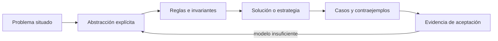

# SE-051 — Conjuntos, relaciones, funciones y grafos

[← SE-050 — Lógica proposicional, predicados e inferencia](../../classes/part-04-pensamiento-computacional-y-resolucion-de-problemas/se-050-logica-proposicional-predicados-e-inferencia/README.md) · [↑ Parte 04](../../classes/part-04-pensamiento-computacional-y-resolucion-de-problemas/README.md) · [📚 Índice completo](../../classes/README.md) · [🌐 Portal](../../site/classes/SE-051.html) · [SE-052 — Invariantes, precondiciones y poscondiciones →](../../classes/part-04-pensamiento-computacional-y-resolucion-de-problemas/se-052-invariantes-precondiciones-y-poscondiciones/README.md)

> Estado: **GUIDED** · Clase desarrollada y revisada cualitativamente.

## Antes de empezar

Esta clase continúa **Atlas**, el planificador de diagnóstico que recibe la evidencia de Nexo y la convierte en una siguiente decisión explicable. Recupera `SE-050`: escribe qué artefacto dejó, qué supuesto permanece abierto y qué propiedad debe sobrevivir al nuevo modelo. La matemática se usa para restringir interpretaciones y encontrar errores; no como ornamentación.

## Prerrequisitos

- Poder separar hecho, interpretación, hipótesis y decisión.
- Manejar tablas, diagramas y pseudocódigo legible; Python es opcional.
- Trabajar con datos sintéticos del caso Atlas y conservar cada versión en Git.

## Problema auténtico

Atlas mezcla hosts, observaciones, pruebas y resultados en una lista. Ya no puede responder qué prueba aplica a qué hipótesis, si dos caminos alcanzan la misma conclusión o si existe un ciclo. Se requiere elegir estructuras según la pregunta, no por comodidad del formato.

## Objetivos observables

Al finalizar podrás explicar el mecanismo con ejemplo y contraejemplo; construir un modelo con dominio y límites; derivar una prueba que pueda refutarlo; comparar al menos dos representaciones; y entregar una decisión cuya evidencia pueda revisar otra persona.

## Mapa conceptual



El mapa separa el problema de su representación. Los casos no reemplazan reglas; las reglas no prueban que el problema esté bien encuadrado. La pregunta de esta clase es: **¿Qué estructura matemática representa mejor pertenencia, asociación, transformación y camino?**

## Temas y por qué importan

| Lente | Pregunta | Evidencia |
|---|---|---|
| dominio | ¿qué entradas y estados existen? | vocabulario y particiones |
| estructura | ¿qué relaciones se conservan? | modelo interpretado |
| regla | ¿qué debe ser cierto? | contrato o invariante |
| estrategia | ¿qué pasos producen el resultado? | pseudocódigo y traza |
| límite | ¿dónde falla el argumento? | contraejemplo y caso límite |

## Conceptos y decisiones

### 1. Conjuntos y universo

Un conjunto agrupa elementos por pertenencia, sin orden ni duplicados. Unión combina posibilidades; intersección conserva coincidencias; diferencia revela cobertura faltante. Toda operación depende de un universo explícito: «todas las pruebas» puede significar las autorizadas, las implementadas o las conocidas.

### 2. Relaciones

Una relación es un subconjunto del producto cartesiano. `prueba_refuta ⊆ Pruebas × Hipótesis` permite muchos a muchos. Propiedades como reflexividad, simetría y transitividad no se presumen: «correlacionado con» puede ser simétrico, «depende de» no.

### 3. Funciones y totalidad

Una función asigna a cada elemento del dominio exactamente un valor. Una tabla que no cubre todos los errores no es total; puede modelarse como función parcial o devolver un resultado explícito `UNKNOWN`. Inyectividad y sobreyectividad importan cuando se quiere reconstruir origen o cubrir todos los estados.

### 4. Grafos dirigidos

Vértices representan estados o tareas y aristas dependencias o transiciones. Dirección, peso y etiqueta tienen significado distinto. Alcanzabilidad responde si existe camino; un orden topológico solo existe en grafos dirigidos acíclicos y no decide prioridad por sí mismo.

### 5. Elección de representación

La misma realidad admite varios modelos. Un conjunto sirve para cobertura; una relación para trazabilidad; una función para asignación determinista; un grafo para rutas. Atlas conserva vistas derivadas de una fuente y prueba consistencia para evitar que tablas duplicadas diverjan.

## Definiciones de trabajo

- **conjunto:** colección definida por pertenencia.
- **relación:** conjunto de pares entre dominios.
- **función:** asignación unívoca desde un dominio.
- **grafo:** vértices conectados por aristas.
- **alcanzabilidad:** existencia de un camino entre vértices.

Las definiciones fijan el uso en Atlas. Si una fuente usa otra convención, documenta la traducción. Una palabra definida no equivale a una propiedad demostrada.

## Ejemplo mínimo

Define H={DNS,TCP,TLS}, P={p1,p2,p3} y una relación `refuta`. Calcula qué hipótesis no tiene prueba y qué pruebas son redundantes. Después dibuja dependencias como grafo.

Antes de resolver, predice el resultado y la propiedad que debería conservarse. Después marca qué parte del resultado procede de la regla y cuál depende del ejemplo.

## Ejemplo profesional

Atlas usa un grafo dirigido acíclico para prerequisitos y una relación aparte para evidencia. Antes de ejecutar, valida que toda hipótesis terminal tenga al menos una prueba autorizada y que no existan ciclos de prerrequisitos. Un orden topológico genera una secuencia válida, no necesariamente óptima.

La entrega profesional hace visible el costo de simplificar. Incluye al menos una alternativa descartada y la condición que obligaría a revisar la decisión.

## Práctica guiada

1. declara universos y tipos de entidad.
2. modela pertenencia con conjuntos.
3. modela trazabilidad como relación.
4. elige una asignación total o parcial.
5. representa dependencias y detecta ciclos.
6. solicita una revisión adversarial y corrige el modelo sin borrar la versión que falló.

## Ejercicios

1. **Comprensión:** define dos conceptos con ejemplo, no-ejemplo y límite.
2. **Construcción:** aplica el mecanismo a un caso de Atlas no usado en la explicación.
3. **Refutación:** fabrica la entrada mínima que rompa una solución ingenua.
4. **Transferencia:** usa el mismo razonamiento en planificación de entregas o validación de datos.

## Reto verificable

Entrega `problem.md`, `model.md` y `checks.md`. Una persona revisora debe poder reconstruir dominio, supuestos, regla, resultado y límite; además debe encontrar qué caso refutaría la solución sin preguntarte oralmente.

## Demostración guiada

1. Declara el dominio y selecciona un caso pequeño calculable a mano.
2. Ejecuta la estrategia paso a paso y conserva estados intermedios.
3. Comprueba el resultado contra la definición, no contra intuición.
4. Introduce el fallo controlado y localiza la primera regla violada.
5. Repara el modelo y repite el caso original y el contraejemplo.

## Preguntas frecuentes

### ¿Formal significa usar símbolos difíciles?

No. Significa que dominio, reglas y criterio permiten decidir si una afirmación se sostiene. Una tabla precisa puede ser más formal que una fórmula ambigua.

### ¿Un conjunto grande de pruebas demuestra corrección?

No para un dominio ilimitado. Las pruebas aportan evidencia y detectan defectos; un argumento cubre clases de entradas, siempre bajo supuestos declarados.

### ¿Puedo implementar antes de especificar todo?

Puedes explorar, pero el prototipo no redefine silenciosamente el problema. Registra qué aprendiste y actualiza contrato y casos antes de aprobar.

## Fallo controlado y diagnóstico

Modela `prueba → hipótesis` como función y añade una prueba que refuta dos hipótesis. Observa la pérdida; corrige a relación o a función hacia conjuntos.

Conserva el modelo fallido, la entrada que lo expone, la regla violada y la corrección. No ajustes solo el resultado esperado para hacer pasar el caso.

## Errores comunes y cómo corregirlos

| Síntoma | Causa | Corrección |
|---|---|---|
| el ejemplo funciona pero otro caso no | generalización desde una muestra | definir dominio y buscar frontera |
| dos personas leen reglas distintas | términos o cuantificadores implícitos | glosario y contrato observable |
| el diagrama no cambia decisiones | notación decorativa | interpretar relaciones y límites |
| el proceso no termina | falta medida decreciente o presupuesto | variante y condición de salida |
| se declara «óptimo» sin prueba | confusión entre hallado y garantizado | declarar cota y calidad real |

## Entorno y archivos clave

```text
work/SE-051/
├── problem.md     # contexto, dominio, supuestos y exclusiones
├── model.md       # definiciones, reglas, diagrama y estrategia
├── checks.md      # ejemplos, contraejemplos y aceptación
└── review.md      # objeciones y revisión del modelo
```

El pseudocódigo debe ser independiente de lenguaje y cada diagrama necesita explicación textual. Si usas código para explorar, registra versión, entrada y salida; no lo presentes automáticamente como producto de la clase.

## Seguridad, ética y accesibilidad

- usa incidentes sintéticos y evita convertir direcciones o usuarios en datos de práctica;
- trata autorización y privacidad como invariantes, no como pasos opcionales;
- registra a quién perjudica un falso positivo, falso negativo o prioridad automática;
- ofrece tablas y texto alternativo para diagramas y símbolos;
- define mecanismo de revisión humana y apelación para recomendaciones;
- no uses un modelo parcial para justificar una decisión irreversible.

## Transferencia

Aplica el mecanismo a otro dominio y conserva la estructura del argumento, no los nombres de Atlas. Explica qué dominio, invariante o medida cambia. Si el razonamiento deja de funcionar, identifica el supuesto que pertenecía al caso original.

## Evaluación y evidencia

| Criterio | Para aprobar |
|---|---|
| precisión | dominio, términos y cuantificadores explícitos |
| mecanismo | pasos y relaciones explican el resultado |
| corrección | invariantes, casos o argumento adecuados a la afirmación |
| límites | contraejemplo, costo y supuestos visibles |
| revisión | trazabilidad y objeciones preservadas |

Completar archivos no concede aprobación. La evidencia debe sostener la afirmación exacta, y la revisión de otra persona debe poder contradecirla.

## Fuentes

- [MIT 6.042J — Mathematics for Computer Science](https://ocw.mit.edu/courses/6-042j-mathematics-for-computer-science-spring-2015/): sustenta las definiciones, argumentos y límites usados aquí.
- [MIT 6.006 — Introduction to Algorithms](https://ocw.mit.edu/courses/6-006-introduction-to-algorithms-spring-2020/): sustenta las definiciones, argumentos y límites usados aquí.

Los cursos y SWEBOK aportan definiciones y métodos; no validan automáticamente el modelo de Atlas. Cada aplicación se sostiene con el artefacto y sus casos.

## Límites y siguiente paso

La estructura no fija semántica ni calidad de datos. La siguiente clase expresa condiciones que deben mantenerse antes, durante y después de una transformación.

## Glosario

- **conjunto:** colección definida por pertenencia.
- **relación:** conjunto de pares entre dominios.
- **función:** asignación unívoca desde un dominio.
- **grafo:** vértices conectados por aristas.
- **alcanzabilidad:** existencia de un camino entre vértices.

---

[← SE-050 — Lógica proposicional, predicados e inferencia](../../classes/part-04-pensamiento-computacional-y-resolucion-de-problemas/se-050-logica-proposicional-predicados-e-inferencia/README.md) · [↑ Parte 04](../../classes/part-04-pensamiento-computacional-y-resolucion-de-problemas/README.md) · [📚 Índice completo](../../classes/README.md) · [🌐 Portal](../../site/classes/SE-051.html) · [SE-052 — Invariantes, precondiciones y poscondiciones →](../../classes/part-04-pensamiento-computacional-y-resolucion-de-problemas/se-052-invariantes-precondiciones-y-poscondiciones/README.md)
