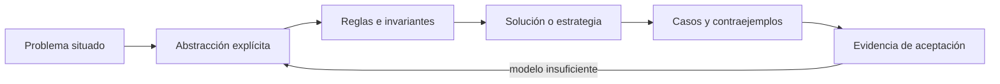

# SE-053 — Recursión, inducción y razonamiento estructural

[← SE-052 — Invariantes, precondiciones y poscondiciones](../../classes/part-04-pensamiento-computacional-y-resolucion-de-problemas/se-052-invariantes-precondiciones-y-poscondiciones/README.md) · [↑ Parte 04](../../classes/part-04-pensamiento-computacional-y-resolucion-de-problemas/README.md) · [📚 Índice completo](../../classes/README.md) · [🌐 Portal](../../site/classes/SE-053.html) · [SE-054 — Algoritmos, corrección y terminación →](../../classes/part-04-pensamiento-computacional-y-resolucion-de-problemas/se-054-algoritmos-correccion-y-terminacion/README.md)

> Estado: **PLANNED** · Borrador público conservado íntegramente y sometido a auditoría técnica y pedagógica.

## Punto profesional y fundamento pedagógico

**Punto profesional.** La clase existe para relacionar definición recursiva, caso base, progreso e inducción.

**Por qué aparece aquí.** Se sitúa después de **Invariantes, precondiciones y poscondiciones** y antes de **Algoritmos, corrección y terminación**: convierte el conocimiento anterior en una decisión observable que la clase siguiente podrá reutilizar. La continuidad se comprueba en el artefacto, no por compartir vocabulario.

**Error conceptual que debe corregir.** Aceptar recursión porque termina en ejemplos pequeños.

**Secuencia de aprendizaje.** Antes de leer la solución, el estudiante predice el resultado del caso normal y del error conceptual anterior. Luego explica un caso resuelto paso a paso, construye un contraejemplo que cambie la decisión y, sin consultar el texto, reconstruye el mecanismo y lo aplica a una entrada nueva. La secuencia usa predicción, explicación propia, contraste y recuperación. [ICAP](https://icap.education.asu.edu/research) distingue participación de construcción de conocimiento; [How People Learn II](https://nap.nationalacademies.org/catalog/24783/how-people-learn-ii-learners-contexts-and-cultures) exige conectar conocimiento previo, contexto y transferencia; la [práctica de recuperación](https://pubmed.ncbi.nlm.nih.gov/16507066/) respalda producir de nuevo la explicación tras una demora; y [Education for Life and Work](https://nap.nationalacademies.org/resource/13398/dbasse_084153.pdf) exige devolución que explique la causa del error.

**Evidencia de aprendizaje.** Recursion-proof.md con medida decreciente, traza e hipótesis inductiva. Debe contener predicción previa, observación, explicación causal, contraejemplo, criterio de aceptación y una nota de qué dato haría cambiar la conclusión.

**Límite de la conclusión.** Terminación no implica complejidad aceptable.

### Trazabilidad fuente → afirmación

| Fuente primaria u oficial | Afirmación que respalda | Lo que no prueba |
|---|---|---|
| [MIT 6.042J — Mathematics for Computer Science](https://ocw.mit.edu/courses/6-042j-mathematics-for-computer-science-spring-2015/) | aporta lógica, inducción, relaciones, grafos y técnicas de demostración aplicadas | No demuestra por sí sola que el artefacto del estudiante sea correcto. |
| [MIT 6.006 — Introduction to Algorithms](https://ocw.mit.edu/courses/6-006-introduction-to-algorithms-spring-2020/) | aporta definiciones, invariantes y análisis de estructuras y algoritmos usados en la clase | No demuestra por sí sola que el artefacto del estudiante sea correcto. |

## Antes de empezar

Esta clase continúa el **modelo de decisión diagnóstica**, que convierte la evidencia de la petición observable de extremo a extremo en una siguiente decisión explicable. Recupera `SE-052`: escribe qué artefacto dejó, qué supuesto permanece abierto y qué propiedad debe sobrevivir al nuevo modelo. La matemática se usa para restringir interpretaciones y encontrar errores; no como ornamentación.

## Prerrequisitos

- Poder separar hecho, interpretación, hipótesis y decisión.
- Manejar tablas, diagramas y pseudocódigo legible; Python es opcional.
- Trabajar con datos sintéticos del caso del modelo de decisión diagnóstica y conservar cada versión en Git.

## Problema auténtico

El árbol de diagnóstico del modelo de decisión diagnóstica contiene subárboles anidados. Una función recursiva los recorre bien en ejemplos pequeños, pero puede omitir nodos o no terminar ante ciclos. Hace falta relacionar definición recursiva, caso base, medida decreciente e inducción.

## Objetivos observables

Al finalizar podrás explicar el mecanismo con ejemplo y contraejemplo; construir un modelo con dominio y límites; derivar una prueba que pueda refutarlo; comparar al menos dos representaciones; y entregar una decisión cuya evidencia pueda revisar otra persona.

## Mapa conceptual



El mapa separa el problema de su representación. Los casos no reemplazan reglas; las reglas no prueban que el problema esté bien encuadrado. La pregunta de esta clase es: **¿Qué estructura disminuye en cada llamada y por qué el argumento cubre todos los casos?**

## Temas y por qué importan

| Lente | Pregunta | Evidencia |
|---|---|---|
| dominio | ¿qué entradas y estados existen? | vocabulario y particiones |
| estructura | ¿qué relaciones se conservan? | modelo interpretado |
| regla | ¿qué debe ser cierto? | contrato o invariante |
| estrategia | ¿qué pasos producen el resultado? | pseudocódigo y traza |
| límite | ¿dónde falla el argumento? | contraejemplo y caso límite |
## Conceptos y decisiones

### 1. Definición recursiva

Una estructura recursiva se define mediante casos base y constructores que contienen estructuras menores. Un árbol vacío o hoja es base; un nodo con hijos combina subárboles. La definición excluye ciclos; si el dominio admite grafos, se requiere memoria de visitados.

### 2. Llamada y marco

Cada llamada recibe un subproblema y conserva un marco con argumentos y punto de retorno. La profundidad consume espacio. La elegancia sintáctica no evita desbordamiento; un recorrido iterativo con pila explícita puede conservar la misma lógica y controlar recursos.

### 3. Inducción matemática

Para demostrar una propiedad P(n), se prueba base y paso desde la hipótesis para un tamaño menor. La inducción fuerte permite asumir todos los tamaños anteriores. Elegir n exige una medida que refleje la estructura: cantidad de nodos restantes, no valor de un ID.

### 4. Inducción estructural

Se prueba la propiedad para cada constructor: hoja y nodo compuesto. Si el resultado es correcto para cada hijo y la combinación preserva la propiedad, lo es para todo árbol finito generado por la definición. Este argumento se alinea mejor que una inducción numérica artificial.

### 5. Recursión, ciclos y memoización

Recursión sobre un grafo sin visitados puede repetir trabajo o divergir. Un conjunto de visitados garantiza que cada vértice se expanda una vez bajo identidad estable. Memoizar reutiliza resultados de subproblemas idénticos, pero exige que dependan solo de la clave y contexto incluido.

## Definiciones de trabajo

- **recursión:** definición o cálculo expresado mediante instancias menores.
- **caso base:** instancia resuelta sin llamada recursiva.
- **hipótesis inductiva:** propiedad asumida para estructuras menores.
- **medida:** cantidad bien fundada que disminuye.
- **memoización:** reutilización de resultados de subproblemas identificados.

Las definiciones fijan el uso en el modelo de decisión diagnóstica. Si una fuente usa otra convención, documenta la traducción. Una palabra definida no equivale a una propiedad demostrada.

## Ejemplo mínimo

Define `contar_pruebas(nodo)` para hoja y nodo con hijos. Traza llamadas para un árbol de tres niveles y demuestra por inducción estructural que cuenta cada hoja una vez.

Antes de resolver, predice el resultado y la propiedad que debería conservarse. Después marca qué parte del resultado procede de la regla y cuál depende del ejemplo.

## Ejemplo profesional

El modelo de decisión diagnóstica recorre el grafo de hipótesis con una pila explícita, límite de profundidad y conjunto de visitados. La especificación explica que un ciclo es error del modelo; no se oculta devolviendo silenciosamente una lista parcial.

La entrega profesional hace visible el costo de simplificar. Incluye al menos una alternativa descartada y la condición que obligaría a revisar la decisión.

## Práctica guiada

1. define la estructura y casos base.
2. traza pila de llamadas.
3. elige medida estrictamente decreciente.
4. escribe base e hipótesis inductiva.
5. introduce un ciclo y añade detección explícita.
6. solicita una revisión adversarial y corrige el modelo sin borrar la versión que falló.

## Ejercicios

1. **Comprensión:** define dos conceptos con ejemplo, no-ejemplo y límite.
2. **Construcción:** aplica el mecanismo a un caso del modelo de decisión diagnóstica no usado en la explicación.
3. **Refutación:** fabrica la entrada mínima que rompa una solución ingenua.
4. **Transferencia:** usa el mismo razonamiento en planificación de entregas o validación de datos.

## Reto verificable

Entrega `problem.md`, `model.md` y `checks.md`. Una persona revisora debe poder reconstruir dominio, supuestos, regla, resultado y límite; además debe encontrar qué caso refutaría la solución sin preguntarte oralmente.

## Demostración guiada

1. Declara el dominio y selecciona un caso pequeño calculable a mano.
2. Ejecuta la estrategia paso a paso y conserva estados intermedios.
3. Comprueba el resultado contra la definición, no contra intuición.
4. Introduce el fallo controlado y localiza la primera regla violada.
5. Repara el modelo y repite el caso original y el contraejemplo.

## Preguntas frecuentes

### ¿Formal significa usar símbolos difíciles?

No. Significa que dominio, reglas y criterio permiten decidir si una afirmación se sostiene. Una tabla precisa puede ser más formal que una fórmula ambigua.

### ¿Un conjunto grande de pruebas demuestra corrección?

No para un dominio ilimitado. Las pruebas aportan evidencia y detectan defectos; un argumento cubre clases de entradas, siempre bajo supuestos declarados.

### ¿Puedo implementar antes de especificar todo?

Puedes explorar, pero el prototipo no redefine silenciosamente el problema. Registra qué aprendiste y actualiza contrato y casos antes de aprobar.

## Fallo controlado y diagnóstico

Elimina el caso base o llama recursivamente con el mismo nodo. Observa no terminación controlada por límite; identifica qué medida dejó de disminuir y repara el contrato.

Conserva el modelo fallido, la entrada que lo expone, la regla violada y la corrección. No ajustes solo el resultado esperado para hacer pasar el caso.

## Errores comunes y cómo corregirlos

| Síntoma | Causa | Corrección |
|---|---|---|
| el ejemplo funciona pero otro caso no | generalización desde una muestra | definir dominio y buscar frontera |
| dos personas leen reglas distintas | términos o cuantificadores implícitos | glosario y contrato observable |
| el diagrama no cambia decisiones | notación decorativa | interpretar relaciones y límites |
| el proceso no termina | falta medida decreciente o presupuesto | variante y condición de salida |
| se declara «óptimo» sin prueba | confusión entre hallado y garantizado | declarar cota y calidad real |

## Entorno y archivos clave

```text
work/SE-053/
├── problem.md     # contexto, dominio, supuestos y exclusiones
├── model.md       # definiciones, reglas, diagrama y estrategia
├── checks.md      # ejemplos, contraejemplos y aceptación
└── review.md      # objeciones y revisión del modelo
```

El pseudocódigo debe ser independiente de lenguaje y cada diagrama necesita explicación textual. Si usas código para explorar, registra versión, entrada y salida; no lo presentes automáticamente como producto de la clase.

## Seguridad, ética y accesibilidad

- usa incidentes sintéticos y evita convertir direcciones o usuarios en datos de práctica;
- trata autorización y privacidad como invariantes, no como pasos opcionales;
- registra a quién perjudica un falso positivo, falso negativo o prioridad automática;
- ofrece tablas y texto alternativo para diagramas y símbolos;
- define mecanismo de revisión humana y apelación para recomendaciones;
- no uses un modelo parcial para justificar una decisión irreversible.

## Transferencia

Aplica el mecanismo a otro dominio y conserva la estructura del argumento, no los nombres del modelo de decisión diagnóstica. Explica qué dominio, invariante o medida cambia. Si el razonamiento deja de funcionar, identifica el supuesto que pertenecía al caso original.

## Evaluación y evidencia

| Criterio | Para aprobar |
|---|---|
| precisión | dominio, términos y cuantificadores explícitos |
| mecanismo | pasos y relaciones explican el resultado |
| corrección | invariantes, casos o argumento adecuados a la afirmación |
| límites | contraejemplo, costo y supuestos visibles |
| revisión | trazabilidad y objeciones preservadas |

Completar archivos no concede aprobación. La evidencia debe sostener la afirmación exacta, y la revisión de otra persona debe poder contradecirla.

## Fuentes


- [MIT 6.042J — Mathematics for Computer Science](https://ocw.mit.edu/courses/6-042j-mathematics-for-computer-science-spring-2015/) — aporta lógica, inducción, relaciones, grafos y técnicas de demostración aplicadas.
- [MIT 6.006 — Introduction to Algorithms](https://ocw.mit.edu/courses/6-006-introduction-to-algorithms-spring-2020/) — aporta definiciones, invariantes y análisis de estructuras y algoritmos usados en la clase.

Los cursos y SWEBOK aportan definiciones y métodos; no validan automáticamente el modelo del modelo de decisión diagnóstica. Cada aplicación se sostiene con el artefacto y sus casos.

## Límites y siguiente paso

Inducción demuestra una propiedad del modelo, no corrige una especificación equivocada. La próxima clase combina contrato, invariante y variante para demostrar corrección y terminación.

## Glosario

- **recursión:** definición o cálculo expresado mediante instancias menores.
- **caso base:** instancia resuelta sin llamada recursiva.
- **hipótesis inductiva:** propiedad asumida para estructuras menores.
- **medida:** cantidad bien fundada que disminuye.
- **memoización:** reutilización de resultados de subproblemas identificados.

---

[← SE-052 — Invariantes, precondiciones y poscondiciones](../../classes/part-04-pensamiento-computacional-y-resolucion-de-problemas/se-052-invariantes-precondiciones-y-poscondiciones/README.md) · [↑ Parte 04](../../classes/part-04-pensamiento-computacional-y-resolucion-de-problemas/README.md) · [📚 Índice completo](../../classes/README.md) · [🌐 Portal](../../site/classes/SE-053.html) · [SE-054 — Algoritmos, corrección y terminación →](../../classes/part-04-pensamiento-computacional-y-resolucion-de-problemas/se-054-algoritmos-correccion-y-terminacion/README.md)
