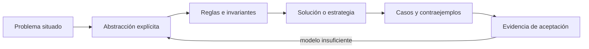

# SE-056 — Heurísticas, aproximación y límites computacionales

[← SE-055 — Complejidad temporal y espacial](../../classes/part-04-pensamiento-computacional-y-resolucion-de-problemas/se-055-complejidad-temporal-y-espacial/README.md) · [↑ Parte 04](../../classes/part-04-pensamiento-computacional-y-resolucion-de-problemas/README.md) · [📚 Índice completo](../../classes/README.md) · [🌐 Portal](../../site/classes/SE-056.html) · [SE-057 — Modelado de estado, transiciones y eventos →](../../classes/part-04-pensamiento-computacional-y-resolucion-de-problemas/se-057-modelado-de-estado-transiciones-y-eventos/README.md)

> Estado: **PLANNED** · Borrador público conservado íntegramente y sometido a auditoría técnica y pedagógica.

## Punto profesional y fundamento pedagógico

**Punto profesional.** La clase existe para usar heurísticas y aproximaciones declarando objetivo, garantía y contraejemplo.

**Por qué aparece aquí.** Se sitúa después de **Complejidad temporal y espacial** y antes de **Modelado de estado, transiciones y eventos**: convierte el conocimiento anterior en una decisión observable que la clase siguiente podrá reutilizar. La continuidad se comprueba en el artefacto, no por compartir vocabulario.

**Error conceptual que debe corregir.** Presentar una buena solución observada como óptima.

**Secuencia de aprendizaje.** Antes de leer la solución, el estudiante predice el resultado del caso normal y del error conceptual anterior. Luego explica un caso resuelto paso a paso, construye un contraejemplo que cambie la decisión y, sin consultar el texto, reconstruye el mecanismo y lo aplica a una entrada nueva. La secuencia usa predicción, explicación propia, contraste y recuperación. [ICAP](https://icap.education.asu.edu/research) distingue participación de construcción de conocimiento; [How People Learn II](https://nap.nationalacademies.org/catalog/24783/how-people-learn-ii-learners-contexts-and-cultures) exige conectar conocimiento previo, contexto y transferencia; la [práctica de recuperación](https://pubmed.ncbi.nlm.nih.gov/16507066/) respalda producir de nuevo la explicación tras una demora; y [Education for Life and Work](https://nap.nationalacademies.org/resource/13398/dbasse_084153.pdf) exige devolución que explique la causa del error.

**Evidencia de aprendizaje.** Heuristic-report.md con baseline, calidad, tiempo y caso adverso. Debe contener predicción previa, observación, explicación causal, contraejemplo, criterio de aceptación y una nota de qué dato haría cambiar la conclusión.

**Límite de la conclusión.** Sin garantía formal la calidad fuera de la muestra permanece desconocida.

### Trazabilidad fuente → afirmación

| Fuente primaria u oficial | Afirmación que respalda | Lo que no prueba |
|---|---|---|
| [MIT 6.006 — Introduction to Algorithms](https://ocw.mit.edu/courses/6-006-introduction-to-algorithms-spring-2020/) | aporta definiciones, invariantes y análisis de estructuras y algoritmos usados en la clase | No demuestra por sí sola que el artefacto del estudiante sea correcto. |
| [MIT 18.404J — Theory of Computation](https://ocw.mit.edu/courses/18-404j-theory-of-computation-fall-2020/) | delimita computabilidad, complejidad y los límites de las soluciones algorítmicas | No demuestra por sí sola que el artefacto del estudiante sea correcto. |
| [MIT 6.042J — Mathematics for Computer Science](https://ocw.mit.edu/courses/6-042j-mathematics-for-computer-science-spring-2015/) | aporta lógica, inducción, relaciones, grafos y técnicas de demostración aplicadas | No demuestra por sí sola que el artefacto del estudiante sea correcto. |

## Antes de empezar

Esta clase continúa el **modelo de decisión diagnóstica**, que convierte la evidencia de la petición observable de extremo a extremo en una siguiente decisión explicable. Recupera `SE-055`: escribe qué artefacto dejó, qué supuesto permanece abierto y qué propiedad debe sobrevivir al nuevo modelo. La matemática se usa para restringir interpretaciones y encontrar errores; no como ornamentación.

## Prerrequisitos

- Poder separar hecho, interpretación, hipótesis y decisión.
- Manejar tablas, diagramas y pseudocódigo legible; Python es opcional.
- Trabajar con datos sintéticos del caso del modelo de decisión diagnóstica y conservar cada versión en Git.

## Problema auténtico

Elegir el conjunto mínimo de pruebas que discrimina todas las hipótesis puede explotar combinatoriamente. El modelo de decisión diagnóstica necesita responder dentro de un deadline. Fingir optimalidad es deshonesto; enumerar todo puede ser inútil. Se comparan heurística, aproximación, búsqueda acotada y límites computacionales.

## Objetivos observables

Al finalizar podrás explicar el mecanismo con ejemplo y contraejemplo; construir un modelo con dominio y límites; derivar una prueba que pueda refutarlo; comparar al menos dos representaciones; y entregar una decisión cuya evidencia pueda revisar otra persona.

## Mapa conceptual



El mapa separa el problema de su representación. Los casos no reemplazan reglas; las reglas no prueban que el problema esté bien encuadrado. La pregunta de esta clase es: **¿Cuándo aceptar una solución no óptima y qué garantía debe conservar?**

## Temas y por qué importan

| Lente | Pregunta | Evidencia |
|---|---|---|
| dominio | ¿qué entradas y estados existen? | vocabulario y particiones |
| estructura | ¿qué relaciones se conservan? | modelo interpretado |
| regla | ¿qué debe ser cierto? | contrato o invariante |
| estrategia | ¿qué pasos producen el resultado? | pseudocódigo y traza |
| límite | ¿dónde falla el argumento? | contraejemplo y caso límite |
## Conceptos y decisiones

### 1. Factibilidad y optimización

Un problema de decisión pregunta si existe solución; uno de optimización busca la mejor según objetivo. Verificar una propuesta puede ser mucho más barato que encontrarla. Definir costo, restricciones y empate evita que «mejor» cambie durante el análisis.

### 2. Heurística

Una heurística usa conocimiento del dominio para encontrar rápido una solución plausible sin garantía general de calidad. Debe declarar casos adversos y fallback. `elige prueba más barata` falla si aporta poca información y obliga a muchas pruebas posteriores.

### 3. Aproximación

Un algoritmo de aproximación ofrece una relación demostrable con el óptimo para una clase de problemas. La garantía no es lo mismo que buen promedio empírico. Si el modelo no satisface sus supuestos, la razón deja de aplicar.

### 4. Búsqueda acotada y anytime

Se puede limitar tiempo, nodos o memoria, conservar la mejor solución hallada y mejorar mientras quede presupuesto. La salida incluye cota o gap cuando existe. Cancelar debe dejar un estado consistente y distinguir incompleto de óptimo.

### 5. Decidibilidad y complejidad

Algunos problemas no admiten algoritmo que decida todos los casos; otros son decidibles pero no se conoce solución eficiente general. NP no significa «imposible» ni «exponencial siempre». Instancias pequeñas, estructura especial o parametrización pueden ser tratables.

## Definiciones de trabajo

- **heurística:** regla práctica sin garantía universal de optimalidad.
- **aproximación:** algoritmo con calidad acotada respecto al óptimo.
- **óptimo:** mejor solución según objetivo y restricciones.
- **anytime:** procedimiento que mejora una solución válida mientras dispone de recursos.
- **decidibilidad:** existencia de un algoritmo que termina y responde todos los casos.

Las definiciones fijan el uso en el modelo de decisión diagnóstica. Si una fuente usa otra convención, documenta la traducción. Una palabra definida no equivale a una propiedad demostrada.

## Ejemplo mínimo

Tres pruebas cubren hipótesis solapadas. Compara enumeración completa con greedy por cobertura/costo. Construye un caso donde greedy no sea óptimo y calcula la diferencia.

Antes de resolver, predice el resultado y la propiedad que debería conservarse. Después marca qué parte del resultado procede de la regla y cuál depende del ejemplo.

## Ejemplo profesional

El modelo de decisión diagnóstica usa greedy como primera solución, luego búsqueda acotada por 200 ms. Reporta costo de la mejor secuencia, límite inferior disponible y si probó optimalidad. Bajo presión mantiene autorización y cobertura mínima como restricciones duras.

La entrega profesional hace visible el costo de simplificar. Incluye al menos una alternativa descartada y la condición que obligaría a revisar la decisión.

## Práctica guiada

1. define objetivo y restricciones.
2. calcula óptimo de un caso pequeño.
3. diseña una heurística.
4. encuentra un adversario.
5. añade presupuesto y metadatos de calidad.
6. solicita una revisión adversarial y corrige el modelo sin borrar la versión que falló.

## Ejercicios

1. **Comprensión:** define dos conceptos con ejemplo, no-ejemplo y límite.
2. **Construcción:** aplica el mecanismo a un caso del modelo de decisión diagnóstica no usado en la explicación.
3. **Refutación:** fabrica la entrada mínima que rompa una solución ingenua.
4. **Transferencia:** usa el mismo razonamiento en planificación de entregas o validación de datos.

## Reto verificable

Entrega `problem.md`, `model.md` y `checks.md`. Una persona revisora debe poder reconstruir dominio, supuestos, regla, resultado y límite; además debe encontrar qué caso refutaría la solución sin preguntarte oralmente.

## Demostración guiada

1. Declara el dominio y selecciona un caso pequeño calculable a mano.
2. Ejecuta la estrategia paso a paso y conserva estados intermedios.
3. Comprueba el resultado contra la definición, no contra intuición.
4. Introduce el fallo controlado y localiza la primera regla violada.
5. Repara el modelo y repite el caso original y el contraejemplo.

## Preguntas frecuentes

### ¿Formal significa usar símbolos difíciles?

No. Significa que dominio, reglas y criterio permiten decidir si una afirmación se sostiene. Una tabla precisa puede ser más formal que una fórmula ambigua.

### ¿Un conjunto grande de pruebas demuestra corrección?

No para un dominio ilimitado. Las pruebas aportan evidencia y detectan defectos; un argumento cubre clases de entradas, siempre bajo supuestos declarados.

### ¿Puedo implementar antes de especificar todo?

Puedes explorar, pero el prototipo no redefine silenciosamente el problema. Registra qué aprendiste y actualiza contrato y casos antes de aprobar.

## Fallo controlado y diagnóstico

Etiqueta como «óptimo» el primer plan greedy. Contrástalo con enumeración en un caso mínimo que lo refuta; cambia el contrato a `best_found` y declara garantía real.

Conserva el modelo fallido, la entrada que lo expone, la regla violada y la corrección. No ajustes solo el resultado esperado para hacer pasar el caso.

## Errores comunes y cómo corregirlos

| Síntoma | Causa | Corrección |
|---|---|---|
| el ejemplo funciona pero otro caso no | generalización desde una muestra | definir dominio y buscar frontera |
| dos personas leen reglas distintas | términos o cuantificadores implícitos | glosario y contrato observable |
| el diagrama no cambia decisiones | notación decorativa | interpretar relaciones y límites |
| el proceso no termina | falta medida decreciente o presupuesto | variante y condición de salida |
| se declara «óptimo» sin prueba | confusión entre hallado y garantizado | declarar cota y calidad real |

## Entorno y archivos clave

```text
work/SE-056/
├── problem.md     # contexto, dominio, supuestos y exclusiones
├── model.md       # definiciones, reglas, diagrama y estrategia
├── checks.md      # ejemplos, contraejemplos y aceptación
└── review.md      # objeciones y revisión del modelo
```

El pseudocódigo debe ser independiente de lenguaje y cada diagrama necesita explicación textual. Si usas código para explorar, registra versión, entrada y salida; no lo presentes automáticamente como producto de la clase.

## Seguridad, ética y accesibilidad

- usa incidentes sintéticos y evita convertir direcciones o usuarios en datos de práctica;
- trata autorización y privacidad como invariantes, no como pasos opcionales;
- registra a quién perjudica un falso positivo, falso negativo o prioridad automática;
- ofrece tablas y texto alternativo para diagramas y símbolos;
- define mecanismo de revisión humana y apelación para recomendaciones;
- no uses un modelo parcial para justificar una decisión irreversible.

## Transferencia

Aplica el mecanismo a otro dominio y conserva la estructura del argumento, no los nombres del modelo de decisión diagnóstica. Explica qué dominio, invariante o medida cambia. Si el razonamiento deja de funcionar, identifica el supuesto que pertenecía al caso original.

## Evaluación y evidencia

| Criterio | Para aprobar |
|---|---|
| precisión | dominio, términos y cuantificadores explícitos |
| mecanismo | pasos y relaciones explican el resultado |
| corrección | invariantes, casos o argumento adecuados a la afirmación |
| límites | contraejemplo, costo y supuestos visibles |
| revisión | trazabilidad y objeciones preservadas |

Completar archivos no concede aprobación. La evidencia debe sostener la afirmación exacta, y la revisión de otra persona debe poder contradecirla.

## Fuentes


- [MIT 6.006 — Introduction to Algorithms](https://ocw.mit.edu/courses/6-006-introduction-to-algorithms-spring-2020/) — aporta definiciones, invariantes y análisis de estructuras y algoritmos usados en la clase.
- [MIT 18.404J — Theory of Computation](https://ocw.mit.edu/courses/18-404j-theory-of-computation-fall-2020/) — delimita computabilidad, complejidad y los límites de las soluciones algorítmicas.
- [MIT 6.042J — Mathematics for Computer Science](https://ocw.mit.edu/courses/6-042j-mathematics-for-computer-science-spring-2015/) — aporta lógica, inducción, relaciones, grafos y técnicas de demostración aplicadas.

Los cursos y SWEBOK aportan definiciones y métodos; no validan automáticamente el modelo del modelo de decisión diagnóstica. Cada aplicación se sostiene con el artefacto y sus casos.

## Límites y siguiente paso

La clase no prueba NP-completitud de un problema nuevo. Enseña a reconocer el tipo de afirmación requerida. La siguiente modela comportamiento dinámico mediante estados y eventos.

## Glosario

- **heurística:** regla práctica sin garantía universal de optimalidad.
- **aproximación:** algoritmo con calidad acotada respecto al óptimo.
- **óptimo:** mejor solución según objetivo y restricciones.
- **anytime:** procedimiento que mejora una solución válida mientras dispone de recursos.
- **decidibilidad:** existencia de un algoritmo que termina y responde todos los casos.

---

[← SE-055 — Complejidad temporal y espacial](../../classes/part-04-pensamiento-computacional-y-resolucion-de-problemas/se-055-complejidad-temporal-y-espacial/README.md) · [↑ Parte 04](../../classes/part-04-pensamiento-computacional-y-resolucion-de-problemas/README.md) · [📚 Índice completo](../../classes/README.md) · [🌐 Portal](../../site/classes/SE-056.html) · [SE-057 — Modelado de estado, transiciones y eventos →](../../classes/part-04-pensamiento-computacional-y-resolucion-de-problemas/se-057-modelado-de-estado-transiciones-y-eventos/README.md)
