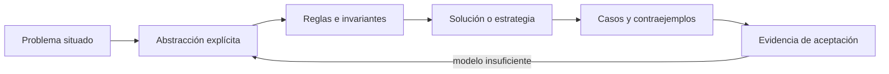

# SE-057 — Modelado de estado, transiciones y eventos

[← SE-056 — Heurísticas, aproximación y límites computacionales](../../classes/part-04-pensamiento-computacional-y-resolucion-de-problemas/se-056-heuristicas-aproximacion-y-limites-computacionales/README.md) · [↑ Parte 04](../../classes/part-04-pensamiento-computacional-y-resolucion-de-problemas/README.md) · [📚 Índice completo](../../classes/README.md) · [🌐 Portal](../../site/classes/SE-057.html) · [SE-058 — Resolución sistemática y registro de hipótesis →](../../classes/part-04-pensamiento-computacional-y-resolucion-de-problemas/se-058-resolucion-sistematica-y-registro-de-hipotesis/README.md)

> Estado: **GUIDED** · Clase desarrollada y revisada cualitativamente.

## Antes de empezar

Esta clase continúa **Atlas**, el planificador de diagnóstico que recibe la evidencia de Nexo y la convierte en una siguiente decisión explicable. Recupera `SE-056`: escribe qué artefacto dejó, qué supuesto permanece abierto y qué propiedad debe sobrevivir al nuevo modelo. La matemática se usa para restringir interpretaciones y encontrar errores; no como ornamentación.

## Prerrequisitos

- Poder separar hecho, interpretación, hipótesis y decisión.
- Manejar tablas, diagramas y pseudocódigo legible; Python es opcional.
- Trabajar con datos sintéticos del caso Atlas y conservar cada versión en Git.

## Problema auténtico

Atlas recibe respuestas tardías, cancelaciones y reintentos. Sin un modelo de estado, un resultado de una ejecución anterior puede cerrar la actual o una cancelación puede dejar pruebas activas. Se necesita describir estado, evento, guardas, acciones y propiedades temporales.

## Objetivos observables

Al finalizar podrás explicar el mecanismo con ejemplo y contraejemplo; construir un modelo con dominio y límites; derivar una prueba que pueda refutarlo; comparar al menos dos representaciones; y entregar una decisión cuya evidencia pueda revisar otra persona.

## Mapa conceptual



El mapa separa el problema de su representación. Los casos no reemplazan reglas; las reglas no prueban que el problema esté bien encuadrado. La pregunta de esta clase es: **¿Qué eventos son válidos en cada estado y qué transición producen?**

## Temas y por qué importan

| Lente | Pregunta | Evidencia |
|---|---|---|
| dominio | ¿qué entradas y estados existen? | vocabulario y particiones |
| estructura | ¿qué relaciones se conservan? | modelo interpretado |
| regla | ¿qué debe ser cierto? | contrato o invariante |
| estrategia | ¿qué pasos producen el resultado? | pseudocódigo y traza |
| límite | ¿dónde falla el argumento? | contraejemplo y caso límite |

## Conceptos y decisiones

### 1. Estado observable y estado derivado

El estado resume la historia relevante para decisiones futuras. No todo campo debe almacenarse: `agotado` puede derivarse de presupuesto. Duplicar estado crea combinaciones imposibles. Se conservan hechos mínimos y se calculan vistas.

### 2. Evento y transición

Un evento representa algo ocurrido; una transición válida relaciona estado origen, evento, guarda, acción y destino. El mismo evento puede ser válido en un estado e ignorado o rechazado en otro. El modelo debe especificar eventos inesperados, no dejarlos a comportamiento accidental.

### 3. Guardas e invariantes

Una guarda habilita una transición; un invariante restringe todos los estados alcanzables. `attempt_id actual` impide aceptar resultados viejos. La acción modifica estado y emite efectos, pero el modelo separa la intención de E/S concreta.

### 4. Máquinas deterministas y jerarquía

Una máquina determinista tiene a lo sumo una transición por estado y evento bajo guardas excluyentes. Estados jerárquicos comparten comportamiento —todos los activos aceptan cancelar— y reducen duplicación, pero pueden ocultar precedencia si no se documenta.

### 5. Safety y liveness

Safety afirma que algo malo nunca ocurre: no ejecutar sin autorización. Liveness afirma que algo bueno eventualmente ocurre bajo supuestos: toda ejecución termina o se cancela. Probar safety no garantiza progreso; reintentar eternamente puede mantener invariantes y violar liveness.

## Definiciones de trabajo

- **estado:** resumen de historia relevante para comportamiento futuro.
- **evento:** hecho que puede activar una transición.
- **guarda:** condición para habilitar una transición.
- **safety:** propiedad que excluye estados malos.
- **liveness:** propiedad de progreso eventual bajo supuestos.

Las definiciones fijan el uso en Atlas. Si una fuente usa otra convención, documenta la traducción. Una palabra definida no equivale a una propiedad demostrada.

## Ejemplo mínimo

Modela `idle → running → completed|failed|cancelled`. Añade `result_received` con `attempt_id`; define qué ocurre si llega después de cancelar.

Antes de resolver, predice el resultado y la propiedad que debería conservarse. Después marca qué parte del resultado procede de la regla y cuál depende del ejemplo.

## Ejemplo profesional

Atlas persiste transición y versión antes de emitir efectos. Cada ejecución tiene ID; eventos duplicados son idempotentes y tardíos se archivan sin mutar el estado actual. Un diagrama se acompaña con tabla completa de eventos.

La entrega profesional hace visible el costo de simplificar. Incluye al menos una alternativa descartada y la condición que obligaría a revisar la decisión.

## Práctica guiada

1. enumera estados mutuamente excluyentes.
2. define eventos y cargas.
3. crea tabla estado-evento.
4. añade guardas e invariantes.
5. prueba duplicado, tardío y cancelación.
6. solicita una revisión adversarial y corrige el modelo sin borrar la versión que falló.

## Ejercicios

1. **Comprensión:** define dos conceptos con ejemplo, no-ejemplo y límite.
2. **Construcción:** aplica el mecanismo a un caso de Atlas no usado en la explicación.
3. **Refutación:** fabrica la entrada mínima que rompa una solución ingenua.
4. **Transferencia:** usa el mismo razonamiento en planificación de entregas o validación de datos.

## Reto verificable

Entrega `problem.md`, `model.md` y `checks.md`. Una persona revisora debe poder reconstruir dominio, supuestos, regla, resultado y límite; además debe encontrar qué caso refutaría la solución sin preguntarte oralmente.

## Demostración guiada

1. Declara el dominio y selecciona un caso pequeño calculable a mano.
2. Ejecuta la estrategia paso a paso y conserva estados intermedios.
3. Comprueba el resultado contra la definición, no contra intuición.
4. Introduce el fallo controlado y localiza la primera regla violada.
5. Repara el modelo y repite el caso original y el contraejemplo.

## Preguntas frecuentes

### ¿Formal significa usar símbolos difíciles?

No. Significa que dominio, reglas y criterio permiten decidir si una afirmación se sostiene. Una tabla precisa puede ser más formal que una fórmula ambigua.

### ¿Un conjunto grande de pruebas demuestra corrección?

No para un dominio ilimitado. Las pruebas aportan evidencia y detectan defectos; un argumento cubre clases de entradas, siempre bajo supuestos declarados.

### ¿Puedo implementar antes de especificar todo?

Puedes explorar, pero el prototipo no redefine silenciosamente el problema. Registra qué aprendiste y actualiza contrato y casos antes de aprobar.

## Fallo controlado y diagnóstico

Procesa un `completed` tardío después de iniciar un nuevo intento y observa que sobrescribe el resultado. Añade correlación y una transición explícita `late_result` sin efecto de negocio.

Conserva el modelo fallido, la entrada que lo expone, la regla violada y la corrección. No ajustes solo el resultado esperado para hacer pasar el caso.

## Errores comunes y cómo corregirlos

| Síntoma | Causa | Corrección |
|---|---|---|
| el ejemplo funciona pero otro caso no | generalización desde una muestra | definir dominio y buscar frontera |
| dos personas leen reglas distintas | términos o cuantificadores implícitos | glosario y contrato observable |
| el diagrama no cambia decisiones | notación decorativa | interpretar relaciones y límites |
| el proceso no termina | falta medida decreciente o presupuesto | variante y condición de salida |
| se declara «óptimo» sin prueba | confusión entre hallado y garantizado | declarar cota y calidad real |

## Entorno y archivos clave

```text
work/SE-057/
├── problem.md     # contexto, dominio, supuestos y exclusiones
├── model.md       # definiciones, reglas, diagrama y estrategia
├── checks.md      # ejemplos, contraejemplos y aceptación
└── review.md      # objeciones y revisión del modelo
```

El pseudocódigo debe ser independiente de lenguaje y cada diagrama necesita explicación textual. Si usas código para explorar, registra versión, entrada y salida; no lo presentes automáticamente como producto de la clase.

## Seguridad, ética y accesibilidad

- usa incidentes sintéticos y evita convertir direcciones o usuarios en datos de práctica;
- trata autorización y privacidad como invariantes, no como pasos opcionales;
- registra a quién perjudica un falso positivo, falso negativo o prioridad automática;
- ofrece tablas y texto alternativo para diagramas y símbolos;
- define mecanismo de revisión humana y apelación para recomendaciones;
- no uses un modelo parcial para justificar una decisión irreversible.

## Transferencia

Aplica el mecanismo a otro dominio y conserva la estructura del argumento, no los nombres de Atlas. Explica qué dominio, invariante o medida cambia. Si el razonamiento deja de funcionar, identifica el supuesto que pertenecía al caso original.

## Evaluación y evidencia

| Criterio | Para aprobar |
|---|---|
| precisión | dominio, términos y cuantificadores explícitos |
| mecanismo | pasos y relaciones explican el resultado |
| corrección | invariantes, casos o argumento adecuados a la afirmación |
| límites | contraejemplo, costo y supuestos visibles |
| revisión | trazabilidad y objeciones preservadas |

Completar archivos no concede aprobación. La evidencia debe sostener la afirmación exacta, y la revisión de otra persona debe poder contradecirla.

## Fuentes

- [MIT 6.042J — Mathematics for Computer Science](https://ocw.mit.edu/courses/6-042j-mathematics-for-computer-science-spring-2015/): sustenta las definiciones, argumentos y límites usados aquí.
- [SWEBOK Guide v4.0a](https://www.computer.org/education/bodies-of-knowledge/software-engineering): sustenta las definiciones, argumentos y límites usados aquí.

Los cursos y SWEBOK aportan definiciones y métodos; no validan automáticamente el modelo de Atlas. Cada aplicación se sostiene con el artefacto y sus casos.

## Límites y siguiente paso

El modelo secuencial no resuelve concurrencia distribuida ni orden global. La próxima clase organiza la resolución como ciclo de hipótesis y evidencia.

## Glosario

- **estado:** resumen de historia relevante para comportamiento futuro.
- **evento:** hecho que puede activar una transición.
- **guarda:** condición para habilitar una transición.
- **safety:** propiedad que excluye estados malos.
- **liveness:** propiedad de progreso eventual bajo supuestos.

---

[← SE-056 — Heurísticas, aproximación y límites computacionales](../../classes/part-04-pensamiento-computacional-y-resolucion-de-problemas/se-056-heuristicas-aproximacion-y-limites-computacionales/README.md) · [↑ Parte 04](../../classes/part-04-pensamiento-computacional-y-resolucion-de-problemas/README.md) · [📚 Índice completo](../../classes/README.md) · [🌐 Portal](../../site/classes/SE-057.html) · [SE-058 — Resolución sistemática y registro de hipótesis →](../../classes/part-04-pensamiento-computacional-y-resolucion-de-problemas/se-058-resolucion-sistematica-y-registro-de-hipotesis/README.md)
