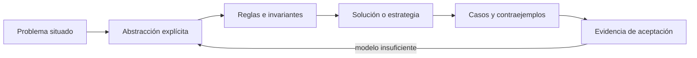

# SE-059 — Taller: descomponer un problema ambiguo

[← SE-058 — Resolución sistemática y registro de hipótesis](../../classes/part-04-pensamiento-computacional-y-resolucion-de-problemas/se-058-resolucion-sistematica-y-registro-de-hipotesis/README.md) · [↑ Parte 04](../../classes/part-04-pensamiento-computacional-y-resolucion-de-problemas/README.md) · [📚 Índice completo](../../classes/README.md) · [🌐 Portal](../../site/classes/SE-059.html) · [SE-060 — Proyecto: especificación y solución contrastable →](../../classes/part-04-pensamiento-computacional-y-resolucion-de-problemas/se-060-proyecto-especificacion-y-solucion-contrastable/README.md)


## Punto profesional y fundamento pedagógico

**Punto profesional.** La clase existe para convertir un problema ambiguo en contratos, riesgos, preguntas y evidencia de aceptación.

**Por qué aparece aquí.** Se sitúa después de **Resolución sistemática y registro de hipótesis** y antes de **Proyecto: especificación y solución contrastable**: convierte el conocimiento anterior en una decisión observable que la clase siguiente podrá reutilizar. La continuidad se comprueba en el artefacto, no por compartir vocabulario.

**Error conceptual que debe corregir.** Empezar por implementar la interpretación más cómoda.

**Secuencia de aprendizaje.** Antes de leer la solución, el estudiante predice el resultado del caso normal y del error conceptual anterior. Luego explica un caso resuelto paso a paso, construye un contraejemplo que cambie la decisión y, sin consultar el texto, reconstruye el mecanismo y lo aplica a una entrada nueva. La secuencia usa predicción, explicación propia, contraste y recuperación. [ICAP](https://icap.education.asu.edu/research) distingue participación de construcción de conocimiento; [How People Learn II](https://nap.nationalacademies.org/catalog/24783/how-people-learn-ii-learners-contexts-and-cultures) exige conectar conocimiento previo, contexto y transferencia; la [práctica de recuperación](https://pubmed.ncbi.nlm.nih.gov/16507066/) respalda producir de nuevo la explicación tras una demora; y [Education for Life and Work](https://nap.nationalacademies.org/resource/13398/dbasse_084153.pdf) exige devolución que explique la causa del error.

**Evidencia de aprendizaje.** Ambiguity-map.md con actores, términos, decisiones, pruebas y preguntas abiertas. Debe contener predicción previa, observación, explicación causal, contraejemplo, criterio de aceptación y una nota de qué dato haría cambiar la conclusión.

**Límite de la conclusión.** La especificación conserva incertidumbre explícita; no la inventa.

### Trazabilidad fuente → afirmación

| Fuente primaria u oficial | Afirmación que respalda | Lo que no prueba |
|---|---|---|
| [SWEBOK Guide v4.0a](https://www.computer.org/education/bodies-of-knowledge/software-engineering) | sitúa la decisión dentro de construcción, diseño, pruebas y práctica profesional de ingeniería de software | No demuestra por sí sola que el artefacto del estudiante sea correcto. |
| [MIT 6.042J — Mathematics for Computer Science](https://ocw.mit.edu/courses/6-042j-mathematics-for-computer-science-spring-2015/) | aporta lógica, inducción, relaciones, grafos y técnicas de demostración aplicadas | No demuestra por sí sola que el artefacto del estudiante sea correcto. |

## Antes de empezar

Esta clase continúa el **modelo de decisión diagnóstica**, que convierte la evidencia de la petición observable de extremo a extremo en una siguiente decisión explicable. Recupera `SE-058`: escribe qué artefacto dejó, qué supuesto permanece abierto y qué propiedad debe sobrevivir al nuevo modelo. La matemática se usa para restringir interpretaciones y encontrar errores; no como ornamentación.

## Prerrequisitos

- Poder separar hecho, interpretación, hipótesis y decisión.
- Manejar tablas, diagramas y pseudocódigo legible; Python es opcional.
- Trabajar con datos sintéticos del caso del modelo de decisión diagnóstica y conservar cada versión en Git.

## Problema auténtico

Una organización pide a el modelo de decisión diagnóstica: «haz que el soporte sea inteligente y rápido». No define persona, decisión, datos, tiempo, error tolerable ni daño. El taller no permite saltar a funciones o IA: debe reducir ambigüedad sin inventar necesidades.

## Objetivos observables

Al finalizar podrás explicar el mecanismo con ejemplo y contraejemplo; construir un modelo con dominio y límites; derivar una prueba que pueda refutarlo; comparar al menos dos representaciones; y entregar una decisión cuya evidencia pueda revisar otra persona.

## Mapa conceptual



El mapa separa el problema de su representación. Los casos no reemplazan reglas; las reglas no prueban que el problema esté bien encuadrado. La pregunta de esta clase es: **¿Cómo convertir lenguaje ambiguo en una decisión que pueda revisarse?**

## Temas y por qué importan

| Lente | Pregunta | Evidencia |
|---|---|---|
| dominio | ¿qué entradas y estados existen? | vocabulario y particiones |
| estructura | ¿qué relaciones se conservan? | modelo interpretado |
| regla | ¿qué debe ser cierto? | contrato o invariante |
| estrategia | ¿qué pasos producen el resultado? | pseudocódigo y traza |
| límite | ¿dónde falla el argumento? | contraejemplo y caso límite |
## Conceptos y decisiones

### 1. Ambigüedad, incertidumbre y conflicto

Ambigüedad admite múltiples interpretaciones; incertidumbre indica información faltante; conflicto enfrenta objetivos incompatibles. Cada una exige tratamiento distinto: definir términos, investigar evidencia o tomar una decisión explícita con trade-offs.

### 2. Pregunta de decisión

El problema se formula como quién decide qué, para lograr qué resultado, bajo qué contexto y restricciones. «Clasificar incidentes» se vuelve «ayudar a soporte a elegir la siguiente prueba autorizada en menos de dos minutos sin exponer datos».

### 3. Mapa de actores y efectos

Usuario directo, persona afectada, operador y dueño de datos pueden ser distintos. Automatizar priorización redistribuye espera y poder. El mapa registra beneficio, carga, capacidad de apelación y responsabilidad cuando la recomendación es errónea.

### 4. Supuestos y preguntas abiertas

Un supuesto se escribe como afirmación que puede cambiar la solución y se asocia a evidencia necesaria. Una pregunta abierta tiene owner y deadline. El modelo de decisión diagnóstica no convierte la ausencia de respuesta en aceptación tácita.

### 5. Criterio de salida del taller

El resultado no es una solución detallada. Es un modelo del problema con alcance, exclusiones, ejemplos, invariantes, opciones y plan de validación. Debe permitir que dos propuestas se comparen sobre el mismo contrato.

## Definiciones de trabajo

- **ambigüedad:** pluralidad de interpretaciones posibles.
- **incertidumbre:** falta de conocimiento relevante.
- **conflicto:** objetivos o restricciones incompatibles.
- **actor:** persona o sistema afectado o participante.
- **criterio de salida:** condición observable para cerrar una fase.

Las definiciones fijan el uso en el modelo de decisión diagnóstica. Si una fuente usa otra convención, documenta la traducción. Una palabra definida no equivale a una propiedad demostrada.

## Ejemplo mínimo

Toma «debe ser rápido» y produce tres interpretaciones medibles: latencia de recomendación, tiempo de resolución y tiempo humano activo. Explica por qué optimizar una puede empeorar otra.

Antes de resolver, predice el resultado y la propiedad que debería conservarse. Después marca qué parte del resultado procede de la regla y cuál depende del ejemplo.

## Ejemplo profesional

El taller reúne soporte, ingeniería, seguridad y una persona afectada por priorización. Genera un glosario, mapa de decisiones, eventos, riesgos y cinco ejemplos. Las contradicciones permanecen visibles con owner; no se suavizan en prosa.

La entrega profesional hace visible el costo de simplificar. Incluye al menos una alternativa descartada y la condición que obligaría a revisar la decisión.

## Práctica guiada

1. subraya términos interpretables.
2. clasifica ambigüedad, incertidumbre o conflicto.
3. formula pregunta de decisión.
4. mapea actores y efectos.
5. crea ejemplos y contraejemplos.
6. somete el modelo a revisión adversarial.
7. solicita una revisión adversarial y corrige el modelo sin borrar la versión que falló.

## Ejercicios

1. **Comprensión:** define dos conceptos con ejemplo, no-ejemplo y límite.
2. **Construcción:** aplica el mecanismo a un caso del modelo de decisión diagnóstica no usado en la explicación.
3. **Refutación:** fabrica la entrada mínima que rompa una solución ingenua.
4. **Transferencia:** usa el mismo razonamiento en planificación de entregas o validación de datos.

## Reto verificable

Entrega `problem.md`, `model.md` y `checks.md`. Una persona revisora debe poder reconstruir dominio, supuestos, regla, resultado y límite; además debe encontrar qué caso refutaría la solución sin preguntarte oralmente.

## Demostración guiada

1. Declara el dominio y selecciona un caso pequeño calculable a mano.
2. Ejecuta la estrategia paso a paso y conserva estados intermedios.
3. Comprueba el resultado contra la definición, no contra intuición.
4. Introduce el fallo controlado y localiza la primera regla violada.
5. Repara el modelo y repite el caso original y el contraejemplo.

## Preguntas frecuentes

### ¿Formal significa usar símbolos difíciles?

No. Significa que dominio, reglas y criterio permiten decidir si una afirmación se sostiene. Una tabla precisa puede ser más formal que una fórmula ambigua.

### ¿Un conjunto grande de pruebas demuestra corrección?

No para un dominio ilimitado. Las pruebas aportan evidencia y detectan defectos; un argumento cubre clases de entradas, siempre bajo supuestos declarados.

### ¿Puedo implementar antes de especificar todo?

Puedes explorar, pero el prototipo no redefine silenciosamente el problema. Registra qué aprendiste y actualiza contrato y casos antes de aprobar.

## Fallo controlado y diagnóstico

Diseña inmediatamente un chatbot y luego intenta justificarlo. Compara con al menos dos opciones —guía estática y planificador— y una opción de no automatizar; reabre el problema.

Conserva el modelo fallido, la entrada que lo expone, la regla violada y la corrección. No ajustes solo el resultado esperado para hacer pasar el caso.

## Errores comunes y cómo corregirlos

| Síntoma | Causa | Corrección |
|---|---|---|
| el ejemplo funciona pero otro caso no | generalización desde una muestra | definir dominio y buscar frontera |
| dos personas leen reglas distintas | términos o cuantificadores implícitos | glosario y contrato observable |
| el diagrama no cambia decisiones | notación decorativa | interpretar relaciones y límites |
| el proceso no termina | falta medida decreciente o presupuesto | variante y condición de salida |
| se declara «óptimo» sin prueba | confusión entre hallado y garantizado | declarar cota y calidad real |

## Entorno y archivos clave

```text
work/SE-059/
├── problem.md     # contexto, dominio, supuestos y exclusiones
├── model.md       # definiciones, reglas, diagrama y estrategia
├── checks.md      # ejemplos, contraejemplos y aceptación
└── review.md      # objeciones y revisión del modelo
```

El pseudocódigo debe ser independiente de lenguaje y cada diagrama necesita explicación textual. Si usas código para explorar, registra versión, entrada y salida; no lo presentes automáticamente como producto de la clase.

### Laboratorio integrado de la Parte 04

Añade a la [especificación contrastable](https://github.com/vladimiracunadev-create/modern-software-engineering-program/tree/main/labs/part-04-contrastable-spec) dos requisitos incompatibles —por ejemplo, validar el comportamiento vivo y no contactar ningún sistema— y registra el conflicto. El taller no se aprueba eligiendo uno en silencio: identifica actor, efecto, decisión pendiente, experimento seguro y criterio de salida.

## Seguridad, ética y accesibilidad

- usa incidentes sintéticos y evita convertir direcciones o usuarios en datos de práctica;
- trata autorización y privacidad como invariantes, no como pasos opcionales;
- registra a quién perjudica un falso positivo, falso negativo o prioridad automática;
- ofrece tablas y texto alternativo para diagramas y símbolos;
- define mecanismo de revisión humana y apelación para recomendaciones;
- no uses un modelo parcial para justificar una decisión irreversible.

## Transferencia

Aplica el mecanismo a otro dominio y conserva la estructura del argumento, no los nombres del modelo de decisión diagnóstica. Explica qué dominio, invariante o medida cambia. Si el razonamiento deja de funcionar, identifica el supuesto que pertenecía al caso original.

## Evaluación y evidencia

| Criterio | Para aprobar |
|---|---|
| precisión | dominio, términos y cuantificadores explícitos |
| mecanismo | pasos y relaciones explican el resultado |
| corrección | invariantes, casos o argumento adecuados a la afirmación |
| límites | contraejemplo, costo y supuestos visibles |
| revisión | trazabilidad y objeciones preservadas |

Completar archivos no concede aprobación. La evidencia debe sostener la afirmación exacta, y la revisión de otra persona debe poder contradecirla.

## Fuentes


- [SWEBOK Guide v4.0a](https://www.computer.org/education/bodies-of-knowledge/software-engineering) — sitúa la decisión dentro de construcción, diseño, pruebas y práctica profesional de ingeniería de software.
- [MIT 6.042J — Mathematics for Computer Science](https://ocw.mit.edu/courses/6-042j-mathematics-for-computer-science-spring-2015/) — aporta lógica, inducción, relaciones, grafos y técnicas de demostración aplicadas.

Los cursos y SWEBOK aportan definiciones y métodos; no validan automáticamente el modelo del modelo de decisión diagnóstica. Cada aplicación se sostiene con el artefacto y sus casos.

## Límites y siguiente paso

El taller produce una base contrastable, no consenso automático ni validación de mercado. El proyecto final la transforma en especificación y solución evaluable.

## Glosario

- **ambigüedad:** pluralidad de interpretaciones posibles.
- **incertidumbre:** falta de conocimiento relevante.
- **conflicto:** objetivos o restricciones incompatibles.
- **actor:** persona o sistema afectado o participante.
- **criterio de salida:** condición observable para cerrar una fase.

---

[← SE-058 — Resolución sistemática y registro de hipótesis](../../classes/part-04-pensamiento-computacional-y-resolucion-de-problemas/se-058-resolucion-sistematica-y-registro-de-hipotesis/README.md) · [↑ Parte 04](../../classes/part-04-pensamiento-computacional-y-resolucion-de-problemas/README.md) · [📚 Índice completo](../../classes/README.md) · [🌐 Portal](../../site/classes/SE-059.html) · [SE-060 — Proyecto: especificación y solución contrastable →](../../classes/part-04-pensamiento-computacional-y-resolucion-de-problemas/se-060-proyecto-especificacion-y-solucion-contrastable/README.md)
